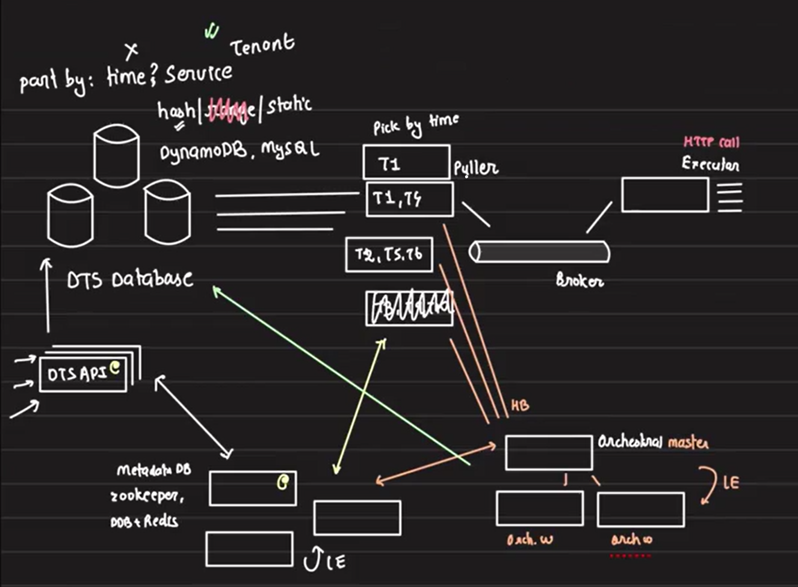
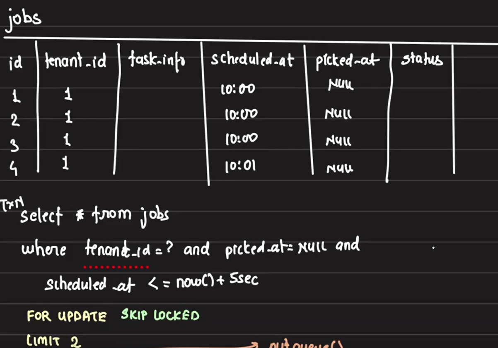
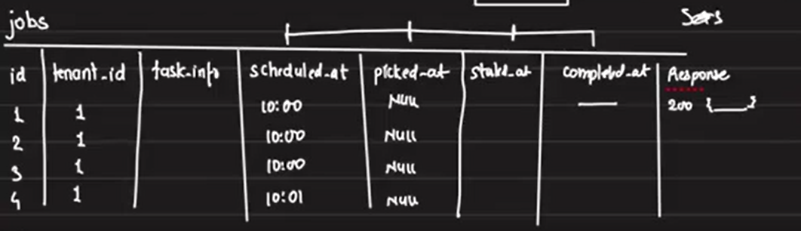
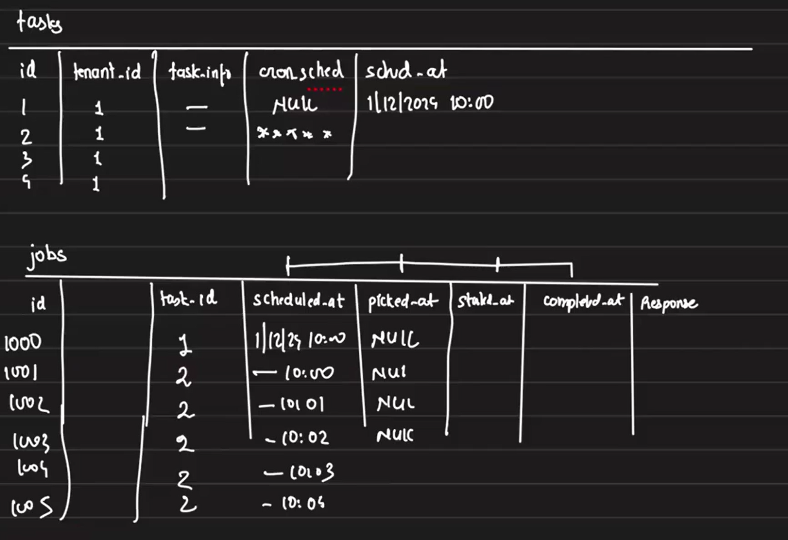

# Distributed Task Scheduler (DTS)

A **Distributed Task Scheduler (DTS)** is designed to schedule and trigger tasks that need to be executed at specific times, ensuring tasks are performed within a Service Level Agreement (SLA). The task must be executed as close to the scheduled time as possible, with only minimal deviation allowed. While it may not be executed at the exact specified time, the difference should be negligible. In this case, the SLA for executing the task is 30 seconds, meaning if a task is scheduled for execution at `10:00:00 AM`, it must start before `10:00:30 AM`.

This architecture caters to scenarios where high volume tasks (such as sending notifications to millions of users) need to be scheduled and executed on time, ensuring that the task execution is **distributed, reliable, and scalable**.

## Types of Tasks
The system primarily handles two types of tasks:

1. **One-Time Task:** A task that is scheduled to be executed once at a specific time.

2. **Recurring Task:** A task that repeats execution at a given interval.

Initially, the design will focus on **single-time execution** and later address recurring tasks.

## System Design Requirements
1. **Scale:** The system should handle 2 billion tasks per day, and each task is primarily an HTTP API call. This means that the scheduler must be designed to handle high-throughput with minimal latency, ensuring that each task is triggered at the correct time

2. **Granularity:** The scheduling operates with **minute-level granularity**, meaning tasks can be scheduled to execute with a precision of minutes.

3. **Tenant-based Partitioning:** The system is designed to be multi-tenant, where **each tenant represents a team** in the organization. This approach allows for the isolation of tasks between different tenants. Partitioning could be achieved through **database sharding** or **distributing tasks across different processing queues** for each tenant, ensuring that one team’s tasks do not interfere with another’s.

4. **Task Ownership:** 

    - The scheduler should **not take ownership of task execution**. Instead, it merely **invokes the tasks** by triggering an HTTP API call on the tenant's infrastructure. The HTTP API is also exposed by specific tenant. This ensures that the actual business logic (e.g., sending notifications) is handled by the tenant's own service, and the scheduler remains lightweight, focused solely on **triggering HTTP API calls** at the scheduled time. This separation of concerns ensures the scheduler does not become a bottleneck or assume responsibility for business operations.

    - It also helps to reduce the infrastructure cost of the scheduler. If the scheduler were responsible for executing tasks within its own infrastructure, the infrastructure requirements would scale significantly as more tenants onboarded, leading to increased costs. By offloading the actual execution of tasks to the tenant's infrastructure and focusing solely on triggering the tasks at the right time, the scheduler can remain lightweight and cost-efficient, regardless of the number of tenants using the system. This ensures that the scheduler's resource usage stays minimal while allowing each tenant to manage and scale their own infrastructure based on their specific needs.

5. **API Exposure:** DTS exposes two APIs:

    - **POST /tasks:** For tenants to submit new tasks into the system.

    - **GET /tasks/{id}:** For retrieving the status of a task.

    The system design is API-driven, with tenants interacting via HTTP endpoints. The actual task execution involves making HTTP API calls with the provided details at the appropriate time. The **SLA enforcement** means the scheduler needs to ensure that API calls are made on time and retries are handled appropriately if there are failures.


## Database Design, Partitioning and Task Execution

Given the system operates at a large scale of around 2 billion tasks per day and has been running for 4-5 years, a single database is insufficient. Hence, a **clustered database** setup with partitioning and sharding is used.

- **Partition Key Selection:**
    - Using `timestamps` as partition keys is inefficient, as it creates a `"hot partition"` problem. For example, if we partition by hour, tasks from the same hour will overload one partition while others remain underutilized.

    - Instead, we use `tenant IDs` as the partition key. Each tenant (service) receives a unique ID when onboarded, and jobs are submitted based on this ID. This approach ensures that the tasks for a particular tenant reside in the same partition.

- **Sharding Strategy:**
    - Range-based partitioning is not suitable for this case, as task submissions are not continuous streams.

    - Hashed partitioning, will be ideal for distributing tasks evenly across partitions. With hashed partitioning, multiple partitions (tenants) can be stored in a single database, and one tenant generating a high volume of tasks only affects **other tenants within the same DB, not the entire system**. Additionally, rate limiting can be applied to each tenant, restricting the number of tasks they can submit within a specific time window.

- **Configuration Management:**

    - We store the partitioning and database configurations in **Zookeeper**. When a new job is submitted through the DTS API, it checks Zookeeper to determine which database to connect to for creating the job entry based on partition key. 
    - For optimization, we can copy the Zookeeper config file to the API server, reducing the need for frequent Zookeeper lookups. However, we must ensure the API server's config is updated if any changes occur in Zookeeper.

    These patterns are similar to what we've seen earlier, in the load balancer configuration discussion. 

- **Handling GET Requests:**
    - For retrieving task details via a GET request, the API server first checks the local config to determine which database holds the data, connects to that database, retrieves the required information, and returns it to the user. This ensures efficient retrieval without querying the entire cluster.


## Potential Challenges and Mitigations So far

While Zookeeper and the DTS API are highly available, can we spot any concerns in this design so far are focused primarily on the DTS database? 

**Problem:** The main concern is managing database load if a tenant schedules more jobs than expected,

**Solution:** 
- If a tenant schedules more jobs than expected or has higher-than-anticipated requirements, we can shift smaller tenants in the same DB to other databases to balance the load. 

- Also as these tenants are internal teams, we can ask them to use new tenant IDs for future tasks while retaining old ones for existing jobs. This approach enables practical workarounds within the organization. Here we can explore using DynamoDB or MySQL with ProxySQL for sharding.

## Task Execution Workflow

### Worker Responsibilities

Now that our jobs are stored in the database, how do the workers retrieve and execute them? Suppose we are using MySQL. The worker will query the database to find all the jobs that need to be executed at the current time and retrieve the job details. Since all of these jobs are HTTP API calls, will the same worker handle making those calls? If so, it's easy to breach the SLA when many jobs need to be executed at the same time, as the worker could become too busy with API calls and miss the SLA for the next set of tasks.

To prevent this, it's better to divide the workload: 

1. **Pullers:** Servers responsible for pulling tasks from the database. They fire queries in SQL to fetch tasks scheduled for immediate execution.

2. **Executors:** Servers responsible for making HTTP API calls to execute tasks picked by pullers. To ensure separation of concerns, pullers and executors are different servers.

3. **Message Queue:** A message queue sits between pullers and executors. Pullers fetch tasks from the database and push them into the queue, while executors pull tasks from the queue to execute.

    

## Concerns and Solutions: Managing Pullers in a High-Scale Distributed System

The above diagram describe the current architecture of our DTS system.

With the design involving multiple components (pullers, executors, message queues), uptime and scaling become critical issues. Can you spot any other issue? 

### Problem 1: Single Puller Machine Cannot Handle High Scale

One primary concern is whether a single machine can handle pulling tasks from the database, considering we are dealing with 2 billion tasks per day and a 30-second window to pull the tasks, push them to the queue, and execute them. A single machine would not be sufficient to pull tasks fast enough, causing delays in the system.

- **Solution:** Introduce multiple puller machines. Each puller will be responsible for pulling tasks for a subset of tenants to distribute the load.

### Problem 2: Ensuring Exclusive Task Ownership by Pullers

When using multiple pullers, there’s a risk that different pullers might pull the same set of tasks, leading to duplication or conflict. We need to ensure exclusivity between pullers.

- **Solution:** To ensure efficient task distribution, each puller server is assigned a specific set of `tenants`, with no overlap between pullers. For example, Puller1 handles tasks for T1 and T4, Puller2 processes T2, T5, and T6, while Puller3 manages T3, T9, and T10. These pullers fetch tasks from their assigned tenants and push them to a message queue or broker for execution.

    To determine which puller is responsible for which tenants, we maintain metadata in **Zookeeper**. When a new puller instance starts, it consults Zookeeper to check which tenants are unassigned and picks up those accordingly. This ensures a balanced workload and prevents conflicts between pullers.

### Problem 3: What Happens When a Puller Fails?

If a puller, such as Puller2, fails, the tenants it was responsible for (e.g., T2, T5, T6) won’t have their tasks processed, leading to disruptions in service.

- **Solution:** Zookeeper functions as a distributed coordination service, but it is not designed to handle business logic or manage server provisioning. It can store metadata and track the state of system components, but it cannot directly spin up new servers or make decisions on task assignments. 

    Introduce an **orchestrator** to monitor the pullers. The orchestrator tracks the heartbeat of each puller and can detect when a puller fails. If a puller goes down, the orchestrator dynamically reassigns its tenants to other pullers or spins up a new puller to take over the failed one’s responsibilities. This ensures continuous task processing even during failures.

### Problem 4: Orchestrator Becomes a Single Point of Failure

With the orchestrator managing pullers, it could itself become a single point of failure. If the orchestrator goes down, the system won’t be able to reassign pullers or monitor their health.

- **Solution:**  Use multiple orchestrator instances, with one master orchestrator and several workers. If the master fails, leader election among the worker orchestrators will select a new master. This ensures redundancy and prevents system failure due to orchestrator downtime. With multiple orchestrators in place, we can distribute the load by assigning a specific set of pullers to each orchestrator to monitor.

### Problem 5: Scaling Pullers Based on Task Volume

At times, the number of tasks to be processed in the next 30 sec may exceed the capacity of the current pullers. If tasks aren’t pulled quickly enough, everything will be delayed, breaking SLAs.

**Solution:** The orchestrator dynamically scales the number of pullers based on the volume of tasks. It monitors the task load for each tenant and adds more pullers when necessary. If one tenant has a sudden surge in tasks, multiple pullers can be assigned to that tenant, and the workload is divided among them. This ensures timely task processing, even under heavy loads.

### Problem 6: Maintaining Exclusivity with Multiple Pullers for One Tenant

Initially, each tenant was assigned to a single puller, ensuring that no two pullers fetched the same tasks. However, as the system scales, a single puller may not be sufficient to handle the load for a high-traffic tenant. To address this, multiple pullers need to fetch tasks for the same tenant.

This introduces a new problem: how do we ensure that multiple pullers assigned to the same tenant do not pick up and process the same task? Without proper coordination, two or more pullers might attempt to pull and enqueue the same job, leading to duplication and potential inconsistencies in execution.

**Solution:** When multiple pullers are handling tasks for the same tenant, we must ensure that:

1. No two pullers pick the same job.
2. Execution remains parallel for efficiency.
3. Job selection and update happen atomically.

We store job-related tasks in a jobs table with the following structure:
1. id: Primary Key
2. tenant_id
3. task_info
4. schedule_at

Here are potential solutions:

- **Solution1: Using Offsets**

    One approach is to use an offset in the query so each puller handles a specific range of tasks.

    - **Problem:** 
        1. Since jobs are continuously added and completed, keeping track of an accurate offset is challenging and and offsets are not sequential from zero.
        2. With large datasets, using `OFFSET` forces the database to scan and discard rows before fetching the required set, making it slow and inefficient.
        3. If multiple pullers fetch jobs with overlapping offsets, duplicate execution might occur.
    
    ```sql
    SELECT * FROM jobs 
    WHERE tenant_id=? AND scheduled_at <= now() + INTERVAL '5 seconds' 
    LIMIT 10 OFFSET X;
    ```
- **Solution2: Using a `picked_at` Column with Exclusive Lock**

    An alternative approach is to use a `picked_at` column and apply an exclusive lock. Pullers will select only jobs where `picked_at` is `NULL` and update it upon picking the job.

    ```sql
    BEGIN;

    -- Step 1: Select tasks
    SELECT id, task_info 
    FROM jobs 
    WHERE tenant_id=? AND scheduled_at <= now() + INTERVAL '5 seconds' AND picked_at IS NULL 
    ORDER BY scheduled_at 
    LIMIT 2 
    FOR UPDATE;

    -- Step 2: Mark tasks as picked
    UPDATE jobs 
    SET picked_at = NOW() 
    WHERE id IN (job_ids_from_step_1);

    COMMIT;
    ```

    - **Problem:**
        1. Multiple pullers may execute the `SELECT` query simultaneously, retrieving the same set of jobs where `picked_at` is `NULL`.

        2. When a puller locks rows using `FOR UPDATE`, other pullers must wait until the first one finishes processing. (Without `LIMIT 2` in query) This effectively makes task execution sequential, defeating the purpose of having multiple pullers for parallel processing.

        3. To improve this, we try to lock only **specific rows** (With `LIMIT 2` in query) instead of the entire table. But tf one puller locks the first set of rows, and another puller tries to acquire the same rows, it will **keep waiting** instead of moving to other available tasks. So it is not solving the previous issue. 

- **Solution3: Using SKIP LOCKED**

    The `SKIP LOCKED` clause ensures that when a transaction encounters rows that are already locked by another transaction, it **does not wait** for those rows to be unlocked. Instead, it **skips** the locked rows and proceeds with the next available set of rows.

    This mechanism prevents pullers from getting stuck waiting for locked tasks, allowing multiple pullers to work in parallel without blocking each other. If a puller that locked certain rows fails before processing them, those jobs will become available again and will be picked up by another puller executing the `SELECT` statement after the lock is released.

    ```sql
    UPDATE jobs 
    SET picked_at = NOW() 
    WHERE id IN (
        SELECT id FROM jobs 
        WHERE tenant_id=? 
        AND scheduled_at <= now() + INTERVAL '5 seconds' 
        AND picked_at IS NULL 
        ORDER BY scheduled_at 
        FOR UPDATE SKIP LOCKED 
        LIMIT 2
    ) 
    RETURNING id, task_info;
    ```

    This solves our problem and fits into our requirements.

So the curent architecture for DTS looks like -- 




### Problem7: Handling Task Failures

- **Handling Task Failures**
    - **Retries and Observability:** If an API call fails, the executor retries the task. Clients also need visibility into task status (successful or failed). Each task execution status is tracked, and the client can retrieve this status via the GET /tasks/{id} API.

## Scaling the System
1. **Horizontal Scaling for Pullers:** The system can add multiple pullers, each responsible for a subset of tenants. **Zookeeper** stores metadata on which tenant each puller handles. An orchestrator manages the addition and removal of pullers based on load.

    - The orchestrator uses **leader election** to ensure high availability, with multiple worker instances and a master instance coordinating puller activity.

    - The orchestrator also monitors future job load and dynamically adjusts the number of pullers.

2. **Scaling Executors:** 
    - Executors can be scaled based on the number of tasks waiting in the queue. If the queue length increases, the orchestrator can add more executors to ensure tasks are executed promptly.

3. **Partition Shuffling:**
    - If a tenant starts generating a large number of tasks, it may affect other tenants on the same partition. The orchestrator can redistribute tenants to new partitions, potentially assigning new tenant IDs.

## Ensuring At-Least-Once Execution with Multiple Pullers in failure cases

When multiple pullers are working in parallel to fetch scheduled tasks from the database and push them to a queue for execution, ensuring at-least-once execution becomes critical, especially in failure scenarios. Here's how to design the process safely:

- **Put into Queue **Before** Updating `picked_at`**

    To avoid the risk of missing tasks due to partial failures, we should **first push the job into the queue**, and only **then update the `picked_at` column**, all within the same transaction. This sequence provides strong guarantees:

    - If the transaction **fails before the job is pushed into the queue**, nothing is committed—including the `picked_at` update. So, the task remains eligible for picking.
    - If the transaction **fails after pushing to the queue but before updating** `picked_at`, the job might be re-picked and re-queued, but that’s acceptable under **at-least-once semantics**.

    This avoids the need for **complex database recovery** in most failure cases, helping maintain SLAs.

- **Put into Queue After Updating `picked_at`:**

    If we instead update the `picked_at` **column before putting the job into the queue**, and the system **crashes after the update but before queueing**, we hit a serious problem:

    - The task is marked as picked (`picked_at` is set), but it **was never queued** for execution.

    - Since it's marked as picked, no puller will pick it again, leading to **a missed execution**.

    - Recovering such tasks requires **manual or expensive DB recovery**, breaking SLA guarantees.

- **Final Takeway:**

    To ensure **at-least-once execution** and maintain system reliability without recovery overhead. So we will take the first approach - **Put into Queue Before Updating `picked_at`**. The steps are -- 

    - Push the task into the queue first.

    - Then update the `picked_at` column, all inside the **same transaction**.

    - This strategy makes sure no task is permanently lost, even if it's retried and executed more than once—**a fair tradeoff for simplicity and resilience**.

- **Task Execution Failures and Status Tracking:**

    When an executor makes an **HTTP API call**, there is always a chance of failure due to network issues, service unavailability, or internal errors. To maintain **reliability and transparency**, we need two key things:

    1. **Retry Mechanism** – Executors should be able to retry failed tasks to increase chances of success based on retry policy.

    2. **Client Visibility** – Clients need a way to know whether their scheduled task succeeded or failed.

    To solve this, we maintain a task status record in the database for each scheduled job. This record tracks:
    - Task ID

    - Current status (`PENDING`, `IN_PROGRESS`, `SUCCESS`, `FAILED`, etc.)

    - Retry count

    - Any error message (if applicable)

    - Last updated timestamp

    Whenever an executor picks up a task and attempts execution:

    - If the API call **succeeds**, the status is updated to `SUCCESS`.

    - If the call **fails**, the executor **retries** based on a retry policy (e.g., max retries, exponential backoff).

    - If all retries **fail**, the status is marked as `FAILED`.

    Clients can query the `GET /tasks/{id}` endpoint to retrieve the current status of any task. This makes the system transparent and observable, allowing clients to programmatically respond to success/failure scenarios.

## Scaling Executors and Queues

To improve scalability and efficiency, we can introduce multiple message brokers instead of relying on a single one. These brokers can be **logically split based on** `tenant_id`, **task priority**, or any other criteria suitable to the system’s use case.

- Queue-Based Partitioning
    Each broker queue can have **its own dedicated set of executors**:

    - High-priority queues can be assigned **more executors** to ensure fast processing.

    - Low-priority queues can operate with **fewer executors** to optimize resource usage.

-  Executor Responsibilities
    Executors are responsible for:

    - Pulling tasks from the queue.

    - Making the corresponding **HTTP API calls**.

    Since they’re network-intensive, these machines should ideally have **high network bandwidth** to handle the outbound traffic efficiently.

-  Deciding Number of Executors
    Just like we handled pullers, the **orchestrator** can monitor:

    - **Queue length** — i.e., how many tasks are waiting in a specific queue.

    - **Task processing rate** — how fast executors are consuming from the queue.

    Based on this data, the orchestrator can dynamically scale the number of executor instances assigned to each queue to **minimize task wait time and meet SLA requirements.**


## Improving the Job Table for Better Observability

To improve observability, we need to enhance our current jobs table to track detailed execution lifecycle events. The current job table looks like below -- 



Here are the proposed enhancements:

✅ **`completed_at` Timestamp**

- **Purpose:**

    Currently there is no information about job completion time — i.e., when the HTTP call initiated by the executor finishes execution.

    Without capturing the completion time:

    - We lose insight into actual job duration.
    - It's harder to troubleshoot delays or failures.
    - Most importantly, customers may not see updated statuses, leading them to believe their tasks were never executed.

    To address this, we must **introduce a** `completed_at` **timestamp column* in the jobs table**, which marks the exact time when a job finishes.

- **How to populate `completed_at`**:

    Once the job completes (i.e., the HTTP call finishes), the executor needs to write job completion info, including status and completion time, to the database. But should this be done synchronously or asynchronously?

    Writing synchronously would block the executor and increase response latency—especially under high load.

    - Asynchronous Approach Using a Message Broker

        Instead, we adopt an **asynchronous design** using a message broker like **Kafka** or **SQS**:

        - Executors push completion metadata (including **completed_at**, **HTTP status**, **response body**, etc.) into a Kafka topic.

        - A pool of consumers reads messages from this topic and performs database writes.

    This decouples job execution from database operations and provides scalability and resilience.

    **Batching writes** from consumers to the DB helps reduce load. However, we must ensure that the **status is updated within a bounded time window** to maintain a real-time experience for users.

🌐 **HTTP Response Storage**

- While the `completed_at` column records the exact timestamp when a job finishes, observability can be further improved by capturing the full context of the HTTP call associated with each job.

- We can store the HTTP status code in a generic `status` column. However, for deeper debugging and operational insights, we can capture the **HTTP response body** along with the **status code**.

🕒 **SLA Compliance Tracking**

- **Purpose:**

    From a user’s perspective, knowing whether their job has met the expected SLA is critical. While we already store `scheduled_at` and `completed_at` timestamps in our job table, relying on users to **manually compute the time difference** to assess SLA compliance is neither user-friendly nor scalable.

    Expecting users to subtract timestamps for each job to understand SLA adherence is not empathetic design. As platform engineers, we must abstract this complexity away and proactively surface SLA insights.

- **Solution:**

    To provide clear, actionable observability, we can add a new Boolean column — `sla_met` — that explicitly tells whether a job met its SLA (`YES` or `NO`). This provides immediate clarity and reduces the cognitive load on users.

    Furthermore, this column helps us **internally analyze SLA violations** and identify bottlenecks in the system.

    Furthermore, this column helps us internally analyze SLA violations and identify bottlenecks in the system.

🔍 **Diagnosing SLA Breaches — Understanding Choke Points:**

There are multiple internal stages where delays may occur. By analyzing additional timestamps in our system, we can isolate the root cause:

1. Puller Delay
    - **Cause:** The puller picked up the task significantly later than it was scheduled.
    - **Diagnosis:** Compare `scheduled_at` vs. `picked_at`. A large gap indicates puller lag.

2. Queueing Delay Between Puller and Executor

    - Cause: After being picked, the task waited too long before actual execution started.

    - Diagnosis: Ideally, we should compare `picked_at` vs. `started_at` (the moment the HTTP request was made by the executor). Currently, we have `picked_at` and `completed_at` but difference between them includes both the queue waiting time and the HTTP response time.

        Note: If we don’t currently store `started_at`, this is a good reason to introduce it for better observability.

3. Slow or Failed Downstream HTTP Calls

    - **Challenge:** Even if we are prompt, the downstream service might timeout or respond slowly.
    - **Case:** SLA is 30 seconds, but the HTTP call times out after 40 seconds.
In this case, although the SLA is breached, it's not our system's fault.
    - **Solution:** Introducing a `started_at` timestamp allows us to distinguish between our system delay and third-party latency.

    - **Bonus Insight:** With `started_at` and `completed_at`, we can calculate the **exact duration of the HTTP call**.

    By capturing and analyzing these timestamps, we can build a **transparent, empathetic, and diagnosable** system where both customers and internal teams gain clarity on where and why an SLA might have been breached.

📊 Fields for SLA & Observability:

| Column Name    | Description|
|----------------|------------|
| `scheduled_at` | Timestamp when the job was suppose to be executed |
| `picked_at`    | Timestamp when the job was picked by the puller | 
| `started_at`   | Timestamp when the executor started the HTTP call | 
| `completed_at` | Timestamp when the HTTP call finished (success or failure) |
| `status`       | HTTP status code returned by the API  |
| `response`     | HTTP response body returned from the API |



## Handling Retries

- **Need**

    In any task execution system, failures can occur due to reasons like network issues, server timeouts, or downstream system errors. A robust retry mechanism is essential to improve reliability. However, without visibility into these retries, users are left in the dark — they can’t know if a task failed initially or how many attempts it took to eventually succeed.

    From a customer experience standpoint, this lack of transparency is concerning. For instance, if a HTTP call failed multiple times and succeeded only after several retries, it may still breach the user’s SLA expectations. Moreover, in the current table design, retry attempts are not reflected at all, which limits observability and prevents debugging.

- **Solution**

    To address this gap, we must enhance our system to track and expose retry information both for internal diagnostics and user transparency. Here's how we can approach it:

    1. **Track Retry Attempts**
        - Add a new column called `retry_count` in the `jobs` table to track how many times a job has been retried before succeeding.
    
    2. **Capture Failure Reasons**

        - Introduce a `failure_log` or `failure_response` column that stores detailed reasons or HTTP responses for each failed attempt which helps with root cause analysis and improves observability for both developers and users. The necessity of this field depends on the retry strategy implemented.
    
    3. **Implementing Retry**
        - **Model Retry Jobs Separately**
            - Treat retries as separate job entries with a new `job_id`, and link them to their original job using a `parent_job_id` column.
            - If a job fails, instead of blocking the current flow, the executor can requeue the job into the broker (Kafka/SQS).
            - This gives complete traceability of retries and their individual outcomes and users can view a lineage of job executions, making it easier to identify which retries succeeded and which failed.

            - These can lead to SLA breaches, especially if retries are queued behind many new tasks.
            - To avoid this, retries can be prioritized or handled by dedicated retry consumers.
            - In this approach, no additional fields are required since each entry in the job table represents a single HTTP call. The corresponding response is already captured in the `response` column, providing sufficient visibility into the outcome of each attempt.

        
        - **Configurable Retry Strategy**
            - Allow users to define retry behavior via configuration:
                - Number of retry attempts
                - Delay between retries
                - Timeout for each HTTP call
            
            - This is handled using a simple `for` loop, where the maximum number of retries is defined by a user-configurable parameter. The loop exits immediately upon receiving the first successful HTTP response.
            - In this implementation as well, it's preferable not to introduce additional fields for storing failure responses, since those fields would remain empty for jobs that succeed on the first attempt. Instead, it's more efficient and consistent to log all HTTP responses—whether from success or failure—within the existing `response` column.

##  Puller Query & Performance Tuning

Let’s now focus on the **SQL query executed by pullers** to fetch jobs from the `Job` table and enqueue them for processing.

The current query in use is detailed in [This Tab](#problem-6-maintaining-exclusivity-with-multiple-pullers-for-one-tenant)  located under **Solution-3: Using SKIP LOCKED**.

This approach ensures that multiple pullers can operate concurrently **without processing the same job**, enhancing both efficiency and throughput.

Let’s revisit why it’s important to use a `LIMIT` when writing the SQL query for pullers:

- Without a `LIMIT`, if the `WHERE` condition matches, say, **10K** tasks, the puller will attempt to **lock all of them at once**. This leads to a situation where only one puller processes everything, while **others remain idle**, defeating the purpose of **parallelism** with multiple pullers. Consequently, maintaining **SLA** becomes difficult, and scalability suffers.

How `LIMIT` Helps Orchestration:

- When we use a LIMIT, we control how many tasks each puller handles per cycle. This enables the **orchestrator** to make **smart decisions** about scaling—i.e., when to add or remove pullers. For example: 
    - Suppose processing a single task takes 15ms.
    - If each puller picks **2 tasks** per cycle (`LIMIT = 2`), and we have **10 pullers**, then:

        - Total time for 10K tasks = `(10,000 * 15ms) / (2 tasks * 10 pullers)` = **7.5 seconds**.
    
    - When we introduce an orchestrator to dynamically add or remove pullers based on system load, the key question becomes: **how does the orchestrator determine when more pullers are needed?** 
    
        Using the above logic, the orchestrator can calculate the number of pullers needed to meet a given SLA within a fixed time window.

## Handling Recurring Jobs

Now that we’ve addressed single-time execution of a task, let’s explore how to extend this solution for recurring tasks. For example, a customer might submit a task on April 26, 2025, at 10:00 AM, and request that it run **every day at 10:00 AM**, or even **every minute** in more complex scenarios.

**Key Principle:** We should **build on top of the existing one-time execution flow**, not create an entirely separate solution.

- **Customer Expectations:**

    From a user experience standpoint, once a recurring job is submitted, customers should be able to:

    - View the number of **completed occurrences**.
    - See a list of **upcoming scheduled executions** in the UI (via the Jobs table).

    This implies that a certain number of future job entries should **always exist** in the Jobs table to ensure upcoming executions are properly scheduled and visible.

- **Possible Design**

    When a customer creates a **recurring job**, the system should **immediately generate a fixed number** (e.g., 10) of job entries in the Jobs table for future execution. Once a job is picked by a puller, processed by the executor, and completed:
    - If it is a recurring job, the executor will **create a new entry** in the Jobs table for the next occurrence

    - The system must ensure that this new occurrence does **not duplicate** any already scheduled times.

    - Required metadata:
        
        To support this behavior, we need to introduce **new columns** in the Jobs table:
            - `is_recurring` (boolean): Indicates whether the job is a recurring one.
            - `recurrence_interval` (e.g., `1 day`, `1 minute`): Defines the time gap between executions.
    - For one-time jobs, these columns will remain `NULL`. Adding these columns impacts the current schema, but it's a necessary and minimal extension to enable powerful recurring task support without breaking the existing design.

    - Also, ensuring that executors do not create **conflicting entries** for recurring tasks adds complexity. Executors must be aware of the **latest scheduled timestamp** for that task to avoid duplications. This becomes even more challenging when **multiple executors** are running concurrently, or when some **executor instances fail to add the next occurrence**, potentially leading to gaps in the schedule.

## Designing for Recurring and One-Time Jobs: Using the Concept of Program vs. Process

To solve the problem of managing one-time and recurring tasks more effectively, we borrow a fundamental concept from Operating Systems — the distinction between **a program and a process**:

- **Program:** Static code written to perform a task (analogous to our Task).
- **Process:** A running instance of a program (analogous to our Job).

- **Proposed Solution: `tasks` and `jobs` Tables**

    - **We introduce two tables in our design:**

        - `tasks` table: Represents what the user submits — the abstract definition of a job, like a program.

            - Fields: `id`, `tenant_id`, `cron_schedule` (one-time or recurring), `scheduled_at`, etc. The `scheduled_at` field will always reflect the **farthest timestamp in the future** for which a job has been scheduled, ensuring the system knows up to when the task has been planned.
        
        - jobs table: Represents each actual execution — like a process.

            - Fields: All runtime-related data including `job_id`, `task_id` (FK), `scheduled_at`, `started_at`, `picked_at`, `completed_at`, `status`, `response`, `sla_met`, `retry_count`

    - **Benefits of This Design:**
        - `tasks` hold the static definition, while `jobs` hold the execution-level data. Users can click on a task to see either all jobs or only those related to that task.

        - For recurring tasks, users won’t need to update or delete each future-scheduled job manually. By updating or deleting the corresponding `task`, the system can automatically update/delete related jobs in bulk.

    - **Handling Job Generation:**
        - When a user submits a **new task:**
            - If it’s **a one-time job**, one corresponding entry is created in the `jobs` table.
            - If it’s **a recurring job**, a batch of, say, 5 future job entries is created in advance.

    - **Auto-Scheduling Additional Jobs:**
        - To ensure continuous execution for recurring tasks:
            - When a **puller picks** a `job` from the jobs table, it can:
                - Use the `task_id` to fetch the related entry from the `tasks` table.

                - Determine if it's a recurring task by checking the `cron_schedule`.

                - Look at the latest `scheduled_at` timestamp in the jobs table for that task.

                - Then generate additional future jobs as needed and update the `scheduled_at` in the `tasks` table.
    - To support tenants with different throughput requirements:

        - Pullers should be tenant-based
        - This allows rate limiting, throttling, and dedicated infra per tenant
        - Improves SLA adherence for high-priority customers

So the current tables look like this -- 




