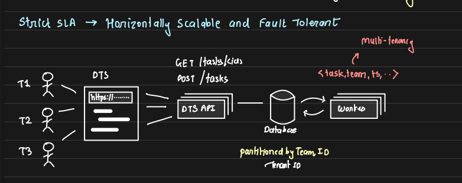
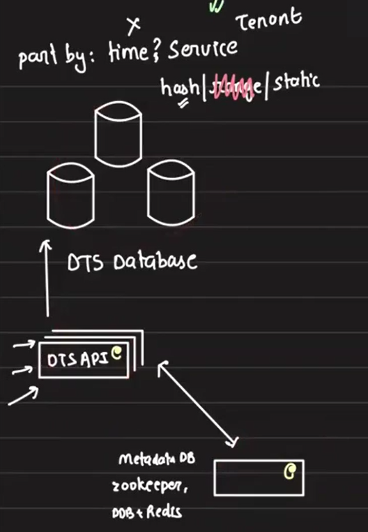
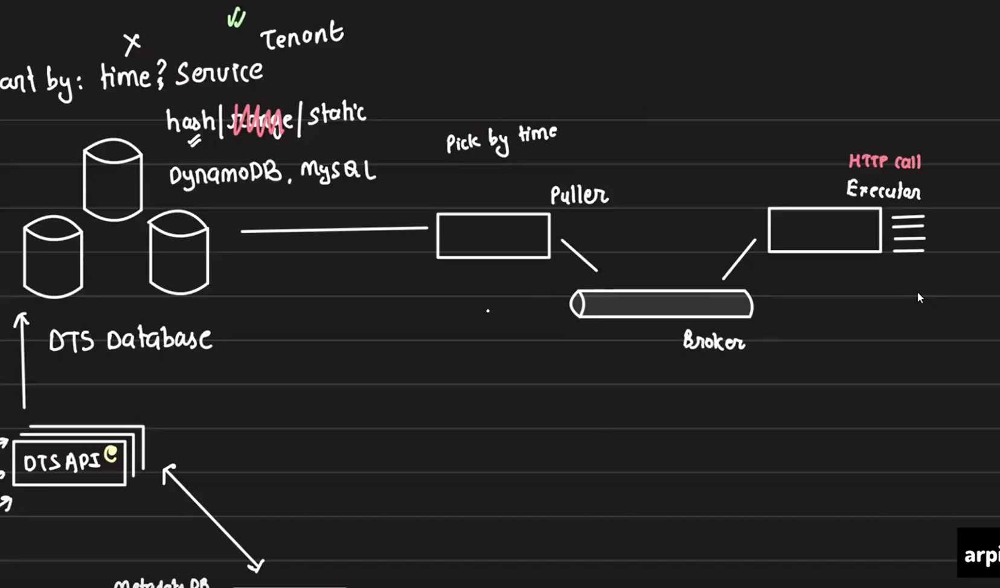
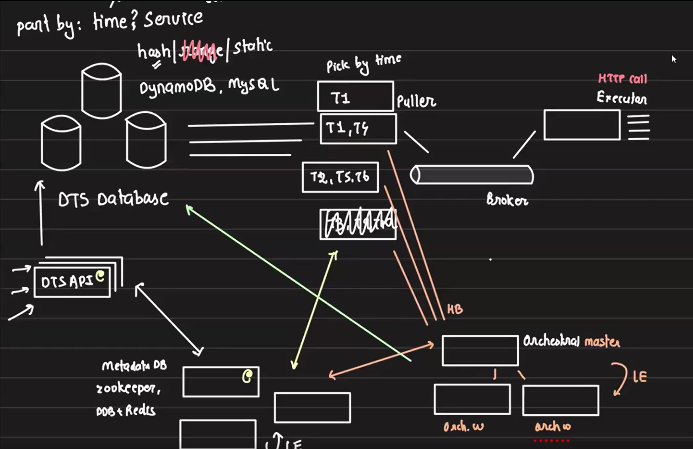

# Distributed Task Scheduler (DTS)

A **Distributed Task Scheduler (DTS)** is designed to schedule and trigger tasks that need to be executed at specific times, ensuring tasks are performed within a Service Level Agreement (SLA). The task must be executed as close to the scheduled time as possible, with only minimal deviation allowed. While it may not be executed at the exact specified time, the difference should be negligible. In this case, the SLA for executing the task is 30 seconds, meaning if a task is scheduled for execution at `10:00:00 AM`, it must start before `10:00:30 AM`.

This architecture caters to scenarios where high volume tasks (such as sending notifications to millions of users) need to be scheduled and executed on time, ensuring that the task execution is **distributed, reliable, and scalable**.

## Types of Tasks
The system primarily handles two types of tasks:

1. **One-Time Task:** A task that is scheduled to be executed once at a specific time.

2. **Recurring Task:** A task that repeats execution at a given interval.

Initially, the design will focus on **single-time execution** and later address recurring tasks.

## System Design Requirements
1. **Scale:** The system should handle 2 billion tasks per day, and each task is primarily an HTTP API call. This means that the scheduler must be designed to handle high-throughput with minimal latency, ensuring that each task is triggered at the correct time

2. **Granularity:** The scheduling operates with **minute-level granularity**, meaning tasks can be scheduled to execute with a precision of minutes.

3. **Tenant-based Partitioning:** The system is designed to be multi-tenant, where **each tenant represents a team** in the organization. This approach allows for the isolation of tasks between different tenants. Partitioning could be achieved through **database sharding** or **distributing tasks across different processing queues** for each tenant, ensuring that one team’s tasks do not interfere with another’s.

4. **Task Ownership:** 

    - The scheduler should **not take ownership of task execution**. Instead, it merely **invokes the tasks** by triggering an HTTP API call on the tenant's infrastructure. The HTTP API is also exposed by specific tenant. This ensures that the actual business logic (e.g., sending notifications) is handled by the tenant's own service, and the scheduler remains lightweight, focused solely on **triggering HTTP API calls** at the scheduled time. This separation of concerns ensures the scheduler does not become a bottleneck or assume responsibility for business operations.

    - It also helps to reduce the infrastructure cost of the scheduler. If the scheduler were responsible for executing tasks within its own infrastructure, the infrastructure requirements would scale significantly as more tenants onboarded, leading to increased costs. By offloading the actual execution of tasks to the tenant's infrastructure and focusing solely on triggering the tasks at the right time, the scheduler can remain lightweight and cost-efficient, regardless of the number of tenants using the system. This ensures that the scheduler's resource usage stays minimal while allowing each tenant to manage and scale their own infrastructure based on their specific needs.

5. **API Exposure:** DTS exposes two APIs:

    - **POST /tasks:** For tenants to submit new tasks into the system.

    - **GET /tasks/{id}:** For retrieving the status of a task.

    The system design is API-driven, with tenants interacting via HTTP endpoints. The actual task execution involves making HTTP API calls with the provided details at the appropriate time. The **SLA enforcement** means the scheduler needs to ensure that API calls are made on time and retries are handled appropriately if there are failures.



## Database Design, Partitioning and Task Execution

Given the system operates at a large scale of around 2 billion tasks per day and has been running for 4-5 years, a single database is insufficient. Hence, a **clustered database** setup with partitioning and sharding is used.

- **Partition Key Selection:**
    - Using `timestamps` as partition keys is inefficient, as it creates a `"hot partition"` problem. For example, if we partition by hour, tasks from the same hour will overload one partition while others remain underutilized.

    - Instead, we use `tenant IDs` as the partition key. Each tenant (service) receives a unique ID when onboarded, and jobs are submitted based on this ID. This approach ensures that the tasks for a particular tenant reside in the same partition.

- **Sharding Strategy:**
    - Range-based partitioning is not suitable for this case, as task submissions are not continuous streams.

    - Hashed partitioning, will be ideal for distributing tasks evenly across partitions. With hashed partitioning, multiple partitions (tenants) can be stored in a single database, and one tenant generating a high volume of tasks only affects **other tenants within the same DB, not the entire system**. Additionally, rate limiting can be applied to each tenant, restricting the number of tasks they can submit within a specific time window.

- **Configuration Management:**

    - We store the partitioning and database configurations in **Zookeeper**. When a new job is submitted through the DTS API, it checks Zookeeper to determine which database to connect to for creating the job entry based on partition key. 
    - For optimization, we can copy the Zookeeper config file to the API server, reducing the need for frequent Zookeeper lookups. However, we must ensure the API server's config is updated if any changes occur in Zookeeper.

    These patterns are similar to what we've seen earlier, in the load balancer configuration discussion. 

- **Handling GET Requests:**
    - For retrieving task details via a GET request, the API server first checks the local config to determine which database holds the data, connects to that database, retrieves the required information, and returns it to the user. This ensures efficient retrieval without querying the entire cluster.



## Potential Challenges and Mitigations So far

While Zookeeper and the DTS API are highly available, can we spot any concerns in this design so far are focused primarily on the DTS database? 

**Problem:** The main concern is managing database load if a tenant schedules more jobs than expected,

**Solution:** 
- If a tenant schedules more jobs than expected or has higher-than-anticipated requirements, we can shift smaller tenants in the same DB to other databases to balance the load. 

- Also as these tenants are internal teams, we can ask them to use new tenant IDs for future tasks while retaining old ones for existing jobs. This approach enables practical workarounds within the organization. Here we can explore using DynamoDB or MySQL with ProxySQL for sharding.

## Task Execution Workflow

### Worker Responsibilities

Now that our jobs are stored in the database, how do the workers retrieve and execute them? Suppose we are using MySQL. The worker will query the database to find all the jobs that need to be executed at the current time and retrieve the job details. Since all of these jobs are HTTP API calls, will the same worker handle making those calls? If so, it's easy to breach the SLA when many jobs need to be executed at the same time, as the worker could become too busy with API calls and miss the SLA for the next set of tasks.

To prevent this, it's better to divide the workload: 

1. **Pullers:** Servers responsible for pulling tasks from the database. They fire queries in SQL to fetch tasks scheduled for immediate execution.

2. **Executors:** Servers responsible for making HTTP API calls to execute tasks picked by pullers. To ensure separation of concerns, pullers and executors are different servers.

3. **Message Queue:** A message queue sits between pullers and executors. Pullers fetch tasks from the database and push them into the queue, while executors pull tasks from the queue to execute.

    

## Concerns and Solutions: Managing Pullers in a High-Scale Distributed System

The current architecture of our DTS is like below -- 



With the design involving multiple components (pullers, executors, message queues), uptime and scaling become critical issues.

### Problem 1: Single Puller Machine Cannot Handle High Scale

One primary concern is whether a single machine can handle pulling tasks from the database, considering we are dealing with 2 billion tasks per day and a 30-second window to pull the tasks, push them to the queue, and execute them. A single machine would not be sufficient to pull tasks fast enough, causing delays in the system.

- **Solution:** Introduce multiple puller machines. Each puller will be responsible for pulling tasks for a subset of tenants to distribute the load.

### Problem 2: Ensuring Exclusive Task Ownership by Pullers

When using multiple pullers, there’s a risk that different pullers might pull the same set of tasks, leading to duplication or conflict. We need to ensure exclusivity between pullers.

- **Solution:** Use Zookeeper to maintain metadata on tenant assignments. Each puller will consult Zookeeper to determine which tenants it is responsible for. This ensures that each puller only handles tasks for its assigned tenants, preventing overlap. If a new puller comes online, it checks Zookeeper and picks up unassigned tenants. For example, Puller1 handles Tenant T1 and T4, while Puller2 handles T2, T5, and T6. This spreads the workload and ensures tasks are pulled promptly.

### Problem 3: What Happens When a Puller Fails?

If a puller, such as Puller2, fails, the tenants it was responsible for (e.g., T2, T5, T6) won’t have their tasks processed, leading to disruptions in service.

- **Solution:** Introduce an **orchestrator** to monitor the pullers. The orchestrator tracks the heartbeat of each puller and can detect when a puller fails. If a puller goes down, the orchestrator dynamically reassigns its tenants to other pullers or spins up a new puller to take over the failed one’s responsibilities. This ensures continuous task processing even during failures.

### Problem 4: Orchestrator Becomes a Single Point of Failure

With the orchestrator managing pullers, it could itself become a single point of failure. If the orchestrator goes down, the system won’t be able to reassign pullers or monitor their health.

- **Solution:**  Use multiple orchestrator instances, with one master orchestrator and several workers. If the master fails, leader election among the worker orchestrators will select a new master. This ensures redundancy and prevents system failure due to orchestrator downtime.

### Problem 5: Scaling Pullers Based on Task Volume

At times, the number of tasks to be processed in the next 30 sec may exceed the capacity of the current pullers. If tasks aren’t pulled quickly enough, everything will be delayed, breaking SLAs.

**Solution:** The orchestrator dynamically scales the number of pullers based on the volume of tasks. It monitors the task load for each tenant and adds more pullers when necessary. If one tenant has a sudden surge in tasks, multiple pullers can be assigned to that tenant, and the workload is divided among them. This ensures timely task processing, even under heavy loads.

### Problem 6: Maintaining Exclusivity with Multiple Pullers for One Tenant


### Task Querying and Execution
- **Query:**

    - A puller queries the `Job` table for tasks whose scheduled time is within a 5-second buffer to ensure no task is missed due to slight delays in execution.

    - Query example:
        ```sql
        SELECT * FROM jobs WHERE tenant_id=? AND scheduled_at <= NOW() + INTERVAL 5 SECOND;
        ```

- **Concurrency Handling:**

    - To avoid multiple pullers picking the same task, the system uses a lock mechanism to ensure exclusivity:
        ```sql
        FOR UPDATE SKIP LOCKED
        ```
    
    - This ensures each puller skips rows already locked by another puller and only picks unlocked rows, maintaining concurrency.

- **Handling Task Failures**
    - **Retries and Observability:** If an API call fails, the executor retries the task. Clients also need visibility into task status (successful or failed). Each task execution status is tracked, and the client can retrieve this status via the GET /tasks/{id} API.

## Scaling the System
1. **Horizontal Scaling for Pullers:** The system can add multiple pullers, each responsible for a subset of tenants. **Zookeeper** stores metadata on which tenant each puller handles. An orchestrator manages the addition and removal of pullers based on load.

    - The orchestrator uses **leader election** to ensure high availability, with multiple worker instances and a master instance coordinating puller activity.

    - The orchestrator also monitors future job load and dynamically adjusts the number of pullers.

2. **Scaling Executors:** 
    - Executors can be scaled based on the number of tasks waiting in the queue. If the queue length increases, the orchestrator can add more executors to ensure tasks are executed promptly.

3. **Partition Shuffling:**
    - If a tenant starts generating a large number of tasks, it may affect other tenants on the same partition. The orchestrator can redistribute tenants to new partitions, potentially assigning new tenant IDs.

## Handling Failures and Recovery
- **Ensuring At-Least-Once Execution:** In the event of a failure (e.g., the system crashes after updating the `picked_at` column but before placing the task into the queue), the system will retry the task execution, ensuring at-least-once execution.

- **Transaction Handling:** To simplify recovery, task execution is performed within a single transaction. The task is pushed into the queue first, and then the `picked_at` column is updated. This approach prevents complex DB recovery processes and ensures SLA compliance.

## Advanced Considerations
1. **Priority-Based Execution:** The system can support priority queues. Higher-priority tasks can be assigned more executors, ensuring quicker execution, while low-priority tasks can be handled with fewer executors.

2. **Broker Scaling:** Multiple brokers can be used to handle different tenants or priorities. Each broker has its own set of executors to ensure efficient task handling.

3. **Orchestrator Monitoring:** The orchestrator continuously monitors the puller and executor nodes, redistributes tasks when nodes fail, and adjusts the system dynamically based on workload.

## Summary
The Distributed Task Scheduler (DTS) is a **highly scalable** and **fault-tolerant** system designed to schedule and trigger millions of tasks (HTTP API calls) daily with minute-level granularity. By partitioning tasks based on tenants, leveraging **Zookeeper** for configuration management, and **using multiple pullers and executors**, the system ensures reliable execution of tasks within defined SLAs.


