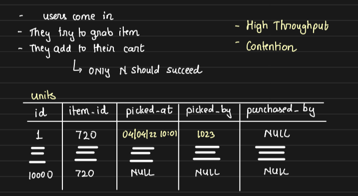
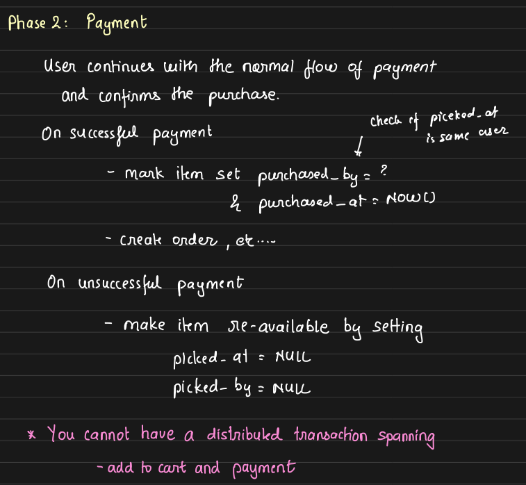

# Flash Sale System Design

## Objective

Design a system that can handle high-volume, high-speed purchases during flash sales like Amazon's or Flipkart's Big Billion Days, ensuring fairness, minimal contention, and system performance.

## Initial Approach: Shared Row for Product

- **Design:** At first glance, a simple design for handling purchases in a flash sale could involve an `Items` table with columns like `id`, `name`, and `quantity`.

    When a user tries to purchase an item, the system would:
    - Acquire a lock on the specific item record.
    - Decrease the `quantity`.
    - Complete the purchase.

    This approach ensures consistency: **only one transaction can modify a particular item at a time.** However, this method also **forces transactions to happen sequentially** for each item, creating a bottleneck.

- **Problem:** In **a flash sale scenario**, where **thousands or even millions** of users may attempt to buy the same item simultaneously, this **sequential locking becomes a major performance issue**.
    
    This approach will **lead to serial execution of each transaction**, because **only one transaction can hold the lock on a given item at any point in time**. It **slows down the system** dramatically and **hogs database connections** as many transactions wait for locks to be released.

    This challenge is known as the **problem of contention** — when too many processes are trying to access and modify the same resource at the same time, leading to delays and reduced system throughput.

    Thus, **minimizing contention is critical** for a successful flash sale system design.

- Transaction Flow:

    ```sql
    BEGIN;
    SELECT * FROM items WHERE id=? FOR UPDATE;
    UPDATE items SET quantity = quantity - 1 WHERE id=?;
    INSERT INTO cart (...);
    COMMIT;
    ```

## Optimized Approach: One Row per Unit

To resolve this, we **create a separate entry for each individual piece of the product**.

For example, if a product has 10 available units, there will be **10 rows in the database**, each representing one unit.
This way, a user will **hold a lock only on the specific unit they are trying to purchase**, allowing other customers to simultaneously lock and purchase the remaining available units without contention.

We implement this using `SKIP LOCKED`, which ensures that if one unit is already locked by another transaction, the system will simply skip it and pick another available unit, avoiding blocking and waiting. Thus reducing lock contention.

The **core challenge of flash sales** is the need to **handle a massive number of user requests in a very short amount of time**, and this design helps achieve that.

Arpit also gave a nice real-world analogy comparing this solution to a book sale event, illustrating why this second approach works much better — (make sure to watch the video for that explanation).

In this design, the **API only allows a certain number of users to add the item to their cart**.
Once the available items are exhausted, the system informs others that **no more items are available.**

- When a user **adds an item to their cart, we record the cart addition timestamp** in the `picked_at` column.
- If the user **successfully completes the purchase**, we update the `purchased_at` column to mark it as sold.
- If the user **fails to complete the payment** within a given time, the item is made available again for others to purchase.

    

This behavior is managed through row-level locks combined with `SKIP LOCKED`:

- When multiple users are trying to add items to their cart simultaneously,
`SKIP LOCKED` ensures that if one item is already locked by another transaction, the system **skips** it and **grabs another available item**, ensuring non-blocking behavior. `SKIP LOCKED` will ensure a non-sequential execution and non-blocking.

Thus, users can continue purchasing the remaining available items without being blocked by locks held by others.

- **Improved SQL with SKIP LOCKED:**
    ```sql
    BEGIN;
    SELECT * FROM items
    WHERE product_id=? AND picked_at IS NULL
    ORDER BY id
    LIMIT 1
    FOR UPDATE SKIP LOCKED;

    UPDATE items
    SET picked_at = NOW(), picked_by = <user_id>
    WHERE id = ?;

    INSERT INTO cart (...);
    COMMIT;
    ```

- Key Concepts:

    - `FOR UPDATE SKIP LOCKED:` Skip already locked rows, ensuring non-blocking concurrent access.

    - `picked_at:` Marks the time item is added to the cart.

The **transaction ends as soon as the item is successfully added to the cart**.

If a customer clicks "**Add to Cart**" but no item gets added, it means no free items are currently available.
However, items may **become available again** if someone who previously added the item to their cart **fails to complete the purchase within a specified time window**

## Payment Phase

Once an item is added to the cart, **payment happens in a second phase.**

This is similar to real-world sales — you **grab the item first** (adding to cart) so that others cannot take it, then **go to the counter to make the payment**.

If the payment succeeds, you keep the item. If not, the item is returned and made available for others.

In our system:
- **Adding to cart** is marked by updating the `picked_at` timestamp and `picked_by` user_id.
- **Successful payment** is marked by updating the `purchased_at` timestamp.

Since the payment is **handled by external payment gateways**, we cannot have a distributed transaction that spans adding to cart and payment completion.

Thus, if the **payment fails**, the user is notified, and the item must be made available again. Making the item available again means **resetting the** `picked_at` column to NULL.

Now, **who will release the items** stuck due to failed payments?
- This will be handled by **cron jobs** that periodically scan for items stuck too long in the cart without successful payment and make them available again.

    ```sql
    UPDATE items
    SET picked_at = NULL, picked_by = NULL
    WHERE 
        picked_at IS NOT NULL 
        AND 
        (
            payment_failed 
            OR 
            (NOW() - picked_at) > threshould
        );
    ```

    

##  Notification Strategies for Re-availability

When items become available again, how should we notify users?

- **Notifying everyone who showed interest** can lead to a **poor user experience** — for example, if 1000 people are notified but only 100 items are available, 900 people will be disappointed.
- **No Notification:**: To avoid this, one option is to **not notify anyone** when items become available again — users who revisit during the flash sale window will find the available items.
- **Under-sell Strategy:** Another approach is to **under-sell:** if a user fails to make the payment, **we don't re-release the item**. Instead, we can conduct a **new flash sale** event later to sell those items.

## Real-World Analogies
- Mall Shopping:
    - Pick items into your cart first → pay at counter → failure = item returned to shelf.

- BookMyShow:
    - Undersell model.
    - Delay between payment failure and seat becoming available again.

- IRCTC:
    - Oversell model — uses waitlists.