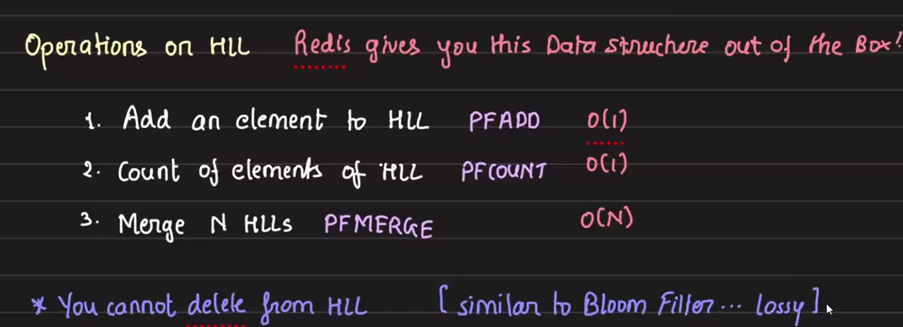

# Cardinality Estimation for Ad Impressions and Analytics

## Motivation
The importance of these metrics becomes clear when we think about counting reactions on a post, which is relatively easier. However, many people view a post without reacting to it — so how do we measure that?

Examples:
- News websites: no reaction buttons but need to measure readers.
- AdTech (like Google Ads): need to report number of views and reactions to advertisers.

    

We aim to **count unique users** (not track their identities) over a **user-selected time window** (flexible querying).

## Use Case in AdTech Firms

Let’s consider an example from adtech companies, such as Google Ads. Whenever someone runs a campaign on Google Ads, we need to show them two key metrics over time:
- The number of views (impressions) their ad received, and
- The number of reactions (if applicable)

In this section, we won’t focus on how to plot these numbers as a time series graph. Instead, we’ll discuss how to calculate these metrics for a specific time range.

Given a particular timeframe, our goal is to show the count of unique users who viewed the ad — not the user details, just the total count.


From the above diagram, it is clear that when calculating the total number of unique users between time A and time B, we cannot simply split the interval and say:

`Total unique users from A to B = Total unique users from A to C + Total unique users from C to B (where A < C < B)`

This is because the same user might appear in both intervals (A to C and C to B), leading to double-counting if not handled carefully.

## Initial Idea: Using a Set for Uniqueness

The first data structure that comes to mind when we hear "unique" is a **Set**.

So, a basic idea would be:
- Every time a user visits an ad, we insert their user ID into a set.
- The size of the set would give us the count of unique users.

However, the problem is that **users can select arbitrary timeframes** to view unique counts. A single set per ad would not be sufficient because it doesn’t account for **time granularity** — we cannot filter visits based on time.

#### **How can we solve this? (Hint: Key-Value pairs)**

Let’s maintain one key per ad per minute, where:
- The key could be in the format `adId_timestamp`, e.g., `a1_202504241301`, `a1_202504241302`, etc.
- This key represents minute-level granularity — for example:
    - `a1_202504241301` → 24th April 2025, 13:01
    - `a1_202504241302` → 24th April 2025, 13:02
- The value for each key is a Set containing **user IDs who visited the ad during that specific minute**.

Now, when a user asks for the unique user count between a custom time range:
- We fetch all relevant sets corresponding to the selected minutes.
- Perform a union of these sets to get the overall unique users.
- Return the size of the resulting set.

#### **But is this scalable? Let's do some math:**
- Assume each user ID is 4 bytes long.
- Suppose each minute an ad is viewed by 10K unique users.

Then, per minute:
- Set size (just data) = 4B × 10K = 40KB
- However, a Set is typically backed by a tree or hash structure internally, with additional overhead (pointers, metadata, etc.).
- This overhead could easily make the in-memory size around 80KB per 10K users 

Per ad, per day:
- Total number of sets = 24 hours × 60 minutes = **1440 sets**.
- Total size ≈ 1440 × 80KB ≈ **110MB per ad per day**.

Now imagine millions of ads running for multiple days — the storage requirement becomes massive!

Moreover:
- Set union is computationally expensive.
- It cannot be efficiently done on disk; **sets must be loaded into memory**.
- Union requires iterating through all elements, making it both time- and memory-intensive.

**Can we optimize this further?**

## Space vs Time vs Correctness — A Trilemma

Let’s think carefully:
- We don't actually need to know who saw the ad.
- We just need to know how many unique users saw it.

However, to calculate **uniqueness**, we still need some form of **user identity**. In system design, there's a common trade-off between space and time:
- If we optimize for one, we often sacrifice the other.
- Ideally, we want to optimize both — but that's only possible if we are willing to **give up on 100% correctness**.

So, the reality is a trilemma:
- **Space vs Time vs Correctness**

If a small error in the unique user count (say, 0.01%) is acceptable, then it’s a practical compromise.

This problem is a classic example where giving up a little correctness can massively save on space and time.

#### **The idea: presence over identity**

We don’t need to store the actual user IDs — we just need to record their **presence**.

- This is the same principle behind a Bloom Filter:
    - We don’t store the word "apple" itself;
    - Instead, we pass it through a hash function and just mark its presence.

Similarly, for our ad-tech scenario, we need a structure that supports:
- Adding elements
- Merging (Union)
- Getting an approximate count (Length)

We don't need:
- Removal
- Intersection

## Introducing HyperLogLog

- HyperLogLog is a **probabilistic data structure** designed for cardinality estimation (i.e., estimating the number of distinct elements).
- It is based on the Flajolet–Martin algorithm
- It supports the exact operations we need:
    - `add` to HyperLogLog
    - `merge` two HyperLogLogs (union)
    - `count` (approximate unique count)
- However, HyperLogLog cannot perform:
    - remove
    - intersection

#### **Efficiency Comparison**

To give a sense of efficiency:
- A Set that stores user IDs might take 4MB.
- A HyperLogLog representing the same data might only take 12KB.
- Downside:
    - HyperLogLog trades off perfect accuracy for huge savings in space and computation time.

## Implementation Using Redis HyperLogLog

Redis provides a very simple and efficient API for working with HyperLogLog through three primary commands:
- PFADD
- PFCOUNT
- PFMERGE



#### How it Works:

We will continue using a key-value structure similar to what we discussed earlier:
- Keys represent a **combination of ad ID and minute-level timestamp**.
    - Key Format: adID_YYYYMMDDHHMM
    - Example: A1_202504261000 -> 26th April 2025, 10:00AM
- Values are **HyperLogLogs storing user presence information**.

#### Usage Flow Example:
- When a user A sees an ad A1 at 26th April 2025, 10:00AM, we execute:
    ```nginx
    PFADD A1_202504261000 A
    ```
    This adds `user A` to the HyperLogLog value of the key `A1_202504261000`.

    Syntax of `PFADD` command -- 
    ```nginx
    PFADD <key> <user_id>
    ```

- Now, suppose a user wants to see how many **unique users** viewed ad `A1` between **10:00AM** and **10:03AM**.
We need to merge the relevant keys using `PFMERGE`:

    ```nginx
    PFMERGE t_A1_202504261000 A1_202504261000 A1_202504261001 A1_202504261002 A1_202504261003
    ```

    This creates a **temporary key** `t_A1_202504261000` that merges the HyperLogLogs values of the given keys.

    Syntax of `PFMERGE` command -- 
    ```nginx
    PFMERGE <key> <source_key1> <source_key2> ...
    ```

    Now, we can get the approximate unique count with `PFCOUNT`:
    ```nginx
    PFCOUNT t_A1_202504261000
    ```

    Syntax of `PFCOUNT` command -- 
    ```nginx
    PFCOUNT <key>
    ```

## Handling HyperLogLog Data

Redis also allows us to **extract** and **reinsert** HyperLogLog data:
- We can use `GET` or `DUMP` to retrieve the data for a key that holds a HyperLogLog.
- Redis will return a hexadecimal representation of the internal byte array.
- his byte array can be stored, transferred, or even restored onto the same Redis server (or a different one) simply by using the regular `SET` command with the hexadecimal value.

This mechanism is very helpful for:
- Backup
- Migration
- Replication across clusters

## Prevent Fraudulent Activity to increase count

In real-world adtech systems, it’s important to **prevent malicious behavior**, such as ad agencies trying to inflate view counts by accessing their own ads from multiple accounts.

To address this, we **should not blindly add every request** to the HyperLogLog. Instead, we introduce a **rule engine** to validate incoming events.

#### Rule Engine Overview:

The rule engine acts as a black box that:
- Accepts input (such as user ID, IP address, timestamp, etc.)
- Applies validation logic
- Filters out suspicious or invalid events, the events that passes the test are elegible to get added in the hyperloglog in redis. 

## System High Level Design

The flow till no we have discussed -- 

1. User Views Ad → Request hits the HTTP API Server
2. Rule Engine Validation → The request is forwarded to the Rule Engine, which determines if the event is valid
3. Update Redis → Valid events are sent to Redis, where user IDs are added to HyperLogLog structures using `PFADD`
4. Advertiser Dashboard Analytics
    → Advertisers access a UI to monitor ad performance
    → The UI calls an Ad Analytics Server → The server performs `PFMERGE` (if needed) and `PFCOUNT` to get the approximate unique user count
    → The result is returned to the frontend for visualization

Here we can logically divide the system into two key paths:
- **Write Path:** From User viewing the ad to data being written to Redis
- **Read Path:** Advertisers query the analytics dashboard to view ad performance, ad analytics server returns `PFCOUNT`.


## Scalability Issues and Practical Fixes: Write Path

### 1. Problem: Redis Overload Due to High Write Volume

In the current architecture, every user view or click on an ad directly triggers a `PFADD` operation in Redis to update the HyperLogLog structure for unique user tracking if validates by rule engine. Since these writes are **synchronous**, a high spike in user activity (especially during peak hours or viral campaigns) can:

- Overwhelm Redis with write requests.
- Introduce latency at the API layer.
- Risk data loss if Redis is temporarily unavailable or unable to scale fast enough.

#### Solution

To address this scalability issue, we shift from a **synchronous** to an **asynchronous** architecture:

- **Message Queue as a Buffer:** We place a message queue (kafka or SQS) between the API server and Redis.
    - The API server publishes events (ad views/clicks) to Kafka.
    - This makes the API layer more responsive and prevents it from blocking due to Redis performance.

- **Consumers for Redis Writes:** A pool of Kafka consumers processes these events.
    - Each consumer reads user interaction events from Kafka and performs the corresponding `PFADD` to Redis.
    - Since Redis `PFADD` takes only one value per call, consumers process events individually but at their own pace, avoiding a Redis write storm.

- **Requirements for the Queue System:**
    - High durability (no message loss)
    - High throughput for both reads and writes
    - High availability to ensure continuous data flow even under failure conditions

    Kafka and SQS both satisfies all this conditions

- **Trade-off:** This approach introduces a slight delay in updating the view counts, but it’s a worthy trade-off.

So the current architecture looks like this -- 


### 2. Problem: Redis is In-Memory and Non-Persistent

Redis stores all data in RAM, which means it's volatile and doesn't guarantee data persistence. In the event of a Redis failure or restart, all data stored in memory could be lost. This is a critical issue when tracking unique ad views or user interactions that must not be lost. Furthermore, we might want to reuse the same event data for other use cases like time-series analysis, debugging, or compliance logging, which Redis is not designed to support.

#### Solution:

To ensure durability and support multiple downstream use cases, we can introduce a second set of consumers that read the same data from the message queue and store it in a persistent storage solution such as Amazon S3, MySQL, or PostgreSQL. This setup not only safeguards the data in case Redis fails but also enables:

- Long-term storage for analytics or audits
- Time-series analysis of ad view trends

To support this, the message queue must provide **multi-consumer support**, high availability, and high throughput. Since SQS doesn't support multiple consumer groups natively, **Kafka** is appropriate choice here.

So the current architecture looks like this -- 


### 3. Problem: Where Should the Rule Engine Sit

As the number of events increases and the logic becomes more complex, we need to determine:
- Where should the rule engine be placed in the data flow?

#### Solution: 

- The rule engine should acts as the first consumer from the primary Kafka topic (Kafka-1) where the API server is pushing the data. 
- Consumers pull data from the primary Kafka topic to a processing server where the filtering logic is executed. The filtered (cleaned) data is then published to a secondary Kafka topic (Kafka-2) for downstream consumption.
- All other downstream consumers (e.g., Redis updaters, analytics systems, etc.) will consume from Kafka-2.


### 4. Problem: Where to Persist Data, Kafka-1 or Kafka-2

Now from which Kafka topic should we persist the data into a persistence database like S3 or MySQL?

We want to ensure:
- Proper filtering of incoming ad interaction events (e.g., rule out malicious activity).
- Efficient and **replayable architecture**, in case of logic changes or bugs.
- Minimized **redundant computation** by storing meaningful intermediate data.

#### Solution:

- Persistence Strategy

    - We might consider persisting data from **Kafka-2** (after filtering), since it excludes any invalid or unwanted events. 
    - However, we may also want to persist data from **Kafka-1** (before filtering), as it gives us the flexibility to replay the rule engine later if needed. While **Kafka-1** data allows reprocessing with updated or corrected rules, **Kafka-2** offers already cleaned data that saves compute time. 
    - The trade-off is: 
        - Data from **Kafka-2** cannot be reverted back to the original raw form but we already spend much time and CPU resources to compute this data. 
        - **Kafka-1** enables full replayability.
        
    - Both approaches have their own advantages and disadvantages, and the choice depends on the use case and system requirements.

    - To support **replayability and debugging**, we should persist data **from both Kafka-1 and Kafka-2** to a durable storage like Amazon S3. This dual storage strategy avoids recomputation and saves compute cost.

    

- Replayability Use Cases
    - Replay is needed when:
        - Rules change (additions, removals, or fixes).
        - Bugs are discovered in previous logic and require reprocessing of historical data.
    - For this, we can:
        - Spin up a temporary consumer that reads from **S3**, re-inserts into **Kafka-1**, and reprocesses through the rule engine.
        - This setup should be **on-demand**, not always running, to save costs and resources.

## Scalability Issues and Practical Fixes: Read Path

### 1. Problem Scalability

Since there are many ads and multiple advertisers accessing analytics concurrently, a single Redis instance will not be sufficient to handle the load. To scale the system effectively, we need to implement Redis sharding to distribute data across multiple nodes and use read replicas to serve high read traffic. For managing configuration and coordination between distributed components, we can leverage **Zookeeper** for centralized config management and service discovery.

### 2. Managing Redis Memory and Persistent Storage for Ad Analytics

Redis is an in-memory datastore, and it is not feasible to store all data across the entire lifespan of an ad—especially when ads may run for weeks or months. Continuously accumulating this data in Redis would lead to unbounded memory growth. To address this, we implement **data offloading** by moving older data from Redis to a **persistent database** after a fixed time window (e.g., 30 minutes).

#### Key Requirements for the Persistent DB
To decide on a suitable persistent storage, we first analyze the type of queries we expect. Suppose Redis retains **only the last 30 minutes of data**. If a client requests analytics for the past 4 hours, we need to:
- Fetch 30 minutes of data from Redis,
- Fetch the remaining 3.5 hours from the persistent DB,
- **Merge all** the relevant data using `PFMERGE` (since we are using HyperLogLog),
- Return the final approximate count using `PFCOUNT`.

However, persistent databases do not understand Redis-specific data structures like HyperLogLog. So, we use the Redis `DUMP` command to export the HyperLogLog as a **hexadecimal-encoded binary blob** and store it in the database, using the **Redis key format** as the identifier. 

When a query is made:
1. Keys for the required time range are identified.
2. For keys not present in Redis, the corresponding data is fetched from the persistent DB.
4. A `PFMERGE` operation is performed across all relevant keys.
5. The result is obtained using `PFCOUNT`.

So the requirements for the persistence DB are -- 
1. **Key Consistency:** The keys in the persistence DB must match the keys in Redis
2. **Binary Storage (BLOB Support):** Since Redis HyperLogLog data is dumped as a hexadecimal-encoded byte array, the DB must support storing this as Binary Large Object (BLOB)
3. **Key-Value Access Pattern**
4. **Range Query Support:** To support time-window queries
5. Sharding
6. Persistence & High Availability

DynamoDB supports all this requirements. 

### 3. Where Should We Perform PFMERGE

The `PFMERGE` operation is specific to Redis and is used to merge multiple HyperLogLogs into one. Since **persistent databases have no understanding of Redis data structures** like HyperLogLog, they **cannot perform operations like** `PFMERGE` or `PFCOUNT`.

Therefore, all HyperLogLog operations must be done within **Redis**.

If some of the required data is already offloaded to the persistent store, we follow this process:

1. Fetch the serialized (dumped) HyperLogLog blobs from the persistent database.
2. Load them temporarily into Redis using the same keys (with a short TTL).
3. Perform the `PFMERGE` in Redis across the required keys.
4. Get the approximate count using `PFCOUNT`.


### 4. Problem: Inefficient HyperLogLog Merge

Let’s consider an extreme but realistic scenario:

Suppose we want to estimate the number of **unique ad viewers over the past 4 hours**, and we're currently storing data at **1-minute granularity in Redis**. That means we need to merge `4 × 60 = 240` HyperLogLog keys using the `PFMERGE` command.

A `PFMERGE` operation with **240 arguments** is inefficient — it increases network overhead, CPU load, and memory usage on Redis.

#### Solution: 

To solve this, we introduce **pre-aggregated HyperLogLog data** at coarser levels of granularity (e.g., 15 minutes, hourly, daily). Here's how the architecture evolves:

1. **Aggregator Server:** A dedicated service runs periodically and:

- Fetches fine-grained (minute-level) HyperLogLog data from the **main Redis server** and **DynamoDB**.
- Merges the keys in a **separate lightweight Redis instance** (used only by the aggregator).
- Dumps the aggregated result into **DynamoDB** as serialized blobs.
- These blobs are stored under keys that reflect their aggregation level — e.g., `A1_202504261200_hr` (hourly), `A1_20250426_dy` (daily), etc.

2. **At Query Time:**

- For a 4-hour analytics request, the system:
    - Pulls **last 30 minutes** of data (30 keys) directly from Redis (still in memory).
    - Pulls **3 hours** of hourly aggregates from DynamoDB (3 keys).
    - Pulls another **30 minutes** of minute-level aggregates from DynamoDB (30 keys).

- In total, **63 keys** (instead of 240) are loaded into Redis for `PFMERGE`.

3. **Key Format Convention**

    To distinguish aggregation levels, we follow a naming convention:
    - mi → minute-level
    - hr → hour-level
    - dy → day-level

    Example: `A1_202504261215_mi`, `A1_2025042612_hr`, `A1_20250426_dy`

    

### 5. Optimization: Offload Read Queries to a Separate Redis Cluster

When handling read-heavy analytics queries (e.g., "**fetch last 4 hours of unique views**"), we currently load historical data into the **main Redis cluster** from both Redis (for recent data) and DynamoDB (for older data), then perform `PFMERGE` and `PFCOUNT`. 

This approach **increases the load** on the main Redis cluster, which is already handling write operations at scale.

#### Solution: Decouple Compute from Storage

To reduce pressure on the main Redis cluster, we can introduce **a separate Redis cluster** that is **dedicated to read queries**. Here’s how it works:

1. **Query Redis Cluster (Compute Redis):**
    - Fetches data from the **main Redis** (recent HLLs) and **DynamoDB** (aggregated historical HLLs).
    - Loads the required HyperLogLog keys into newly introduced redis.
    - Performs `PFMERGE` and `PFCOUNT` locally.
    - Returns the result to the client.

2. **Storage-Compute Separation:**
    - The **main Redis cluster** and **DynamoDB** act as **storage layers**.
    - The **new Redis cluster** acts as the **compute layer**.
    - Each layer can now be **scaled independently** based on query volume or storage needs.

3. **Additional Flexibility**
    - Instead of DynamoDB, we can also use **Elasticsearch** for storing and querying historical aggregates, especially if we want **more flexible querying** or **full-text search** on the data.
    - This pattern allows us to avoid loading large data sets into a Redis instance that is critical for real-time write workloads.

