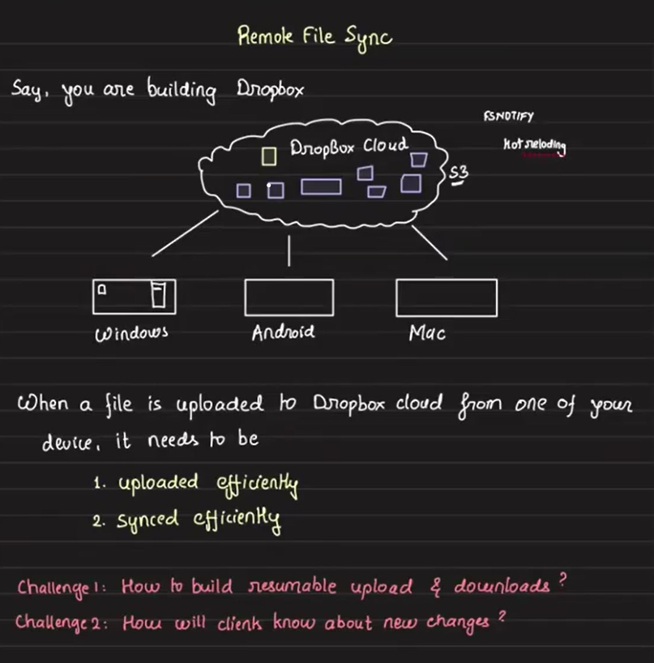

# Dropbox Remote File Sync

Dropbox's file sync system, one of its key features that drove its popularity in 2008-09, allows **seamless synchronization of files across multiple devices** (Windows, macOS, Android, etc.) by keeping a special folder (the “Dropbox folder”) in sync with the cloud. Let’s break this down step-by-step.

## Goal

Keep a common folder, Dropbox folder synchronized across all devices linked to a Dropbox account. Any changes (create, update, delete) made on one device should reflect on all others with efficient bandwidth usage and fast updates.



## Problems to Solve First: Upload Mechanism & Change Detection
1. **Resumable Uploads and Downloads** – Ensuring large file transfers can resume after interruptions.
2. **Client-Side Change Awareness** – How clients detect and react to new changes in the Dropbox folder.

### Step 1: Solving the Upload Problem

#### Dropbox Client Setup

- The Dropbox client must be installed on **every system**, we want to keep in sync.
- A specific folder need to be marked as the **Dropbox folder** on every system.
- The client runs continuously, keeping the folder in sync with the cloud.

To do this efficiently, the Dropbox client maintains the state of sync — tracking what changes have already been synced and what’s new. This ensures only new or modified data is processed.

#### Change Detection & Upload
When a file (e.g., `video.avi`) is added into the Dropbox folder:
- The Dropbox client detects this change via **FSNOTIFY**, a local file system event notifier.
- **FSNOTIFY** captures additions, deletions, and modifications, and generates local events.
- The Dropbox client consumes these events and initiates the corresponding sync operations.
- Once a new file is detected, the Dropbox client breaks the file into chunks (e.g., a 14MB file with a 4MB chunk size becomes 3×4MB + 1×2MB).
- These chunks are then uploaded to the cloud, typically to Amazon S3.

There are two strategies for uploading:
- Upload each chunk as a separate file.
- Store it as a single file but use S3 multipart upload, uploading one chunk at a time.

#### Chunk Storage, Metadata, and Content-Addressable Design

Suppose a user places `video.avi` in the root of their Dropbox folder. The file is split into four chunks: `c1`, `c2`, `c3`, and `c4`. These chunks are uploaded to cloud storage like:

```ruby
S3://my_dropbox/<account_id>/c1.blob
S3://my_dropbox/<account_id>/c2.blob
...
```

Now the question is: How do we store the mapping between `video.avi` and its chunks (`c1`–`c4`)?

Naively embedding the filename in chunk paths (e.g., `video_avi_c1.blob`) or organizing them in a folder (`S3://my_dropbox/<account_id>/video_avi/`) causes problems—especially during renames, which would require updating every chunk's S3 path. This is inefficient.

✅ Solution:

Introduce a metadata database that:

- Stores either the **chunk IDs** or their **storage locations** and maps filenames (like `video.avi`) to chunk IDs (e.g., `c1`, `c2`, `c3`, `c4`)
- We’ll use **pre-signed URLs** to upload each chunk directly to cloud storage. On the backend, we'll maintain the metadata table.
- Keeps chunk paths static (independent of file name)
- Enables fast rename by just updating the DB entry and efficient access

🔐 Chunk ID Generation and Integrity:

Now how to generate this chunk id's? Chunk IDs can be generated either on the client or with server assistance. To detect corruption, we compute a **hash** (e.g., SHA-256) of each chunk and store it. This hash can also serve as the chunk's unique ID, combining identification and integrity verification in one step.
- Ensures deduplication and corruption detection
- Hashes can serve as both identifiers and integrity checks
- Its very rare that a collision will happen, we will furthur see measure to avoid collision.
- Number of bits used for hash generation depends on the scale, the more the hash length, the less the chances of collision. 

Example of a chunk ID:

`SHA256(chunk_data) → 256-bit ID`

Hashing makes the system **content-addressable**—like Git. Identical chunks across files/devices map to the same hash, saving space and improving sync logic.
- So, what we’ve effectively built is a **content-addressable filesystem**, where files are reconstructed from a database of chunk hashes stored independently in S3.

#### Core Components till now

1. **Dropbox Client:** Installed on each device. Watches a Dropbox folder for changes.
2. **FSNOTIFY:** Filesystem-level notification API to detect changes in real time (additions, deletions, modifications). FSNOTIFY detects file additions, deletions, and modifications in the Dropbox folder. These local events are picked up by the Dropbox client locally, which consumes them and triggers appropriate sync actions.
3. **Cloud Storage (e.g., S3):** Stores file chunks.
4. **Metadata DB:** Stores file paths, chunk references, and versioning info.
    - Metadata DB Table Schema
        - `account_id`: User account ID
        - `path`: File path relative to Dropbox folder (e.g., `/exam/random.avi` i.e `random.avi` is present inside a folder `exam` in the dropbox folder)
        - `blocklist`: Ordered list of chunk IDs (e.g., h1,h2,h3)

#### Summary of upload flow

When a user adds a file, say `video.avi`, into the root of the Dropbox folder:
1. Dropbox client detects it using FSNOTIFY.
2. **Chunking & Hashing:** 
    - Assume chunk size = Max 4MB
    - E.g., A 14MB file is split into 4 chunks: 3 of 4MB, 1 of 2MB (e.g., `h1`, `h2`, `h3`, `h4`)
    - SHA256 hash is calculated for each chunk → used as **Chunk ID**
    - Chunks are content-addressed (like Git):
        ```java
        Chunk ID = SHA256(chunk_data)
        ```

3. **Storage Strategy:** Each chunk is uploaded to cloud storage (e.g., S3) at a path like:
`S3://my_dropbox/<account_id>/h1.blob`, `h2.blob`, and so on.

4. **Metadata Management:**
A metadata table stores:
    - `account_id`
    - `path` (e.g., `/video_avi` or `/exam/random_avi`, relative to the Dropbox root)
    - `blocklist` (comma-separated chunk IDs in order)

    This mapping allows file reconstruction in the correct sequence. Since order matters for rendering, the `blocklist` preserves the chunk order.

5. **File Update Handling:**

    When a chunk (e.g., `h3`) is modified and becomes `h3'`, only the `blocklist` column is updated in the DB.

###  Step 2: Change Detection Across Devices:

To keep multiple devices in sync under the same Dropbox folder, we can maintain an `updated_at` timestamp column in the metadata table. Whenever a file is added, updated, or removed, the Dropbox client on that machine detects the change using `FSNOTIFY`, and the cloud metadata (particularly `blocklist` and `updated_at`) is updated accordingly.

Other devices periodically **poll** the Dropbox server and compare their locally cached `updated_at` values with those in the cloud. If a file's `updated_at` in the server is newer, the client:

- Downloads the updated `blocklist`
- Compare the chunk IDs and fetches the chunk IDs from S3 which are changed
- Reconstructs and replaces the old file with the new version

This **polling-based approach** ensures eventual consistency across all devices without the complexity of maintaining long-lived connections.

A **push-based approach** is not used in sync because then we need to maintaining persistent connections between the Dropbox cloud and all user devices which is resource-intensive, complex, and less scalable, especially when users go offline frequently.

### Step 3: Efficient Folder Sync

The `path` column in the metadata DB stores the file's location relative to the root Dropbox folder (e.g., `/exam/random_avi`). Though S3 URLs like `S3://my_dropbox/<account_id>/<chunk_id>` don’t reflect this path, it helps logically group and query files.

To sync all files in a user’s Dropbox, the system can run:
```sql
SELECT * FROM metadata WHERE account_id = ? AND path LIKE '/*';
```

To sync files within a specific subfolder (e.g., `/exam/`):

```sql
SELECT * FROM metadata WHERE account_id = ? AND path LIKE '/exam/%';
```

These queries return the file's relative path, associated chunk IDs (as blocklist), and the latest `updated_at` timestamp. The Dropbox client can then compare this timestamp with its local state to identify modified or newly added files, download the updated chunks, and reconstruct the complete file accordingly.

The `blocklist` column maintains the ordered list of chunk IDs (e.g., `h1`,`h2`,`h3`,`h4`). While storage order doesn’t matter, this sequence is essential for proper reconstruction of the file during sync or download.

## Workflow Overview

3. Uploading Chunks to Cloud (Resumable Upload)

    - Requirements:
        - Upload only the chunks that don’t exist.
        - Avoid re-uploading if upload partially failed earlier.
    
    - Strategy:
        - Client calls API → “I want to commit file /video.avi with blocklist: [h1, h2, h3, h4]”
        - Meta Server (API) checks S3 for which chunks are missing
        - Meta Server responds with missing chunks list
        - Client uploads only those missing chunks using presigned URLs
        - Once all chunks are uploaded, client calls API again
            - If all chunks exist → entry is made in DB (commit)
    
        This ensures resumable uploads and avoids duplicate uploads.

4. Metadata DB Design

    - Table Schema
        - `account_id:` User account ID
        - `path:` File path relative to Dropbox folder (e.g., /exam/random.avi)
        - `blocklist:` Ordered list of chunk IDs (e.g., h1,h2,h3)
        - `version_id(vid):` Monotonically increasing version number per user
        - `timestamp:` File update time if not using vid

    - Path is logical, not physical.
    - Chunk names are not tied to file names, making rename efficient.
    - Storing hash in blocklist allows detecting file corruption and deduplication.

## Sync Across Devices

#### How do other devices know if a file changed?

- Every client keeps track of latest vid it has synced.
- Periodically, client polls Meta Server:
    ```arduino
    "Give me entries after vid = X for account_id = Y"
    ```
- New entries (with higher vid) are sent.
- Client compares chunk hashes with local ones to:
    - Download only new chunks
    - Reconstruct file from chunks

####  Lazy vs Eager Download
- Eager: All updated chunks downloaded immediately.
- Lazy: Only metadata pulled; chunks are downloaded when user accesses the file (0-byte placeholder). 
- For lazy load:
    - When user clicks a file → download chunks → reconstruct file → temporary cache → serve to user

####  File Versioning

Instead of updating DB row, insert a new row for every file update.

| version_id |	path	| blocklist	| account_id |
|---|---|---|---|
| 12	| /video.avi |	h1,h2,h3,h4	| A123 |
| 13 |	/video.avi |	h1,h2,h3',h4 |	A123 |

- Client fetches latest version by max `vid`.
- Easy to revert to older version.
- Avoids need for `is_active` boolean column.

## API Design

1. Commit API (PUT /<file_path>)

    Client calls:

    ```bash
    PUT /video.avi
    Payload: blocklist=[h1,h2,h3,h4]
    ```

    Server Flow:
    - Check which chunks exist in S3
    - Return missing chunk list
    - Client uploads those chunks using presigned URLs
    - Client retries the same PUT call
    - If all chunks exist → server commits entry in DB

2. Get Updates API
    ```bash
    GET /sync?account_id=A123&after_vid=42
    ```
    Returns all new versions for that account.

## Multi-versioned File Consistency
- New device joins → gets all metadata
- Syncs chunk-by-chunk only if required
- Chunks are shared across files if identical (de-duplication)

## Related Systems
- Git: Uses content-addressed storage (hash-based chunking)
- Google Drive: Also supports multiversioning (but serves full files for in-browser playback)
- S3: Native versioning support (not used here due to chunking design)

##  Considerations
- CDN Not Required:
    - Since it's personal sync (user uploads & downloads their own data), CDN isn’t needed.

- Hash Collisions:
    - Use SHA-256 for minimal collision risk
    - Avoids uploading duplicate content

- Cache Management:
    - Temporarily store and reconstruct full files on client during lazy access
    - Delete after use