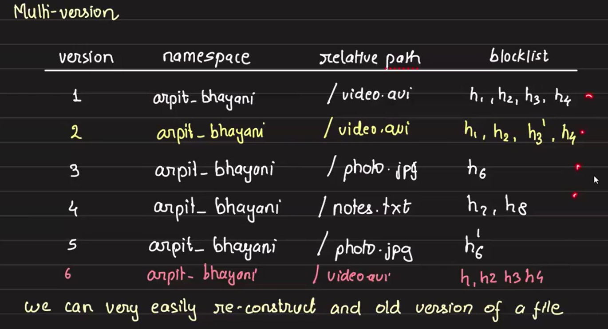

# Dropbox Remote File Sync

Dropbox's file sync system, one of its key features that drove its popularity in 2008-09, allows **seamless synchronization of files across multiple devices** (Windows, macOS, Android, etc.) by keeping a special folder (the “Dropbox folder”) in sync with the cloud. Let’s break this down step-by-step.

## Goal

Keep a common folder, Dropbox folder synchronized across all devices linked to a Dropbox account. Any changes (create, update, delete) made on one device should reflect on all others with efficient bandwidth usage and fast updates.


## Problems to Solve First: Upload Mechanism & Change Detection
1. **Resumable Uploads and Downloads** – Ensuring large file transfers can resume after interruptions.
2. **Client-Side Change Awareness** – How clients detect and react to new changes in the Dropbox folder.

### Step 1: Solving the Upload Problem

#### Dropbox Client Setup

- The Dropbox client must be installed on **every system**, we want to keep in sync.
- A specific folder need to be marked as the **Dropbox folder** on every system.
- The client runs continuously, keeping the folder in sync with the cloud.

To do this efficiently, the Dropbox client maintains the state of sync — tracking what changes have already been synced and what’s new. This ensures only new or modified data is processed.

#### Change Detection & Upload
When a file (e.g., `video.avi`) is added into the Dropbox folder:
- The Dropbox client detects this change via **FSNOTIFY**, a local file system event notifier.
- **FSNOTIFY** captures additions, deletions, and modifications, and generates local events.
- The Dropbox client consumes these events and initiates the corresponding sync operations.
- Once a new file is detected, the Dropbox client breaks the file into chunks (e.g., a 14MB file with a 4MB chunk size becomes 3×4MB + 1×2MB).
- These chunks are then uploaded to the cloud, typically to Amazon S3.

There are two strategies for uploading:
- Upload each chunk as a separate file.
- Store it as a single file but use S3 multipart upload, uploading one chunk at a time.

#### Chunk Storage, Metadata, and Content-Addressable Design

Suppose a user places `video.avi` in the root of their Dropbox folder. The file is split into four chunks: `c1`, `c2`, `c3`, and `c4`. These chunks are uploaded to cloud storage like:

```ruby
S3://my_dropbox/<account_id>/c1.blob
S3://my_dropbox/<account_id>/c2.blob
...
```

Now the question is: How do we store the mapping between `video.avi` and its chunks (`c1`–`c4`)?

Naively embedding the filename in chunk paths (e.g., `video_avi_c1.blob`) or organizing them in a folder (`S3://my_dropbox/<account_id>/video_avi/`) causes problems—especially during renames, which would require updating every chunk's S3 path. This is inefficient.

✅ Solution:

Introduce a metadata database that:

- Stores either the **chunk IDs** or their **storage locations** and maps filenames (like `video.avi`) to chunk IDs (e.g., `c1`, `c2`, `c3`, `c4`)
- We’ll use **pre-signed URLs** to upload each chunk directly to cloud storage. On the backend, we'll maintain the metadata table.
- Keeps chunk paths static (independent of file name). 
- By not joining chunk names with file names, makes renaming efficient, just updating the DB entry and efficient access

🔐 Chunk ID Generation and Integrity:

Now how to generate this chunk id's? Chunk IDs can be generated either on the client or with server assistance. To detect corruption, we compute a **hash** (e.g., SHA-256) of each chunk and store it. This hash can also serve as the chunk's unique ID, combining identification and integrity verification in one step.
- Ensures deduplication and corruption detection
- Hashes can serve as both identifiers and integrity checks
- Its very rare that a collision will happen, we will furthur see measure to avoid collision.
- Number of bits used for hash generation depends on the scale, the more the hash length, the less the chances of collision. 

Example of a chunk ID:

`SHA256(chunk_data) → 256-bit ID`

Hashing makes the system **content-addressable**—like Git. Identical chunks across files/devices map to the same hash, saving space and improving sync logic.
- So, what we’ve effectively built is a **content-addressable filesystem**, where files are reconstructed from a database of chunk hashes stored independently in S3.

#### Core Components till now

1. **Dropbox Client:** Installed on each device. Watches a Dropbox folder for changes.
2. **FSNOTIFY:** Filesystem-level notification API to detect changes in real time (additions, deletions, modifications). FSNOTIFY detects file additions, deletions, and modifications in the Dropbox folder. These local events are picked up by the Dropbox client locally, which consumes them and triggers appropriate sync actions.
3. **Cloud Storage (e.g., S3):** Stores file chunks.
4. **Metadata DB:** Stores file paths, chunk references, and versioning info.
    - Metadata DB Table Schema
        - `account_id`: User account ID
        - `path`: File path relative to Dropbox folder (e.g., `/exam/random.avi` i.e `random.avi` is present inside a folder `exam` in the dropbox folder)
            - Path is logical, not physical.
        - `blocklist`: Ordered list of chunk IDs (e.g., h1,h2,h3)

#### Summary of upload flow

When a user adds a file, say `video.avi`, into the root of the Dropbox folder:
1. Dropbox client detects it using FSNOTIFY.
2. **Chunking & Hashing:** 
    - Assume chunk size = Max 4MB
    - E.g., A 14MB file is split into 4 chunks: 3 of 4MB, 1 of 2MB (e.g., `h1`, `h2`, `h3`, `h4`)
    - SHA256 hash is calculated for each chunk → used as **Chunk ID**
    - Chunks are content-addressed (like Git):
        ```java
        Chunk ID = SHA256(chunk_data)
        ```

3. **Storage Strategy:** Each chunk is uploaded to cloud storage (e.g., S3) at a path like:
`S3://my_dropbox/<account_id>/h1.blob`, `h2.blob`, and so on.

4. **Metadata Management:**
A metadata table stores:
    - `account_id`
    - `path` (e.g., `/video_avi` or `/exam/random_avi`, relative to the Dropbox root)
    - `blocklist` (comma-separated chunk IDs in order)

    This mapping allows file reconstruction in the correct sequence. Since order matters for rendering, the `blocklist` preserves the chunk order.

5. **File Update Handling:**

    When a chunk (e.g., `h3`) is modified and becomes `h3'`, only the `blocklist` column is updated in the DB.

###  Step 2: Change Detection Across Devices:

To keep multiple devices in sync under the same Dropbox folder, we can maintain an `updated_at` timestamp column in the metadata table. Whenever a file is added, updated, or removed, the Dropbox client on that machine detects the change using `FSNOTIFY`, and the cloud metadata (particularly `blocklist` and `updated_at`) is updated accordingly.

Other devices periodically **poll** the Dropbox server and compare their locally cached `updated_at` values with those in the cloud. If a file's `updated_at` in the server is newer, the client:

- Downloads the updated `blocklist`
- Compare the chunk IDs and fetches the chunk IDs from S3 which are changed
- Reconstructs and replaces the old file with the new version

This **polling-based approach** ensures eventual consistency across all devices without the complexity of maintaining long-lived connections.

A **push-based approach** is not used in sync because then we need to maintaining persistent connections between the Dropbox cloud and all user devices which is resource-intensive, complex, and less scalable, especially when users go offline frequently.

### Step 3: Efficient Folder Sync

The `path` column in the metadata DB stores the file's location relative to the root Dropbox folder (e.g., `/exam/random_avi`). Though S3 URLs like `S3://my_dropbox/<account_id>/<chunk_id>` don’t reflect this path, it helps logically group and query files.

To sync all files in a user’s Dropbox, the system can run:
```sql
SELECT * FROM metadata WHERE account_id = ? AND path LIKE '/*';
```

To sync files within a specific subfolder (e.g., `/exam/`):

```sql
SELECT * FROM metadata WHERE account_id = ? AND path LIKE '/exam/%';
```

These queries return the file's relative path, associated chunk IDs (as blocklist), and the latest `updated_at` timestamp. The Dropbox client can then compare this timestamp with its local state to identify modified or newly added files, download the updated chunks, and reconstruct the complete file accordingly.

The `blocklist` column maintains the ordered list of chunk IDs (e.g., `h1`,`h2`,`h3`,`h4`). While storage order doesn’t matter, this sequence is essential for proper reconstruction of the file during sync or download.

#### Lazy vs. Eager Download Strategy

Once a file change is detected, the Dropbox client has two options for downloading:

1. **Eager Download:** Immediately download the updated chunks as soon as the change is detected.
2. **Lazy Download:** Just create placeholder entries (e.g., 0B files or metadata entries) and defer the actual download until the user opens or accesses the file. When user tries to access the file, it downlaod the chunks, reconstruct the file and serves to user. 

Lazy download improves performance and saves bandwidth when many files are changed but not immediately needed.

- **Note:** Download and upload are done directly via **pre-signed S3 URLs**, as previously discussed. Since the same user typically uploads and downloads the file across their own devices, **a CDN is unnecessary**—the latency and distribution needs are minimal.

## Multi-Versioning Instead of Overwriting

Initially, we updated the `blocklist` and `updated_at` columns in-place to reflect changes. But instead, we can **append new rows** to maintain **version history** of each file i.e making a new entry in the DB whenever there is a modification or addition:

|account_id	| path | blocklist |	timestamp |
|---|---|---|---|
| A123	| /video.avi |	h1,h2,h3,h4 |	10:22 |
| A123	| /video.avi |	h1,h2,h3',h4 |	11:22 |

To improve consistency and avoid timestamp collisions, we can add a vid(version ID) column and monotonically increasing vid instead of timestamps:

| vid |account_id	| path | blocklist |
|---|---|---|---|
|1 | A123	| /video.avi |	h1,h2,h3,h4 |
|2 | A123	| /video.avi |	h1,h2,h3',h4 |

This design ensures:
- Each version of a file is preserved.
- Clients can sync by saying: “I have data up to `vid = x`; give me everything after that.”
- `vid` must be **unique per user** but not globally. This is similar to Jira ticket numbers that reset per project.

## Unified File Upload API Design (Dropbox server API)

When uploading a file (new or modified), should Dropbox client expose two separate APIs—**one for creation** and **one for modification**?

**Initially, it seems logical** to separate the two operations due to their functional differences. However, from the **backend/database perspective**, both actions—creating a new file or updating an existing one—follow a very similar process:
1. **Upload file chunks to S3 (block server)** if they do not already exist.
2. **Insert or update metadata** (file path, blocklist) in the database (meta server).

Thus, we can consolidate both actions actions **modify and add** under **a single `PUT` API**:
```css
PUT /<relative_path> 
Body: blocklist = [h1, h2, h3, h4]
```
### Upload Flow: Commit Protocol
To avoid inconsistencies and partial uploads, we adopt a commit-style protocol involving two roles:
- **Block Server (S3):** Stores file chunks.
- **Meta Server (API server):** Stores file metadata and manages coordination.

Here’s how it works:

1. **Change Detection**

    Dropbox client detects a file change (e.g., video.avi) via FSNOTIFY.

2. **Chunking & Hashing**
    
    The client splits the file into chunks and computes SHA256 hashes for each chunk: `h1, h2, ..., hn`.

3. **Commit Request to Meta Server**
    
    The client calls the API:
    ```css
    PUT /video.avi 
    Body: blocklist = [h1, h2, ..., hn]
    ```
    
    This indicates intent to "commit" the file with given chunk hashes.

3. **Missing Block Detection**
    
    Meta server will not allow client to directly upload all the chunks in S3. It will only allow chunks that are not there in S3 to get uploaded. 
    
    So the Meta Server checks with the block server (S3) to identify which of the chunks are missing. Only **S3 can reliably determine this**.

4. **Presigned Uploads**
    
    The Meta Server responds client with a list of missing chunks and their respective **presigned URLs**. Dropbox client uploads those missing chunk. 
5. **Chunk Upload**
    
    The Dropbox client uploads only the missing chunks to S3. 
6. **Repeat Until Success**

    The client reissues the same `PUT` request. This process repeats until the Meta Server confirms all chunks exist in S3 (i.e., the missing list is empty).

7. **Finalize Entry in DB**
    
    Once all chunks are uploaded, dropbox client initiate the action to create or update the metadata in the database (meta server). So we need separete API for that. 
    ```css
    PUT /commit
    Body:
        {
            "path": "/video.avi",
            "blocklist": ["h1", "h2", "h3", "h4"],
            "account_id": "user_123"
        }
    ```
    - Creating the metadata entry before ensuring that all chunks are uploaded can lead to inconsistencies:
        - **Failed uploads:** If the chunk upload fails after the DB entry is created, the sync process breaks—other devices see metadata but can't fetch the file.

        - **Partial uploads:** Large files with slow network could result in long upload times. If another device tries to sync while the upload is incomplete, it may receive an error saying the file doesn't exist.
    
        This protocol ensures **atomicity and consistency**. A file entry is created **only when all required chunks are present** in the block server.

#### Why This is Robust
- Avoids premature DB entry creation that could break sync on other devices.
- Prevents unnecessary chunk uploads during retries.
- Works the same way for both new files and file modifications:
    - **New File** → All chunks uploaded.
    - **Modified File** → Only changed chunks uploaded.

## Multiversioning of file

When we create a new database entry for every file **update, revert, or creation**, we automatically **enable multiversioning** of files. But then how to keep track of the current version of a particular file? Most commonly we can use a separate `is_active` flag to track the current version.

Instead of marking one version as active ( using a boolean `is_active` column), we rely on the **monotonically increasing** `version_id` to determine the most recent state. For each user, the combination of `account_id` and the highest `version_id` for a given file path represents the latest version.

### Efficient Sync Strategy (Change Detection)



When a Dropbox client wants to sync:

1. It tells the API server:

    "**I have all data till** `version_id = X`. **Tell me what's new.**"

2. The server responds with entries having `version_id > X` for that `account_id`.
3. The client:
    - Checks the new entries’ blocklist.
    - Compares them with its local blocklists.
    - Downloads only the changed chunks (e.g.,` h6 → h6'`, `h3' → h3`) using pre-signed S3 URLs.

    This approach avoids sending unchanged chunks and minimizes data transfer.

## Related Systems
- Git: Uses content-addressed storage (hash-based chunking)
- Google Drive: Also supports multiversioning (but serves full files for in-browser playback)
- S3: Native versioning support (not used here due to chunking design)

## In-Browser File Viewing & Chunking Limitations

When providing an **in-browser viewing experience** (like Google Drive’s in-picture video playback), the chunked file model poses challenges. Browsers expect **a single continuous file**—not disjointed chunks.

For example, when you open a video or file in Google Drive:
- It initially shows a loading spinner or placeholder.
- Behind the scenes, it **downloads all the required chunks**, temporarily caches them locally, **reconstructs the complete file**, and then streams or displays it in-browser.
- Once playback or viewing is done, the temporary file/cache is removed.

This process is necessary because:
- **Browsers can’t handle chunked storage directly.**
- Full file reconstruction is required for standard video players, PDF viewers, image renderers, etc.

Thus, although we store files as chunks for efficient syncing and deduplication, to **support seamless in-browser previewing**, the Dropbox client must:
- Download all chunks when the file is accessed.
- econstruct and serve a unified file to the browser layer.

This ensures the user experience remains fluid, while still leveraging chunk-based storage behind the scenes.

##  Considerations
- CDN Not Required:
    - Since it's personal sync (user uploads & downloads their own data), CDN isn’t needed.

- Hash Collisions:
    - Use SHA-256 for minimal collision risk
    - Avoids uploading duplicate content

- Cache Management:
    - Temporarily store and reconstruct full files on client during lazy access
    - Delete after use