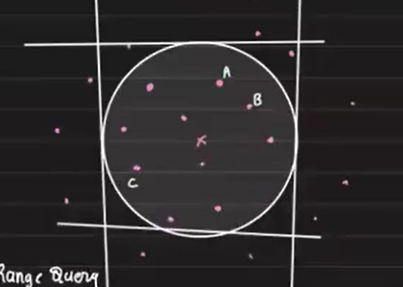
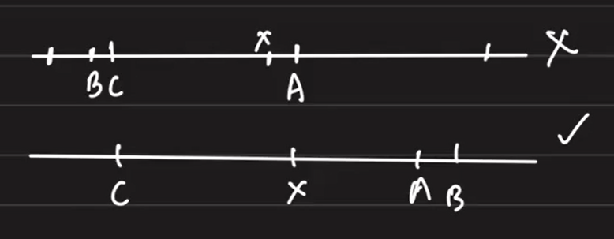
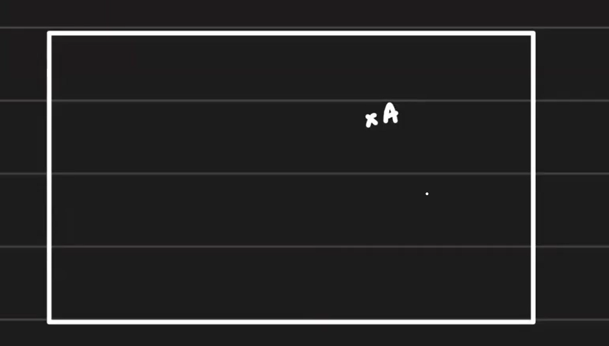
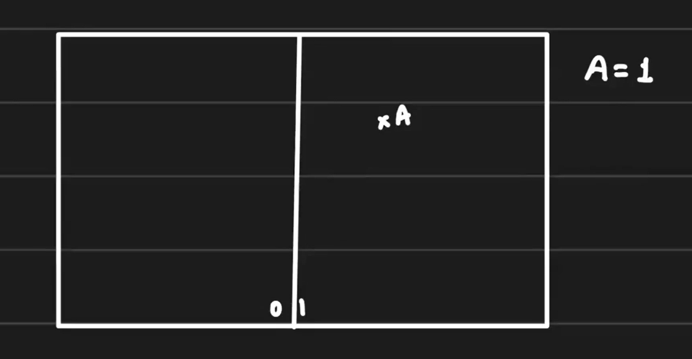
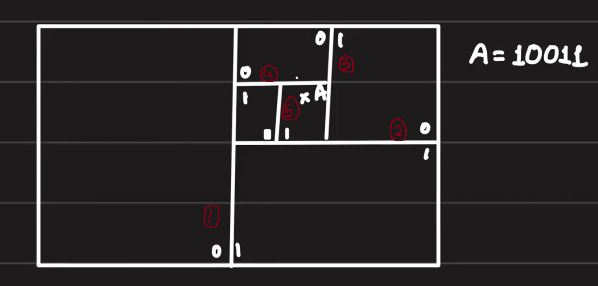
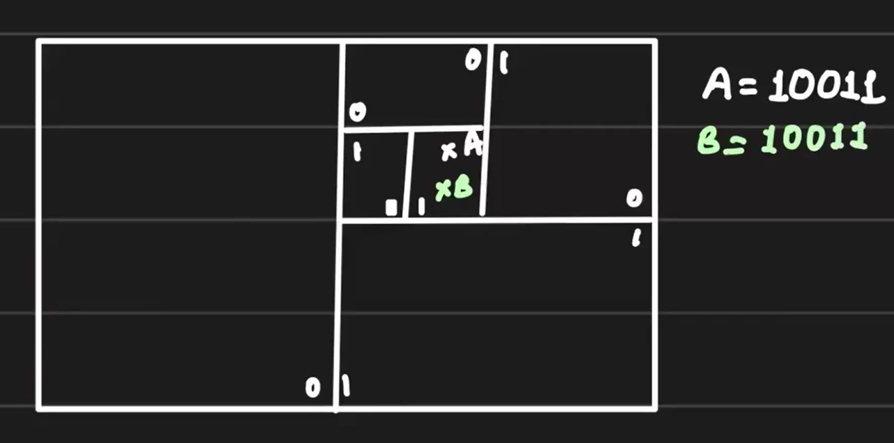
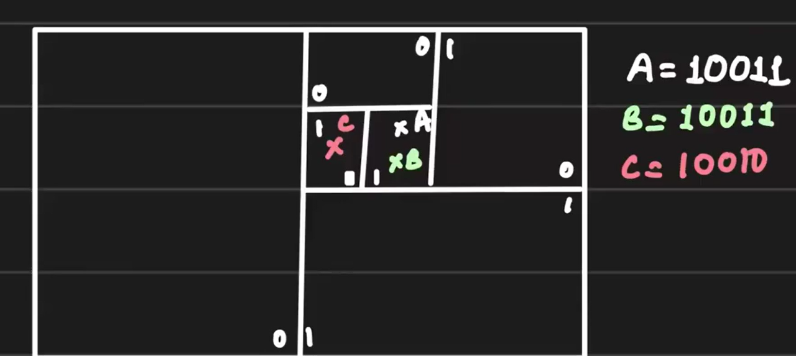
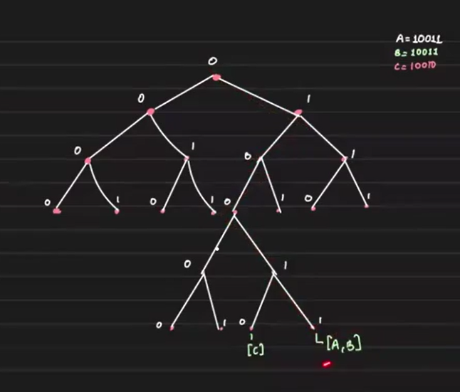
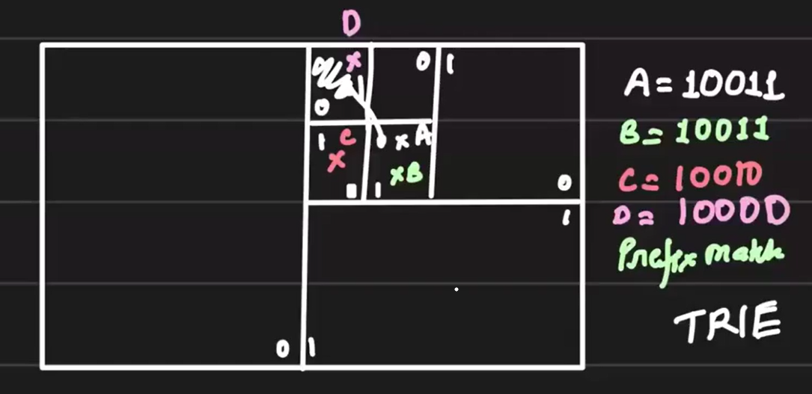

# Geo Proximity Service Design - Efficient Nearby Search at Scale

## Problem Statement:

Given a user’s location **(latitude, longitude)**, find all nearby users within a `k` km radius. This is essential in services like Uber, Tinder, and Facebook. Since location (x, y) is not unique (multiple users can be in the same location), the naive KNN approach becomes expensive at scale.

## Naive Approach:

Using K-Nearest Neighbors (KNN), we compute the distance from the given point to all others, which leads to a time complexity of `O(n)` — not feasible at scale where `n` is very large.

## Divide and Conquer Strategy:

Initially, we can partition users by country, state, city, and locality. However, within a region, KNN still requires `O(n)` checks. Precomputing all distances could help if locations were static, but they are highly dynamic in apps like Uber or Tinder, so precomputation is not viable.

## 1D Range Query Approximation:

If we could represent location by **a single dimension k**, then we can perform efficient range queries to quickly find all users within a certain radius (e.g., ±5 km) from a given location `x`:

**Find all users where location ∈ [x - 5, x + 5]**

```sql
SELECT * FROM users WHERE location BETWEEN x-5 AND x+5;
```
To store user locations efficiently, we maintain each user's location in a separate column in our database.

#### How to Implement Efficient Range Queries?

- **Binary Search:**

    Binary search allows us to efficiently locate a starting point—such as `x - 5`—in **O(log n)** time. However, this is only possible if the data is **sorted**. Since our queries are based on location, the dataset must be **sorted by the location column** to ensure binary search works correctly.

- **Linear Scan After Search:**
    
    Once we locate position x using binary search, we can do a linear scan to collect all users within the desired range `[x - 5, x + 5]`. This part has time complexity `O(K)`, where `K` is the number of matching records.

So the overall time complexity becomes `O(log n) + K`
#### Data Structures Optimized for This

To perform such operations efficiently, we need data structures that are optimized for ordered data with **fast search + sequential scan + fast insertion**, such as:

- **B+ Tree:**
    
    Used in many databases like MySQL, MongoDB, DynamoDB, B+ trees support fast range queries by allowing binary search followed by in-order traversal of adjacent entries.

- **Skip List:**
    
    A probabilistic alternative to balanced trees, also used in some NoSQL systems (e.g., Redis internally), offering O(log n) search and fast in-order traversal.

- **Segment Tree (for advanced use cases):**
    
    Can be used when we need range aggregates in addition to simple range fetches, though it’s more common in algorithmic or in-memory contexts.

These data structures are hyper-optimized for solving **single-dimensional range queries**, making them a great choice for proximity-based geo services when the space is simplified to one dimension.

## The Dimensionality Problem:

The Earth is a 2D surface (lat, lon), and range queries in 1D aren’t sufficient. Two possible strategies:

1. Convert 2D coordinates into a single dimension.
2. Break (lat, lon) down into two separate 1D range queries—**one for the x-axis (longitude)** and **one for the y-axis (latitude)**—and then take the intersection of results. 

### **Why #2 doesn’t work:**
Let’s say:
- We query for all users with x (longitude) in [x-Δ, x+Δ]
- Separately, you query for all users with y (latitude) in [y-Δ, y+Δ]
- Then you take the intersection of user IDs returned by both queries.

**What’s wrong with this?**

The problem is **loss of context**. When querying `x` independently, you get all users within that x-range **without knowing their corresponding y-values**. The same happens with `y`.

This results in logically "**infinite**" **y-values for a given x**—you have no constraint binding x and y together as a location pair.

If `x` and `y` are stored independently, querying on `x` without `y` leads to logically infinite matches on `y`, breaking proximity constraints.

**Example:**

Imagine there are thousands of users at every longitude value. Querying for `x in [10, 11]` gives you a huge number of users across all latitudes. When you intersect with `y in [50, 51]`, unless you also know the (x, y) pairs, you may end up missing valid matches or including incorrect ones.

**Conclusion:**

We cannot perform accurate 2D range queries by independently filtering x and y values without maintaining their relational context. This is why you either:

Convert (x, y) into a 1D value using spatial indexing (e.g., geohash, Hilbert curve), or

Use spatial databases or specialized data structures like quad trees, R-trees, or geohash-based tries that are built for multi-dimensional queries.

## Converting 2D Space to 1D — The Core Idea

To efficiently perform range queries in a 2D space (latitude and longitude), we need to **transform the two-dimensional location (x, y)** into **a single-dimensional** value `z` using a mapping function with the signature:

```scss
f(x, y) → z
```

This transformation enables us to use optimized 1D data structures (like tries, B+ trees, etc.) for fast lookups. But for this function to be useful, it must preserve spatial locality.

#### Desired Properties of the Mapping Function
1. **Locality Preservation:**

    If two points are **close together in 2D**, then their corresponding `z` values in 1D should also be close together.

2. **Separation Preservation:**

    If two points are far apart in 2D, then their `z` values should also be **far apart** in 1D.

#### Why This Matters



In the above picture A, B, and C are three points on a 2D plane (see Pic-1). When we map them to 1D space:

We need a function `f(x, y) → z` that maps 2D coordinates to 1D while preserving spatial proximity:

- The 1st example mapping in the below picture is bad mapping as B and C appear close in 1D even though they are far apart in 2D — violating spatial correctness.

- The 2nd example mapping in the below picture is a good mapping, the relative distances are preserved — B and C are far apart both in 2D and 1D, while A and B (if close in 2D) also remain close in 1D.

   

This ensures our proximity-based queries remain accurate even after dimensionality reduction.

## Solution: Space-Filling Curves (1D Mapping)

This challenge leads us into a specialized area of computer science known as **space-filling curves**. These are mathematical constructs designed to map multi-dimensional data (like 2D coordinates) into a single dimension while preserving locality.

Examples of **space-filling curves**:
- Hilbert Curve
- Z-Curve
- Morton Order (Z-order)
- N Curve
- Reverse N Curve

These curves are widely used in spatial indexing, databases, graphics, and geographic information systems.

**Note:** Arpit provides a brief explanation of some of these algorithms in his video. You can either follow that or refer to other resources for deeper understanding.

We'll focus on one specific algorithm from this family that we will use to solve our problem efficiently.

## Geohash and Trie-Based Proximity Search

Let’s assume our world is a **2D rectangular space**, and we want to represent any point in this space — say point A — using a **1D representation**.


#### Recursive Binary Splitting

1. We begin by **splitting the world vertically** into two halves:
    - Left half → `0`, Right half → `1`
2. Point **A** lies in the right half, its 1D coordinate becomes `1`.
    
    
3. We can recursively divide the world as many times as needed for finer granularity. Each time:
    - Left half → `0`, Right half → `1`

For example, after **5 levels of splitting**, point A might fall into a specific sub-box represented as `10011`. This binary string is now a 1D coordinate for A.



#### Uniqueness and Proximity
- If **point B** also lies within the same tiny box as A, its coordinate will also be `10011`.
    
- If we need to **differentiate between A and B**, we can keep splitting further.
- This encoding ensures that **points close in 2D** remain close in 1D as long as they share common prefix bits.

#### Applying This to Real-World Scenarios (e.g., Tinder Nearby Feature)

Let’s say:
- Users **A and B** share coordinate `10011`.
- Another user **C** lies just left of A, and is encoded as `10010`
    

When the app (e.g., Tinder) exhausts users in A’s area, it might expand the search to nearby areas, including C’s box.

Now we need a way to **efficiently query all nearby users**, including A, B, and C.

#### Prefix Matching with Trie

Looking at the coordinates of A, B, and C, we observe a clear **prefix pattern** — nearby locations share common prefixes in their binary representation. The most efficient data structure to handle such **prefix-based lookups is a Trie.**

- Each level of the trie represents one level of split.
- Deeper levels = finer precision (closer proximity).
- As we move up the trie, we **broaden** our search.



So:

- To find nearby users, we **traverse the trie** to a given coordinate (e.g., `0 → 1 → 0 → 0 → 1 → 1 → 1`) and collect users there (e.g., A and B).

- If the result is insufficient, we **go one level up** and collect all children nodes (users in broader regions like C), and so on.

Trie allows efficient search and **progressive expansion:**
- Start with leaf node
- Expand to parent and siblings if not enough results

#### Navigating to Nearby Regions (e.g., Google Maps or Tinder Swipe Behavior)

Suppose we don’t want to match user **C**, but rather want to explore a different area like the **top-right corner**, where user **D** resides with coordinate `10000`.

- To move to D’s region, we can **flip specific bits** of A’s coordinate.
- This is a standard operation in spatial navigation (e.g., in Google Maps).

These square regions are part of a **quadtree** structure, where each square is a “quad,” and the coordinate we derived (`10011`, `10010`, etc.) is called a Geohash.



In Tinder:
- If user A and B have prefix `10011`, they are close.
- If user C is in adjacent box: `10010`, it is slightly farther.
- To include C, broaden search by reducing prefix depth (e.g., `1001*`)

Moving or zooming around Google Maps is like flipping bits of a GeoHash.
- Top-left/right = flip specific bits
- Each region = "squad"
- Geohash encoding gives us a compact 1D representation of 2D locations

####  Final Insight
- The **Geohash** is a 1D encoding of 2D (or even 3D) coordinates.
- It’s an incredibly **simple yet powerful** representation that allows us to use **prefix matching** to search nearby regions using a Trie.
- Whether we move **left, right, or zoom in/out**, we can manipulate the bits of the geohash accordingly.

## Monetization Opportunities with Geospatial Data

Yes, geohash-based proximity systems can be effectively monetized in several ways:

1. **Progressive Zoom-Level Based Charging (e.g., Google Maps)**

    As a user zooms in deeper (exploring smaller geographic regions), each level of traversal can be assigned a cost. Think of each edge in the trie (or each zoom level) having a specific charge. The deeper the user goes, the more precise the data — and thus, the more valuable it becomes.

2. **Tiered Access in Matchmaking Apps (e.g., Tinder)**

    At each trie node, we can maintain two lists:
    - Premium Users
    - Free Users

    When displaying matches:
    - Show **premium users firs**t, followed by free users.
    - Introduce tiers such as **Gold, Silver**, etc., where higher-tier users appear even in wider search radii (e.g., 50km+).
    
    - This logic mimics platforms like Google Maps, where **businesses that pay more remain visible even when users zoom out**, often with a pinned label or highlight.

## GeoHash Prefix Match - SQL Implementation

This complex proximity logic reduces to a simple **prefix match** query:

Simple SQL for finding users near a location:
```sql
SELECT * FROM people
WHERE SUBSTR(geohash, 1, 5) LIKE 'tdrlv%';
```
- `tdrlv` is the prefix GeoHash of Bangalore.
- While not the most optimized approach, it provides a solid starting point and can be optimized further for production use.

**Note:** For visualizations, tools like p5.js (a JavaScript visualization library) can be helpful for simulating spatial partitioning, geohash generation, and zoom behaviors.