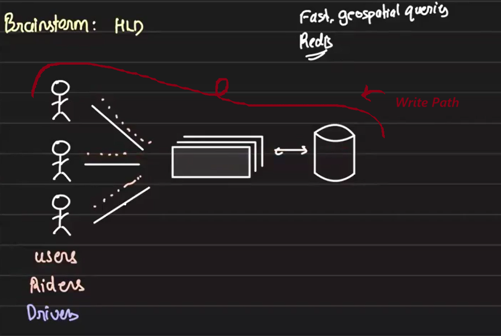

#  Uber Driver-Rider Matching System Design

## Overview

We design a system to efficiently match riders and nearby drivers and real-time data updates.

The Uber app continuously collects location data from both drivers and riders via heartbeat API calls (e.g., every 5 seconds). These updates are **POST requests** containing **geolocation data**, and they are ingested by the backend system for real-time matching. The challenge is to ensure low-latency, high availability, and fault tolerance while maintaining scalability.

## Write Path: Ingesting Heartbeats

### Database Choice

A fast, geo-query-supporting data store is essential. Redis fits well because of its in-memory speed and geo-spatial capabilities.

### Optimizations
- **Batching Writes:**

    Avoid writing every heartbeat individually. Batch them over time windows (e.g., 60 seconds) to reduce write load. Some level of data staleness for both rider and driver is acceptable.

- **Region-Based Partitioning Using Redis & Zookeeper:** 

    To ensure efficient scalability and low-latency responses, we partition data **by region**, typically **by city**. This works because no rider will ever request a driver from another city, allowing complete isolation between regions.
    - Partitioning Logic
        - Each **city** is assigned to a specific **Redis server**.
        - When using multiple Redis instances, we need to determine which city maps to which server.
        - This mapping can be:
            - **Statically configured**, or
            - **Dynamically managed via a config service, e.g., Zookeeper**.
    - Role of Zookeeper
        - Zookeeper stores the **city-to-Redis-server mapping**.
        - The API server consults Zookeeper to determine the correct Redis instance before processing **a location ingestion request**.
        - This allows:
            - **Dynamic config syncing** across services.
            - Easy **update propagation** when cities are **rebalanced**.
            - This is where all the concepts of **configuration synchronization, dynamic updates, polling, and push-based mechanisms** come into play—topics we’ve already discussed earlier.

### Horizontal Scalability & Fault Tolerance
- This architecture is **horizontally scalable** for each segment — new Redis nodes can be added and cities re-mapped with minimal effort. 
- If a Redis node goes down, the cities it handles become temporarily unavailable.
    - However, since drivers constantly emit location data (heartbeats), once the node is back, data gets refreshed automatically.
- To avoid downtime entirely, we can use **Redis read/write replicas**, ensuring **high availability** and **fault tolerance**.

## Read Path: Matching Drivers to Riders

Imagine multiple users are requesting rides at the same time. Each request is handled by a **matching service**. When a user initiates a request—for example, "I am in Bangalore and want to travel from Marathahalli to Sarjapur"—the **matching service** processes this call. Based on the user’s city, it identifies the appropriate Redis server (say, Redis node R1 for Bangalore) and queries it to fetch a list of available drivers in that region.

### Optimizations

- **Location-Based Filtering Using Redis Geospatial Queries**

    We don’t need to retrieve all drivers in Bangalore—only those near the user. This is handled efficiently using Redis’s internal **geospatial data structures**. Since the user’s current location is included in the matching request, the Redis server returns only nearby drivers, ensuring faster and more relevant matching.

- **Scalling Maching Service**

    A single server may not handle all incoming requests, so multiple instances need be deployed to distribute the load efficiently. The matching service is **stateless**, allowing it to **scale horizontally based on traffic**.

- **Scalability Concerns**

    For certain high-demand cities, the volume of requests per minute might exceed the capacity of a single Redis node. To manage this load, we can deploy multiple **read replicas** of the Redis node.

    When using replicas,**replication lag** naturally occurs — but is it a problem in our context? Suppose a driver or rider updates their location in the primary Redis node, and it takes up to 10 seconds for this update to reach a read replica. How far can a driver or rider realistically move in 10 seconds?

    In practice, **10 seconds is a large value** in the context of computation and storage. However, Redis replication typically happens in **milliseconds**, not seconds. So the actual lag is minimal. Even if a brief lag does exist, it doesn’t significantly impact the **matching accuracy** or user experience in ride-hailing scenarios.

    In contrast, a 10-second replication lag would be unacceptable in systems like **e-commerce** (e.g., flash sales), but in our case, it’s **not a critical concern.**

### Matching Workflow: From Nearby Drivers to Trip Creation

1. **User initiates a match request**

    A rider sends a request to the **Matching Service**, providing their current location and destination. The matching service identifies the city and routes the request to the appropriate **Redis node** (e.g., R1 for Bangalore).

2. **What does the Matching Service get from Redis?**

    The Redis node returns **a list of nearby drivers** based on the rider’s geo-coordinates. But matching service don’t send all this information of driver to the rider — that would be a poor user experience. In practice, users only see details of the **driver they are matched with**. Moreover, if there are thousands of nearby drivers, there’s no need to process them all at once. So, the matching service limits the Redis query to fetch only the top `n` **nearby drivers**.

3. **How do we initiate matching with drivers?**

    Once the matching service retrieves these `n` nearby drivers, it **sends parallel requests (notifications)** to all of them, containing the rider's pickup and drop locations (e.g., Marathahalli to Sarjapur) and the fare. Each driver gets the chance to **accept or reject** the trip.

4. **Trip assignment with locking to avoid race conditions**

    If a driver accepts the request, the system takes an **exclusive lock on the database** to update the trip assignment. This ensures **only one driver is assigned** to a particular trip, even if multiple drivers respond at the same time. This is a classic **limited resource with multiple contenders** scenario — a concurrency problem we’ve already explored.

5. **Handling no driver acceptance**
    
    If **none of the initial** `n` **drivers accept**, the matching service will fetch the **next batch of** `n` **drivers** from Redis and repeat the same request process until a match is found or a timeout is reache

    

### Smart Driver Selection: Filtering Based on Preferences & Constraints

When matching a rider to a driver, it’s not enough to simply pick any nearby driver. The system must respect **several constraints** to ensure a good user experience.

#### Why filtering is necessary

For example, what if:
- The rider books a 6-seater but the assigned driver has a 4-seater?
- The rider wants to pay via card, but the driver accepts only cash?
- The rider has a 4,5⭐ rating and expects a similarly rated driver?
- The driver doesn’t want to drive to certain locations after a specific time (e.g., no airport trips after 10 PM)?

These conditions ensure **a mutually acceptable match.**

#### Where to apply these filters?

- **Option A: In the Matching Service (Post-fetch filtering)**

    - Fetch nearby drivers from Redis.
    - Apply filters in the application logic.
    - **Downside:** Unnecessary data is retrieved and multiple retries may occur if many drivers don’t meet the criteria. This creates inefficiency and increases latency.

- **Option B: At the Redis level (Pre-fetch filtering)**
    - Ideal solution is to filter before fetching using something like a `WHERE` clause (as in SQL), but Redis does not natively support such filtering.

- **Option C: Key-based Filtering (Not Recommended)**
    - Create composite keys including preferences (e.g. `driver:bangalore:card_only:6_seater:>4star`)
    - Problem:
        - Keys become long and hard to manage.
        - Any change in driver preferences would require key regeneration → **inefficient and error-prone**.

- **Option D:Lua Script-Based Filtering (Recommended with Caution)**

    We can use **Lua scripts** to perform complex filtering logic in Redis(**similar to Option B**). Initially, the idea is to offload this logic to **read replicas** to reduce the load on the primary Redis node. However, by default, Lua scripts do not run on read replicas because they might contain write operations (like SET or UPDATE), which are not permitted on replicas.

    If we attempt to run a Lua script using the `EVAL` command on a read replica, Redis will respond with a `MOVED` error. This response includes the IP address of the corresponding **master node**, and the Redis client (SDK) in the matching service will then redirect the request to that master and execute the script there.

    To safely run **read-only Lua scripts** on read replicas, Redis provides the `EVAL_RO` command. This allows us to execute Lua scripts that only perform read operations without triggering replication errors—enabling **load-balanced, high-throughput querying** across replicas without impacting the master.
    
    Initially `EVAL_RO` command was not there in Redis. A company named Gojek raised this issue with the open source community and the commnunity implemented this command.

    
## Read-Heavy and Write-Heavy System

The driver-rider matching system exhibits characteristics of both **read-heavy** and **write-heavy** workloads:
- **Write-heavy:** Every driver and rider device sends **location updates every 5 seconds**, leading to **continuous high-frequency writes** into Redis.

- **Read-heavy:** Every time a rider initiates a match, the system fires **a Lua script-based geo-query** to fetch eligible drivers from Redis. These Lua scripts are more **resource-intensive and latency-sensitive** than typical Redis operations.

Due to this dual pressure, the system must scale **reads and writes independently** to maintain performance and reliability.

### Scaling Strategy:
- **Write Scalability:** Achieved through **sharding**—we've partitioned data by region (e.g., cities) and distributed it across multiple Redis masters.

- **Read Scalability:** Achieved using **read replicas**—each master Redis node has multiple replicas to handle high read throughput (e.g., Lua-based matching queries).

Redis naturally supports this architecture: **one master with multiple read replicas**, and **multiple such masters**, enabling a horizontally scalable and fault-tolerant system.

## Designing for High Availability and Low Latency with EVAL.RO

When designing the driver-matching system using Redis, we focus heavily on **availability and low latency over strict consistency**. In this context, consistency means real-time precision in location data—but slight inaccuracies are tolerable. What’s critical is that:
- Writes (location updates) must always be processed, and
- Reads (matching queries) must always return a result quickly.

Any **downtime is unacceptable**, as the system must remain responsive at all times.

### Key Design Goals:
1. **In-memory and fast:** To support real-time interactions.
2. **Supports geo-queries:** For locating nearby drivers efficiently.
3. **Horizontally scalable:** Multiple master nodes, each with multiple read replicas.

**Redis** satisfies all these criteria, making it a suitable choice. However, a major challenge arises with Lua scripting and replicas.

### The Problem with `EVAL` on Redis Replicas

Matching logic involves complex filtering, which we handle using **Lua scripts** passed via the `EVAL` command. These scripts encapsulate conditions like car type, driver rating, payment preference, destination rules, etc., and Redis filters the eligible drivers internally.

But:
- The standard `EVAL` command is **not supported on Redis replicas** because it might contain write operations.
- When we issue `EVAL` to a read replica, Redis returns a `MOVED <master_ip>` response.
- The Redis client (SDK) then automatically redirects the request to the **master**, executes the script, and returns the result.

This behavior defeats the purpose of scaling reads via replicas.

### Solution: EVAL.RO Command
To address this, Redis introduced the `EVAL.RO` command. Here's how it solves the problem:
1. `EVAL.RO` allows only read-only operations within the Lua script (e.g., `GET`, `GEOSEARCH`, `KEYS`, `LRANGE`, etc.).
2. **No write commands** (`SET`, `DEL`, `INCR`, etc.) are allowed.
3. Required SDK changes: The **Gojek engineering team** contributed a patch to the Go Redis SDK, which previously blocked script execution on replicas. The Redis team then formally implemented support for `EVAL.RO`.

### Impact
With EVAL.RO in place:
- **Matching queries can run on read replicas**, preserving master bandwidth.
- **Reads and writes are now independently scalable**—masters handle location updates (writes), while replicas handle match queries (reads).
- This leads to a **highly available, low-latency, and horizontally scalable** architecture.

This leads to a highly available, low-latency, and horizontally scalable architecture.

## Achieving High Availability with Redis: Read Replica Strategy and Load Balancing

We’ve seen how Redis helps us achieve **low latency** through in-memory storage and geo-queries. But what about **availability**? Gojek implemented a few smart strategies to handle availability concerns in this architecture.

- **Problem: Read Replica Failure During Matching Query**

    When a rider initiates a match, the system fires a query (via Lua script) to **a read replica**. However, if this replica becomes unavailable during query execution, the request fails and must be retried—**hurting availability**.

- **Solution: Split Queries Across Multiple Read Replicas**

    Instead of depending on a single read replica, **split the query and run it in parallel on multiple read replicas**, each handling part of the search space.
    
    For example:
    - If the rider requests drivers with **rating > 4**, we split the range into:
    - Drivers with ratings **4.0–4.5**
    - Drivers with ratings **4.5–5.0**

    Each query is dispatched to **a different read replica**. Even if one replica fails, the system can proceed with partial results from the other. This **improves fault tolerance** and keeps the system available.

    

## Handling Hotspot Redis Nodes: Load Rebalancing Strategy

**Problem: Uneven Load Distribution (Hotspot)**

Suppose two high-traffic cities like Mumbai and Bangalore are assigned to the same Redis node (R1). This could overwhelm R1 during peak load, affecting performance.

## Scaling Lua with Redis: The EVAL.RO Revolution

- **Problem:** `EVAL` doesn’t run on read replicas (write-only command).
- **Solution:** Use `EVAL.RO`, a Gojek-proposed enhancement allowing **read-only Lua scripts** on Redis replicas.
    - Commands like `GET`, `GEOSEARCH`, etc., are supported.
    - Requires SDK changes (e.g., Go Redis SDK patched by Gojek).
- **Benefit:** Redis read and write workloads can now be scaled independently.

## Ensuring High Availability

We can redistribute cities to different Redis nodes, for example, moving Bangalore from R1 to R3. But this raises a concern:

**What happens to the data already present in R1? Do we need complex, no-downtime data migration?**

**Key Insight: Frequent Location Updates Make Migration Easy**
What Redis stores here is just **geo-location** data that gets updated **every 5 seconds** from every device.

So,
- If we move Bangalore to R3, **R3 will start receiving fresh location data within 5 seconds.**
- We can tolerate a brief data gap (≤5 seconds) because updates are so frequent.
- **No complex migration is needed.** Simply update the config and let fresh data flow into the new node.

This **simplifies rebalancing** without downtime. In practice, **large cities are rarely moved**. The system typically reassigns **smaller cities** first to reduce load on hot nodes. Large cities are moved **only as a last resort**.

## Key System Design Principles in this case
- High Availability > Strong Consistency
- In-memory store with geo-queries is a must
- Multi-master with read replicas for both performance and fault tolerance
- Redis with EVAL.RO makes real-time, filtered geo-matching scalable
