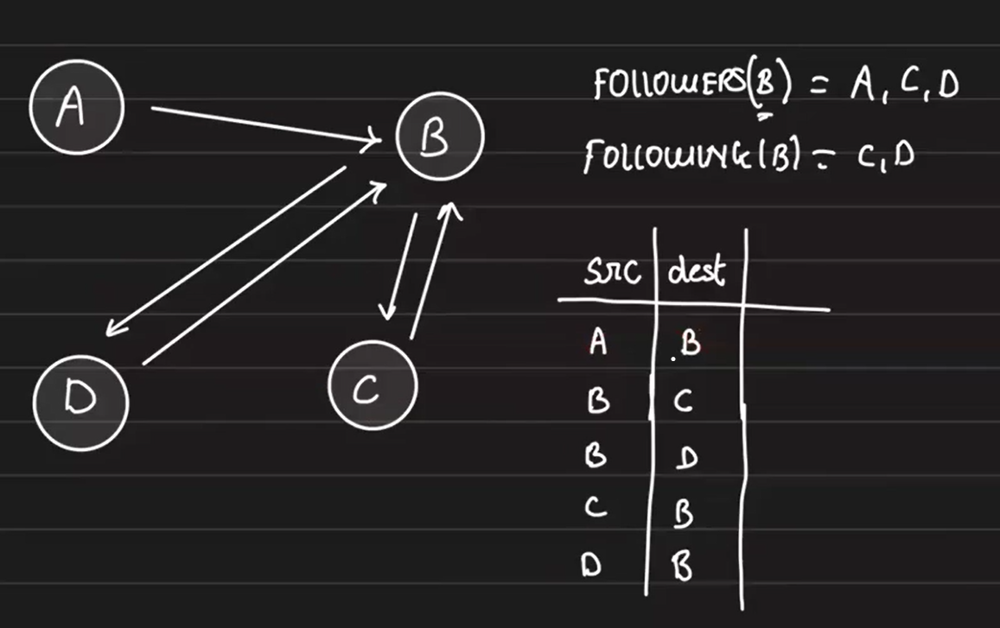
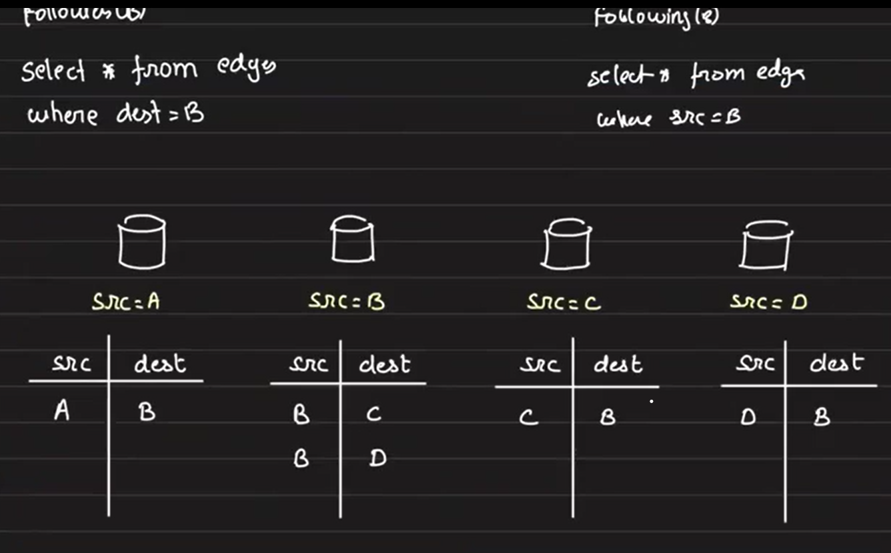
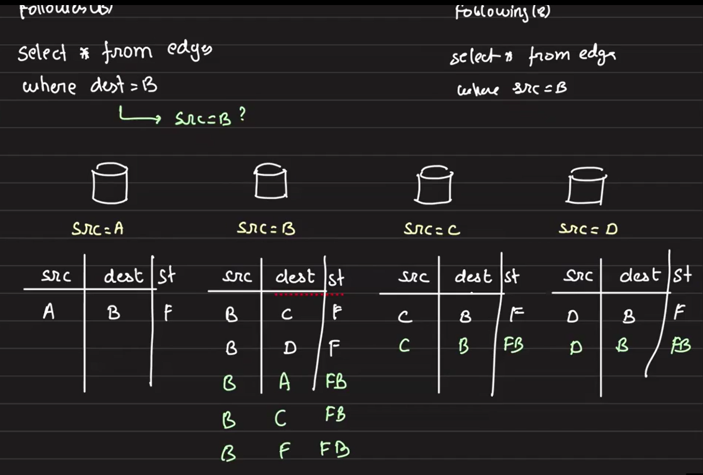
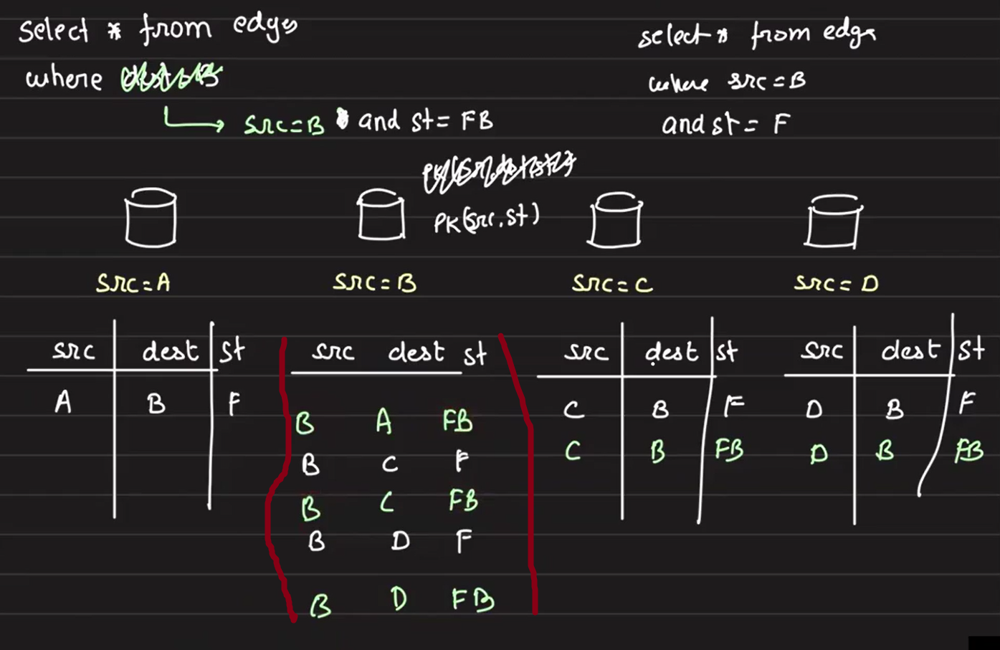
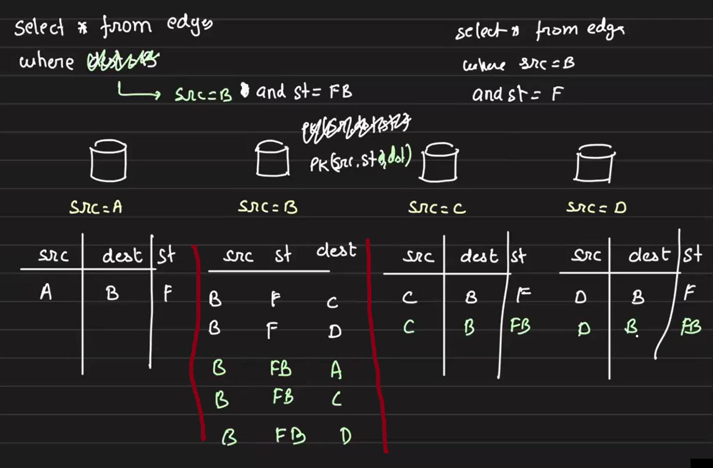
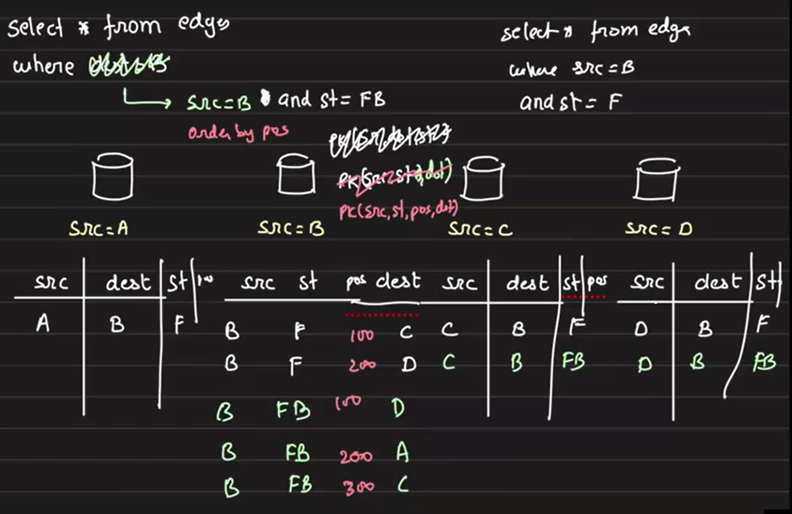

# Designing the Follow/Following Service in Social Media Platforms

In a social media platform, the **Follow/Following** relationship forms the foundation of user interactions. The goal is to model this efficiently at scale while considering read-heavy access patterns.

## Problem Statement
- Users can follow other users.
- Potentially, every user can follow every other user (N * N relationship).
- Example: With **1 million users**, there can be **1 trillion possible follow relations**.
- This is a **directed graph** problem (A follows C --→ directed edge A → C).

But **does this need a Graph DB?**
Let's analyze.
- Use Case: A user (with 200K followers) tweets. The post needs to be shown to all followers.
- Fetching 200K followers at once is not feasible via traversing all the edges.
- **Graph DBs struggle with deep pagination:**
    - They are great for recommendation engines, fraud detection, but not for social media scales.
    - Pagination degrades performance significantly after a few pages.
- **Relational DBs handle pagination efficiently** because:

Hence, for **deep pagination and massive scale** graph DB is not a good choice, Relational DBs are preferred. When choosing a database, it's crucial to consider the **access patterns, expected scale, and the underlying storage architecture** to ensure optimal performance and efficiency

## Data Modeling in Relational DB

In relational databases, data is physically organized based on the order of the **primary key** using a **B+ tree structure**. This layout enables highly efficient **sequential scans** when querying by primary key or index key, making **range queries** particularly fast and scalable.

To understand this better, consider a simple example with four users: **A, B, C, and D**. Let’s focus on `user B` to see how data retrieval benefits from this ordered structure.



### Table Design
In our relational database table, we store the **follow/following relationship** using two columns:
- `src` (source user)
- `dst` (destination user)
- Table Name: edge

The interpretation is simple: `src` follows `dst`.

Here the **primary key will be a composite key** `(src, dst)`. To efficiently query the data it will be stored as -- 
- The table is **ordered by** `src` **first**.
- Within each `src`, it is further ordered by `dst`.

### Access Patterns
1. For a query like "**Get all the followings of user B**"

    - As the data is internally stored in a **B+ tree** and sorted by the composite key **(src, dst)**, we can efficiently locate the **starting point of** `src = 'B'` in **O(log n)** time. After that database performs a **sequential scan** until we encounter entries where `src = 'C'` or `src = 'D'`, ....  At that point, we know no further entries for `src = 'B'` will appear since all entries for `src = 'B'` are stored contiguously, this is highly efficient.
        ```sql
        SELECT * FROM edge WHERE src = 'B';
        ```

2. For a query like **"Does user A follow user B?"**
    - we can efficiently check if the pair `(A, B)` exists. Once the database reaches entries where `src = 'B'`, we know there are no more entries for `src = 'A'`, eliminating the need for a full table scan.

2. For a query like **"Get all followers of User B"**
    ```sql
    SELECT * FROM edge WHERE dst = 'B';
    ```
    - The query engine cannot leverage the existing index because the table is not sorted by `dest`.
    - Entries for `dest = 'B'` could be scattered across the entire table.
    - As a result, the query becomes a **full table scan**, which is **inefficient** for large datasets

### Possible Optimization: Secondary Index on (dest, src)

- One obvious solution is to **create another index** on `(dest, src)`.
    - This would allow efficient queries for `dest = 'B'` by enabling O(log n) lookup and sequential scan by `dest`.

- Drawback:
    - This solution works well for a **single-instance database**, but **fails in a sharded environment**.
        - If the database is sharded by `src`, a query on `dest` would still require a **scatter-gather across shards**, making it expensive.

### Importance of Followings and Followers Queries 

In a social media platform like Instagram, both **"followings"** and **"followers"** queries are critical to core features:
1. **Constructing My Feed:**

    - To build my feed, the system needs to quickly fetch **all the accounts I follow.** Hence, the query to get **my followings** must be highly optimized.

2. **Distributing My Posts to Followers:**

    - Whenever I post something, the platform needs to notify or update the feeds of **all my followers.**
    - This requires fetching **all the users who follow me**, which is equally important.

But till now what we have build --
- Query 1 (get followings of `B`) aligns well with the current data layout and indexing strategy.
- Query 2 (get followers of `B`) suffers due to lack of indexing on `dest`, leading to performance bottlenecks.

## Re-thinking Data Layout for Efficient Follower Retrieval

Let’s consider a scenario where we **shard the database by the** `source (src)` user. For simplicity, imagine each shard holds data for one `src` (e.g., one shard for A, one for B, etc.).



- The first query **"get all followings of B"**  becomes very efficient.
    - As it only needs to query the shard that contains `src = 'B'` data.
    - Thanks to the shard-local ordering by `(src, dst)`, this is a quick sequential scan after a B+ tree lookup.

- However, the 2nd query **"get all followers of B"** becomes problematic:
    - This query now turns into **a cross-shard query**, as `dest = 'B'` could be present in any shard.
    - Each shard would need to be scanned to find if any user follows `B`.
    - This makes the query very inefficient at scale.

### A Possible Solution: Secondary DB Sorted by Destination

One possible optimization is to maintain **a second database**:
- This secondary DB would store the same edge data but **ordered by** `dest` **first, and then** `src`.
- For followers query (`dest = 'B'`), we would query this second DB, enabling a sequential scan similar to the first query’s efficiency.

### But There's a Trade-off
- While this improves query performance for followers, it introduces complexity:
    - At runtime, the system now needs to decide which DB to query:
        - Query DB1 when searching by `src = 'B'`.
        - Query DB2 when searching by `dest = 'B'`.
    - Maintaining and syncing two databases with the same data but different orderings increases storage overhead and operational complexity.

Thus, while this method can improve query performance, it introduces **architectural trade-offs** that need careful consideration.

## Eliminating Cross-Shard Queries with Follow State Duplication

To solve the inefficiency of fetching followers in a source-sharded database, we can rethink how we model the follow relationship.

For every follow relationship where **User A follows User B**, we can 
interpret it in two ways:
- A follows B
- B is followed by A

To support both access patterns efficiently, we introduce a new column called `state (st)`:
- `F` for "follows"
- `FB` for "followed by"

This means for a single follow relationship, we will store **two rows** in the relational table:
1. `(A, B, F)` → Represents **A follows B**
2. `(B, A, FB)` → Represents **B is followed by A**



### Querying with State Column

With this design, both types of queries can be optimized to target specific shards and avoid cross-shard queries:

1. Get all followings of B (who B follows):
    ```sql
    SELECT * FROM edge WHERE src = 'B' AND st = 'F';
    ```
    - This query hits only the shard where `src = 'B'`.
    - Efficient, as data is ordered by `src`.

2. **Get all followers of B** (who follows B):
    ```sql
    SELECT * FROM edge WHERE src = 'B' AND st = 'FB';
    ```
    - Previously this was a cross-shard query with `dest = 'B'`.
    - Now it also becomes a single-shard query by using `src = 'B'` and filtering with `state = 'FB'`.

- **Trade-offs and Benefits**
    - **Trade-off:** We double the number of entries in the database to maintain both perspectives of the relationship.
    - **Benefit:** We eliminate expensive cross-shard queries and keep both "followings" and "followers" queries efficient.
    - Access patterns are now symmetric — both followings and followers are accessible via a single-shard lookup.

## Primary Key Design: Impact of Ordering on Query Performance

When deciding the primary key for our follow relationship table, the choice of ordering has a direct impact on query efficiency.

### Ordering by (src, dst) 
Initially, we considered ordering the data by `(src, dst)`. This works well for queries like **"Get all users followed by B"** (i.e., `src = 'B' and state = 'F'`). However, when we attempt to retrieve **"All followers of B"** (i.e., users who follow B), this ordering becomes problematic.

For the ordering `(src, dst)`, the data will be laid out like this -- 



Let's break it down:
- For the follower query, we would look for entries where `src = 'B'` and `state = 'FB'`.
- But in this schema, the data is ordered only by `src` and `dst`, without considering the `state`.
- As a result, to retrieve all entries with `src = 'B'` and `state = 'FB'`, we would still need to scan the **entire shard segment where** `src = 'B'`.
- This effectively becomes **a full scan within that shard** since the `state` column is not part of the ordering key used by the underlying B+ tree structure.

### Ordering by (src, dst, state)

We might consider extending the key to (src, dst, state) to address this. However, this still does not solve the problem:
- The data would still be grouped by `src` first.

- Inside the segment of `src = 'B'`, entries would be ordered by `dst` and then st`a`te.
- This means that entries with `state = 'F'` and `state = 'FB'` would be intermixed based on `dst` ordering.
- Therefore, a query like `src = 'B' and state = 'FB'` would still require scanning through all entries of `src = 'B'` to filter out the correct `state`.
- The lookup would again degrade into a **sequential scan of the shard segment** for `src = 'B'`.

### Ordering by (src, state, dst)
Now with the primary key i.e order as `(src, state, dest)`. The data layout in the table will be like -- 


With this ordering:
- The **first query** (**get all followings of B**) becomes efficient.
    - This query benefits from the ordering, as it can directly seek to the start of `(B, F)` and then perform a sequential scan for all matching `dest` values.

- For the **second query** (**get all followers of B**),
    - Also starts with a key lookup for `(B, FB)` and then performs a sequential scan.

- So this ordering improves the scan locality for the second query compared to previous key choices, it now requires scanning only through the entire range where `(src = 'B' AND state = 'FB')` exists. Hence, within that shard, it avoids a full table scan.

## Introducing Priority and Efficient Ordering in Feed Queries

So far, we have been ordering both "**follows**" and "**followed by**" relationships by `user_id` (i.e., `src` and `dest`). However, real-world feed generation requires more complex ordering.
- Real-World Feed Scenarios:
    - Users may want to see **recent followers first**.
    - I frequently interact with suppose Arpit's contents, so any new post by arpot **should appear higher in my feed** than for users who rarely visit Arpit’s profile.

### Need for a Priority Column:

To support such personalized sorting, we introduce a new column, let's call it priority (or pos), which indicates the importance of `dest` for a given `src` and `state`.

### Primary Key Options:

- Current primary key: `(src, state, dest)`
- The get data ordered by `pos`, query will look like 
    ```sql
    SELECT * FROM edge WHERE src='B' AND state='FB' ORDER BY pos
    ```
- Issue:
    
    Internally, the database needs to scan **all rows for src='B' and state='FB'**, collect the result set, and **sort it by pos**.
    
    If there are **millions of entries**, this sort operation becomes very expensive.

### Optimizing Data Layout for Efficient Sorting:

To make this query efficient, we should **store the data in the same order as we want to retrieve it**.

Thus, we change the primary key to: `(src, state, pos, dest)`



Benefits:
- Now the query:
    ```sql
    SELECT * FROM edge WHERE src='B' AND state='FB' ORDER BY pos
    ```
    becomes **a range scan over already sorted data**. We can also remove `ORDER BY pos`.

- Both "followings" and "followers" queries are optimized with this key ordering.

### Do We Still Need `dest` in the Primary Key?

Initally we may think that we don't need `dest` in primary key if `pos` is unique. But 
- Consider the case of duplicate priorities with `dest` in primary key
    - Example: `(A, FB, 200, C)` and `(A, FB, 100, C)` → Ideally, this duplication should not happen.
- Also, for point queries like: `Does A follow B?`

    We still need a **unique constraint on** `dst` to ensure data consistency and quick lookups.

Thus, **dest is essential** for uniqueness and point queries.
Reason
- Efficient sequential scans by `src` and `state`.
- Ordered by `pos` for fast **priority-based pagination**.
- Keeps `dst` to ensure uniqueness and support efficient "does A follow B" lookups.

## Efficient Pagination 

### Problem with OFFSET-based Pagination:

As the number of followers grows to **millions of users**, simple pagination queries become inefficient.

- Example Query:
    ```sql
    SELECT * FROM edge WHERE src='B' AND state='FB' ORDER BY pos LIMIT 10;
    ```
    - This returns the **first 10 records** efficiently.
    
    For the next page:
    ```sql
    SELECT * FROM edge WHERE src = 'B' AND state = 'FB' ORDER BY pos LIMIT 10 OFFSET 10;
    ```
    Similarly, offset 20, offset 30, and so on for subsequent pages.

#### The Drawback:
- For each OFFSET query, the database has to:
    - Compute **the entire result** set up to the `OFFSET+LIMIT` value.
    - **Skip the initial rows.**
    - Only then return the next 10 items.
- This becomes **increasingly expensive** as OFFSET grows larger.

### Cursor-Based Pagination (Seek Method):

A much more efficient approach is to **remember the last item fetched** and use it to continue pagination.

Optimized Query:
```sql
SELECT * FROM edge WHERE src='B' AND state='FB' AND pos > 10 ORDER BY pos LIMIT 10;
```
- Instead of OFFSET, we use the **position of the last fetched item (pos > 10).**
- Internally:
    - The database does a **B+ tree seek (O(log N))** to reach the starting point.
    - Then performs a **sequential scan** to fetch the next 10 items.

This method **avoids scanning skipped records** every time and scales efficiently with large datasets.

## Summary: Twitter's FlopDB Design

- This architecture is similar to Twitter's FlopDB.
- It's a **read-heavy system**:
    - **Read-heavy workload** -> Feed construction happens frequently.
    - **Write-light workload** -> New followers/following events are much less frequent.
- Hence, the system is optimized for fast, efficient reads, especially for large-scale follower graphs.

- By:
    - Using a relational DB,
    - Duplicating data with a `state` column,
    - Choosing the right primary key order,
    - Implementing seek-based pagination,
we achieve high performance at social media scale.