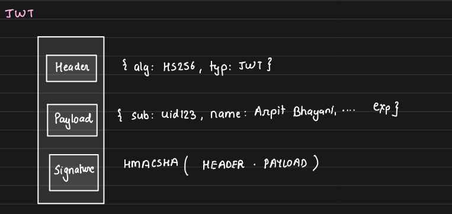

## 1. Caching Assets in a CDN

While static content is commonly cached in a CDN, dynamic assets can also be effectively cached. A **Content Delivery Network (CDN)** is a network of geographically distributed servers that sit between the user and the origin server. These origin servers could be an API server, a web server, or even cloud storage like S3 or HDFS.

### a. How a CDN Works
**Request Handling:** The core idea of a CDN is to improve performance by positioning servers geographically closer to users. When a user makes a request, it first goes to the nearest CDN server. If the requested resource is cached in the CDN, it serves the response immediately. If not, the CDN forwards the request to the origin server, retrieves the response, caches it locally, and then serves it to the user. All subsequent requests for that resource are handled by the CDN server without querying the origin. This makes the CDN the first point of contact, significantly reducing latency.

### b. How Does the Browser Know the Nearest CDN Server?

CDNs use protocols like Anycast and Border Gateway Protocol (BGP) to route traffic to the closest server:

- Anycast allows multiple servers to share the same IP address. For example, if CDN servers in Kolkata (KS1) and Mumbai (MS1) both advertise the IP address `10.0.0.1`, a request from West Bengal would hit KS1, while a request from Nagpur would hit MS1, ensuring the closest server is always reached.

- It may seem that a hacker could advertise the same IP, like `10.0.0.1`, and intercept traffic, but BGP includes built-in security measures to prevent such unauthorized actions. These mechanisms ensure that only legitimate servers can advertise certain IP routes, safeguarding user data from malicious routing attacks.

This setup ensures that content is delivered quickly and securely from the nearest server, optimizing user experience.

### c. CDN Configuration and Request Flow

When configuring a CDN, it appears like a black box where we simply provide an origin server, and the CDN gives us a domain name to use for communication. Let’s break down what actually happens.

For example, suppose the origin server’s domain name is `https://arpitbhayani.me`, and an image file exists at `https://arpitbhayani.me/img/arpit.jpg`. When a user tries to load this image, the request is directed to the machine whose IP address is linked to the domain `arpitbhayani.me`, which is configured in **Route53** or another DNS service. Without a CDN, this request goes directly to the origin server, retrieving the image file.


Now, when a CDN is involved, the process changes. Let's say the CDN assigns the domain `https://a.mycdn.net` as a proxy for `https://arpitbhayani.me`. When a user makes a request for `https://a.mycdn.net/img/arpit.jpg`, the request undergoes DNS resolution, and the CDN server closest to the user is identified by the DNS, based on Anycast routing. If the CDN server already has the image cached locally, it serves it immediately. If not, it forwards the request to the origin server `https://arpitbhayani.me`, retrieves the image, caches it, and returns the response to the user. From then on, all subsequent requests for the same URL will be served by the CDN server directly without involving the origin server.


The challenge that arises at scale is ensuring efficient caching and proper content distribution to handle millions of requests, balancing load and minimizing latency across various regions.

---
> Disclaimer: 
>> 1. Arpit demonstrates coding a CDN prototype — try it yourself
>> 2. He also provides a real-world demo with his website and DNS configuration — check it out.
---


## 2. Image Upload Service

In a service like Instagram, users upload photos that are stored in an S3 bucket, while the image URL is stored in a database. The design could include the following components:

1. Tables:
    - `Users`: Stores user data.

    - `Posts`: Stores post data, including `post_id`, `user_id`, `caption`, and `image_url`.

2. Image Upload Flow:
    
    1. The user uploads an image via an API call to API Server.
    2. The API server uploads the image to S3. S3 doesn't provide an image URL upon upload; instead, we can construct the URL manually.
    3. The `Posts` database entry is created with the generated image URL.

    

### a. Issues with Current Image Upload Flow

`We're always limited by hardware: CPU, memory, disk, or network. Focus on issues related to these.`

1. **Failed Flow Handling:**

    If the flow fails after the image is uploaded to S3 but before the POST entry is created in the database, the image remains stored in S3 without a corresponding entry in the database. However, this is not a critical issue, and the unused image can remain in S3.

2. **Large Image Size and API Server Memory:**

    a. When large images (e.g., 4MB) are uploaded via the API server to S3, the API server must temporarily hold the image until the upload is complete. If the API server fails during this time, the user will simply receive an error, and they can retry the upload.

    b. With multiple concurrent users (e.g., 1,000 users uploading 4MB images), the API server must hold these images in memory. This means the server would need at least 4GB of memory to handle the upload requests, which can become increasingly resource-intensive as user volume grows.

    c. The user's TCP connection to the API server remains open until the image upload completes and a success or failure response is returned. These long-running connections can strain server resources, requiring more servers with higher memory capacities to manage the load, which increases infrastructure costs.


### b. Solution: Direct Upload to S3:

To reduce the load on API servers and infrastructure costs, we can allow users to directly upload images to the S3 server instead of routing through the API server.

#### Challenge: Providing S3 Credentials
We cannot give users long-lived AWS credentials for direct uploads due to security risks, as these credentials can be misused over time. A solution to this is to provide temporary credentials with limited validity, such as for 5 minutes.

#### Two-Part Upload Process
To enable direct uploads without compromising security, the process can be split into two parts:

1. Prepare-Upload:

    - The user communicates with the API server, indicating their intention to upload an image.
    - The API server talks to the S3 server and generates a presigned URL.
    - This presigned URL is sent back to the client. The URL is time-bound and valid for a short period, ensuring security.

2. Upload:
    - The client makes a POST request directly to S3 using the presigned URL, uploading the image.
    - Since the upload happens directly with S3, it reduces the load on the API server.

Once the user successfully uploads an image and receives the corresponding image URL, the user API will send a request to the Post Service. Post Service then creates a new entry in the Post DB including the image URL and user details.


**Benefits:**
- **Reduced Infrastructure Costs:** The number of API servers and their memory requirements are reduced as the API server no longer holds large files temporarily.
- **Short-lived Credentials:** The presigned URL has expiration info baked in, so there’s no need to manage expiration manually.
- **No Long TCP Connections:** By eliminating long-running TCP connections, fewer API servers are needed, further optimizing resource usage.

### c. Public Key Cryptography in Image Upload Service

In a system where two services (or microservices) need to interact securely without direct access to each other's data, public key cryptography plays a crucial role.

#### Problem Overview

- **Auth Service:** Manages user authentication and stores sensitive information such as emails, passwords, and tokens in its Auth DB.

- **Post Service:** Manages users' posts and stores post-related data in its Post DB.

The challenge arises when the **Post Service** needs to ensure that the request it receives is from an authenticated and legitimate user. The Post Service must validate the user's identity without having direct access to the Auth DB or calling the Auth Service every time a validation is needed. We aim to make the Post Service independent of other services during validation.

#### Initial Solutions and Their Problems

1. **Call Auth Service to Validate Token:**

    - User sends a authentication token (received from Auth Service) to post service while making a post request. Post Service calls the Auth Service to check the validity of the authentication token by querying the Auth DB. If valid, the Auth Service confirms this to the Post Service, which then processes the request.

    - **Issue:** This creates a dependency where the Post Service is not self-contained, as it must rely on the Auth Service for validation.

2. **Post Service Accessing Auth DB Directly:**

    - Post Service is granted access to the Auth DB, allowing it to validate the token without calling the Auth Service.

    - **Issue:** It still creates a dependency. The Post Service is not fully autonomous.

In both cases, the Post Service is dependent on another system (Auth Service or Auth DB) to validate the token

#### JWT and Public Key Cryptography Solution

To address these concerns, we can use **JSON Web Tokens (JWT)** to make the Post Service self-sufficient for token validation.

- **JWT Token:** When a user authenticates via the Auth Service, they receive a JWT token, which contains three parts:

    1. **Header:** Specifies the algorithm used to generate the signature.
    2. **Payload:** Contains claims such as the user's information (e.g., user ID).
    3. **Signature:** Generated using the private key of the Auth Service and based on the header and payload.

        

- **How Validation Works:**

    1. When the user sends a request to the Post Service, they include the JWT token.

    2. The Post Service can now validate the JWT without calling the Auth Service or accessing the Auth DB.
        - The Post Service uses the public key (shared and accessible by anyone) to verify the token’s signature.

        - The **private key**, which is only with the Auth Service, is used to generate the signature when the JWT is created.
    
    3. If an attacker attempts to modify the payload (e.g., change the user ID), they cannot change the signature because they do not have access to the private key. The Post Service will detect this change when validating the token.

        

    This process ensures that the Post Service can securely verify the authenticity of the request without any external dependency.


---
> Disclaimer: 
>> 1. Arpit provides a real-world demo of all this with github — check it out.
---

### d. Optimizing Image URLs in the Post DB

Let’s consider an issue with how image URLs are stored in the POST DB when using a CDN for serving images. Suppose the images are uploaded to an S3 bucket named **insta-images**, and the path for each image is structured as:

```bash
insta-images/<user_id>/random_image_id.extension
```

This generates a complete URL like:

```bash
https://edge.insta.com/insta-images/<user_id>/random_image_id.extension
```

For example:
```bash
https://edge.insta.com/insta-images/123/abc456.jpg
```

Here, **edge.insta.com** is the CDN domain that serves the images. However, storing this full URL in the database has some significant issues:

1. **Redundant Data Storage**
The portion of the URL, `https://edge.insta.com/insta-images/`, is the same for every image. Storing it repeatedly in the database for each image wastes space. Since this part of the URL remains constant, it's unnecessary to store it in the image_url field of the DB.

2. **Flexibility and Maintainability**
A bigger issue arises when you need to change the CDN provider. For instance, if the CDN is switched from **edge.insta.com** to **instacdn.net**, then all URLs stored in the database must be updated. For example:

    ```bash
    https://instacdn.net/insta-images/123/abc456.jpg
    ```
Having the full URL in the database means we would need to update every entry in the **POST DB**, which can be a costly and error-prone operation.

**Solution:**
Only store the dynamic part of the URL (the image path) in the **POST DB**. The constant **CDN URL** and **bucket name** can be dynamically constructed when needed. For example, store only:

```bash
123/abc456.jpg
```

If we look carefully We can also leverage the fact that the `user_id` is already present in each post entry. Instead of storing the `<user_id>/random_image_id.extension`, we should store only the unique, random part id as the image path (for example, `abc456.jpg`). For example, store only:

```bash
abc456.jpg
```

Then, construct the full URL when serving the image by prepending the `CDN URL` and `bucket name` and `user id`. If the CDN provider changes, we only need to update the base URL in our application logic without altering the database records. This approach is more efficient, reduces storage space, and simplifies maintenance.

### e. Image Upload and Post Creation with Kafka Integration

The **Image Service** interacts with S3 to generate a **pre-signed URL**, which is then used by the user to upload the photo directly to S3. After the upload, the user requests the **Post Service** to create the post using the image URL. Once the post is successfully created in the **Post DB**, an event is published to Kafka by **Post Service**. Services like notifications for subscribed users, user feed updates, and analytics act as Kafka consumers, processing the event to ensure real-time updates and seamless platform integration.


## 3. Privacy Concerns in Handling Private Photos on Platforms like Instagram

---
> Disclaimer: Arpit provides an insightful demonstration that shows how private photos might not be entirely private on platforms like Instagram.
---

The key issue arises from how easy it can be for someone with access to a private post to inspect the URLs of the associated images and videos via the browser's developer tools. These URLs point to the CDN-stored media, as Instagram serves its content via a CDN.


This URL can be easily copied and shared, allowing anyone with the link to access and download the supposedly private image.

However, these URLs are embedded with public key cryptography details that authenticate the user’s access to view the image but only until the credentials expires. 

**Instagram’s Approach to Privacy:** When we try to access a user’s private account in incognito mode or from an unauthorized account, Instagram denies access because it doesn’t receive an access token. If we use an authorized account, Instagram checks if that account has permission to view the user’s profile. This authorization is the critical point where access is either granted or denied.

**The Role of CDN:** Photos and videos are served to users via a CDN. The URL format is as we discussed earlier:

```bash
https://<cdn_domain_name>/<s3_bucket_name>/<user_id>/random_image_id.extension
```

To access Instagram's private photos, the critical factor is passing the appropriate authentication parameters. Photos and videos are served to users via a CDN, but the CDN itself does not have the capability to know whether a user is authorized to view a particular image. The access control is managed by Instagram’s database, which verifies who has permission to access the content. Therefore, Instagram embeds cryptographic information into the media request, ensuring the CDN serves the content only to authorized users. 

Since the CDN and Instagram’s database cannot communicate directly to verify access, public key cryptography is used as the bridge between the systems. The cryptographic parameters are included in the request to ensure that only authorized users can access the media. These parameters also come with an expiration time to prevent long-term unauthorized access.

But CDN only checks the cryptographic signature embedded within the URL to verify if the request is legitimate. Someone else having this link (e.g., by inspecting browser elements), also can access the content until the cryptographic token embedded in the URL expires.

**Public and Private Key System:** While public keys are available to everyone, only Instagram holds the user’s credentials and private key. This ensures that only Instagram can generate a valid cryptographic link. However, once generated, the CDN, which possesses the public key, can decrypt and serve the requested image. The CDN does not have insight into the user's credentials; its role is only to serve content based on whether the cryptographic signature is valid or not.

**Summary:** This approach ensures that the CDN can validate requests but lacks the capability to identify the user directly, as only Instagram maintains the detailed credentials and user access rights. However, anyone with access to the cryptographic link can temporarily bypass these access controls until the link's expiration, which presents a minor risk in content protection.

