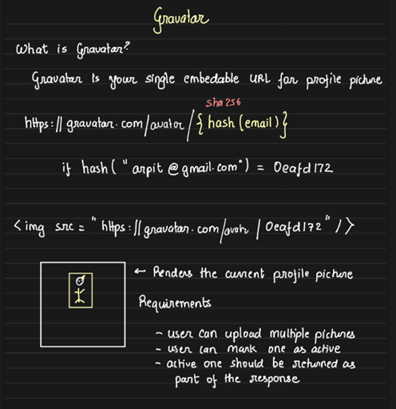

# Designing a Gravatar-like Service

We will design a service similar to **Gravatar** that returns a profile image URL based on a user's email. The key aspect is that the service allows users to upload multiple images, choose one as active, and have the active image reflected in the response.

## Key Concepts of Gravatar

- Gravatar returns an image URL (not a website URL).

- The image URL can be used directly in the `` tag to display the profile picture.

- The URL format is consistent: `https://www.gravatar.com/avatar/${hash of email}`.

- The hash is based on the user's email, so changing the image on Gravatar automatically updates the profile image on multiple social media platforms that using the same URL and the image url will also remain unchanged irrespective of the image.

## Design Requirements:

1. **Multiple image uploads:** Users can upload several profile pictures.

2. **One active image:** Users can set one image as their active profile picture.

3. **Returning the active image:** When queried, the service should return the active image in the response.

    

## Image Upload Process (via S3)

The image upload process remains similar to the previous discussions:

1. **Prepare Upload:** The client requests the server for a pre-signed URL to upload images directly to S3.

2. **Upload:** Once the image is uploaded to S3, the user submits the form, and the server creates an entry in the database.

    

## Database Schema Design

1. Users Table:
    - Stores `user_id` (primary key) and `email` (unique key).

2. Photos Table:
    - Stores `photo_id` (primary key), `user_id` (foreign key), and a boolean column `is_active` indicating which image is currently active for that user.

## Handling Active Photos

- Constraints:

    - Each user can have only one active photo at a time.

- Transactions for Changing Active Photo:
    1. Deactivate the current active photo:

        ```sql
        UPDATE photos
        SET is_active = FALSE
        WHERE user_id = ? AND is_active = TRUE;
        ```

        Here  adding the condition `is_active = TRUE` is not strictly necessary, but without it, the query will update all photos associated with the given `user_id` by setting `is_active` to `FALSE`. This isn't incorrect, it is inefficient. Since each user can only have one active photo, updating every photo (especially if a user has many, say 100) when only one needs to be updated results in unnecessary processing. By including the `is_active = TRUE` condition, we limit the update to only the currently active photo, making the transaction more efficient.
    
    2. Activate the selected photo:

        ```sql
        UPDATE photos
        SET is_active = TRUE
        WHERE photo_id = ? AND user_id = ?;
        ```

        the `user_id = ?` condition isn't mandatory as `photo_id` is unique but helps prevent accidentally activating another user's photo.
    
    3. These two updates should happen within a single transaction to ensure consistency.

## Optimizing with Indexes
1. Index on `user_id`: Queries will frequently use `user_id`, so we need an index on this column.

2. Index on `is_active`: We also need to efficiently find the active photo, so an index on `(user_id, is_active)` will speed up searches.

    ```sql
    CREATE INDEX idx_user_is_active
    ON photos(user_id, is_active);
    ```

## Retrieving Active Photo
To retrieve the active photo of a user, the SQL query would be:

```sql
SELECT photo_id
FROM photos
WHERE user_id = ? AND is_active = TRUE;
```

However, there's a challenge: the image URL uses the hash of the user's email (`https://www.gravatar.com/avatar/${hash_of_email}`), not the `user_id`. Therefore, we need to retrieve the user_id based on the email hash.

The updated query becomes:
```sql
SELECT photo_id
FROM photos AS p INNER JOIN users AS u ON p.user_id = u.user_id
WHERE u.hash = ? AND p.is_active = TRUE;
```

We could consider applying the `WHERE` clause first and then performing the `JOIN`, which would reduce the result size of the joined tables. However, SQL query optimization engines handle this internally. The bigger issue is that this query involves a full table scan on the users table because the index is on the `email` column, not on the `hash(email)`. As a result, the database has to retrieve each user's email and then compare it with the provided email hash.

To resolve this, we can store the email hash directly in the `users` table by adding a `hash` column. 

**The users table would now have columns like `user_id`, `email`, and `hash`.**

This allows us to update the query to:
```sql
SELECT photo_id
FROM photos AS p
INNER JOIN users AS u ON p.user_id = u.user_id
WHERE u.hash = ? AND p.is_active = TRUE;
```

With this setup, the query now has **O(1)** complexity with another index on hash to store the email hash. We can efficiently leverage the `(user_id, is_active)` index to find the active photo, limiting the search to just the user's photos.

## Optimizing the Index Size

Now, let's consider the `is_active` column in the `photos` table and the `(user_id, is_active)` index. Are they optimized enough?

- The index `(user_id, is_active)` will have as many entries as there are photos. For example, 10M entries for 1M users with 10 photos each.

- We are primarily interested in the active photos (`is_active = TRUE`), which are only a small subset. As per earlier example,  we are only interested in 1 million entries (where `is_active = TRUE`)

- As we know, database performance is highly dependent on whether it can load all the relevant indexes into memory.

- To optimize this, we can reduce the index size by excluding the 9 million entries where `is_active = FALSE`. This is where the concept of a partial index comes in, which allows us to index only the rows by indexing only where `is_active = TRUE`. While MySQL does not support partial indexes, PostgreSQL does.

    ```sql
    CREATE INDEX idx_active_photos
    ON photos(user_id)
    WHERE is_active = TRUE;
    ```

    This drastically reduces the size of the index to match only active photos, making DB queries faster.

## Database Optimization

Since `is_active` is a singular property for each user (only one photo can be active at a time), we can optimize the schema by removing the `is_active` column from the photos table. Instead, we can add an `active_photo_id` column in the users table, which will be a foreign key referencing `photo_id` in the `photos` table. This eliminates the need for the `is_active` column and simplifies our queries.

The new structur of `User` and `Photos` tables will be:

- **User:** `user_id` (primary key), `email` (unique key), `active_photo_id` (foreign key)
- **Photos:** `photo_id` (primary key), `user_id` (foreign key)

The query to retrieve the active photo becomes:

```sql
SELECT active_photo_id
FROM users
WHERE hash = ?
```
Updating the user's active photo becomes:
```sql
UPDATE users
SET active_photo_id = ?
WHERE hash = ?
```
Both queries are now simpler and more efficient.

## Serving the Photo via CDN

Now that we have discussed the database structure, let's move on to how the photo will be served. At a large scale, we will use a CDN to deliver the photos efficiently.

The CDN URL could be something like `cdn.gravatar.com`, with the origin server being `api.gravatar.com`. Here, the origin server is the API server, not S3, because only the API server knows which photo is currently active for a user.

Here’s how the flow works:

1. When a user or a website requests the gravatar service by hitting the URL `cdn.gravatar.com` with the email hash, the request is sent to the CDN.

2. If the CDN has cached the photo, it serves the image immediately.

3. If the CDN doesn’t have the photo, the request is forwarded to the API server (`api.gravatar.com`).

4. The API server fetches the active photo URL from the database, retrieves the photo from S3, and sends it back to the CDN.

5. The CDN caches the photo and serves it to the user.

**Note:** explore the concept of OG (Open Graph) images, which follows a similar pattern.