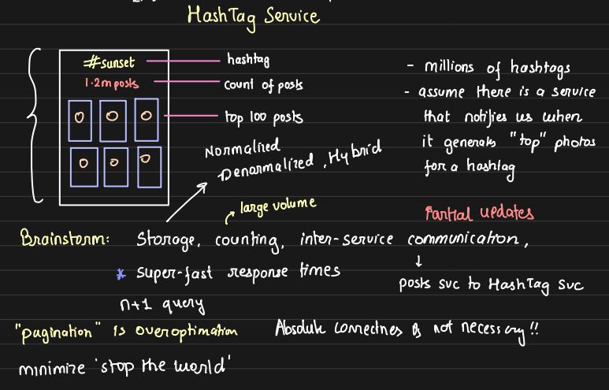
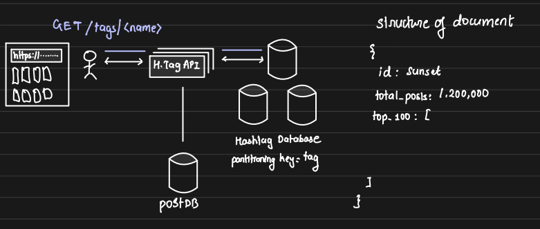
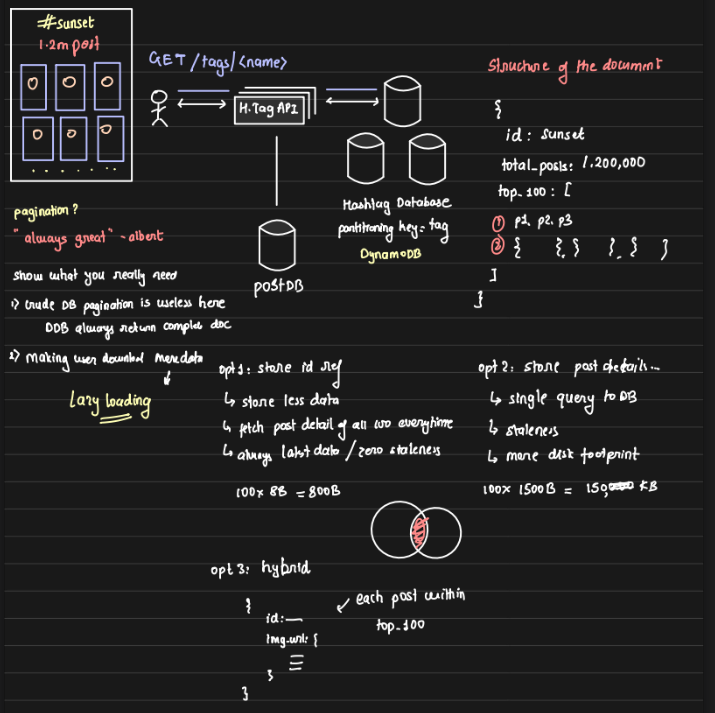
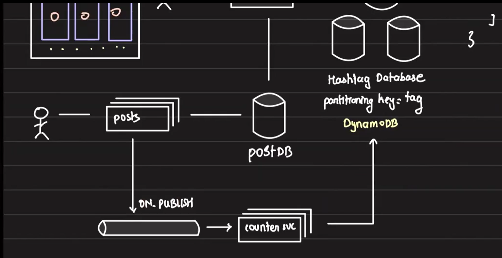
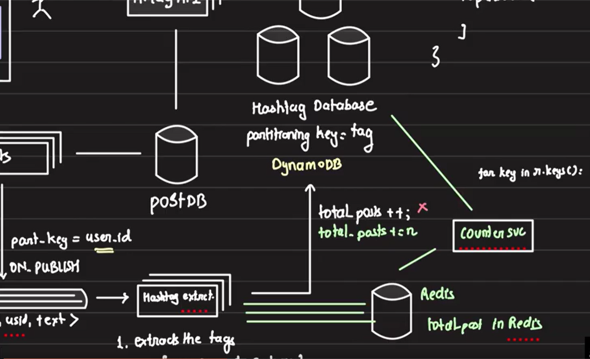
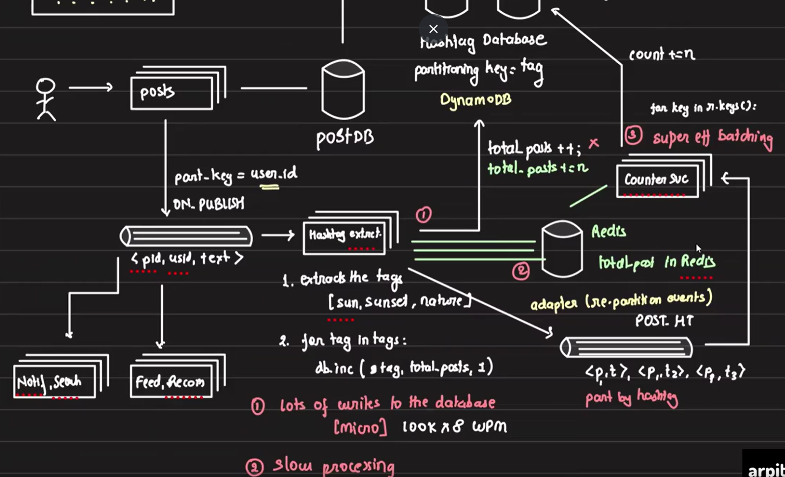
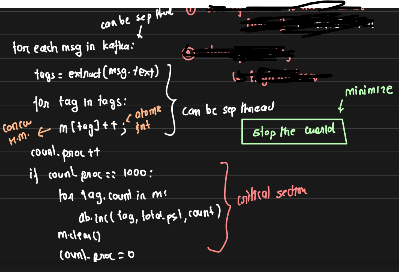
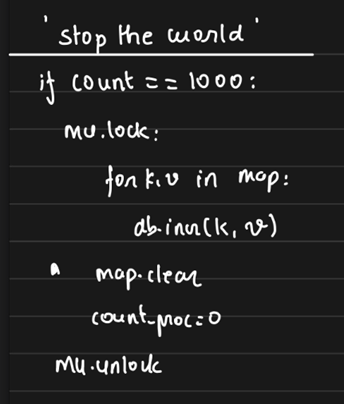
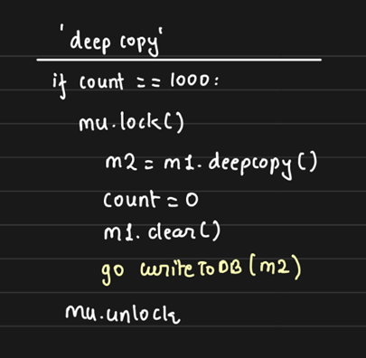

# Hashtag Service

## 1. Requirements:

1. Display the hashtag at the top of the page.
2. Show the total number of posts for the hashtag.
3. Display the top 100 posts for the hashtag (determined by the data science team).
4. Each hashtag will have its own page, optimized for fast rendering.
5. The service will be notified by an external system when new top posts are available for a hashtag.

    

## API Design:

- Users will make a GET request to the endpoint `/tags/<name>`, where `<name>` is the hashtag name.
- The hashtag service will query the Hashtag DB to fetch the data and return it to the user.

## 2. Database Architecture:

- Since we expect millions of hashtags and high user traffic, a single data node can’t hold all the data. Therefore, the database should run in cluster mode, either using a DB that supports sharding out of the box (e.g., DynamoDB) or manually sharding the DB.

- Given our access pattern of "given hashtag, retrive the details," we can easily partition the database by hashtag for efficient access.

## 3. Optimizing for Low Latency:

- To ensure low latency for best user experience, the data required for the hashtag page should be precomputed and part of the document returned by the Hashtag DB.

- The Hashtag DB will return a document containing:
    - hashtag_id
    - total_posts for the hashtag
    - The top 100 posts for the hashtag

    

## 4. Approaches to Storing Top 100 Posts

Now, let's explore the different ways to store 100 posts and decide which approach to choose and why.

### Approach 1: Store IDs of the Top 100 Posts

- **Method:**
    - In this approach, we store only the IDs of the top 100 posts for each hashtag.

    - Whenever a new post enters the top 100 list, we update the document by adding the new post ID and removing the least relevant one.

    - The full post details are fetched from the Post DB when needed (e.g., when the user accesses the hashtag page).

- **Pros:** 
    - **Smaller storage size:** Only post IDs are stored, minimizing the data size.

    - **Always up-to-date data:** Every time a user requests the top posts, the latest information is retrieved from the Post DB with zero staleness using post IDs.

- **Cons:**

    - **Read-heavy operations:** Every time the hashtag page is accessed, the system has to make multiple queries to the Post DB to fetch the full details of the 100 posts.
    
    - **Slower user experience:** The need to fetch data from the Post DB increases page loading time, leading to a poor user experience.
    
    - **Increased load on Post DB:** Continuous queries to retrieve post details can overload the Post DB, affecting overall system performance.

- **Result:** 

    While this approach ensures zero staleness by always fetching the latest post data from the Post DB, it compromises on user experience due to increased page loading times and higher load on the Post DB, especially in high-traffic scenarios. Since we are optimizing for best user experience, this design is not ideal.

### Approach 2: Store Full Post Details

**Method:** Here, instead of just storing the IDs of the top 100 posts, we store the entire post details in the document itself. This allows fetching all the required data for the top 100 posts in a single GET call, avoiding additional queries to the Post DB.

- **Pros:**
    - **Efficient Retrieval:** All 100 posts can be retrieved in one call, significantly reducing read times.

    - **No Additional Queries:** No need to fetch data from the Post DB for each post, which speeds up the response time.

- **Cons:**
    - **Staleness:** Since the post details are stored in the document, there can be a delay in reflecting updates (staleness) as the document might not always contain the most up-to-date information.

    - **Top 100 Posts Update:** Updating the top 100 posts becomes a more complex task, as the entire post details must be replaced each time there’s a change.

    - **Increased Memory Requirement:** Storing the full details of 100 posts consumes significantly more memory.

        - Approach 1, Storing 100 post IDs = 800 bytes (100 * 8B), assuming each post ID size=8B.

        - Approach 2, Assuming each post takes 1500B, we would need ~150KB per hashtag. (100 posts * 1500B per post).

        - For 1 million hashtags, memory grows from ~800MB to ~150GB.

- **Result:**
    
    This approach improves **performance and user experience** by eliminating frequent calls to the Post DB, but it comes at the cost of *staleness* and **higher memory usage**. It is ideal for scenarios where fast retrieval is prioritized over the real-time accuracy of post data.

### Approach 3: Hybrid Approach (Storing Minimal Post Info)
**Method:** Instead of storing the entire post details or just the post IDs, we store minimal information for each post in the document, such as the **image URL** and the **post ID**. The idea is to show only the images of the posts in the hashtag page. If a user is interested in a post, they can click on it,  which triggers a separate GET call and will redirect users to the exact post page that contains all the detailed information (likes, shares, comments, etc.) for that specific post. This approach effectively balances the trade-off between memory usage and user experience.

- **Pros:**

    - **Optimized for User Experience:** Users can see the posts' images quickly without fetching unnecessary details, improving page load times.
    
    - **Reduced Memory Usage:** Storing only metadata like the image URL and post ID takes up less memory compared to storing the entire post.
    
    - **Lower Post DB Load:** Since the details of posts are only fetched when the user interacts with a specific post, it reduces the number of queries to the Post DB.

- **Cons:**

    - **Staleness Risk:** While this reduces the load on the Post DB, there’s still the potential for staleness, as the stored document might not have the most up-to-date image or details but it's mitigated by storing only minimal data that doesn't change often.

- **Result:**

    This hybrid approach strikes a balance between memory efficiency and user experience. It allows fast loading of the hashtag page by displaying post images without overloading the DB. However, it introduces the complexity of handling additional API calls when fetching full post details. This approach is well-suited for our use case where the initial page load speed is crucial, but users don’t need all the post details upfront.


## 5. Pagination:

- **Issues:**
    1. **Inefficient Pagination on the API Server:**

        Since DynamoDB returns the entire document containing all 100 posts, implementing pagination at the API level would require reading the full document each time, making pagination ineffective.

    2. **Loading All 100 Posts at Once:**

        On the front end, showing all 100 posts’ metadata at once can be inefficient. Users may not scroll beyond a few posts (e.g., 15 photos), but we still end up loading unnecessary data and consuming the user’s bandwidth.

- **Solutions:**
    1. **Avoid Pagination on the API Server:**
    
        Given that the full document is retrieved each time, pagination should not be applied at the API level to avoid redundant reads.
    
    2. **Implement Lazy Loading on the Front End:**
        
        Lazy loading ensures that images are only loaded when they come into the viewport. This way, only the posts the user is currently viewing are loaded, reducing bandwidth usage and improving the page's performance.

- **Advantages:**
    1. **Optimized User Experience:**
        
        Lazy loading improves the user experience by loading only the necessary content, preventing delays due to excess data loading.

    2. **Bandwidth Efficiency:**
        
        This approach reduces bandwidth usage by loading images only when needed, ensuring the user’s data quota is used effectively and not wasted on content they don’t view.
    


## 6. Counting Total Posts with Kafka and Post API

In this system, the top 100 posts for a hashtag are provided by the data science team using a service lets name it popularity service, which updates the posts in a Kafka cluster. We act as consumers of these updates. However, it is our responsibility to keep track of the total number of posts under each hashtag. Given the scale of platforms like Twitter or Instagram, some level of error or staleness in this count is acceptable.

- **Initial Method**
    - When a user creates a post, they call the Post API Server, which inserts the post entry into the Post DB.
    
    - After a post is published, the Post API pushes an event (an ON_PUBLISH event) to a Kafka topic. This event contains the post metadata.
    
    - A Counter Service (or any other service) consumes events from the Kafka topic and increments the count of related hashtags by 1 in the Hashtag DB.

    

- **Kafka Partitioning:**
    - The partition key for the Kafka topic can be the **user ID**.

    - Posts from a particular user will always go to the same partition, and multiple users can share the same partition.

    - **Partitioning Strategy (User ID Hashing):** The user ID is passed to a hash function, and the result is modded by the number of partitions to determine which partition the post will go to.

- **Consumers:**
    - Various services, such as the **Notification Service, Search Service, Feed, and Recommendation Service**, can all consume from the same Kafka topic.
    
    - Since the partitioning key is consistent, all these Kafka consumers will receive events for the same user from the same partition, maintaining efficient processing across different services.

## 7. Hashtag Post Count Increment

When building a service to track the count of posts for hashtags (e.g., in a social media application), a naive implementation can cause significant scalability and performance issues. Let's explore several approaches to optimize this system, focusing on reducing database load and improving parallelism in processing.

### Approach 1: Increment Total Posts for Tags

- **Method:**

    1. Extract hashtags from post captions.
    2. For each tag, increment the total post count by 1 in the database.

        ```Python
        tags = extract(msg.text)
        for tag in tags:
            dbInc(tag, total_posts, 1)
        ```
- **Pros:**
    1. Simple and straightforward method to update post counts for each tag.
    2. Ensures real-time updates with every post, reflecting the immediate status of total posts for each tag.
    
- **Cons:**
    1. **High Write Load:**

        - Each post triggers multiple writes to the database. For platforms like Twitter, with 100,000 posts per minute and an average of 8 tags per post, this results in approximately 800,000 write operations to the database every minute. This creates a significant strain on the database.
    
    2. **Limited Parallelism & Slower Processing:**

        - The tag processing is slow because for each message, it loops through all tags and increments the total post count for each one. The parallelism is constrained by the number of Kafka partitions, as only one consumer in a group can read from a partition. This limited parallelism can lead to higher staleness in tag count data.

- **Result**

    - This method ensures that tag counts remain relatively up-to-date but suffers from performance issues due to high write volume and limited parallelism. A batch increment strategy can reduce some of the load, improving performance but reduce accuracy by introducing staleness in the system.

###  Approach 2: Using Redis for Intermediate Increment of Tag Counts

- **Method:**
    1. The Kafka consumer acts as a hashtag extraction service. For each tag in a post, it creates or updates a key in Redis, where the key is the tag and the value is the total number of posts for that tag.

    2. Each increment operation in Redis is fast as Redis resides within the same network as the hashtag consumer.

    3. A separate counter service reads all the keys from Redis periodically, retrieves the value (total post count for each tag), updates the hashtag database, and resets the Redis value to 0.

        Code of Counter Service:
        ```Python
        for key in redis.keys():
            val = redis.getValue(key)
            dbInc(key, total_posts, val)  # Increment DB total for the tag
            redis.setValue(key, 0)
        ```

        

- **Pros:**

    - **Faster Updates:**
        
        Redis allows for quick, intermediate increments in memory, which reduces the immediate load on the database and speeds up the hashtag extraction process.

    - **Reduced Write Pressure on DB:**
        
        By aggregating increments in Redis and periodically updating the hashtag DB in batches, this approach minimizes the frequency of direct writes to the main database.

- **Cons:**

    1. **Expensive Redis Query (`redis.keys()`):**

        The `redis.keys()` operation is highly expensive and time-consuming in large-scale production environments. In fact, it is often banned due to the high performance cost, as it locks Redis during the operation, leading to a "stop the world" issue.

    2. **Redis as a Single Point of Failure:**

        Redis becomes a single point of failure unless it is run in a clustered mode. This adds complexity and requires extra overhead to ensure high availability and fault tolerance.

    3. **Additional Service Overhead:**

        Introducing a new counter service that processes Redis data and manages uptime adds maintenance and operational complexity.

- **Result:**

    - While Redis allows for faster intermediate updates and reduces the immediate write load on the database, the performance bottleneck caused by querying Redis keys (`redis.keys()`) makes this approach inefficient for large-scale production. Moreover, Redis can become a single point of failure, requiring additional resources to mitigate these risks. Given the overhead and risks involved, this approach may not be optimal for handling large-scale data processing.

### Approach 3: Using Kafka for Hashtag Processing

- **Method:**
    - The hashtag extraction service reads posts from a Kafka topic, extracts hashtags, and writes the data back into another Kafka topic, partitioned by hashtags.
    
    - For each hashtag in a post, an event is created in the second Kafka topic as `<post_id, hashtag>`.
    
    - If a post contains multiple hashtags, multiple events are generated.
    
    - This ensures that all events related to the same hashtag land in the same partition, allowing the counter service to consume events from specific partitions.
    
    - The counter service counts the total posts for each hashtag over a set interval and updates the hashtag database accordingly.

        

- **Pros:**

    - Parallel processing is enhanced by Kafka partitions, as each partition is processed by an independent consumer.

    - Each unique hashtag is processed by a single consumer. Hashtags are processed in batches for efficiency, reducing the number of writes to the database.

- **Cons:**

    - **High event volume:** For a post with multiple hashtags, the system generates multiple events, which can overwhelm Kafka with a large number of events.

    - **Limited parallelism:** The parallelism of the counter service is constrained by the number of partitions, meaning that each consumer can only process events for one partition at a time.

- **Result:** 

    This approach uses Kafka to balance load distribution but introduces the challenge of event flooding, especially for posts with many hashtags. The efficiency of counting and updating the database depends on partitioning, but this may still lead to bottlenecks based on the number of events per partition.

    

### Approach 4: Local Batching with In-Memory Storage

- **Method:**
    - Instead of using central storage like Kafka or Redis, we store post counts for each hashtag locally in the memory of each hashtag extraction API server.

    - Each server maintains a hash map `HashMap<tag, int>`, where `int` stores the count of posts for that hashtag.

    - Multiple API servers may process the same hashtag independently, leading to local optimization rather than global.

    - The post count for a hashtag is updated either after a certain interval or when a threshold count `n` (e.g., 10) is reached, based on the total number of posts read rather than the individual tag count. This approach ensures that even rare hashtags get updated. If we were to base the threshold on the number of posts for a specific tag (e.g., updating when a tag reaches 100 posts), a rare tag might never reach that threshold and would never be updated in the hashtag DB. By using the number of posts read as the trigger, we guarantee that all hashtags are regularly updated.

- **Pros:**
    - Reduces reliance on external systems like Redis or Kafka, leading to faster processing as data is handled in-memory.

    - Efficient for local batch processing, reducing the frequency of database writes.

    - Simpler architecture without needing to manage external services like Redis or Kafka.

- **Cons:**
    - Lack of global synchronization across multiple API servers.

    - Possibility of data staleness as each server updates its counts independently.

    - Risk of memory limitations if the hashtag count grows significantly in each server.

- **Result:**
    - This approach improves performance by leveraging in-memory storage for local batching, but sacrifices global accuracy as multiple servers  store and update the same hashtag independently. It is suitable when some level of staleness is acceptable, and frequent DB writes are to be avoided. As per our requirement, this is the best approach so far.

### Multithreading Optimization in Hashtag Extraction Service

This multithreading optimization applies to the last three approaches, but we'll use **Approach 4** as a reference. In **Approach 2** and **Approach 3**, this optimization is applicable to the **counter service**, while in **Approach 4**, it applies to the hashtag extraction service.

- **Method:**
    - Suppose in Approach 4, we update the hashtag DB after consuming every 1000 posts.
    
    - The basic algorithm increments the tag count in a hash map for every post processed.

        ```Python
        count_post = 0
        for msg in kafka:
            tags = extract(msg.text)
            for tag in tags:
                m[tag]++
            count_post++
            if count_post == 1000:
                for tag, count in m:
                    db.Inc(tag, total_posts, count)
                m.clear()
        ```

- **Problems:**
    1. **Concurrency Issues:**
    
        Multiple API servers may update the DB at the same time, leading to inconsistencies. However, database systems usually handle concurrency via internal locking mechanisms, so `db.Inc` can manage this.

    2. **Multi-Threading:**
    
        The code isn't CPU-intensive, so multiple consumer threads can be spun up on a machine. Each thread can run this code in parallel, improving efficiency. 

        Even with a single consumer, we can still spawn additional threads to handle the extraction and tag count increment in parallel (lines 3-5 of the algorithm). Since hashtag extraction can be computationally expensive, processing separate messages in parallel optimizes resource usage and prevents unnecessary CPU hogging.

        Overall, the system naturally moves toward a multi-threaded design, improving efficiency and throughput.

        

- **Critical Sections:**
    - **Atomic Increment:** 
    
        The increment operation (`++`) is not atomic, which means every `++` is a critical section where a lock is required to ensure thread safety. To avoid explicitly managing locks, we can use a `ConcurrentHashMap` for the hashmap (`m[tag]++`) and replace the value type with an `AtomicInteger`. This ensures that each increment operation is thread-safe without needing manual synchronization.
    
    - **Stop-the-World Block:**

        When the condition `count_proc == 1000` is met, we iterate through the map to update the database and clear the map. This operation must be atomic, meaning that during this process, the tag extraction step should not modify the map. This creates a "stop-the-world" problem, where we block further operations while the map is processed.

        Using an embedded database like SQLite may seem like a solution, but it doesn't resolve the issue because we still need to read from the embedded database and update the hashtag database, leading to the same problem. The time-consuming nature of updating the database for each tag requires us to minimize this stop-the-world period.

        An alternative could be replacing the `db.Inc` operation with Kafka by creating a Kafka topic with `<tag, count>`. However, even in this case, the entire map must be written to Kafka before clearing it, again causing a stop-the-world scenario.

        This "stop-the-world" process only affects **a single hashtag extraction API server**, while **other servers continue functioning in parallel** since each operates independently with its own instance of the code.

        

- **Solutions:**

    The root cause of this issue is that while the map is being read and cleared, no modifications should occur i.e the data we are reading should not be modified. A potential solution is to create a deep copy of the map data. Once we have the deep copy, we can safely clean the original map and continue processing new tags while the deep-copied data is used for database updates or other operations in parallel.

    - **Approach1: Deep Copy**
        - **Method:**
            - When a threshold is reached (e.g., after 1000 posts), the system pauses to handle the current map data.
            -  A deep copy of the hashtag count map is created for safe processing.
            - A separate thread is spawned to update the database using the deep copy.
            - The original map is cleared, and the post counter is reset, allowing the hashtag extraction process to resume immediately.
            -  Database updates occur in the background, and the system continues to extract tags, minimizing downtime.
        
            This ensures minimal blocking and efficient parallel processing. 

            
        
        - **Disadvantages:**
            - Creating a deep copy takes time, though it's faster than directly updating the DB or pushing events to Kafka/Redis.

            - The memory requirements double because, after creating the deep copy but before clearing the original map, both the original and the deep copy exist simultaneously, leading to increased memory usage.

    - **Approach2: Dual HashMap**
        - **Method:**
            - Use two hash maps: an **active map (ma)** and a **passive map (mp)**.

            - Initially, both maps are empty. Extracted tag-post counts are stored in the active map.

            - When the counter hits 1000, enter the critical section, swap the maps (`ma` and `mp`), and release the lock.

            - The active map (`ma`) is reset, and a new thread updates the DB using the passive map (`mp`).

            - This approach avoids memory spikes since map swapping only involves reference changes.

                
        
        - **Pros:**
            - The dual hash map approach prevents memory doubling while minimizing stop-the-world time.

            - Forking new threads for DB updates while continuing tag extraction improves overall performance.