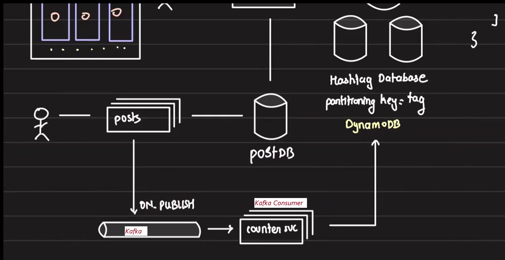

# Hashtag Service

## 1. Requirements:

1. Display the hashtag at the top of the page.
2. Show the total number of posts for the hashtag.
3. Display the top 100 posts for the hashtag (determined by the data science team).
4. Each hashtag will have its own page, optimized for fast rendering.
5. The service will be notified by an external system when new top posts are available for a hashtag.

    

## API Design:

- Users will make a GET request to the endpoint `/tags/<name>`, where `<name>` is the hashtag name.
- The hashtag service will query the Hashtag DB to fetch the data and return it to the user.

## 2. Database Architecture:

- Since we expect millions of hashtags and high user traffic, a single data node can’t hold all the data. Therefore, the database should run in cluster mode, either using a DB that supports sharding out of the box (e.g., DynamoDB) or manually sharding the DB.

- Given our access pattern of "given hashtag, retrive the details," we can easily partition the database by hashtag for efficient access.

## 3. Optimizing for Low Latency:

- To ensure low latency for best user experience, the data required for the hashtag page should be precomputed and part of the document returned by the Hashtag DB.

- The Hashtag DB will return a document containing:
    - hashtag_id
    - total_posts for the hashtag
    - The top 100 posts for the hashtag

    

## 4. Approaches to Storing Top 100 Posts

Now, let's explore the different ways to store 100 posts and decide which approach to choose and why.

### Approach 1: Store IDs of the Top 100 Posts

- **Method:**
    - In this approach, we store only the IDs of the top 100 posts for each hashtag.

    - Whenever a new post enters the top 100 list, we update the document by adding the new post ID and removing the least relevant one.

    - The full post details are fetched from the Post DB when needed (e.g., when the user accesses the hashtag page).

- **Pros:** 
    - **Smaller storage size:** Only post IDs are stored, minimizing the data size.

    - **Always up-to-date data:** Every time a user requests the top posts, the latest information is retrieved from the Post DB with zero staleness using post IDs.

- **Cons:**

    - **Read-heavy operations:** Every time the hashtag page is accessed, the system has to make multiple queries to the Post DB to fetch the full details of the 100 posts.
    
    - **Slower user experience:** The need to fetch data from the Post DB increases page loading time, leading to a poor user experience.
    
    - **Increased load on Post DB:** Continuous queries to retrieve post details can overload the Post DB, affecting overall system performance.

- **Result:** 

    While this approach ensures zero staleness by always fetching the latest post data from the Post DB, it compromises on user experience due to increased page loading times and higher load on the Post DB, especially in high-traffic scenarios. Since we are optimizing for best user experience, this design is not ideal.

### Approach 2: Store Full Post Details

**Method:** Here, instead of just storing the IDs of the top 100 posts, we store the entire post details in the document itself. This allows fetching all the required data for the top 100 posts in a single GET call, avoiding additional queries to the Post DB.

- **Pros:**
    - **Efficient Retrieval:** All 100 posts can be retrieved in one call, significantly reducing read times.

    - **No Additional Queries:** No need to fetch data from the Post DB for each post, which speeds up the response time.

- **Cons:**
    - **Staleness:** Since the post details are stored in the document, there can be a delay in reflecting updates (staleness) as the document might not always contain the most up-to-date information.

    - **Top 100 Posts Update:** Updating the top 100 posts becomes a more complex task, as the entire post details must be replaced each time there’s a change.

    - **Increased Memory Requirement:** Storing the full details of 100 posts consumes significantly more memory.

        - Approach 1, Storing 100 post IDs = 800 bytes (100 * 8B), assuming each post ID size=8B.

        - Approach 2, Assuming each post takes 1500B, we would need ~150KB per hashtag. (100 posts * 1500B per post).

        - For 1 million hashtags, memory grows from ~800MB to ~150GB.

- **Result:**
    
    This approach improves **performance and user experience** by eliminating frequent calls to the Post DB, but it comes at the cost of *staleness* and **higher memory usage**. It is ideal for scenarios where fast retrieval is prioritized over the real-time accuracy of post data.

### Approach 3: Hybrid Approach (Storing Minimal Post Info)
**Method:** Instead of storing the entire post details or just the post IDs, we store minimal information for each post in the document, such as the **image URL** and the **post ID**. The idea is to show only the images of the posts in the hashtag page. If a user is interested in a post, they can click on it,  which triggers a separate GET call and will redirect users to the exact post page that contains all the detailed information (likes, shares, comments, etc.) for that specific post. This approach effectively balances the trade-off between memory usage and user experience.

- **Pros:**

    - **Optimized for User Experience:** Users can see the posts' images quickly without fetching unnecessary details, improving page load times.
    
    - **Reduced Memory Usage:** Storing only metadata like the image URL and post ID takes up less memory compared to storing the entire post.
    
    - **Lower Post DB Load:** Since the details of posts are only fetched when the user interacts with a specific post, it reduces the number of queries to the Post DB.

- **Cons:**

    - **Staleness Risk:** While this reduces the load on the Post DB, there’s still the potential for staleness, as the stored document might not have the most up-to-date image or details but it's mitigated by storing only minimal data that doesn't change often.

- **Result:**

    This hybrid approach strikes a balance between memory efficiency and user experience. It allows fast loading of the hashtag page by displaying post images without overloading the DB. However, it introduces the complexity of handling additional API calls when fetching full post details. This approach is well-suited for our use case where the initial page load speed is crucial, but users don’t need all the post details upfront.

## 5. Pagination:

- **Issues:**
    1. **Inefficient Pagination on the API Server:**

        Since DynamoDB returns the entire document containing all 100 posts, implementing pagination at the API level would require reading the full document each time, making pagination ineffective.

    2. **Loading All 100 Posts at Once:**

        On the front end, showing all 100 posts’ metadata at once can be inefficient. Users may not scroll beyond a few posts (e.g., 15 photos), but we still end up loading unnecessary data and consuming the user’s bandwidth.

- **Solutions:**
    1. **Avoid Pagination on the API Server:**
    
        Given that the full document is retrieved each time, pagination should not be applied at the API level to avoid redundant reads.
    
    2. **Implement Lazy Loading on the Front End:**
        
        Lazy loading ensures that images are only loaded when they come into the viewport. This way, only the posts the user is currently viewing are loaded, reducing bandwidth usage and improving the page's performance.

- **Advantages:**
    1. **Optimized User Experience:**
        
        Lazy loading improves the user experience by loading only the necessary content, preventing delays due to excess data loading.

    2. **Bandwidth Efficiency:**
        
        This approach reduces bandwidth usage by loading images only when needed, ensuring the user’s data quota is used effectively and not wasted on content they don’t view.
    

## 6. Counting Total Posts with Kafka and Post API

In this system, the top 100 posts for a hashtag are provided by the data science team using a service lets name it popularity service, which updates the posts in a Kafka cluster. We act as consumers of these updates. However, it is our responsibility to keep track of the total number of posts under each hashtag. Given the scale of platforms like Twitter or Instagram, some level of error or staleness in this count is acceptable.

- **Initial Method**
    - When a user creates a post, they call the Post API Server, which inserts the post entry into the Post DB.
    
    - After a post is published, the Post API pushes an event (an ON_PUBLISH event) to a Kafka topic. This event contains the post metadata.
    
    - A Counter Service (or any other service) consumes events from the Kafka topic and increments the count of related hashtags by 1 in the Hashtag DB.

    

- **Kafka Partitioning:**
    - The partition key for the Kafka topic can be the **user ID**.

    - Posts from a particular user will always go to the same partition, and multiple users can share the same partition.

    - **Partitioning Strategy (User ID Hashing):** The user ID is passed to a hash function, and the result is modded by the number of partitions to determine which partition the post will go to.

- **Consumers:**
    - Various services, such as the **Notification Service, Search Service, Feed, and Recommendation Service**, can all consume from the same Kafka topic.
    
    - Since the partitioning key is consistent, all these Kafka consumers will receive events for the same user from the same partition, maintaining efficient processing across different services.

    