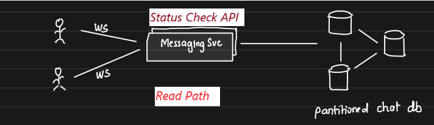
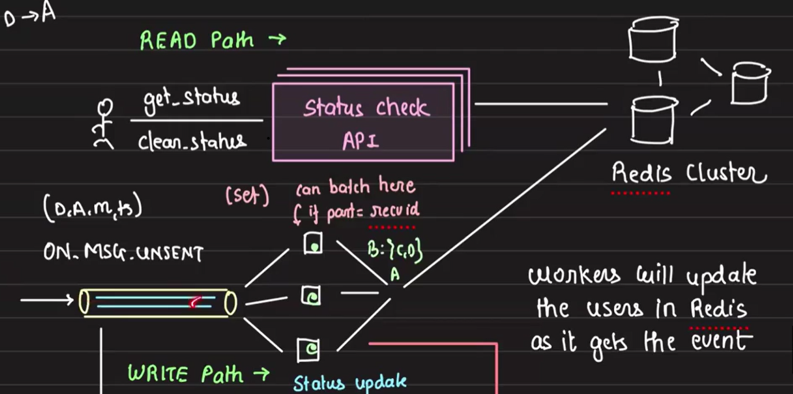
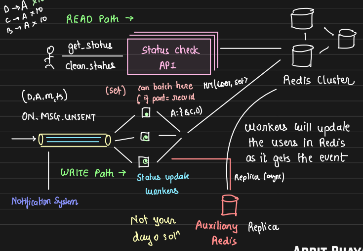

# Newly Unread Message Indicator

## Requirement Analysis:

### Objective

Build a system that displays the total number of unique users who have sent new messages while the user is offline. The counter should reset to zero when the user taps on the counter, similar to WhatsApp’s unread message feature.

### Core Features:

-  **Offline Behavior:** If 6 messages come from 4 different users while offline, the counter shows 4. When the user taps the counter, they see all unread messages from different users, and the counter resets to 0. This repeats every time new messages arrive. The counter reset is not dependent on whether the user views each individual's message or not.

- **Online Behavior:** If the user goes offline again and receives 2 new messages from 1 user, the counter shows 1 when they come back online.


## Solution

This problem can be solved with two types of design approaches:

1. **Count on the Fly:** Compute the number of unread messages in real-time using SQL.

2. **Precompute and Store:** Store precomputed results of unread messages.

### Approach 1: Count on the Fly (Using SQL)

This approach involves querying the database for unread messages. To implement this, we need an efficient SQL schema and appropriate indexing.

#### SQL Schema:

1. User Table:
    - `id`, `name`, ...

2. Messages Table:
    - `id`, `msg`, `from`, `to`, `timestamp`

3. User Activity Table:
    - `user_id` (Foreign Key to `User`)
    - `last_read_at` (timestamp for the last time the user clicked the unread counter)

#### SQL Query:

To find the number of unique users who sent messages since the last time the user clicked the counter:

```sql
SELECT COUNT(DISTINCT from)
FROM Messages
WHERE to = ? AND timestamp > 
      (SELECT last_read_at FROM User_activity WHERE user_id = ?);
```

This approach is partially decent but may not scale effectively.

#### Indexing Considerations:

Now, let's consider indexing and determine which indexes to create and why. A common misconception is that all columns in the WHERE clause should be indexed, but this generalization is not always accurate. We’ll demonstrate this through the following example. Based on this idea, we'll create two indexes: 

- Initial Indexes:
    - Index on the `to` column (messages received by a user).
    - Index on the `timestamp` column (messages sent after a certain time).

    - Example Index:
        - IDX(TO): `to`, `id`
        - IDX(timestamp): `timestamp`, `id`


            | **IDX(TO)**    |                | **IDX(timestamp)** |                |
            |----------------|----------------|--------------------|----------------|
            | **To**         | **Id**         | **Ts**             | **Id**         |
            | **B**          | 1              | 11:10              | 1              |
            | **C**          | 2              | 11:10              | 2              |
            | **C**          | 4              | 11:20              | 3              |
            | **C**          | 5              | 11:21              | 4              |
            | **D**          | 3              | 11:22              | 5              |
            | **D**          | 6              | 11:23              | 6              |

    - **Query Execution Process:**

        When executing the query to find all the new unread msg for `'C'` and after `'11:00'`

        1. Index Lookup on `to` Column:

            The query first looks up rows where `to = 'C'` using the `IDX(TO)` index, which gives rows with IDs 2, 4, 5.

            **Time Complexity:** O(log n), `n` is the number of rows in the index.
        
        2. Sequential Scan on `timestamp`:

            It scans the IDX(timestamp) index for rows where timestamp > '11:00', fetching all relevant rows.

            **Time Complexity:** O(m), `m` is the number of total records in the `timestamp` index.
        
        3. Set Intersection:
            
            The results from both indices are intersected to find matching IDs (2, 4, 5).

            **Time Complexity:** O(k), `k` is the number of matched rows in both indices.
        
        This query is inefficient because of set intersection, which can become very slow, especially with larger datasets. The sequential scan of `timestamp` adds significant overhead.

- Improved Composite Index:

    A composite index on `(to, timestamp)` improves performance by reducing the need for set intersections. The new index with the same data as earlier will look like -- 

    | **To** | **Timestamp** | **Id** |
    |--------|---------------|--------|
    | B      | 11:10         | 1      |
    | C      | 11:10         | 2      |
    | C      | 11:21         | 4      |
    | C      | 11:22         | 5      |
    | D      | 11:20         | 3      |
    | D      | 11:23         | 6      |

    - **Query Execution Process:**

        For the same query execution, the cursor performs a logarithmic scan to find the starting index at row 2 (where `to=C`). It then scans only three rows for `timestamp > 11:00`, quickly identifying the matching results: `msg id 2, 4, 5`.

        This is much faster than the previous approach as no set intersection is required. The time complexity for this operation is reduced to O(log N + k), where N is the number of rows (due to the index lookup) and k is the number of matching rows (three in this case). This results in a significantly more efficient query.

- Optimizing Further:

    Even with a composite index, we still need to fetch the `from` user ID from the actual `messages` table. To optimize further:

    - **Covered Index:** Create a composite index covering `(to, timestamp, from)`, so the entire query can be answered using the index without fetching from the main table.

### Approach 2: Precomputed Approach

#### Overview

This approach precomputes the count of unread messages from distinct users while the recipient is offline. Upon receiving a request from the user, the API queries a database, retrieves the precomputed value, and returns it. The focus is on how to efficiently precompute and store this value in the database. This approach involves two main paths: the *read path* and the *write path*.

- **Read Path:** When a user checks for unread messages, an API queries a precomputed value from the database and returns the count of unique users who sent unread messages.
    

- **Write Path:** This path updates the database with new events (messages sent while the recipient was offline) to maintain the precomputed count.

#### Message Delivery Status and Offline User Tracking

##### Write Path

The **write path** is responsible for updating the database with the precomputed count of distinct message senders. This process starts when a message is not delivered, possibly due to the recipient being offline. The messaging service tracks this, ensuring that although real-time delivery didn’t occur, the message remains persistent.

Here, we need to replicate the design principles we used for Slack’s messaging system, where Kafka played a key role. In this case, we extend Kafka's functionality to handle undelivered messages. We introduce a new Kafka topic called `ON_MSG_UNSENT` to store messages that were not delivered because the user was offline.

Whenever an undelivered message event is generated (e.g., `(D, A, m, ts)`— meaning user `D` sent message `m` to user `A` at timestamp `ts` but `A` was offline), an event was produced in Kafka. A service called `Status Update` consumes these events, batches them, and stores the necessary information in the database for future processing.

This design allows the write path to continuously update the distinct sender count for each user, ensuring that the system remains up-to-date.

##### Read Path

The **read path** allows the user to retrieve the total number of distinct users who sent messages while the recipient was offline. This count is fetched from a precomputed value stored in the database. When the user queries the system, the **status check API** server retrieves the data directly from the database to deliver the number of unique users who messaged them.

To efficiently compute this count, we use a database that supports set operations, as sets automatically store unique values. Redis is an ideal choice here due to its minimal latency and support for set-based operations. In our design, ***each receiver user id is represented as a key in Redis***, and ***the value is a set containing unique `user_ids` from whom the user has received messages***. When the status check API queries the Redis database, it simply returns the size of this set (`key.length`), providing the distinct count of message senders.



Here’s a brief explanation of the flow:

1. When a message is sent but the recipient is offline, Kafka captures the undelivered message event in the ON_MSG_UNSENT topic for processing.

2. The `Status Update` service consumes Kafka events, extracts the receiver and sender user IDs from each event, and updates Redis by adding the sender ID to the set associated with the receiver's user ID as the key. 

3. Redis stores the unique sender count, where each receiver user id is a key, and the value is a set of unique sender IDs.

4. When the user checks for unread messages, the **status check API** queries Redis to quickly return the count of distinct senders.

#### Optimization Techniques

##### First Optimisation

- Problem:

    In the **write path**, when events from the `ON_MSG_UNSENT` Kafka topic are consumed, the system performs micro writes to the database. Each event updates Redis by adding a sender ID to the set corresponding to a receiver's user ID. This means that for each undelivered message, a small write operation occurs in Redis.

    If many users send messages to a receiver who is offline, it will result in a large number of micro writes to Redis, causing high write load on the system. Each message triggers a single update, which is inefficient at scale. Additionally, since Kafka partitions the topic by `receiver_id`, all messages for a single receiver will be handled by the same consumer, adding to the write load for that partition.

- Solution:

    To mitigate the issue of too many micro writes, we can implement batching in the Kafka consumers. Instead of updating Redis for each individual message, the consumer accumulates a batch of messages (grouped by `receiver_id`) and performs a bulk update once a certain threshold is reached. This approach reduces the number of write operations by grouping multiple updates into a single write. The hash map structure `<receiver_id, set>` is used to store the batched updates, where each key is a `receiver_id`, and the value is a set of unique `sender_ids` for that receiver.

    Once the threshold is reached, the batch is written to Redis in one operation, reducing the load and improving system efficiency. This is similar to a batching technique used in a previous session for hashtag extraction.

##### Second Optimisation

- Problem: 

    This system faces challenges because it handles both **read-heavy** and **write-heavy** use cases. Users tend to stay offline for long periods, resulting in a large number of undelivered messages. When users come back online, reads increase significantly. Since both reads and writes are high, a single Redis cluster serving both can get overwhelmed.

    To further complicate matters, if a user, say `B`, is offline for a full day and another user `A` sends repeated messages at hourly intervals, Redis is updated multiple times even though `A` is already present in the set. These redundant writes waste resources and increase write load unnecessarily. Adding redis replica leads to data synchronization issues between clusters, especially in real-time messaging systems.

- Solution:

    To address the issue of redundant writes and balance the load between reads and writes, we introduce a **replica Redis cluster** (write replica).

    - Before Kafka consumers update the main Redis cluster, they first check the replica cluster. If the replica already contains the user ID (i.e., if `A` is already in the set corresponding to `B`), the consumer skips writing to the main Redis cluster.

    - If the replica does not contain the user ID, the consumer writes to both the replica and the main Redis cluster. This ensures only necessary updates are applied to the main cluster, significantly reducing the write load.

    - If data (e.g., a set of senders) is deleted from the main Redis cluster (as recipent came online can click the counter), the same deletion is also propagated to the replica to keep them in sync.

        

    The **replica cluster handles redundant writes**, reducing the load on the main cluster. In case the replica goes down, writes will continue to the main cluster, which handles all operations as a fallback. This way, the system becomes more efficient and can handle heavy read-write traffic while preventing unnecessary writes.

#### Conclusion

The precomputed approach leverages Kafka and Redis to manage a high volume of read and write operations efficiently, while optimizations like batching and replica clusters help in reducing redundant writes and maintaining performance.