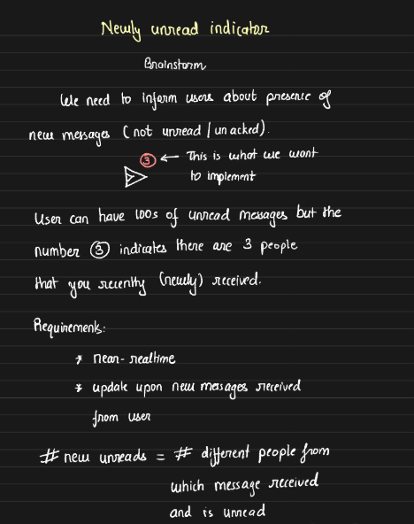

# Newly Unread Message Indicator

## Requirement Analysis:

### Objective

Build a system that displays the total number of unique users who have sent new messages while the user is offline. The counter should reset to zero when the user taps on the counter, similar to WhatsApp’s unread message feature.

### Core Features:

-  **Offline Behavior:** If 6 messages come from 4 different users while offline, the counter shows 4. When the user taps the counter, they see all unread messages from different users, and the counter resets to 0. This repeats every time new messages arrive. The counter reset is not dependent on whether the user views each individual's message or not.

- **Online Behavior:** If the user goes offline again and receives 2 new messages from 1 user, the counter shows 1 when they come back online.



## Solution

This problem can be solved with two types of design approaches:

1. **Count on the Fly:** Compute the number of unread messages in real-time using SQL.

2. **Precompute and Store:** Store precomputed results of unread messages.

### Approach 1: Count on the Fly (Using SQL)

This approach involves querying the database for unread messages. To implement this, we need an efficient SQL schema and appropriate indexing.

#### SQL Schema:

1. User Table:
    - `id`, `name`, ...

2. Messages Table:
    - `id`, `msg`, `from`, `to`, `timestamp`

3. User Activity Table:
    - `user_id` (Foreign Key to `User`)
    - `last_read_at` (timestamp for the last time the user clicked the unread counter)

#### SQL Query:

To find the number of unique users who sent messages since the last time the user clicked the counter:

```sql
SELECT COUNT(DISTINCT from)
FROM Messages
WHERE to = ? AND timestamp > 
      (SELECT last_read_at FROM User_activity WHERE user_id = ?);
```

This approach is partially decent but may not scale effectively.

#### Indexing Considerations:

Now, let's consider indexing and determine which indexes to create and why. A common misconception is that all columns in the WHERE clause should be indexed, but this generalization is not always accurate. We’ll demonstrate this through the following example. Based on this idea, we'll create two indexes: 

- Initial Indexes:
    - Index on the `to` column (messages received by a user).
    - Index on the `timestamp` column (messages sent after a certain time).

    - Example Index:
        - IDX(TO): `to`, `id`
        - IDX(timestamp): `timestamp`, `id`


            | **IDX(TO)**    |                | **IDX(timestamp)** |                |
            |----------------|----------------|--------------------|----------------|
            | **To**         | **Id**         | **Ts**             | **Id**         |
            | **B**          | 1              | 11:10              | 1              |
            | **C**          | 2              | 11:10              | 2              |
            | **C**          | 4              | 11:20              | 3              |
            | **C**          | 5              | 11:21              | 4              |
            | **D**          | 3              | 11:22              | 5              |
            | **D**          | 6              | 11:23              | 6              |

    - **Query Execution Process:**

        When executing the query to find all the new unread msg for `'C'` and after `'11:00'`

        1. Index Lookup on `to` Column:

            The query first looks up rows where `to = 'C'` using the `IDX(TO)` index, which gives rows with IDs 2, 4, 5.

            **Time Complexity:** O(log n), `n` is the number of rows in the index.
        
        2. Sequential Scan on `timestamp`:

            It scans the IDX(timestamp) index for rows where timestamp > '11:00', fetching all relevant rows.

            **Time Complexity:** O(m), `m` is the number of total records in the `timestamp` index.
        
        3. Set Intersection:
            
            The results from both indices are intersected to find matching IDs (2, 4, 5).

            **Time Complexity:** O(k), `k` is the number of matched rows in both indices.
        
        This query is inefficient because of set intersection, which can become very slow, especially with larger datasets. The sequential scan of `timestamp` adds significant overhead.

- Improved Composite Index:

    A composite index on `(to, timestamp)` improves performance by reducing the need for set intersections. The new index with the same data as earlier will look like -- 

    | **To** | **Timestamp** | **Id** |
    |--------|---------------|--------|
    | B      | 11:10         | 1      |
    | C      | 11:10         | 2      |
    | C      | 11:21         | 4      |
    | C      | 11:22         | 5      |
    | D      | 11:20         | 3      |
    | D      | 11:23         | 6      |

    - **Query Execution Process:**

        For the same query execution, the cursor performs a logarithmic scan to find the starting index at row 2 (where `to=C`). It then scans only three rows for `timestamp > 11:00`, quickly identifying the matching results: `msg id 2, 4, 5`.

        This is much faster than the previous approach as no set intersection is required. The time complexity for this operation is reduced to O(log N + k), where N is the number of rows (due to the index lookup) and k is the number of matching rows (three in this case). This results in a significantly more efficient query.

- Optimizing Further:

    Even with a composite index, we still need to fetch the `from` user ID from the actual `messages` table. To optimize further:

    - **Covered Index:** Create a composite index covering `(to, timestamp, from)`, so the entire query can be answered using the index without fetching from the main table.

