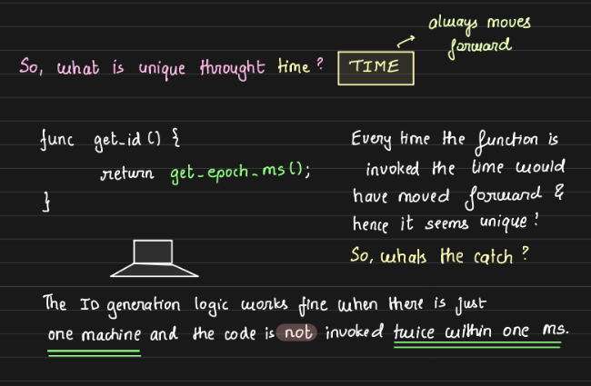

# Distributed ID Generation Problem

## Problem Statement:
The goal is to create a globally unique ID generator that assigns a unique ID every time it is invoked. This function should be adaptable, working within a distributed system or a single machine.


## Why a Distributed ID Generator is Needed:
In distributed systems, especially when databases are sharded across multiple nodes, generating a unique identifier for each record is crucial. For example, if we have 3 MySQL instances each generating their own local IDs, the same ID (e.g., row 10) could exist on all instances. This creates ambiguity when you want to refer to or delete a specific row. A globally unique ID across all instances resolves this issue by ensuring that each object or row is uniquely identifiable, regardless of which instance it resides on.


## Solution Approaches:

### 1. Timestamp-Based ID:
- One simple approach is to generate a timestamp-based ID, which works well if the ID generation frequency is low (not multiple requests in the same millisecond).

- **Problem:** When multiple requests are made within the same millisecond from different machines or threads or from same machine, the generated IDs will no longer be unique.

    

### 2. Timestamp + Machine ID:
- To handle collisions between machines, we can append a machine ID to the timestamp.

- **Problem:** If two threads within the same machine request an ID at the same millisecond, collisions can still occur.

    

### 3. Timestamp + Machine ID + Thread ID:
- One solution is to append the thread ID to ensure uniqueness across threads on the same machine.

    

### 4. Counter-Based ID Generation:

- Instead of a thread ID, a counter can be incremented atomically across threads as two different thread from same machine can access a shared resource. This counter is reset periodically or after hitting a certain limit.

    

- Since the counter is unique across the machine, the use of a timestamp becomes redundant. Even if multiple threads of the same process within the machine invoke the ID generation function simultaneously, it will still produce unique IDs, as the counter is incremented atomically. This ensures uniqueness without relying on time-based identifiers.

    

- **Trade Off:** The issue with using a counter-based approach for generating unique IDs is that once the counter reaches its maximum value, it will begin regenerating previously issued IDs, leading to conflicts. For instance, using an unsigned long int can generate approximately 4 billion unique IDs per machine. This method works well if we can confidently assume that a single machine won't generate more than 4 billion IDs. However, the combination of a timestamp, machine ID, and counter does not have this limitation. This approach provides a simpler, efficient solution but imposes an upper limit on the number of requests a single machine can handle.


### Persistence of Counter Value

The counter used for generating unique IDs is volatile, meaning if the machine restarts, the counter resets to 0, creating possible collisions. To prevent this, the counter must be persisted by storing its value in a file. Each time the counter is accessed, it reads the current value from the file, increments it, and then saves the updated value back to the file. This ensures continuity even after a system restart.


To improve reliability, a buffer like `+100` is added when reading the counter. Without this buffer, several issues may arise:

- **Delayed Flushing:** If the operating system doesn’t immediately flush the counter value to disk, there could be collisions in ID generation.

- **Process Failure:** If a process crashes before `save_counter()` is called, the system could generate duplicate values when it restarts. The buffer reduces the risk of these collisions by creating a margin of safety before the counter value is persisted again.

### Optimizing ID Generation to Reduce Disk I/O:

Every call to the ID generation function triggers a disk I/O operation, which can be costly and slow. To optimize performance, instead of writing to the file after every counter update, we can choose one of the following approaches:

1. **Interval-Based Updates:** The counter value is written to the file after a fixed time interval. This approach requires setting up a separate thread or cron job that runs periodically to save the counter value. However, this adds complexity, as we need to ensure the thread or cron job is active and properly tracks time intervals.

2. **Condition-Based Updates:** A simpler alternative is to update the file only when the counter meets a specific condition, such as `counter % 50 == 0`. This avoids the overhead of constantly managing a separate thread, making it more efficient and easier to implement.

    

- **Flush Mechanism:** To minimize disk I/O overhead, the counter is only persisted after certain intervals or conditions (e.g., after every 50 increments).

- **Crash Safety:** A safer way to prevent ID collisions after crashes is to use a strategy where the counter starts from a higher value on reboot, ensuring no duplicate IDs are generated.

#### Handling System Crashes and Ensuring Safe Values:

To ensure no collisions in case of a crash, we calculate a "safe" starting value when the system restarts. For example, if we flush the counter value to the file after every 3 increments and the system crashes after generating IDs 7 and 8, then the last flushed value was 6 and after system reboot the ID might be incorrectly generated as 7 again. To avoid this, the system should restart with a safe value based on:

```
safe_start = counter_value_in_file + flush_frequency + 1
```

For instance, if the last flushed value was 6 and the system crashed after 7 and 8 were used, the next safe start value would be 10 (6 + 3 + 1). This ensures no duplicate IDs are generated, although the IDs may not be consecutive, guaranteeing that each ID remains unique.


## Ensuring Monotonicity:
If we add complexity to ID generation, we might want monotonically increasing IDs. In some use cases, like database transactions, a monotonically increasing ID is necessary for conflict resolution.

- Monotonicity in a Single Machine:

    - A simple combination like below can ensure increasing IDs for the same machine.
        - timestamp + machine ID
        - timestamp + counter + machine ID 

    Timestamp on the left side give us rough monotonicity if the granularity of the timestamp is small enough 

    

- Monotonicity Across Machines:
    - Using a **timestamp** for generating unique IDs across multiple systems can cause issues if the clocks on those machines go out of sync. When clocks aren't synchronized, IDs generated won't maintain their order, breaking the monotonicity. This is called clock drift, time differences between machines.

        Guaranteeing monotonicity in a distributed system is challenging. A solution is to use a **centralized server** to generate the IDs, ensuring that the server’s clock remains in sync and thus produces monotonically increasing IDs. However, this comes with a tradeoff: **reduced throughput** since every request needs to make a network call to the central server, introducing latency.
    
        

## Challenges in Centralized ID Generation Server:
In a system with only one ID generation server, that server becomes a single point of failure. If it goes down, all services relying on it will be affected. To avoid this, multiple ID generation servers can be added, with a load balancer in front to distribute requests evenly.

However, with multiple servers, a new challenge arises: ensuring that the ID generated by one server is unique and not replicated by another. To address this, the servers can use gossip protocols to communicate and synchronize. While this can ensure uniqueness, maintaining monotonicity becomes a problem.


There is no perfect way to guarantee both monotonicity and high throughput in a distributed system. If monotonicity is essential, we would need to reduce throughput by pausing all other ID generation processes when one server generates an ID. Only after it has finished and communicated with other servers can they resume, thus ensuring monotonic order. This, however, significantly impacts performance.

