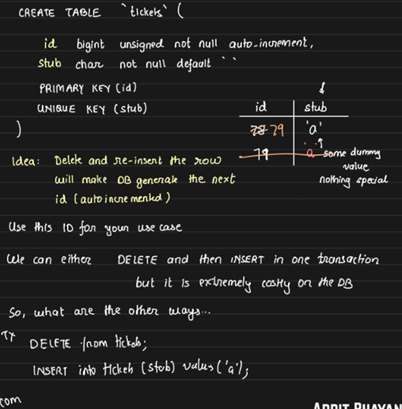

## Central ID Service with Batching: Amazon's Approach

In the context of distributed systems, we often require globally unique IDs. To meet this demand, an **ID generation service** pre-generates a pool of unique IDs. When an API server requests an ID, the service simply hands over a portion from the pre-generated batch.

But why do we need these IDs?

Take the **Order** or **Payment** service as examples. These services typically store records in **sharded databases**. Each shard must assign unique identifiers to the records. Without globally unique IDs, there would be ambiguity. 

To resolve this, API servers need to ensure that the IDs they assign to new orders or payments are unique across all shards. By using a central ID generation service, the servers can safely distribute unique IDs across their respective databases, even in distributed or sharded setups.

### Why API Servers Need ID Batches:
- API servers (like those for Payment or Order services) use the IDs to uniquely identify records across all database shards.

- Instead of making a network call to the ID generation service for every request (which would introduce network delays), the API servers request batches of IDs (e.g., 500 at a time) when they boot up or when their current batch is nearly exhausted.

### ID Distribution:
- The ID generation service hands out monotonically increasing IDs. For example, it may allocate ranges like [0, 500] or [1000, 1500] to a server.

- These ranges are stored in a SQL table (with columns for the service name and allocated range) and the current counter, ensuring that distributed services receive unique, non-overlapping ranges.

### Handling Unused IDs:

When a server is assigned a range of IDs and it crashes or shuts down, upon reboot, it will request new IDs. This can result in previously allocated IDs remaining unused.

To mitigate this, one option is to keep the ID batch size small, so that losing a few IDs due to server failures isn't a significant issue. However, a smaller batch size may lead to the server exhausting its allocated IDs more quickly. In such cases, the API server will need to repeatedly request new IDs from the ID generation service, which can introduce network delays.

The optimal solution is to balance the batch size to minimize both the risk of unused IDs and the network delays caused by frequent requests.

### Challenges with Monotonicity:
- While the IDs are monotonically increasing within each batch, monotonicity is not guaranteed across all API servers. For example, if server1 is assigned [1, 500] and server2 [501, 1000], alternating requests between the servers could result in an interleaving of IDs (e.g., request1 gets 1, request2 gets 501, request3 gets 2, and so on).

- If monotonicity is required, API servers would need to fetch one ID at a time directly from the ID generation service, but this would introduce significant overhead.

    

## Why Not Use UUID for ID Generation?
While UUID (Universally Unique Identifier) provides a convenient method for generating globally unique IDs, it introduces several performance issues when used as row IDs or unique identifier for each row in databases like MySQL.

### Key Issues with Using UUID:
1. Memory Overhead:

    For optimal database performance, leveraging indexes efficiently is critical as they are stored in memory. Indexes allow databases to quickly compute the final result set and then access the additional required details from disk. The more index rows that can fit in a single memory page, the faster the query execution.

    However, longer IDs, such as UUIDs (128-bit, 16 bytes), consume significantly more memory compared to integer IDs (32-bit, 4 bytes). This increased memory footprint means fewer index rows can fit into a single memory page, which can slow down query execution.

    For example, if you use UUIDs as row IDs along with an indexed column (e.g., age), the memory required to store a single row in the index would be 20 bytes (16 bytes for the UUID + 4 bytes for the indexed column). If the row ID were an integer, the index size would be 8 bytes (4 bytes for the integer ID + 4 bytes for the age).

    This is why shorter, monotonically increasing IDs (like integers) are generally preferred, as they help maximize the number of rows that can fit in memory, boosting overall database performance. 

2. B+ Tree Rebalancing:

    - UUIDs are not monotonically increasing, meaning they are randomly distributed. In a **B+ Tree index** (used by MySQL), inserting a new UUID might require inserting the ID in the middle of the tree, leading to **frequent rebalancing** of the B+ tree. This rebalancing introduces overhead and can significantly slow down the database, especially in high-write-throughput applications.

---------------------------

> Disclaimer: To understand the performance impact, create two MySQL tables—  
>- one with a monotonically increasing integer ID
>- another with UUID as the ID

> Then insert 10 million rows into each. We can observe that the table with the integer ID performs faster and requires less index space than the table using UUIDs.
---------------------------

### Security Considerations:

- UUIDs offer better security because they are unpredictable, making it harder for an attacker to guess the next ID. On the other hand, sequential integer IDs are more predictable and could expose sensitive information if used improperly.

    

### MongoDB’s Approach:
- MongoDB uses a custom 12-byte unique ID composed of:
    - 4 bytes for the epoch time,
    - 5 bytes for random digits,
    - 3 bytes for a counter.

The timestamp at the start ensures IDs are sorted chronologically, improving performance in certain use cases.


## Example from Flickr’s Ticketing System:
- Flickr avoids using UUIDs for generating IDs due to their inefficiency in indexing. Since UUIDs are 128-bit values, they significantly increase the cumulative size of indexed data, which impacts the memory usage of the database.

    To optimize performance, the cumulative size of indexed data should be as small as possible, as this directly correlates with the **bare minimum RAM** needed for efficient database operations. The smaller the index, the more data can fit in memory, leading to faster query execution.

    

### Flickr's ID Generation System with MySQL Auto-Increment

Flickr employs MySQL’s auto-increment feature to generate unique IDs, which is used for its sharded Post database. This ID generation system works as follows:

- Flickr has a ticketing server dedicated to generating IDs using the auto-increment feature of MySQL, so basically the ticketing server is a MySQL server.
- When a user posts something, the API server interacts with the ticketing server to obtain a globally unique ID.
- This ID is then utilized to store the post in the sharded Post database, ensuring each post has a unique identifier across the shards.

Yes this system may face throughput limitations but it works well within Flickr’s operational requirements.


#### MySQL Table Structure

In Flickr's ID generation system, the **ticketing server** relies on a two-column design, consisting of an `id` (which is the primary key) and a `stub`, which is a **single-character field**.

- The `id` column is **auto-incremented**.
- `stub` only contains unique characters.
- To trigger the auto-increment mechanism, **data must be inserted** into the row. Flickr uses the `stub` column to handle this, where a single character is inserted into the `stub` column.

However, the process of **deleting a row** and then **inserting** a new character into the stub column just to generate a new ID can be costly for the database.



## MySQL Optimizations:
- Instead of DELETE and INSERT operations to generate new IDs (which are expensive), MySQL provides two efficient options:
    1. `INSERT … ON DUPLICATE KEY UPDATE:` 
        - This tries to insert a row, and if it fails due to a unique key constraint, it updates the row.
        - This is why the `stub` column is made unique. Without the unique constraint, the `UPDATE` clause wouldn't trigger.
        - Example Query:
        ```sql
        INSERT INTO tickets(stub) VALUES('a') ON DUPLICATE KEY UPDATE id = id + 1;
        ```
    2. `REPLACE INTO:`
        - This works by trying to insert a row. If a row with the same unique key already exists, the old row is deleted and a new one is inserted.
        - However, this approach is 32 times slower than the previous one
    
    Therefore, the optimized query becomes:
    ```sql
    INSERT INTO tickets(stub) VALUES('a') ON DUPLICATE KEY UPDATE id = id + 1;
    ```

    Note: The table contains only one row, with two fields: `id`, which stores the latest used ID, and `stub`, which holds a single character `'a'` without any other value. 

    

## Single Point of Failure in Ticketing System
In the current setup -- 
1. The Client makes a request to create a post.
2. The Server sends a request to the Ticketing Server to retrieve a unique ID for the post.
3. The MySQL Server returns the unique ID.
4. The Server stores the post along with the unique ID in the Post Database.


Here MySQL server i.e. the ticketing server can become a single point of failure.

To address this, we add more servers, and a gossip protocol is needed for communication, which leads us to the earlier issue of distributed monotonicity. However, monotonicity is not requirement in this case, allowing for a different approach to handle the failure.

The solution involves using two MySQL database servers, where instead of simply incrementing the counter (`counter++`), they increment the counter by 2 (`counter+=2`). One server starts from 1 and the other starts from 2. As a result, one server generates odd IDs and the other generates even IDs, ensuring that both servers generate unique IDs continuously. This approach avoids the single point of failure, but it sacrifices monotonicity, which is acceptable in this specific scenario.

