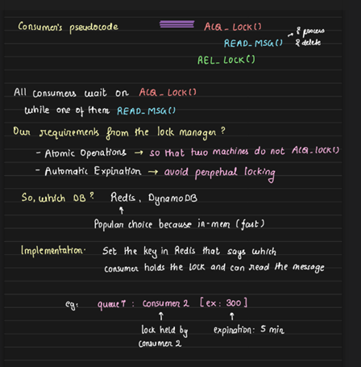

# Distributed System Synchronization with Remote Locks
In distributed systems, synchronization is a common challenge, requiring different approaches depending on the entities involved:

1. **Threads within the same process** use mutexes or semaphores.
2. Processes across the same machine often synchronize using disk-based locks (e.g., preventing concurrent execution of certain system commands like `apt-get upgrade`).
3. **Distributed systems across multiple machines** employ **remote locks** for synchronization.

## Example: A Hypothetical Queue for Synchronization

Consider a hypothetical queue system that doesn't inherently provide isolation, data protection or locking mechanisms. The queue simply processes messages by firing a request, fetching data, executing the task, and then deleting the message without ensuring any concurrency control. This means that consumers need to manage synchronization themselves.

In this scenario, each consumer must implement logic to determine who will access the queue, retrieve a message, process it, and delete it, ensuring that only one consumer processes a message at a time.

**Solution: Centralized Lock Management** To ensure proper synchronization, a **lock manager** can be introduced. This lock manager acts as a central entity where only one consumer can acquire a lock, enter the critical section (process a message), and then release the lock. Only the consumer holding the lock is authorized to process the queue or perform any operations on it. The requirements for this lock manager are:

1. **Atomicity:** Only one consumer should be able to hold the lock at any given time.

2. **TTL (Time-to-Live):** If a consumer crashes or fails to release the lock, the lock must expire, preventing perpetual starvation.

A popular solution for implementing these distributed locks is **Redis**, which provides atomic operations and TTL. The widely-used **RedLock algorithm** ensures high availability and distributed lock functionality.

DynamoDB, a fully managed service by AWS, is another option for distributed locks, though Redis remains the more popular choice for such implementations.

## Flow of Distributed Locks in Redis
In a distributed system, multiple consumers compete to acquire a lock for critical sections. The general flow is as follows:

1. **Lock Acquisition:** n consumers try to acquire the lock. One of them successfully obtains the lock, allowing it to enter the critical section and perform its operation.

2. **Critical Section:** The consumer that holds the lock proceeds to perform its operation, ensuring that no other consumer can interfere with this process.

3. **Lock Release:** Once the operation is complete, the consumer releases the lock, enabling other consumers to attempt acquiring the lock and enter the critical section.

This process is widely used in distributed transactions, where remote locks are essential for data integrity. However, it’s important to note that while distributed locks are heavily used, they reduce throughput, so their usage is often minimized for performance reasons.

Example: Consider a queue named `Q7`. Suppose `Consumer2 (C2)` wants to acquire a lock on `Q7`. In Redis, `C2` will set a value with the key `Q7` and value `C2`, along with a TTL (time to live). This indicates that `C2` holds the lock on `Q7`. If the key `Q7` already exists, `C2` will not set anything and will wait for the lock to be available again.

## Basic Redis Locking
To acquire a lock in Redis:

- A consumer sets a key using the `SETNX` command, which ensures the key is only set if it doesn't exist.
- If the lock is acquired, the consumer enters the critical section, processes the task.

    
- After the task got finished the consumer releases the lock.
    

## Issue with Release Lock implementation

In distributed systems, while only one transaction can acquire the lock and enter the critical section, there are concerns with the current lock release implementation:

1. **No Ownership Check for Lock Release:** If there's no check for ownership, any consumer could release the lock, even if they didn't hold it. Although the system ensures only one consumer can enter the critical section, it's still possible for a developer to forcefully delete the lock without proper validation. However, as developers, we must avoid such practices to ensure system integrity.

2. **Expired Lock Scenario:** Suppose transaction T1 acquires the lock and is performing an operation that takes longer than expected, surpassing the TTL of the lock. Once the TTL expires, the lock is automatically deleted, and transaction T2 may acquire it. Now, when T1 finishes its operation, it attempts to release the lock—potentially releasing the lock held by T2.

**Solution:** To address this, we must ensure that only the consumer holding the lock can release it. The correct approach is to check if the lock belongs to the consumer before releasing it, ensuring that no other process unintentionally interferes.

Can you figure out any issue with the above release lock implementation?

**Problem:** One issue arises between the `redis.get` and `redis.delete` operations. Suppose T1 acquires the lock and performs `redis.get` to confirm it holds the lock. If a context switch occurs before T1 completes its critical section, the lock's TTL (Time-to-Live) may expire, causing the key to be evicted from Redis. As a result, T2 could acquire the lock and enter the critical section. Once T1 resumes execution, it may attempt to release the lock it originally acquired, as it previously received confirmation from `redis.get`, but this would mistakenly release the lock held by T2.

**Solution:** To prevent this race condition, atomicity between `redis.get` and `redis.delete` is required. Redis provides a solution using LUA scripts to ensure that both operations occur atomically, meaning they execute as a single unit. The command `eval` can be used to pass the `LUA script`, ensuring the lock is only deleted by the transaction that holds it. This guarantees that the lock management remains consistent even during context switches.

---------------------------

> Disclaimer:
> Arpit shows the code for this acquire and relase lock, do it by yourself

---------------------------

## Distributed Lock for High Availability and Fault Tolerance
For systems requiring fault tolerance and high availability, a single Redis node becomes a single point of failure. The solution is to implement a **distributed lock** using multiple independent Redis nodes. A lock is only considered acquired if it's successfully locked on more than 50% of the Redis nodes. This ensures:

- Fault tolerance: Even if one or two nodes fail, locks can still be acquired.
- No single point of failure.

For example, in a system with 5 Redis nodes, a transaction must acquire locks on at least 3 nodes to proceed. If 1 or 2 nodes go down, locks can still be acquired.

## Comparison of Approaches

1. **Single Redis Node:** Simple but introduces a single point of failure.
2. **Multiple Independent Redis Servers:** Ensures high availability and fault tolerance, but reduces throughput.
3. **Redis Read Replicas:** While replicas provide redundancy, they might lead to stale reads and incorrect lock acquisition due to replication lag.