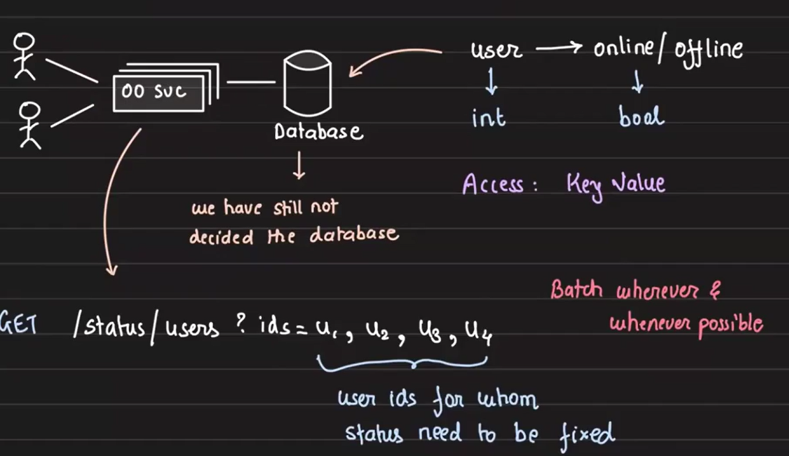
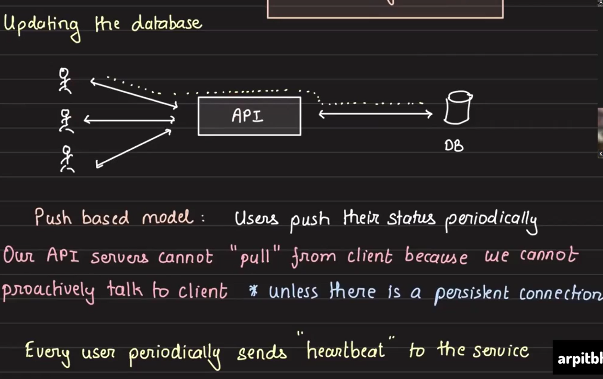
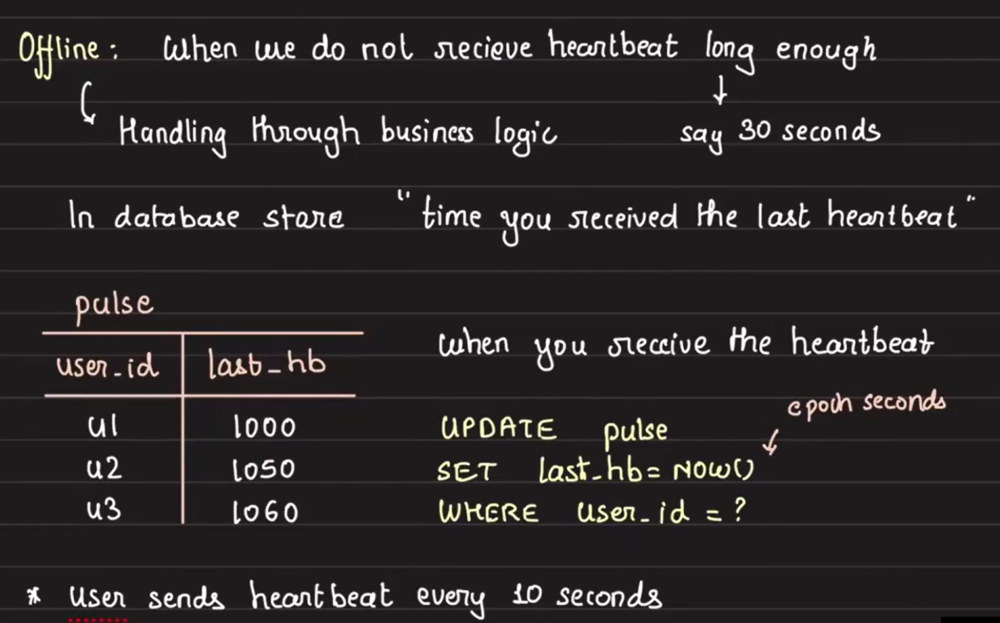
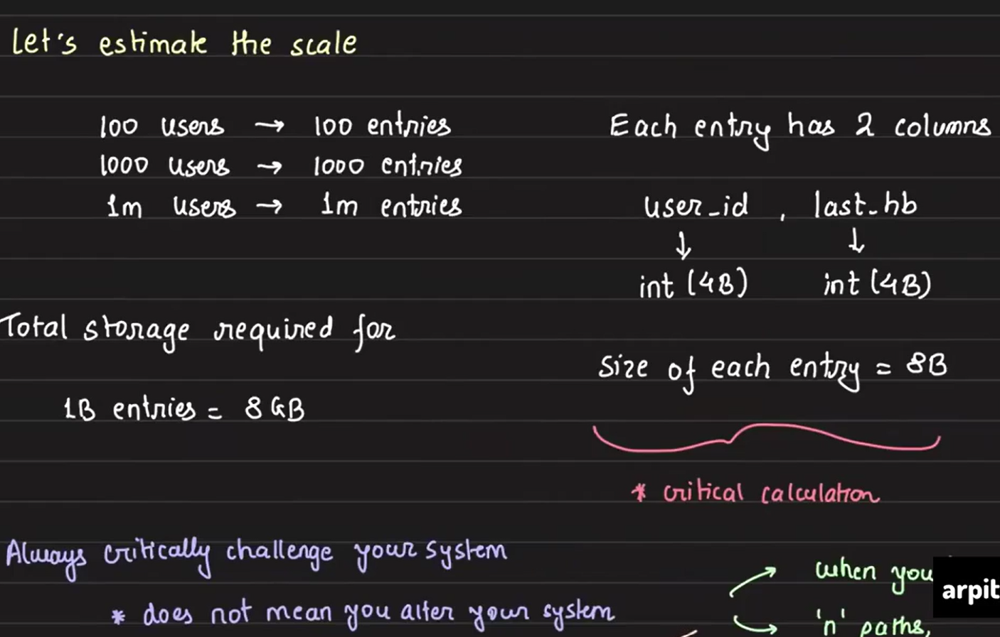
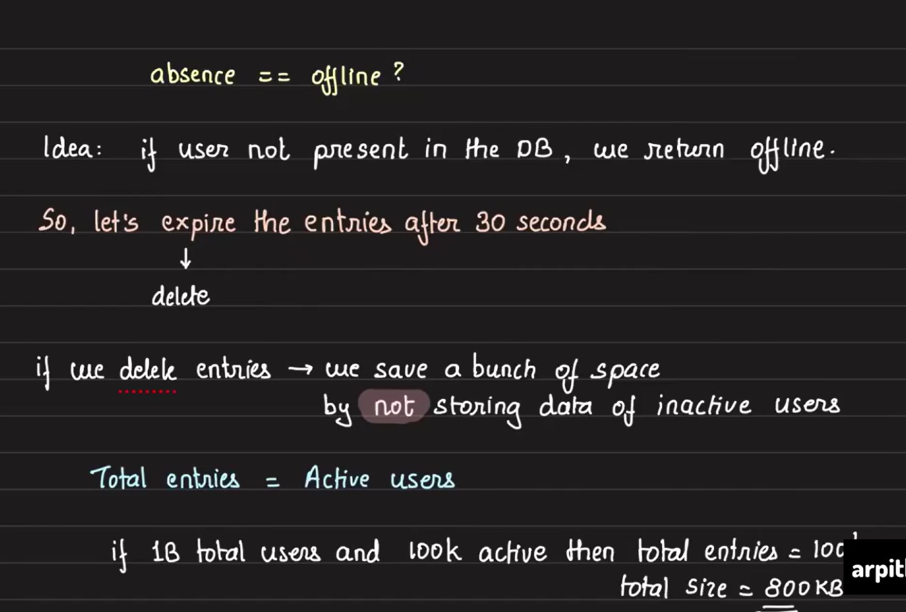
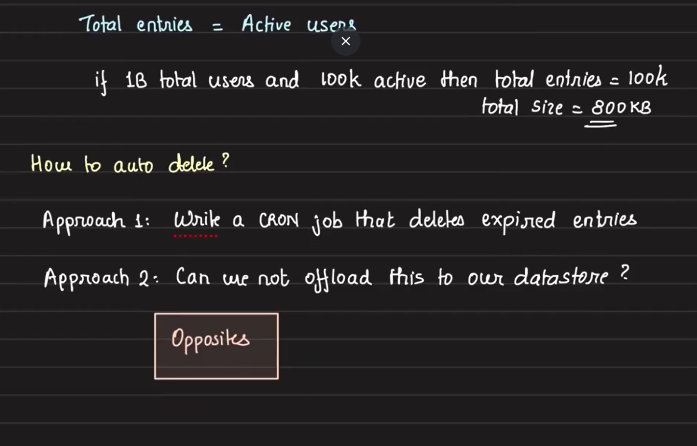
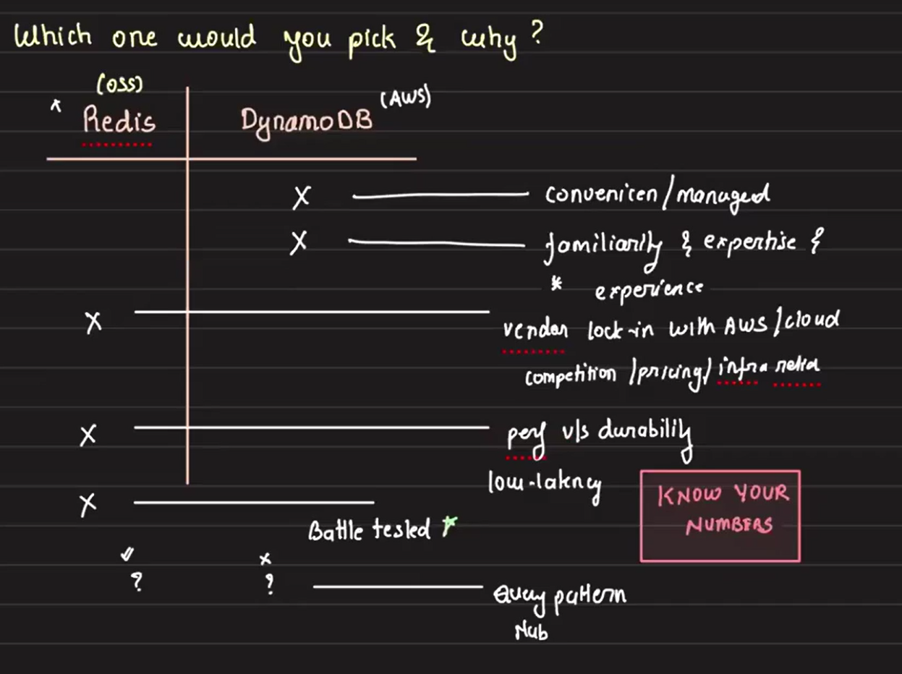

# System Design: User Online/Offline Status Tracker

## Overview
The system aims to track the online or offline status of users based on periodic heartbeats they send to the server. A push-based approach is used to maintain an accurate status in real-time. The system handles large-scale traffic efficiently, leveraging connection pools and database optimization techniques.

## Key API
### 1. API for get User Status:

- **Single User Status (Inefficient):** An API that fetches the status of one user at a time `(GET /status/user/{user_id})`. This method would require multiple API calls for multiple users, which is inefficient.

- **Batch User Status (Preferred):** An API that fetches the statuses of multiple users in a single call `(GET /status/users?ids=u1,u2,u3)`. This is efficient for querying the status of multiple users at once.

### 2. Updating user status: Push vs Pull Based Approach

When updating the user status in the database, we have two approaches to consider:
1.  **Push-Based Approach**
    - **How It Works:** In this method, users push their status to the server periodically.
    - **Implementation:**
        - We need to design an API that users will call to update their status.
        - For instance, we can create an endpoint: `POST /heartbeat` (Authenticated).
        - Authenticated users will call this API to mark themselves as "alive" or "online."
        - Whenever a user sends a heartbeat, API server will mark them as online in DB.
    - **Process:**
        - When a user sends a request to `/heartbeat` with an authentication token, the server updates the corresponding entry in the database, marking the user as online (`true`).
2. **Pull-Based Approach**
    - **How It Works:**  In a pull-based system, the API server pulls the user’s status when required.
    - **Challenges:** 
        - The server must know the user's location (IP address) and have a way to communicate with the user (i.e., the user needs to be running on a specific port).
        - Since users are not typically running on fixed IP addresses or ports, it is impractical to implement this method for remote or distributed users.
        -  For this method to work, there needs to be a persistent connection between the user and the API server.
    - **Use Case:** A pull-based approach is more suitable when:
        - Users are within the same infrastructure (e.g., internal systems).
        - The API server knows their IP addresses and users are listening on fixed ports.
        - In such cases, the server can actively fetch the status from users.

In our use case `Push-Based Approach` is much fesible. 

## DataBase Design

1. Data to Store:
    -  **User ID:** The unique identifier for the user.
    - **Status (Online/Offline):** Boolean indicating the user's current state.

Initially we start with simple sql table with two columns `user_id` and `status`. We will understand all the implementation nuances and what feature we want from the database and then decide on the database.

## Push-Based Approach: Determining User Online/Offline Status

We have decided to use the **push-based approach** where a user's status is set to online (`true`) whenever they send a heartbeat. However, the challenge is determining when to set the status to offline (`false`). 
Here's how we address this --- 

- Setting the Status to Offline
    - The user’s status is marked offline when the server does not receive a heartbeat for a significant period of time.
    - Defining "**Significant Time**":
        - We define this significant time as 10 seconds. If no heartbeat is received from the user within 10 seconds, we will mark the user as offline.

- Storing the Last Heartbeat Time:
    - To track whether a user is online or offline, we must store the timestamp of the last received heartbeat.
    - This timestamp will help determine the user’s status in future status checks.

## Change in Database Design
To handle above changes we need to store the timestamp of the last received heartbeat also, so now the databse will contain below two columns

-  **User_ID:** To store user id
- **Timestamp:** The time when the last heartbeat was received.

Here we remove `status` column and add `timestamp` column. Based on the timestamp column users status i.e. `online/offile` will be determined.

## Change in GET query for user status

To check the online/offline status of users, the GET request process changes slightly to account for the heartbeat logic. The process is as follows:

1. User sends a GET request to check the status of one or more users.
2. Server fetches the last heartbeat time for each user from the database.
3. Determine status based on timestamp:
    - If the last heartbeat was received within the last 10 seconds, the user is marked online.
    - If no heartbeat has been received in the last 10 seconds, the user is marked offline

## Storage requirements

### Storage Calculation:

- Each user entry in the database has two fields:
    - user_id: 4 bytes (approx).
    - timestamp: 4 bytes (approx).
- Therefore, the total size of each entry is approximately 8 bytes.

### Scale Estimation:
- 100 users → 100 entries → 800 bytes.
- 1 billion users → 1 billion entries → 8 GB.
- For 1 billion users, the storage requirement is only 8 GB, which is quite manageable.

## Optimization Options: Storing Only Online Users (Framework of Opposite)

Although storage is not a significant concern, we can further optimize by storing only the data of online users. This is just about considering all availble options and choose the best.

### Option 2: Storing Only Online Users' Data
- In this approach, instead of keeping data for all users, we only store data for users who are currently online.
- This requires deleting entries of users who haven't sent a heartbeat within the last 10 seconds.

### Handling Offline Status:
When a user is marked as offline (no heartbeat received within 10 seconds), their data needs to be removed from the database. There are two ways to achieve this:
- **Cron Job:** 
    - A scheduled job that runs periodically (e.g., every 30 seconds) to delete entries older than 10 seconds.
- **Database Expiration Feature:** 
    - Use a database that supports automatic expiration of records after a certain time (e.g., Redis for in-memory open source storage or DynamoDB for a managed solution).
    - This ensures that data is automatically removed when the user's entry becomes outdated.

## Updated GET and POST Requests for User Status for option 2

1. **Handling Heartbeat (POST Request)**
    - When a user sends a heartbeat, we follow these steps:
        - Check if the user_id exists in the database:
            - If the user_id does not exist, create a new key for that user and update the last heartbeat timestamp.
            - If the user_id already exists, update the last heartbeat timestamp.
        - Set an expiration time of 30 seconds for the key. This means if the user doesn’t send another heartbeat within 30 seconds, the key will automatically expire.

2. **Fetching User Status (GET Request)**

    - When the system needs to fetch a user's status:
        - Check if the user_id key exists in the database:
            - If yes: User is online.
            - If no: User is offline. (i.e., the key has expired or was never created), the user is considered offline.

## Database Selection
### Key Databases:
1. Redis:
    - In-memory storage, extremely fast lookups.
    - Supports automatic expiration of keys.
    - Well-supported with a large community.
2. DynamoDB:
    - Disk-based storage, offering persistence.
    - Supports data expiration with some configuration.
    - Managed by AWS, but has less community support compared to Redis.

**Vendor login:** Vendor lock-in is when a customer is unable to easily switch to a different product or service from a vendor without incurring significant costs.

## Handling Server Load for Heartbeat Requests
1. Heartbeat Traffic:
    - Online users will send a **heartbeat every 10 seconds**, meaning each online user sends **6 heartbeats per minute**.
    - For 1 million active users, the system will receive 6 million requests per minute (6M req/min).

2. Database Interaction
    - Each heartbeat results in one database call:
        - The database call is simple—it updates a single row with the current timestamp.
        - The query execution time itself is very short (in microseconds) since it only involves a small read or update.
3. Server Overhead Concerns
    - Although the query execution is fast, other overheads are more time-consuming:
        - Establishing a TCP connection (3-way handshake).
        - Firing the query and waiting for a response.
        - Terminating the connection (2-way connection teardown).

These steps contribute significantly to the overall time for each request, making native implementation less efficient for handling such a large number of requests.

## Optimization: Connection Pooling
1. Why Use Connection Pooling?
    - A connection pool optimizes the process by reducing the time spent on connection management.
    - In a native implementation, each request establishes a new connection with the database, which is costly in terms of time.

2. How Connection Pooling Works
    - The server pre-establishes a pool of connections with the database.
    - When a request comes in:
        - The server borrows a connection from the pool.
        - The server executes the query using that connection.
        - Once the query is complete, the server returns the connection back to the pool, ready for reuse.
    - This approach eliminates the need to establish and tear down TCP connections repeatedly, saving significant time on connection management.

## Real-World Considerations
1. WebSockets vs REST API:
    - In production systems, WebSockets are typically used for real-time communication.
    - For simplicity, this system design uses a REST-based heartbeat approach.
2. Handling Large Request Volumes:
    - Even though each heartbeat request is small, the system needs to handle millions of requests per minute.
    - By using a connection pool, we minimize the overhead caused by opening and closing database connections, improving overall performance.