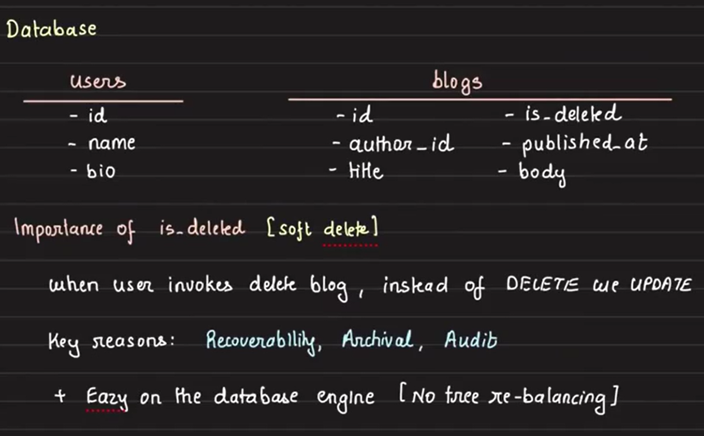
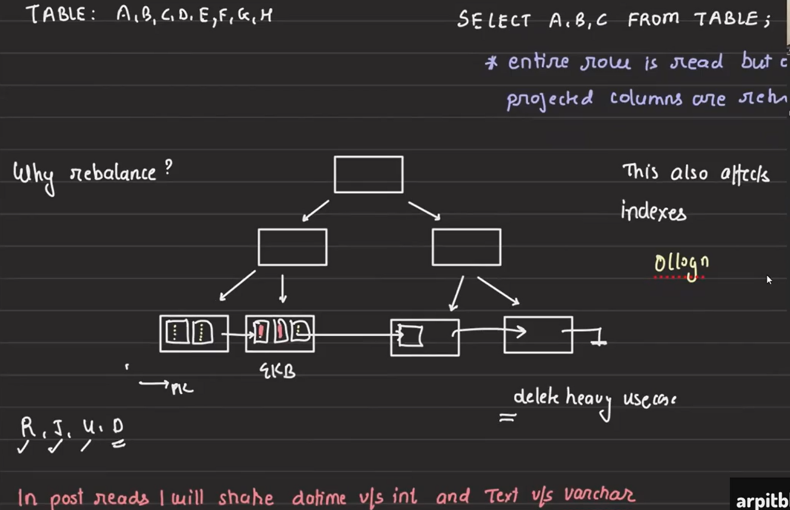
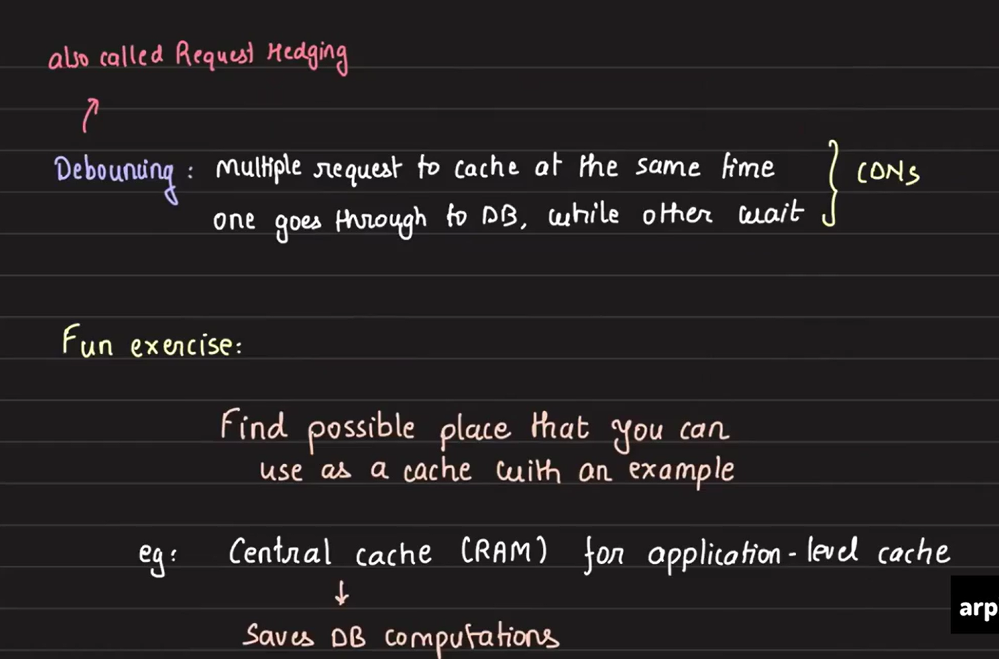

# Core Concepts of a Database and Caching

This document outlines core concepts of database and caching with the help of a multi-user blogging system (similar to Medium). It explores the database structure, caching strategies, and potential challenges in scaling and optimizing the system.

## Core Concepts of a Blogging System

- **Users:** A user can have multiple blogs.
- **Blogs:** Each blog is created by a user and can be published or deleted.

## Database Design

The database will primarily consist of two tables:
1. Users Table:
    - `id:` Unique identifier for the user.
    - `name:` The name of the user.
    - `bio:` A short bio or description for the user.

2. Blogs Table:
    - `id:` Unique identifier for the blog post.
    - `author_id:` Foreign key linking to the Users table.
    - `title:` Title of the blog post.
    - `is_deleted:` Boolean flag to indicate whether the blog is deleted (soft delete).
    - `published_at:` Timestamp for when the blog was published.
    - `body:` The actual content of the blog post.

        

## Soft Delete vs Hard Delete
### Soft Delete:

- When a user deletes a blog post, the post is not immediately removed from the database. Instead, the `is_deleted` column is marked as true.

### Reasons for Soft Delete:
- Recoverability: Data can be restored if needed (similar to Gmail's trash or the Recycle Bin in Windows).
- Archival and Auditing: Deleted content is still available for auditing or archival purposes.
- Efficiency in DB operations:
    - Avoid frequent B+ tree rebalancing: Hard deleting every time would lead to frequent rebalancing of the B+ tree, which is time-consuming. With soft delete, we only update a field in the database, avoiding rebalancing.
    - Batch Hard Deletes: Over time, we can batch-process these soft-deleted entries and hard delete them later in bulk, improving performance.

    

### Insertions and B+ Trees:
- Every insertion in a B+ tree can potentially trigger rebalancing to maintain its structure and properties.
- If we continually insert data at the right side of the B+ tree (in a sequential manner), the number of rebalancing operations is significantly reduced.
- Using an auto-increment column for indexing ensures that new entries are always added sequentially to the right side of the B+ tree, minimizing rebalancing.
- UUIDs and Rebalancing:
    - UUIDs on the other hand, do not follow a sequential order.
    - Since UUIDs are random, they can cause inserts at any position in the B+ tree, potentially increasing the frequency of rebalancing operations.
- There will be deeper discussions on this topic in later classes, where we will explore the trade-offs between using sequential vs. random keys (like UUIDs) for indexing in B+ trees.

## Caching Strategy

### Why Caching is Important

Caching helps to:
- Reduce expensive computations.
- Avoid unnecessary I/O and network calls.
- Improve performance by storing precomputed or frequently accessed data closer to the application.

However, caching isn't just about storing data in RAM. It can happen at various levels (e.g., CDNs, local caches) and is useful only if fetching from the cache is significantly faster than the fallback option.

### Caching Considerations
- Caching will only be beneficial if the fallback (DB fetch or computation) is costlier than the cache hit.
- If most of the processing time is spent on CPU-bound tasks like encryption or decryption, and not on data retrieval, caching may not provide significant benefits especially if the cache is positioned at the database level. In such cases, the cache will only save some time on fetching data from the database, but the overall performance won’t improve if the main bottleneck is CPU-intensive processing.

    This highlights the importance of understanding the entire system architecture, as caching is only effective when it addresses the actual performance bottlenecks.

### Cache Challenges

In this setup, when users request a post from the API server, the server first checks if the post is already stored in the cache:

- If the post is in the cache, the server quickly returns it to the user.
- If not, the server fetches the post from the database, stores it in the cache for future requests, and then sends it to the user.

let's think about the potential issues with caching in terms of performance.

### Problems:
1. Cache Misses:
    - A cache miss leads to two read operations and one write operation: one to check the cache and one to fetch from the database. Write operation is to update the cache.
    - **Solution:** Increase cache capacity or adjust caching strategy to reduce misses.

    This is very generic problem whenever we use cache.

2. Data Staleness:
    - If blog posts are updated frequently, cached data may become stale (out of sync with the DB).
    - **Solution:** Implement a TTL (Time-to-Live) for each cache entry. Once TTL expires, the cache either:
        - Deletes the entry, or
        - Refreshes the data from the database.

3. Cache Debouncing (Request Hedging):
    - When dealing with a cache miss, fetching data from the database and storing it in the cache may take time (e.g., 3 seconds). During this delay, the system might receive millions of requests for the same key. If the cache misses for all these requests, each one will independently follow the same fallback process, causing redundant work and unnecessary load on the system.

        This problem is called request hedging or cache debouncing.

    - **Solution:** Only the first request should fetch from the DB, while others wait. This can be implemented using multithreading and semaphores.
    - **Optimization:** Implement this on the API server level using a local hashmap to track ongoing requests. This avoids the need for a global cache lock across all servers.

### Cache Debouncing Solution
- **Problem:**  If multiple requests come for the same key(for the same post) during a cache miss, all of them will try to fetch the data from the database, leading to redundant work. 
- **Solution:**
    - When a cache miss occurs for a key, allow only one request to fetch the data from the database.
    - **All other identical requests** should wait until the first request finishes fetching and caching the data.
    - Once the first request completes, the waiting requests can use the now-cached data instead of repeating the process.
    - This logic applies only for **identical keys** to avoid redundant operations.

        

### Implementation Approach for Cache Debouncing:

- Initial Thought:
    - Implementing this globally across multiple API servers would require a shared global storage where all servers update and check keys in progress.
    - However, adding a global storage solution introduces complexity and potential network issues.

- Simplified Approach:
    - Instead of using global storage, implement request hedging locally within each API server.
    - Each API server maintains a local hashmap that tracks the keys it is currently fetching data for.
        - If a new request comes in for a key that is already in the hashmap (i.e., data is being fetched for that key), the request will wait until the fetch operation completes.
        - Once the data is fetched and stored in the cache, all waiting requests can retrieve it without redundant database queries.

- Advantages of Local Hedging:
    - **Simpler Design:** By handling it at the API server level, we avoid the complexity of global synchronization across servers.
    - **Avoids Cascading Failures:** The number of concurrent requests for the same key is limited to the number of available API servers, preventing overwhelming the database with redundant fetches.

- Implementation Approach:
    - Use multithreading and semaphores to manage concurrent requests:
        - One thread handles fetching the data for a cache miss.
        - Other threads for the same key wait until the data is ready in the cache.
