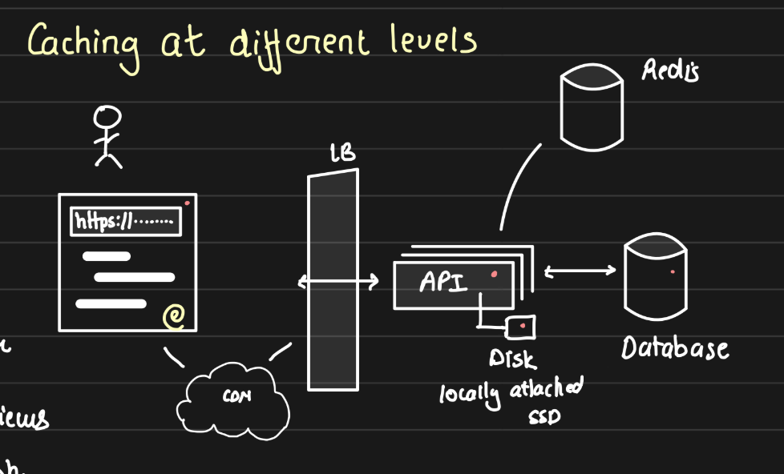
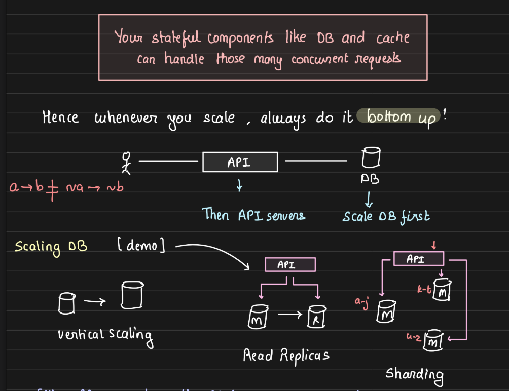
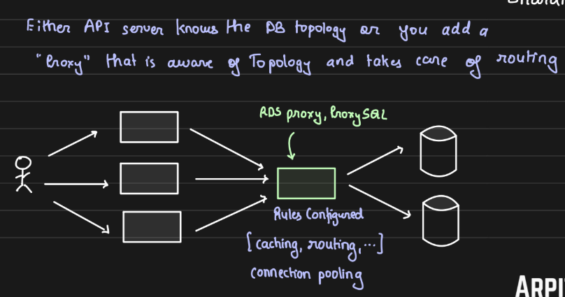

# Caching and Database Optimization

## Caching at Different Levels

1. CPU Cache (L1, L2):

    - Quickest access memory, stores frequently used data for fast CPU access.
2. Browser Cache:

    - Stores website resources (HTML, CSS, images) locally to speed up website load times on future visits.
3. Static Resources & Local Storage:

    - Applications like Slack and Teams store data on the client-side for quicker access.
4. Database Cache & Materialized Views:

    - Avoids redundant table joins by caching query results. Risks of staleness (outdated data) can be handled by scheduling cron jobs to refresh.
5. Database RAM Cache (Buffer Pools):

    - Ensures frequently accessed data is stored in memory to avoid disk I/O on repeated access. Similar to Java's `Xms` parameter, this defines the initial amount of reserved memory.
6. API Server Cache:

    There are several challenges related to caching data in the RAM of multiple API servers:

    - **Staleness:** The data in the cache may become outdated over time, leading to stale data being served to users.
    - **Cache Invalidation:** With multiple API servers caching the same data, ensuring that all cached copies are updated or invalidated correctly is a challenge.
    - **Cache Eviction:** Determining when to evict data from the cache to free up space without impacting performance.
    - **Memory Bloat:** Caching too much data in memory can lead to excessive memory usage, potentially impacting the system's overall performance.

These issues are all solvable, but they require careful consideration and planning to ensure that caching is done efficiently and effectively.

7. Cache at Load Balancer:

    - **Purpose:** If specific requests (like a particular URL) are frequently made, we can cache the response on the load balancer side.

        - **Example:** In a blog scenario, if a particular blog post is very popular and requested by multiple users, we can cache the page at the load balancer. This allows the load balancer to serve the page directly, without forwarding the request to the API server each time. This caching of API server responses helps save both time and cost.
    - **Downside:** The downside is the additional memory required by the load balancer to store cached responses. The cache can be stored in RAM or disk, depending on the configuration, which impacts resource usage.

8. Cache at CDN Level:

    - CDNs are geographically distributed, allowing content to be served from the closest location to the user. `(Geo Proximity)` It caches static and dynamic content closer to the user, reducing the time and cost of serving data from the origin server.

9. Runtime Language Cache:

    - Runtime caches (e.g., Java HashMap or Python dict) help in caching objects or results closer to the application, reducing network and database calls.

10. Disk Cache (Locally Attached SSDs):

    -A very underrated caching option. Instead of caching data in memory (as discussed in point 5), we can cache it on a locally attached SSD in API server. This approach provides faster access compared to making a network call to the database, and it's also more cost-effective since disk storage is generally cheaper than memory. While not as fast as in-memory caching, using an SSD for caching strikes a good balance between speed and storage cost.
    

## Scaling Strategies in System Design

**Scalability:** The ability of a system to handle more load by increasing its capacity.

### Two Types of Scaling:
1. Vertical Scaling:
    - Increase CPU, RAM, or disk space on existing servers.
    - Pros: Simple implementation.
    - Cons: Limited by hardware capacity.

2. Horizontal Scaling:

    - Add more machines (servers) to distribute the load.
    - Pros: Infinite scalability, fault tolerance.
    - Cons: Complex management, needs distributed system design (like sharding databases).

### Scaling Databases

1. Scaling Reads:

    - Use Read Replicas to offload read traffic from the master node.
    - Replication lag could lead to stale data.
    -  For critical operations, such as financial transactions, reads must go directly to the master to avoid inconsistencies, while non-critical reads (e.g., profile information) can come from replicas.
2. Scaling Writes:

    - Once vertical scaling limits are reached, add read replicas. However, if the write load exceeds the master node's capacity, horizontal scaling of writes is required by sharding the database.

- Horizontal scaling, while theoretically limitless, has practical constraints, especially for stateful components like databases and caches. Adding more API servers can increase the capacity to handle incoming requests, but the backend systems, such as the database, also need to scale to manage the load. 
    - For instance, during high-demand periods like festive seasons on platforms like Swiggy, Zomato, or Amazon, it’s not just the APIs that need to scale, but also the payment systems, databases, and even external partners (like restaurants) need to scale to ensure seamless operations. In essence, scaling must occur across the entire system, not just at the application layer, for effective load management.

        

### Sharding Techniques:
- **Range-based Sharding:** Split data based on key ranges (e.g., A-M to Shard 1, N-Z to Shard 2).
- **Hash-based Sharding:** Use a hash function on keys to distribute data across different shards.

## Connection Pooling & Database Proxy
1. Connection Pools:
    - API servers maintain two types of connection pools: one for read replicas and another for the master node. Depending on the query type (read/write), the appropriate pool is used.
2. Database Proxy (RDS Proxy, ProxySQL):
    - If the database topology is elastic (i.e., dynamic scaling), API servers may not be aware of which nodes to connect to. In this case, a proxy server (like ProxySQL) manages all database connections and routes requests based on predefined rules.

    