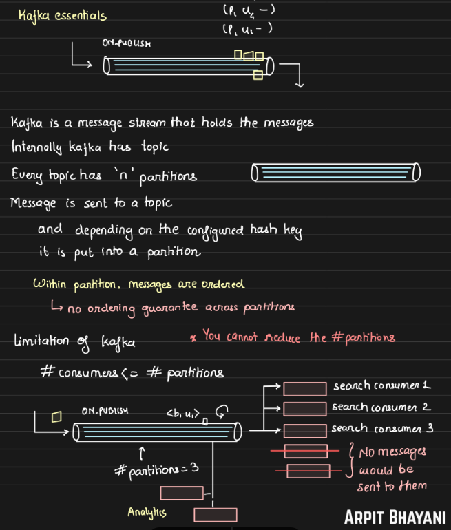
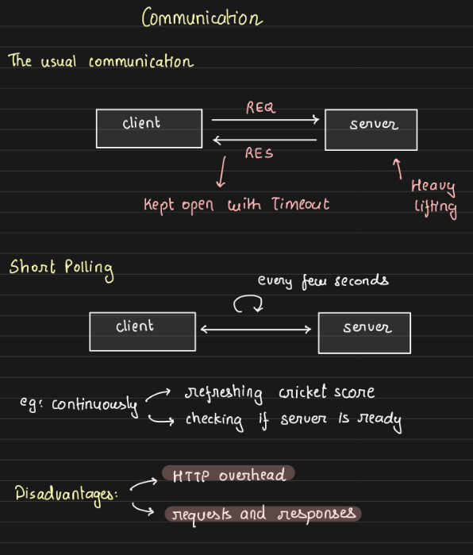
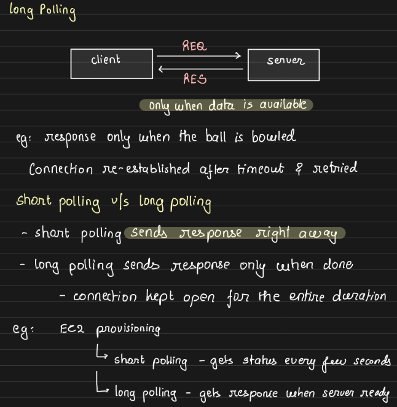
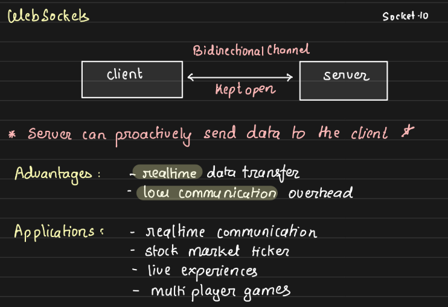
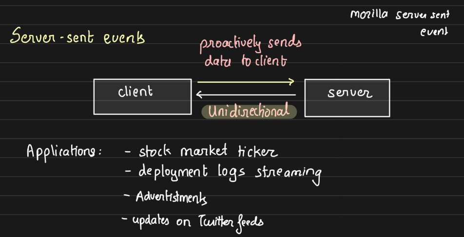

## Message Queue vs Message Stream

The key difference between a message stream (like Kafka) and a message queue (like AWS SQS) lies in how they handle and deliver messages, particularly in how they deal with multiple consumers and message retention. Here’s a simple breakdown with examples:

### Message Queue (e.g., AWS SQS, RabbitMQ):
1. **Point-to-Point Communication:** Messages are delivered to one consumer. Once the message is processed and removed, it’s no longer available to others.
2. **No Message Retention:** The message is deleted once a consumer receives and processes it.
3. **Consumer Model:** Typically, each message is consumed by only one recipient. It works well when you want to distribute tasks between multiple workers (e.g., an email processing system).
4. **Use Case:** SQS is suitable for tasks like job queuing, where you want to distribute jobs to workers, and once a job is processed, it’s removed from the queue. For example, if you have 5 workers handling 100 tasks, each worker will process tasks independently, and no task will be duplicated between them.
### Message Stream (e.g., Apache Kafka):
1. **Pub/Sub Model:** Kafka allows multiple consumers to read the same message. Consumers in different consumer group can independently track their progress.
2. **Message Retention:** Messages are retained for a configurable amount of time (e.g., days or weeks), even after being read. This means different consumers can access the same messages at different times.
3. **Consumer Model:** Multiple consumers can read from the same stream of messages simultaneously without the messages disappearing. Kafka is ideal for scenarios where you want broadcast messaging or real-time event streaming.
4. **Use Case:** Kafka works well for applications like real-time data processing or event sourcing. For example, if you want to stream logs to multiple analytics systems, each system (consumer) can process the logs independently from the Kafka stream.
### Example:
- **SQS:** Imagine a system that processes customer support tickets. Once a worker picks up a ticket from the queue and resolves it, that ticket is no longer available to others.
- **Kafka:** Think of a stock trading system where multiple services (pricing engines, auditing systems, etc.) need to process the same stock price updates. Kafka allows multiple systems to subscribe to the same stream of price updates, ensuring all of them receive and process the messages in real-time.

## Apache Kafka Overview: Parallelism and Limitations

Kafka’s scalability is influenced by its partitioning mechanism. A topic can have multiple partitions, and parallelism is constrained by the number of partitions. For a consumer group, each partition is consumed by only one consumer at a time. Adding more consumers to the group beyond the number of partitions will not distribute additional workload to them—they will remain idle.

- **Key limitation:** Kafka’s parallelism is capped by the number of partitions. To scale, you need to increase partitions, but this action is irreversible—you cannot decrease the number of partitions later.

- **Retention Policy:** Kafka uses a global retention policy, meaning messages are retained based on a specified time or space limit, and there is no explicit "delete message" feature. Once processed, a message can only be deleted based on the retention rules.

## Fault Tolerance and Message Processing

- **Dead Letter Queue (DLQ):** In the event of failure, Kafka can handle messages using DLQs, ensuring failed messages are redirected for later processing.

- **Message Acknowledgment:** Kafka ensures that once a message is committed by a consumer, it won’t be reprocessed. However, if a consumer processes a message but fails before committing it, another consumer from the same group will reprocess that message.

- **Zero-copy Technology:** Kafka uses the zero-copy technology to optimize performance by bypassing the need to copy data between application and kernel space during file transfers.

## Communication Models: Short Polling, Long Polling, and WebSockets

There different communication techniques depending on use cases we have.

- **Short Polling:** 
    - The client sends repeated requests to the server for updates and the server response immediately with the data it has. This method is resource-intensive as it results in frequent API calls, establishing many short-lived TCP connections. An example would be a live score refresh.

        

- **Long Polling:** 
    - In contrast, long polling involves holding the client’s request open until there is a change in data. This avoids the need for constant requests but can result in long-lived connections, which are resource-intensive in a different way. This functionality is not an automatic or pre-configured feature already available on the server. Instead, it must be implemented manually, tailored to the specific business logic and use case requirements. This means developers need to write custom logic to control how and when data will be send.

        

- **WebSockets:** 
    -  An extension of short polling and long polling is having a long-running, persistent connection with the backend — this is where WebSockets come in. The advantage of WebSockets is that the connection is persistent, allowing for real-time, bidirectional communication with the server. Typically, in client-server interactions, the client sends a request, and the server responds. But what if we want the server to send data without the client asking for it? For example, in a chat application, you don’t repeatedly request new messages from the server. Instead, the server sends messages to your device whenever someone sends you a message, as long as your chat app is connected to the internet.

        WebSockets are perfect for scenarios where the server needs to push data to the client without a specific request from the client. This long-lasting connection is both its strength and its weakness:

        - **Strength:** Since the connection is already established, there’s no overhead from setting up new connections each time, so the focus is purely on data transfer. This results in low communication overhead and enables real-time data transfer. Common use case is multiplayer gaming.

        - **Bidirectional Communication:** This allows both the client and the server to send data to each other in real time, which is crucial in use cases requiring constant, instantaneous communication.
    
        

- **Server-Sent Events (SSE):** 
    - The opposite of bidirectional communication, is unidirectional communication, known as server-sent events (SSE). In SSE, the server sends updates or events to the client, but only after the client initiates the connection. The key point here is that the client first establishes a connection with the server, allowing the server to send data to the client. However, once the connection is established, the **client cannot send any data back to the server**, which is why it’s called **unidirectional communication**.

    - **Need for SSE**: A common question is, "If WebSockets offer bidirectional communication, why use unidirectional SSE?" The answer is that SSE is much lighter in terms of protocol overhead compared to WebSockets. WebSockets come with additional complexity, like handling headers, multiplexing, and managing multiple communication channels. SSE, on the other hand, is more lightweight and easier to manage when the only requirement is for the server to push data to the client.

    - **Example:** live updates in LLMs often use SSE for streaming responses. Other use cases include advertisement updates or Twitter feeds, where new content is pushed to the client whenever user scrolls. One thing to keep in mind with SSE is managing timeouts, ensuring that the connection stays open for the necessary amount of time based on the application's needs.

    

## Task 1: Mimic EC2 Instance Creation with Short Polling and Long Polling

1. Short Polling:

    - Create an API that simulates EC2 instance creation, which takes 10 seconds to spin up.
    - When the user makes a request, the process starts and immediately returns a message to the user saying the process has started.
    - Create another API for the user to check the status of the instance creation. Each time the user calls this API, the server will return the current status of the instance (e.g., `TODO`, `in-progress`, `completed`, `failed`)

2. Long Polling:

    - Build a long-polling API where the server only responds to the user when there is a state change (e.g., from `TODO` to `in-progress` or `completed`). User will send the current state it has.

    - The API waits until the instance status changes before returning a response to the user.

## Task 2: Log Streaming Example with Server-Sent Events and WebSockets

- Build a log streaming service using Server-Sent Events (SSE).

    - The server will push log updates to the client as soon as they become available.
    - The client remains connected to receive logs in real-time without needing to request them continuously.

- Build the same log streaming functionality using WebSockets.

    - Establish a persistent connection where both the server and the client can send data back and forth, allowing real-time bi-directional log streaming.