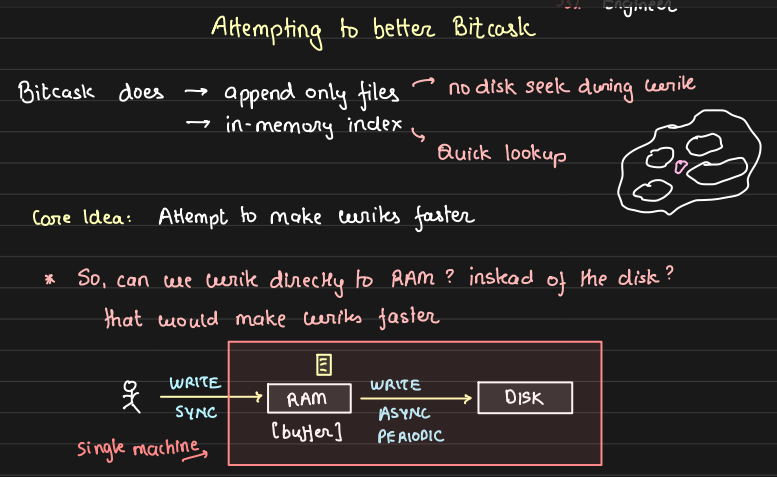

#  LSM Trees and Bitcask Improvement through Write Optimization

## Introduction

We won't design Bitcask by simply following examples. Instead, we will focus on solving an existing problem that can be addressed using LSM trees. Our goal is to explore how LSM trees provide a solution to this problem and understand their role in the design process.

- **Quick Recap of Bitcask:** 
    Bitcask follows a simple design with:
    - A single append-only write file and multiple read files.
    - An in-memory index for quick lookups.

While effective for certain workloads, Bitcask can be slow in write operations as every write directly impacts the disk, which is relatively slow. Our goal is to improve this by introducing a buffering mechanism in RAM, enabling faster writes, batch processing, and optimizing disk I/O.

## Problem Definition: Can We Make Bitcask Better?

To improve Bitcask, we want to address the problem of **slow disk writes**:

- **Solution:** Use a RAM buffer to store writes temporarily and periodically flush them to disk in batches. This method optimizes both user experience (faster writes) and system performance (more efficient disk writes).

- Validation: Is This a Real Problem?

    Before jumping into a solution, it is crucial to validate whether users face performance issues during writes. The users of Bitcask are the best source for feedback on whether slow writes are problematic and worth solving.

    

## Key Challenges and Trade-offs

1. **Durability:** When storing data in RAM, there's a risk of losing data if the RAM malfunctions or fails, particularly for data that hasn't yet been written to disk. In such cases, data loss occurs, and recovery becomes impossible. 
    - **Solution:** To address this durability issue, we use **Write-Ahead Logging (WAL)**. WAL ensures that data is first written to a log on disk before being stored in memory. If, for example, data is flushed to disk every minute, any data not written to the disk during that minute could be lost in the event of a failure. Without WAL, this creates a maximum window of 1-minute data loss. But with WAL implementation there will be no data loss.
    
        However, WAL is essentially similar to an append-only file on disk, which parallels the approach used in Bitcask, where data is appended to a file on disk for each write operation, WALL also we are doing the same.

        To strike a balance between write speed and data durability, we can offer users a configurable option:

        - **High-Speed Write (Potential Data Loss):** If the user prioritizes faster write speeds, they can opt not to use WAL or flush less frequently. This may result in some data loss in the event of a failure, but it significantly increases write throughput.

        - **Full Durability (Slower Write Throughput):** For users who cannot afford to lose any data, WAL is enabled, ensuring that all data is durable and recoverable. While this guarantees data durability, it comes at the cost of reduced write throughput.

        

2. **Memory Limitations:** RAM has a fixed size, meaning we must manage storage carefully until the data is flushed to disk.
    - We need a strategy to avoid running out of RAM while ensuring that the writes are as fast as possible.

3. **RAM Flushing Strategy:** When flushing data from RAM to disk, it's not necessary to halt all operations (often referred to as "stopping the world"). Instead, we can leverage a more efficient pattern:

    - **Copy-on-Flush Approach:** Before flushing, move the current content of RAM to another temporary location in RAM and clear the initial memory location. This allows new writes to continue at the initial location without interruption.

    - **Flushing in Parallel:** While new data is being written to the cleared memory space, the older data from the temporary RAM location is flushed asynchronously to disk.

By this way writing to RAM and flushing to disk can occur simultaneously

## Determining RAM Allocation for the Database
How can users determine the appropriate amount of RAM to allocate while using this database?

1. Ingestion Rate Over Write Throughput:

    - Simply tracking the write throughput (number of writes per second, wps) is not the ideal metric. For example, consider two cases:
        - Case 1: 100 writes per second (wps) with each write being 100 MB.
        - Case 2: 10,000 writes per second, but each write is only 1 KB.
    
    - Clearly, it’s not the number of writes but the size of the data being written that impacts RAM usage. Therefore, what needs to be tracked is the ingestion rate (total data size written per second), as it plays a crucial role in determining the required RAM size and how frequently data should be flushed to disk.

2. Flushing Behavior and Memory Usage:

    - When flushing data from RAM to disk, we are transferring the entire RAM data to another temporary memory location. This means that after the flush, the original memory space is cleared and ready for fresh writes.

        

    - Unlike a cleanup job as discussed last week (where some data remains), here the memory usage drops to zero after the flush operation is completed because the entire RAM content is transferred for flushing.

## Write Optimization: RAM Buffering

The basic write optimization strategy involves:

1. Writing data into a RAM buffer.
2. Periodically flushing the RAM content to disk in batch mode for faster write operations.

But when we refer to "adding it to a buffer", what the buffer actually is? let's break down what this buffer is and how it operates.

1. **What is the Buffer?**

    - As we putting key-value pair in buffer then the buffer can be seen as a hashmap that temporarily holds key-value pairs before they are flushed to disk. This allows us to perform fast in-memory operations before persisting the data.

2. **Operations on the Buffer:**
    - **PUT(k, v):** Updates or adds the key-value pair to the hashmap (i.e buffer).
    
    - **DEL(k):**
        - Deletes the key from the hashmap, but what if the key has already been flushed to disk and isn't in the hashmap?
        
        - In this case, instead of removing the key directly, we insert a special value (like -1) to indicate that the key has been deleted. This ensures that when flushing the buffer to disk, we know the key should be deleted from persistent storage.
    
    - **GET(K):**
        - First, the system checks the hashmap (i.e buffer in RAM). If the key is not found in RAM, it moves to the disk to search for the key. Once located, the value is fetched and returned.

## Deep Dive into Get and Flush Operations

When handling flush operations, we cannot directly go to the index offset of a key and update it during a flush, as this would be too slow in disk. Additionally, storing all key-value pairs in a single file would result in a file that is too large to manage. Instead, we use multiple files and periodically merge them through a process called compaction where multiple files are merged periodically to remove stale or deleted entries.

- **File Creation During Flush:**

    To make the flush process faster, we create a new file for each flush operation. By doing so, the flush becomes more efficient. However, since we are optimizing for write performance, we cannot create an index and update that in RAM with each flush as this would require scanning the entire new data and updating the index for each entry, which would be time-consuming and inefficient. This means that when performing a `GET` request, we need to search through multiple files to locate the most recent version of a key.

- **File Naming and Indexing:**

    We name the files sequentially (e.g., `file-0.txt`, `file-1.txt`, `file-2.txt`, etc.) to easily identify the most recent file. Using this naming convention, we traverse the files in descending order to quickly locate the latest possible value for a key. To speed up reads, we also create an index for each file. This index helps us quickly determine whether a key is present and, if so, where it is located in the file.

    During a `GET` request:

    1. Start scanning from the most recent file.

    2. Load the file's index into memory to check for the presence of the key.
    3. If the key is found, retrieve the value and return it.
    4. If the key is not found, proceed to the next (older) file and repeat the process.

    In the worst-case scenario, if the key is not present in any file, we may need to scan all files and load their indices, which makes `GET` operations slower when optimizing for write-heavy workloads.

- **Memtable and Trade-offs:**
    
    The in-memory index that we flush along with each file is known **as a memtable**. This is the trade-off in **write-heavy** systems: faster writes at the expense of slower reads as we may need to scan multiple files to retrieve the latest key-value pair. If the user's system is primarily write-heavy, the LSM tree design is suitable. However, if the system is **read-heavy**, a design like Bitcask, which optimizes for read performance, might be better.

- **Handling Deletes**

    For delete operations, we need to locate the latest entry for the key. If the key has been deleted, we store a special value (such as -1) to indicate the deletion. This ensures that when we flush the data from RAM to disk, we account for keys that should be deleted.

- **SSTables and Ordered Flush:**

    To further improve performance, we can flush data to disk in a sorted order by key. This is called an **SSTable (Sorted String Table)**. Storing data in a sorted order simplifies the process of merging files during compaction, as merging sorted data is significantly easier and faster.

    

### Optimizing GET for Worst Case Scenario (Key Not Present)

To optimize the worst-case scenario for a GET request—where the requested key is not present—there are strategies we can implement to avoid unnecessary disk reads:

1. **Using a Set to Track Keys:**

    - We can use **a set** to store all keys. Before performing a GET operation, we can check this set to quickly determine whether a key exists or not. In the case of **a deletion**, we simply remove the key from the set. This allows us to efficiently return a 404 (key not found) without scanning files if the key doesn't exist. If the key is found in the set, we proceed with the standard GET strategy to retrieve its value.

    - **Challenges with the Set:**

        - The  might grow large enough to require multiple disk reads to load the entire set into memory, which could slow down the operation.
    
        - The set might become too large to fit into RAM altogether, it will slow down performance.
    
        - Storing the set in memory along with the buffer that holds both keys and values increases RAM usage, similar to the limitation in Bitcask where all keys mudt be stored in memory.
    
    Given that our system is write-heavy, we don’t want to significantly increase RAM usage just to optimize for rare read operations.

2. **Space-Efficient Solution: Bloom Filters:**

    To address the issue with set, we need a space-efficient way to know in advance whether a key exists or not. A Bloom filter is a great solution here. 

    - Bloom filter is a probabilistic data structure that is highly space-efficient and helps us determine if a key does not exist with 100% certainty. A Bloom filter guarantees that if it says a key does not exist, it definitely doesn't.
    
    - However, if the Bloom filter says a key exists, the key may or may not actually exist. This trade-off allows us to optimize memory usage while still maintaining efficiency in most cases.

    For a more in-depth understanding of Bloom filters, Arpit provides a detailed explanation in a native way—review that material as needed.

3. **How GET Operation Will Work:**

    - **Step 1:** Check the buffer first. If the key exists, return its value.
    
    - **Step 2:** Check the Bloom filter. If it indicates that the key doesn't exist, return a 404 response immediately.
    
    - **Step 3:** If the Bloom filter says the key might exist, go to the disk, retrieve the key, and return the value.

4. Handling Stale Entries with Compaction:

    - Since we create a new file with each flush, over time, there will be multiple files, some of which may contain **stale entries** for keys (i.e., older values for the same key) from older PUT operations of similar key.
    
    - To optimize this, we can periodically perform a **merge and compaction** process. This will remove deleted keys and stale entries, ensuring only the latest values for keys are stored, further improving the efficiency of the system.

## Advantages Over Bitcask:

1. **Faster Reads for Recently Written Data:** In our approach, recently written data is stored in a buffer in RAM, so when we read that data, it can be returned directly from memory. In Bitcask, even recently written data requires a disk read, making our solution faster in this regard.

2. **Ability to Handle More Keys:** Bitcask requires that all keys fit into RAM, limiting the number of keys it can handle. Our solution is more scalable because we are not restricted by the key size needing to fit entirely in RAM.

## LSM Tree Structure

What we are implementing here is essentially a two-level **LSM (Log-Structured Merge) Tree**. The first level (**Level-0**) is the **RAM** where all key-value pairs are initially stored. Once these are flushed to disk, they move to the second level (**Level-1**). Each level has its own Bloom filter for efficient lookups. As files accumulate in Level-1, they are periodically merged and compacted into Level-2. We can visualize each level in the LSM Tree as a directory, such as L0, L1, and L2. 

At the bottom-most levels of an LSM Tree, a self-merge operation removes stale entries. For instance, if the same key exists multiple times, only the latest entry (in the topmost level) is kept. If key `k1` is in Level-2 and a `PUT` operation for `k1` will update it in Level-1. When performing a GET, the system will always return the value from the most recent level, meaning the value from **Level-1** in this case.

- Put Operation Workflow:

    - Suppose we are putting the key-value pair (k4, v4).
    
    - This data is first written into RAM (Level-0).
    - It then gets flushed to disk, and a file in Level-1 now contains k4, v4.
    - A background thread picks up files from Level-1, merges them, and stores them in Level-2. The files from Level-1 are deleted after compaction.
    - Similarly, we can create additional levels (e.g., Level-3) for more data.

- Get Operation Workflow:

    - First, we check RAM (Level-0) to see if the key exists. If it does, we return the value.
    
    - If not, we check the Bloom filter in Level-1. If the filter indicates the key might exist, we try to retrieve the value from disk. If it's not found, we move to Level-2.
    - If the Bloom filter in Level-1 says "no," we proceed to Level-2 and repeat the process, and so on.

This structure optimizes for recently written data, making reads faster for new writes compared to older ones.

## Interpreting Performance:

When comparing different storage solutions:

- **Redis** is the fastest because it stores everything entirely in RAM.

- **Bitcask** is slower than Redis since it accesses the disk for both GET and PUT operations.
- **LSM Trees** (like the one we're building) are slower than Bitcask in read, even with Bloom filters, because we may still need to check multiple files to determine if a key exists or not. In write LSM Tree will be faster than Bitcask with a slight risk of data loose.

- **B+ Trees** are the slowest, as they rely heavily on disk operations. B+ Trees are optimized for read-heavy workloads, whereas LSM Trees are optimized for write-heavy workloads.

    

    Here,
     - Km: Key in memory
     - Vm: Value in memory
     - KD: Key in disk
     - VD: Value in disk

## Read and Write Trade-offs in LSM vs. Bitcask

1. **Write Performance:** LSM trees outperform Bitcask because writes initially go to RAM rather than disk.

2. **Read Performance:** LSM trees introduce potential slowdowns for reads, as stale data may exist in multiple levels, requiring more complex lookup logic. This can be mitigated with Bloom filters and careful indexing.

LSM trees favor **write-heavy systems**, while Bitcask might be better suited for read-heavy systems.

## Conclusion: Benefits of LSM Tree

- **Faster writes:** Recently written data resides in RAM, improving performance compared to Bitcask, which writes directly to disk.

- **Scalability:** LSM tree allows holding more keys in RAM and offers better management of large datasets through compaction and multiple levels.

LSM trees (as seen in implementations like RocksDB) provide a flexible, write-optimized solution for databases, while Bitcask and B+ trees might serve better in read-heavy environments. Each design has trade-offs, and the choice depends on system requirements.