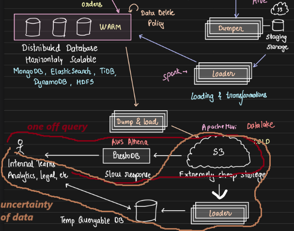

# Building a Multi-Tiered Storage System for Analytics

In this note, we will explore the process of building a multi-tiered storage system for an e-commerce platform or any product that scales with time, the use cases around it, and how change data capture (CDC) and multi-storage solutions play crucial roles in data management and analytics.

## Initial Setup and Challenges

- **Multi-User Blogging App Example:** Consider a multi-user blogging application where data is initially stored in a NoSQL transactional database like MongoDB. In the early stages of the product, the product team manually queries MongoDB to generate insights and graphs, which guide business decisions.

- **Scaling Issue:** As the product and company grow, a dedicated insights team is formed. The insights team is proficient in SQL but not NoSQL. MongoDB, like other NoSQL databases, is not optimized for analytics and SQL querying, making it impractical for the team to work directly with MongoDB.

- **Proposed Solution:** A common solution is to copy data from MongoDB to an SQL database. The application sends data to the MongoDB transactional DB and also pushes events to Kafka. From Kafka, data can be written to a SQL database for the insights team to generate reports and analytics.

    

    - **Problems with Direct Event Propagation:** For every event in the application (e.g., updating a photo, deleting a photo, etc.), there must be a corresponding Kafka event. A potential risk arises when data is successfully written to MongoDB but fails to write to Kafka. This introduces inconsistency between the NoSQL and SQL databases.

## Solution with CDC and ELT

- **Introduction to CDC:** To mitigate the issue of missing events in Kafka, an **ETL (Extract, Transform, Load)** process can be introduced. ETL involves extracting data from MongoDB, transforming it to a SQL-compatible format, and loading it into a SQL database. One of the best approaches to ETL is **Change Data Capture (CDC).**

- CDC pulls updates periodically from the source database (MongoDB), applies necessary transformations, and writes them to the destination database (SQL). This periodic pull mechanism ensures no data is lost. Two popular CDC tools are **Airbyte and Debezium.**

    

## Multi-Tiered Storage Architecture

CDC plays a significant role in building multi-tiered storage systems. CDC allows us to extract changes from a source database, transform them, and load them into another storage system.

- **Hot vs. Cold Data:** In large-scale applications like e-commerce, orders are accessed frequently when they are recent but less frequently after several months. It doesn't make sense to store older, less accessed data in expensive transactional databases (e.g., MySQL). Instead, it should be moved to cheaper storage like S3.

    This approach optimizes cost and performance, ensuring that frequently accessed order data is stored in a fast, accessible storage, while older, less-accessed data is moved to more cost-effective, slow, scalable cold storage solutions.

    

- **Multi-Tier Architecture:**

    - **Hot Storage:** A high-cost, fast-access database like MySQL or DynamoDB.

    - **Warm Storage:** A cheaper, horizontally scalable, read-heavy storage like S3 with query capability using tools like PrestoDB or Hive.
    
    - **Cold Storage:** A highly cost-efficient storage solution (e.g., S3) where very old and infrequently accessed data can be stored as simple files.

    

---------------------------
> Disclaimer: 

>- Configure CDC tools like Airbyte with a MySQL server to capture data changes and write them to a JSON file. 
>- This practical exercise helps to understand how CDC works, what data is captured, and what actions we can perform with it.
    
---------------------------

## Retrieving Order Details with Consistency Across Hot and Cold Storage

When a user queries, "Given an order, provide the order details," the **Order Service**, which operates as a transactional database (e.g., MySQL, PostgreSQL), is responsible for fetching all relevant information associated with the order. This typically includes product details, payment information, and logistics data.

In the native implementation:

1. Order Service queries the hot database for product details.
2. It then communicates with the Payment Service to fetch payment information.
3. Finally, it reaches out to the Logistics Service to retrieve the logistics details.
4. All these details are merged, and a consolidated response is returned to the user.

As the system evolves, older order data might be migrated to cold storage for cost-efficiency. However, one challenge is ensuring **consistent responses** whether the data is retrieved from hot storage (for recent orders) or cold storage (for older orders). The response provided to the user must remain the same, regardless of the storage tier from which the information is pulled. 

## Data Movement Between Tiers

When moving data from hot storage (e.g., a transactional database) to warm storage (e.g., S3), a critical question arises: **What exactly should we store in S3?** To minimize the cost of S3 calls, the goal is to reduce the number of queries while maintaining data completeness. A potential solution is to store **JSON objects** for each order, containing all relevant information, such as payment and logistics details, in a single, merged object.

However, to create these merged objects, we need to gather and consolidate data from multiple services (e.g., hot storage, payment, logistics, etc.). This process involves an **intermediate staging area** where data from different sources is aggregated before being stored in warm storage. The structure of this intermediate storage could be organized as follows:

- A folder for each service (e.g., payment, logistics).
- Within each folder, subfolders for the year, month, day, and hour.

The intermediate storage can also be S3, but once the data is aggregated, it is written to cold storage, which needs to be - Cheaper than hot storage, Horizontally scalable and Optimized for read-heavy operations.

Typically, loading the data to intermediate storage is achieved by using **ParquetSQL**.

### The Process of Merging and Writing to Warm Storage

To merge the data:

1. We create **ParquetSQL pipelines** that pull data from hot storage (orders), payment services, and logistics services into the intermediate staging area.

2. Once all data is collected, the merging process begins. For each order, the system checks for references to payment and logistics data, then links them to create a complete order record.

3. This merging is performed using distributed computing. For example, ParquetSQL pipelines operate on subsets of the data, merging the tables to create a final joined record.

4. Even if payment or logistics services use NoSQL databases, the intermediate storage is always written in SQL format, typically using HIVE to flatten the JSON objects and store them as SQL tables. Flattened JSON may contain null values or discrepancies, which are handled during the merging process.

5. Finally, **ParquetSQL** leverages **Hive catalogs/metadata** to fire SQL queries across the intermediate data, performing distributed computations across the cluster to generate a final result— a consolidated object for each order. This object is then written to warm storage.

### Alternative Approach: Storing Data in Warm and Hot Storage Simultaneously

Instead of using the above approach, we can also consider directly storing order data in both hot and warm storage. Whenever a new order is placed, the order service can:

1. Collect all details (e.g., product, payment, logistics) and store the full object in both warm and hot storage.

2. However, this introduces an issue: data like logistics status changes frequently and requires updates in both storage tiers, which increases costs.

3. Therefore, we can optimize this process by updating data in warm storage **only after the data has stabilized** (i.e., no more frequent changes are expected). This reduces synchronization overhead and cuts down on costs.

## Strategies for Hot vs. Warm Data Access

- **Time-Based Data Transfer to Warm Storage**

    To determine whether data should be in hot storage or warm storage, a common approach is to set a time threshold, after which data is moved from hot storage (e.g., MySQL) to warm storage (e.g., Parquet or HIVE). For instance, we can configure that after 6 months, all orders will be transferred to warm storage.

    To track this, we maintain metadata for all orders. This metadata helps in deciding whether to query hot or warm storage. If the order was made within 6 months, it resides in hot storage; otherwise, it’s moved to warm storage. However, sometimes issues in the pipeline might delay data transfer, and orders older than 6 months could still reside in hot storage and all GET queries for such orders will fail as it can't find the data in warm storage. Additionally, querying metadata for every request introduces **extra time overhead** for each query.

- **Alternate Approach: Query Hot Storage First, then Warm**

    An alternate solution is to always query hot storage first. If the data is present, return it. If not, check warm storage. This approach introduces a trade-off in time, as fetching older orders from warm storage may take slightly longer. However, given that older orders are rarely accessed, it’s acceptable for the occasional request to take longer.

    This method avoids maintaining metadata, eliminating an extra query step, and avoids a single point of failure (the metadata system). Although querying warm storage takes more time, it’s infrequent, and we prevent unnecessary complexity.

- **Timestamp as Part of Order ID:**
    
    Given that the system we build it is 100% sure that the orders will be present in warm storage after 6 months, another solution involves embedding the timestamp into the order ID. By extracting the timestamp, the system can quickly determine whether the order is more than 6 months old. So we don't have to maintain any metadata. However, this approach tightly couples the ID generation logic with the storage system and may not be ideal if edge cases arise or if a more flexible approach is needed. Given the second approach (querying hot storage first) is simpler and avoids complications, it remains preferable.

## Moving Data to Cold Storage: Queries and Optimization

When the data in warm storage (after 6 months) is no longer frequently accessed, we can move it to cold storage (e.g., S3 data lakes). This is done using a **dump and load strategy**—data is dumped from warm storage and loaded into another, cheaper S3 storage. One popular format for cold storage is Apache Hudi.

### Querying Cold Storage

There are two types of queries that can arise with cold storage data:

1. **Ad-hoc Queries:** For example, a customer might request an invoice from 6 years ago. These queries are supported using **PrestoDB**, which allows SQL queries on S3-stored data (e.g., CSV or Parquet). PrestoDB maintains indexes on this data, improving query efficiency.

    However, this setup can be costly because we need to pay for PrestoDB and incur expenses for frequent S3 accesses. Additionally, indexes may not always be pre-generated and may need to be created on-demand, further increasing costs. 

    - For rare, one-off queries, this cost is acceptable.

2. **Investigative Queries:** The second type of query might occur in scenarios like a police investigation, where we know the data range (e.g., from November 1st to November 8th) but are uncertain about the specific data required. In such cases, firing multiple queries to narrow down the needed information can quickly become expensive due to the high query costs.

    To optimize, instead of running numerous queries directly on S3, we download the entire data range (from November 1st to November 8th) and load it into a **temporary queryable database**. This allows the team to run as many queries as necessary without incurring significant costs.

    For one-off queries, we avoid downloading the full dataset, but in cases where investigation or uncertainty exists, downloading and loading the data into a temporary database is more cost-efficient and practical.

##  Building a Cost-Efficient E-Commerce Order System

- **Order Data Management:** In an e-commerce system, each order consists of multiple components (order details, payment, logistics). As data ages, it transitions from hot storage (MySQL/DynamoDB) to warm storage (S3). Warm storage contains pre-merged JSON objects with all relevant details (order, payment, logistics) for each order. Queries for warm data are less frequent but should still return the same consistent results as hot storage.

- **Benefits of Tiered Storage:**

    - Cost Efficiency: Older data is stored in cheaper storage solutions, reducing operational costs.
    
    - Scalability: Horizontal scalability in warm and cold storage ensures the system can handle large amounts of data as the business grows.
    - Consistency: The system provides consistent query results regardless of whether data is retrieved from hot, warm, or cold storage.

## Conclusion

Building a multi-tiered storage system is crucial for applications that generate and store large amounts of data over time. CDC tools like Airbyte and Debezium help ensure consistent data replication between NoSQL and SQL databases. By leveraging distributed computing tools and structured data pipelines, companies can maintain efficient, cost-effective storage solutions while providing consistent data access to users.