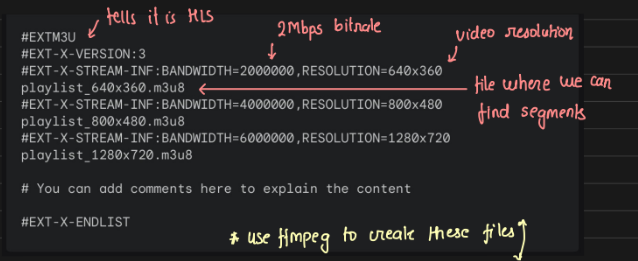
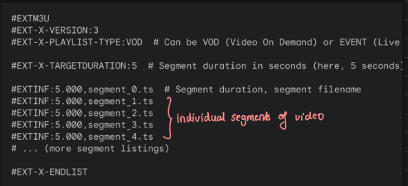
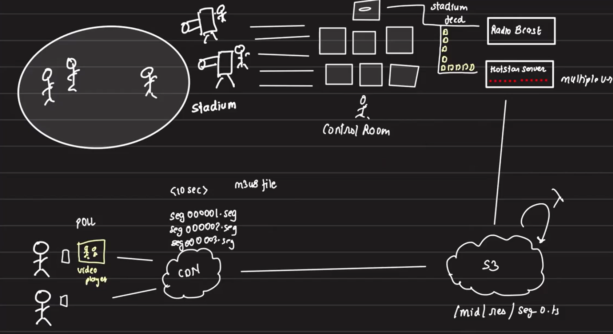
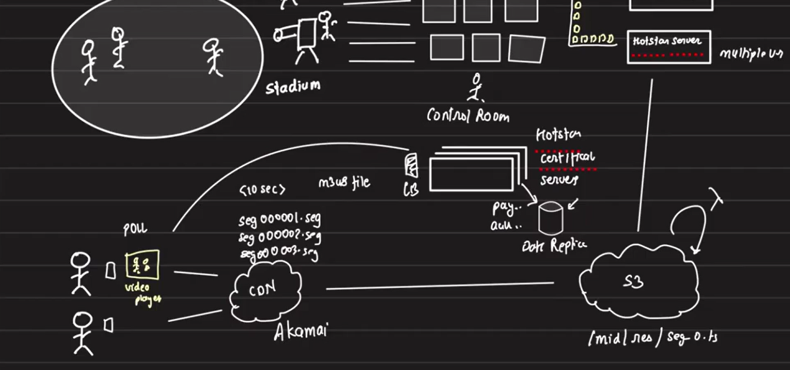
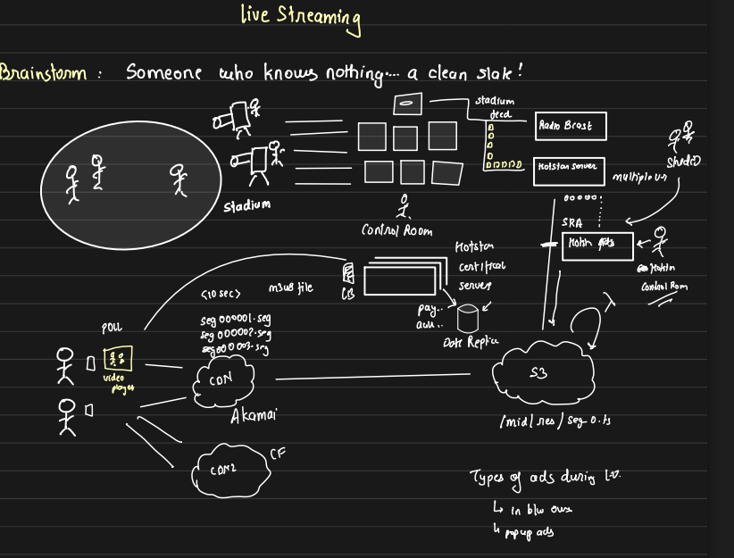

# Live Streaming Overview

## Example: Cricket Streaming

To understand live streaming, we will use the example of cricket streaming. Contrary to common belief, there is a significant delay of around 10-15 seconds between what happens in the stadium and what we see on TV or the internet. This delay occurs due to the process of capturing, processing, and transmitting video feeds.

## Live Streaming Pipeline: From the Field to the Screen

### Insights on Capturing and Transmitting Stadium Feeds to OTT Servers
- Multiple cameras capture the match in the stadium.

- In the control room, a director views feeds from all cameras and selects the best angles, switching as necessary (e.g., switching to a camera showing the right side after the batsman hits the ball there). The chosen footage forms the **final stadium feed**.
- The stadium feed is sent to various broadcasters: TV channels, radio stations, OTT platforms (like Hotstar).
- OTT platforms receive the stadium feed and distribute it to users. We will discuss how the distribution happens in OTT platforms.
    
- In live streaming, the stadium feed does not contain the entire match or large time frames since it is transmitted in near real-time. Typically, the stadium feed is recorded in short segments, such as 10-second chunks, and sent to the OTT platform's servers. This ensures that viewers receive near real-time data, with each server on the OTT side handling the live feed for one game.

- Now, we may wonder whether the stadium feed includes advertisements. The technical answer is no, as the addition and transfer of ads would increase the overall delay. However, ads are crucial for revenue generation. The real reason is that it’s not the stadium feed that stadum does not determines which ads to show and when; this responsibility lies with the broadcasting channel or platform. The stadium feed only contains what is happening live in the stadium, including commentary and events on the ground, with no advertisements.

### From Stadium Feed to User Device: Hotstar’s Streaming Workflow
        
Let’s discuss the happy path: no ads, and Hotstar directly streams the stadium feed to users' devices, such as mobile phones or laptops. How does this process work?

First, users need to log into the Hotstar app. Assuming the match is open for everyone to watch, users must choose what they want to view from a range of available options, including multiple live matches and films. Once the user selects the match to watch, the 10-second feed chunk must reach their device from Hotstar's servers.

Users can view the stream on any device that has a video player capable of playing the feed. The video player, however, needs to fetch the feed chunks from somewhere. Hotstar’s infrastructure may be located in the Singapore region, while the viewers could be based in India. It is impractical to expect the video chunks to be transferred directly from Singapore to India for every request, as this would introduce significant delays, making the viewing experience poor.

To optimize the user experience, the next video chunk needs to be fetched from the closest possible location. This is where a **Content Delivery Network (CDN)** plays a vital role. Without a CDN, Hotstar would require massive infrastructure to support chunk delivery, which is inefficient. By offloading this responsibility to a CDN, Hotstar ensures that the video chunks are delivered quickly and efficiently.

Thus, the video player will receive a **CDN URL** to fetch the video chunks. The CDN helps deliver content from the nearest server location, reducing latency and enhancing the overall viewing experience.

### From CDN to Device: How Video Players Receive Segments

When a user watches a video or live stream, it may seem like the data is continuously sent to their device, but in reality, the **video player pulls data from the CDN** rather than the CDN pushing it to the player. This approach ensures that the video player can control what it has received and what still needs to be fetched. Let’s break down how it works:

- **Pull vs. Push Approach:**

    While it might seem more efficient for the CDN to push data once a connection is established, this could lead to issues such as the player losing connection or missing chunks of data. If the CDN pushed content without awareness of what the video player received, it could result in inconsistencies. For simplicity, **the video player pulls each chunk from the CDN**, ensuring it controls what it receives.

- **Buffering and API Calls:**

    As we watch a video, we see parts of it buffered in advance. The video player makes API calls to the CDN to request the next chunk of the video. If the network is slow or a chunk is unavailable, we experience buffering. This is the standard approach to video streaming. The CDN delivers video in small segments (or chunks) that are requested one by one by the player.

- **How Does the CDN Know the Next Chunk?:**

    The video player pulls chunks sequentially, but how does it know what to request next? Chunks are named in an ordered fashion, such as seg000001.ts, seg000002.ts, etc. But to inform the video player which chunks to fetch and their sequence, a manifest file (like `.m3u8` in HLS) is provided.
        
- **Metadata and Resolution Support in m3u8 File:**

    When a video player initiates streaming, the first thing it does is make a call to the provided stream URL. This call retrieves an m3u8 file, which contains important metadata, including details about the available resolutions and corresponding bitrates. For instance, the m3u8 file might list supported resolutions such as 640x360, 800x480, and 1280x720, each having its own specific `m3u8 playlist file`.

    These playlist files indicate the various quality levels the video player can switch between based on the user’s network conditions and selected resolution. The video player uses this information to dynamically adjust the stream resolution, ensuring the best possible experience for the viewer. For example, if a user selects 1280x720, the video player will load the m3u8 playlist file that corresponds to that resolution, making it easy to switch between different qualities seamlessly.

    
        
- **m3u8 File Contents and Segment Information**

    Once the appropriate m3u8 playlist file is loaded, the video player continues to make HTTP requests to download and buffer individual video segments sequentially. The playlist file provides information about each segment, typically in 5-second chunks, and includes the name and location of each segment file. These segments are numbered in order, for example, `seg000001.ts`, `seg000002.ts`, and so on.

    

    **In live streaming, the `m3u8` file is continuously updated to include new segments as they are generated.** For example, Hotstar's server would update the playlist file every 5 seconds, ensuring the latest video chunks are available for the CDN to serve. The video player, in turn, regularly polls the `m3u8` file to get the latest segment names, enabling it to continue buffering and playing the stream smoothly. This continuous update allows live streaming to happen with only a small delay.

    When users seek a specific point in the video, such as the 23rd second, the player uses the metadata in the playlist to locate the corresponding segment (e.g., `seg000005.ts` for 20-25 sec, assuming each chunk from CDN is 5sec long). The video player downloads that segment and starts playback, minimizing any interruptions. If the resolution is changed during playback, the player will download the new `m3u8` file for the selected resolution and resume streaming from the appropriate segment.

    This segment-based streaming process is the standard across all video players, and even piracy tools exploit it by downloading each segment separately, assembling the entire video for offline use.

    This segment-based approach is also how piracy software operates; once the software has access to the segment information, it can download and save each segment to assemble the entire video.

- **Using FFmpeg for Video Streaming:**

    Tools like FFmpeg are used to process video for streaming. FFmpeg can split video into segments and generate the .m3u8 playlist, preparing everything needed for smooth HTTP-based streaming to the CDN.
        
### Delivering Chunks to CDN and Handling Multiple Resolutions:

Now, the question arises: how are the video chunks delivered to the CDN? The simple answer is that the CDN requires an origin server, and in this case, we can use Amazon S3 as the origin. The Hotstar server uploads the video chunks to S3, and the CDN pulls the data from there.

As high-resolution stadium feeds are being received, viewers can watch the stream at different resolutions such as 360p, 720p, 1080p, or higher, depending on their network bandwidth and device capabilities. So, where does the transformation to different resolutions happen?

Given that Hotstar servers receive a 10-second video chunk per match, processing the video for multiple resolutions is not a scalability issue. However, if it takes longer than 10 seconds to create multiple versions of a 10-second video, Hotstar would struggle to maintain real-time streaming, causing the stream to fall further behind live events. Therefore, the processing must be extremely fast, typically taking less than a second to generate all required resolutions.

This transformation can be performed on the Hotstar server, which processes the video chunks and pushes them to S3. A common directory convention could be used, such as `/match_id/resolution/segment_0.ts` to organize different resolution segments for easy access.
        
### **Plan B: Handling Failures in Live Streaming**

What if the Hotstar server, which is responsible for receiving and processing the chunks, goes down? A backup plan is essential for such cases. Instead of relying solely on the Hotstar server for processing, we can relay the incoming chunks directly to S3. A Lambda function can be configured to trigger automatically whenever a new chunk is added to a particular path in S3. The Lambda function would then handle the processing, create multiple resolutions, and push the transformed video chunks back to S3 in the earlier location. 

Once the chunks are in S3, the CDN can be configured in either push or pull mode. In a pull-based approach, the CDN polls S3 to fetch new video segments, ensuring smooth streaming to users' devices. However, a push-based approach is also commonly used in production for live streaming. In this case, after the Hotstar server or Lambda pushes the video chunks to the CDN, the CDN then distributes the content to all of its edge servers, ensuring efficient and reliable content delivery to viewers.

## Subscription-Only Access to Live Matches

If Hotstar wants to restrict live match streaming to subscribed users and block public access, there needs to be a mechanism that ensures only the video players of subscribed users can pull data from the CDN URL. However, CDN servers do not handle authentication by themselves, so a separate authentication server is required.

This authentication server will issue a short-lived token or certificate, which the subscribed user's video player must send with each request to the CDN. The CDN server then verifies this token and, upon successful validation, serves the video chunk to the user. Without this token, the CDN will deny access to the requested segment. This concept is similar to how private Instagram photos work, where public key cryptography is used for secure communication.

For example, Hotstar could employ a certification server that provides very short-lived certificates (similar to JWT tokens) upon successful authentication of a user. Each time that user requests a video segment from the CDN, the video player must send this certificate along with the request. The CDN server validates the certificate before serving the segment. As the certificates are short-lived, they can’t be reused, thus adding another layer of security.

To ensure continued access, the Hotstar app must constantly poll the certification server to fetch fresh certificates at regular intervals and include them in subsequent CDN requests.

### Ensuring High Availability of the Certification Server

The certification server is a critical component of this architecture, as if it goes down, no users can access the match. Therefore, high availability is crucial.

- The certification server is a typical API server, stateless by nature, and its primary task is to authenticate users by checking the payments or subscription status of the user.

- Scaling this server is relatively straightforward since it’s stateless. It can communicate directly with a database that stores subscription information.

- Given that this is a read-heavy system, where the server frequently reads from the database, we can implement read replicas for database scaling. This ensures that multiple instances can read data without overwhelming a single database instance.

- Additionally, introducing a caching layer between the certification server and the database can reduce the load on the database, further improving performance and scalability.

## Ad Placement in Live Streaming: A Key Revenue Generator

Advertising is a critical component for revenue generation during live-streamed matches. There are several types of ads that viewers encounter while watching a live event:

1. **Video Ads:** Typically short, like 15-second video ads that appear at strategic breaks, such as between overs.

2. **Pop-up Ads:** These ads momentarily appear during the stream and then disappear without interrupting the match.

3. **Server-Rendered Ads:** These ads are directly embedded into the video feed by the server before delivery to the CDN and user.

### Differences Between YouTube Ads and Live Streaming Ads

In YouTube, ads are marked by yellow markers on the timeline. When the video hits that marker, the ad plays, but the video pauses. Once the ad finishes, the video resumes from the same point. This approach is called **"stop-the-world" ads**, commonly used in **video-on-demand (VoD)** platforms. The video pauses while the ad plays, and it resumes afterward, ensuring no content is missed.

However, live streaming operates differently. When ads play, the match does not pause; the match continues in real-time. The ad replaces the live match feed momentarily, and when the ad concludes, the match feed resumes. The key challenge here is deciding when to show the ad without missing crucial moments of the game.

### Human-Controlled Ad Insertion

In Hotstar’s live streaming setup, a human operator in the control room decides when to show ads and when to resume the match feed. This decision-making process is unpredictable, as no one knows exactly what will happen in the match and when it’s an appropriate time for an ad. These ads might not replace match feed while storing it in S3.

### Server-Rendered Ads

When seeking back during a live stream, we may still see ads in the video. Unlike the yellow markers used in platforms like YouTube, these ads are not separate from the main feed but are part of the match feed itself. These are known as server-rendered ads.

In this process, the ad is not part of the original stadium feed; instead, it is **overlaid** on top of the stadium feed. When the stadium feed arrives at the Hotstar server, the server injects these ads before storing the final feed in S3. During this injection, the ad replaces the corresponding part of the stadium feed, creating a seamless transition between the live match content and the ad.

As a result, server-rendered ads are **permanently embedded** in the final video feed. Even when viewers seek backward or review the match later, these ads remain visible. However, since these ads are part of the final recorded video, they may eventually become outdated or irrelevant, remaining in the video until it is taken offline.

### Implementing Server-Rendered Ads in Match Feeds

To implement server-rendered ads, Hotstar uses two types of video chunks: stadium feed chunks and ad feed chunks. For example, if the ad is to run for 5 minutes, the control room operator decides where to insert the ad in the match feed. The system then removes 5 minutes of the stadium feed and replaces it with the ad feed.

A common scenario is during breaks, such as after the 1st session of a cricket match. Instead of live match footage, Hotstar may show a special analysis or commentary, which is a separate feed overlaid on the match feed. This placement is highly valuable since it becomes part of the final, permanent video feed, visible even during replays or highlights.

## Redundancy in CDNs:
- OTT services use multiple CDNs to distribute traffic.
- If one CDN goes down, the traffic is routed to another, ensuring uninterrupted service.

In summary, live streaming involves multiple components—capturing stadium feeds, processing chunks, storing them in CDNs, and handling user authentication—while also dealing with complexities like adding ads and scaling for millions of viewers.