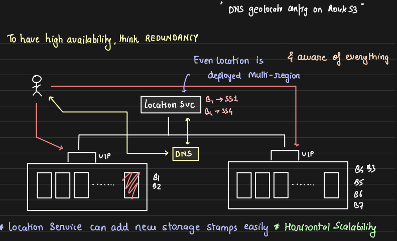
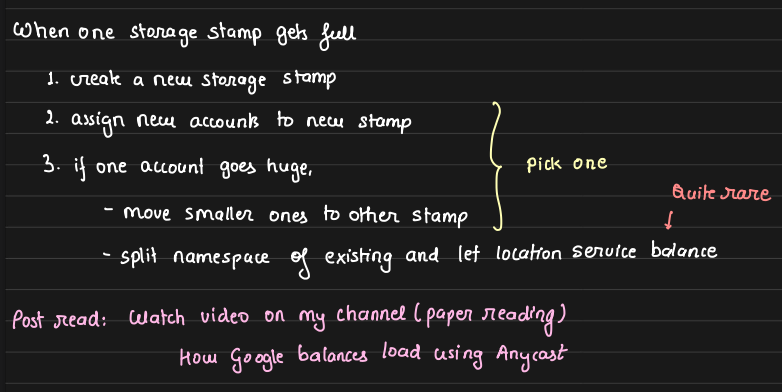
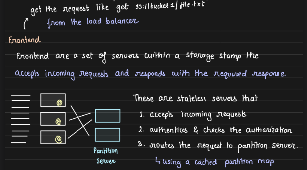
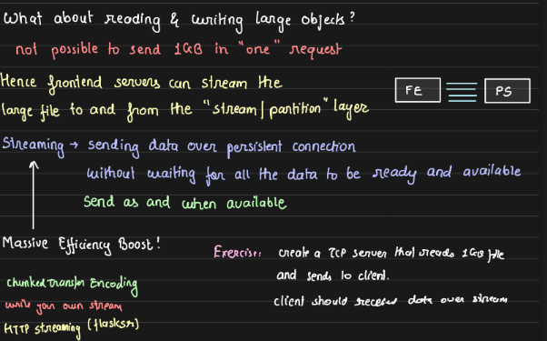
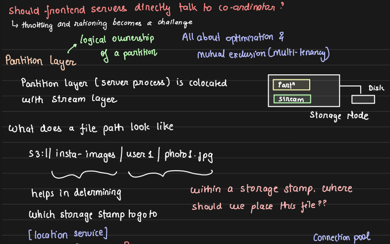
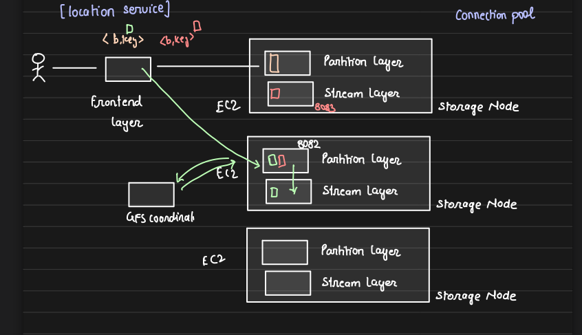
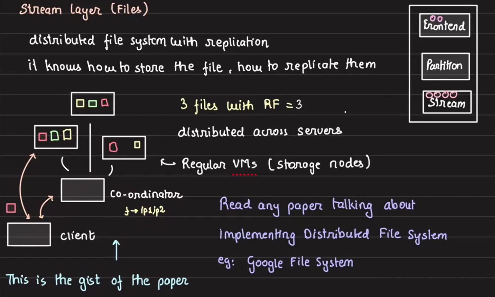
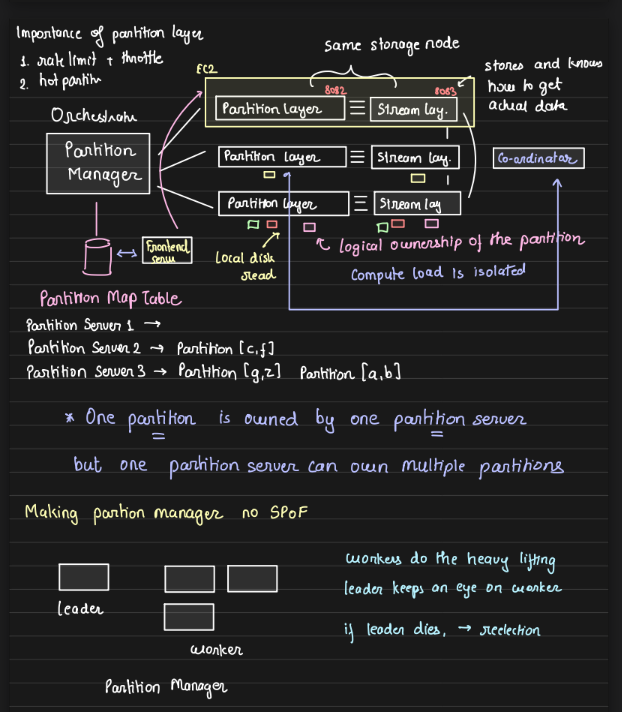
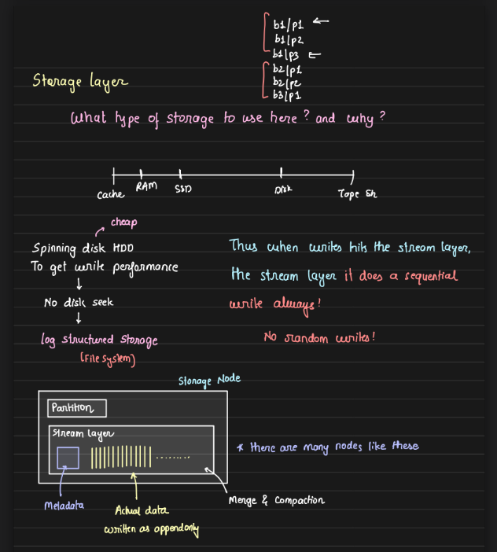

# Designing Amazon S3

## Key Design Concept

- **Logical and Virtual Directories:**

    One of the most important design decisions in Amazon S3 is that directories are entirely logical and virtual. For instance, if we create a folder called `abc` in S3 and store a file like `123.jpg` in it, there is no actual folder named `abc` on the disk. The folder structure is simply a logical representation.

    In S3, the entire path, such as `bucket/directory`, is considered the key. Directories do not hold any physical significance. Essentially, S3 is just **a key-value store**, where the "key" is the entire path to the file, and the "value" is the file itself.

    This design choice is highly efficient. There is no need for an actual directory on the disk where the file must be physically present. The file can be stored anywhere, which greatly simplifies the design, improves scalability, and allows files to be placed in any location across the globe. This makes S3 a highly flexible and powerful storage solution.

## Design Goals

1. **Strong Consistency:** When writing data, any subsequent read should reflect the latest written data. For instance, if a key `f` holds the value `'ball'` and is updated to `'ball1'`, the next read must return `'ball1'` immediately without any delay.

2. **Global Namespace:** S3 bucket names should be globally unique, not limited to specific regions. This means that when a bucket is created, its name is unique across all regions, not just in one. This ensures that businesses can scale without facing conflicts.

    For example, if a company in India is named "CompanyNew" and creates an S3 bucket with that name, it can expand to the US or other regions without worrying that another company has already taken that bucket name. By enforcing global uniqueness, S3 avoids naming conflicts, making it easier for businesses to grow and expand seamlessly across regions.

3. **Disaster Recovery:** S3 provides protection against natural disasters (like floods or earthquakes) by ensuring redundancy in both storage and compute infrastructure.

4. **Multi-Tenancy:** In a multi-tenant architecture, multiple customers share the same infrastructure, which helps reduce infra costs. However, it's crucial to ensure that the load from one customer does not impact others.

    For instance, if both Amazon Prime and Netflix are operating in the same data center, a high load on one service should not affect the performance of the other. Effective multi-tenancy ensures that each customer experiences consistent performance, regardless of the load placed by others sharing the same infrastructure. This isolation is key to maintaining service reliability and customer satisfaction while optimizing infrastructure usage.

## S3 Architecture Overview

S3’s architecture is built around **storage stamps,** which are collections of racks designed to store data redundantly. Each storage stamp typically contains:

- 10–20 racks
- 18–20 servers per rack
- Capacity: 30–50 PB per storage stamp, but it’s typically only utilized up to about 70% of its capacity. This allows for fault tolerance, so that if one rack fails, the other racks can handle the load and continue to serve data requests seamlessly.

- Redundant power supply and network connectivity ensure high availability and durability.

**Rack Failure Handling:** In the event of a rack failure, the remaining racks in the storage stamp take over the workload, ensuring that data remains accessible. This redundancy is key to the high availability and reliability of S3.

S3 utilizes **VIP (Virtual IP)** addresses for each storage stamp, allowing requests to be routed to the appropriate storage stamp without needing to configure DNS changes when replacing racks.

## Location Service & DNS

When multiple storage stamps are in use, Location Service plays a vital role in routing traffic to the correct storage stamp. Here's how this works:

- **Location Service:** This service acts as the single point of entry when accessing S3. This is responsible for mapping buckets to the storage stamps they reside in. It updates DNS entries when new buckets are created or moved. Basically DNS service updates storage stamp IP corresponding to each bucket in DNS. 

- **HTTP API Access:** When accessing S3, we interact with it via HTTP APIs. For example, the S3 URL format is: `https://<bucket-name>.s3.<region>.amazonaws.com/<object-key>`. When a bucket is created, the location service updates **Route53** (AWS's DNS service) with the correct information, so the DNS knows where to direct requests. The DNS resolution process returns the IP address of the storage stamp associated with that bucket. But what is the IP Address of a storage stamp? Here comes VIP.

- **Virtual IP (VIP):** Even though a storage stamp consists of multiple racks, there is a single IP address (VIP) that represents the entire storage stamp. Multiple machines within the stamp share this VIP. After DNS resolution, the request is directed to the VIP of the storage stamp.

- **Handling Rack Replacement:** If a rack is replaced, the virtual IP (VIP) remains the same. This means the DNS does not need to be updated, ensuring seamless continuity without requiring reconfiguration, which is a major advantage of using a VIP.

In the latter section, we will explore what happens after a request reaches the VIP.

## Handling Storage Stamp Capacity

Before diving into what happens after a request reaches the VIP, let's first discuss what happens if a storage stamp becomes full. When a storage stamp reaches its capacity, a new storage stamp must be created. Here's how the process works:

1. **Creating a New Storage Stamp:** To create a new storage stamp, a set of unused racks is selected. These racks are "wrapped" together to form a logical storage stamp. The data center operations team handles the physical setup, which includes connecting power supplies, establishing redundant Ethernet connections, and configuring the racks for operation. Once this is done, the new storage stamp is registered with the **Location Service** and assigned a **Virtual IP (VIP)**.

2. **Assigning New Buckets:** After the new storage stamp is ready, any new buckets created in S3 are automatically assigned to it. This ensures that the old storage stamp, which is nearing full capacity, can still function without interruption.

3. **Balancing Load Between Stamps:** If one account in the old storage stamp becomes particularly large, smaller buckets from that stamp may be migrated to the new storage stamp. This creates more room for the larger account to continue growing. Each bucket has a maximum capacity, and when an account approaches this limit, AWS contacts the customer to recommend creating a new bucket. The customer can then route future requests to the new bucket at the application level.

## Inside the S3 Storage Stamp: Layers and Processes

Within each S3 storage stamp, multiple racks are present, each containing multiple servers. The storage stamp itself is divided into three layers: **Stream**, **Partition**, and **Front End**. These layers are not necessarily hosted on separate servers. Multiple layers may run on the same server using different ports. For example, a single server might run the partition process on port 8081 and the stream process on port 8082, making the server capable of handling both tasks. However, the front end layer typically runs on a dedicated set of servers.

### Front End Layer:

The front end layer is the first point of entry when interacting with the storage stamp, though it's not a user interface. This layer is a group of servers dedicated to handling specific tasks.

When a request is made to the storage stamp's virtual IP (VIP), the VIP randomly forwards the request to one of the frontend servers. The frontend servers handle **authentication and authorization**. After verifying the request, they forward it to the **partition server**.

- The partition server communicates with the stream layer, which locates where the requested data is stored.
- The stream layer sends the data location back to the partition server.

- The partition server retrieves the data and sends it to the frontend server, which then returns the data to the client.

#### Handling Large File Transfers

When it comes to transferring large files (e.g., a 1GB file in S3), loading the entire file into memory and sending it in one HTTP response is impractical. Similarly, the client can't receive and load a file of that size into memory at once. Instead, the solution is streaming the response.

Streaming allows the file to be broken into smaller parts, such as 1MB chunks, which are then sent sequentially. HTTP supports this type of transfer using **chunked transfer encoding**, a built-in feature of the HTTP protocol.

---------------------------
> Disclaimer:

> To gain a better understanding of streaming large files, try writing two processes:

>> **1. Server Process:** Reads a large file chunk by chunk and sends each chunk as a stream.

>> **2. Client Process:** Receives the file chunks and reconstructs the file on its end.

> This exercise will also help us to understand how to read files in chunks, avoiding loading an entire large file into memory (which .read() does by default). Breaking the file into chunks for reading and transfer is crucial when dealing with large data.

> This hands-on approach helps in grasping the concepts of file streaming and efficient memory usage in real-world scenarios.
---------------------------

### Stream Layer (Core Storage Layer):
The stream layer functions as the core storage component, acting like a distributed file system with replication. This layer exposes file system-like APIs that the partition layer can use. Internally, the stream layer handles various complex tasks, but these are abstracted away from the partition layer. We can imagine the stream layer as something similar to Google File System (GFS) or other distributed file systems.

When a partition server sends a request to the stream layer (e.g., a GET request), the request goes to a coordinator within the stream layer. This coordinator determines where the file is located and may return one or multiple file locations. The partition layer can read from a single location or trigger multiple reads from different locations, selecting the data from whichever read completes first. The partition server directly communicates with the machine holding the data, which is why this architecture isn't referred to as a microservice system.

The coordinator can provide multiple locations where data is stored, ensuring protection against failures through redundancy. Depending on the configuration, the coordinator may return a single location or multiple locations. The partition layer can issue either a single read or multiple reads based on the configuration.

The stream layer coordinates data replication and ensures durability by maintaining the desired replication factor across servers.

### Partition Layer:

When the partition layer needs to store data, it contacts the stream layer’s coordinator. The coordinator selects the best locations for storage based on the system's replication factor (e.g., 3 replicas). The coordinator provides the IP addresses of three machines, and the partition layer forwards these IPs to the client. The client then writes the data directly to these machines, bypassing intermediary layers to minimize network bandwidth usage, especially for large files.

The partition layer determines the **logical ownership of a partition**. But what exactly is a partition? A partition is essentially a range of keys, and each partition is owned by a partition server. Multiple partition servers together form the partition layer.

**Partitioning** refers to grouping keys and determining which server stores which keys. This can be done through **hash-based grouping**, where a hash function determines which partition should store a given key. In S3, the key could be the `bucket_name/entire_path`. If hash-based routing is used, it’s possible for multiple objects within the same bucket to be stored on different servers.

However, this could lead to a poor design decision. Files within the same bucket are often accessed together, and storing them on different servers can increase retrieval time. Instead of hash-based routing, range-based hashing can be used. By keeping the keys lexicographically sorted, it is more likely that all objects from the same bucket are stored on the same server. This ensures better performance as the objects are stored together after sorting by key. 

#### Request Flow

As we discussed earlier, both the **partition layer** and the **stream layer** can be present inside the same node. The flow of a request looks something like this:

1. The request comes from the user to the frontend server after DNS resolution and via the VIP.

2. The frontend server, with the help of a partition manager, determines which partition the key belongs to and which VM the partition resides on.
3. The request is then forwarded to that VM.
4. The VM communicates with the stream layer coordinator to fetch the location of the key's value.
5. It’s likely that the key and value are stored on the same storage node, enabling the VM to read the data locally and send the response.
6. If the key-value pair is stored on a different VM, the partition layer can issue a command to read from the other storage node and return the value.

The **partition manager** and the **file system coordinator** work together to ensure that the partition layer and stream layer are **co-located** on the same node, ensuring faster retrieval. Although cross-server communication might occur when necessary, the system minimizes such instances to reduce latency.

#### Why Do We Need the Partition Layer?

Why doesn’t the frontend directly communicate with the file system coordinator? The reason lies in the need for **logical abstraction** to support **multi-tenancy**. The frontend server performs **authentication** and **authorization**, which is lightweight work. However, if it also had to fetch data from the file system, a heavy load on one bucket could slow down requests for other buckets being handled **by that same frontend server**.

The partition layer helps avoid this issue. The partition layer can implement **rate limiting** and other measures locally to provide multi-tenancy. Managing this directly in the partition manager would be much more difficult, as requests could come from any frontend server and all eventually lead to the same stream layer.

The partition layer solves the problem by isolating load across different servers. Each server handles specific partitions (ranges of keys) and applies local rate limiting to manage traffic independently. This ensures that high load on one partition or bucket doesn’t affect others. By co-locating data with the partition, it minimizes cross-server communication and improves efficiency. Additionally, since load management is decentralized, the system avoids single points of failure, ensuring better resilience and scalability.

To manage this centrally would require a **global rate limiter**, which introduces additional complexity, including the challenge of maintaining availability. The failure of a global rate limiter could affect the entire storage stamp. By handling these processes locally within the partition layer, failures in one partition do not impact others, and load isolation is achieved, ensuring better performance and scalability.

### Handling Server Failures:

If a server goes down, the stream layer’s coordinator detects the failure. The coordinator knows which files the failed server stored and recognizes that the replication factor for those files has dropped. To restore the desired replication factor, the coordinator issues commands to other servers to replicate the affected files. This process ensures that no data is lost due to server failures.

The stream layer also manages server selection from different racks to maintain redundancy and avoid data loss in case of a full rack failure. This is why servers are never utilized at full capacity—there’s always extra space reserved for replication during failure scenarios.

## Handling Requests in the Frontend Layer

1. **Direct Data Access by Frontend:**

    When a request comes to the frontend, it doesn’t need to communicate with the partition manager to get the partition for the key. Instead, the frontend directly queries the database to retrieve the partition responsible for the key. This eliminates unnecessary network calls between the frontend and partition manager, avoiding performance bottlenecks. If all data retrieval requests had to be routed through the partition manager, it would require scaling the partition manager alongside the frontend. Direct database access by the frontend solves this issue efficiently.

2. **Forwarding to Partition Server:**
    
    Once the frontend knows which partition server is responsible for the key, it forwards the request to that partition server.

3. **Partition Layer and Data Streaming:**
    
    Partition server asks parition layer to retrive the location. The partition layer communicates with the file system coordinator, retrieves the data's location, fetches the value, and streams it back to the frontend. The frontend then streams the data to the user. As discussed earlier, in most cases, data is stored in the local database of the partition server responsible for it. However, there are instances where the data might reside in the storage of another server.

    
4. **Handling Partition Layer Failure:**
    
    If the partition layer goes down, the file system coordinator identifies the issue, maintains the replication factor by copying the affected files to other servers, and the partition manager designates new owners for the files that were managed by the failed partition servers.

5. **Partition Manager Failure and Leader Election:**

    In case the partition manager dies, a leader-worker strategy is in place. A leader is elected to ensure continuity and proper management of partition servers.

## Storage Choice for S3

When selecting storage for S3, SSDs are not used due to their high cost. Since S3 is a **write-heavy system**—primarily used for cold storage like audit logs where data is written frequently but rarely read—SSD would not be a cost-effective choice. Instead, S3 uses a **log-structured file system**. This file system stores data sequentially in contiguous locations, minimizing disk seeks and making it ideal for handling random writes efficiently. Given S3's heavy write operations, this approach optimizes performance while keeping costs lower.

## Data Durability

Data durability refers to preserving data by maintaining multiple copies to prevent data loss. Within a single storage stamp, durability is handled by the file system coordinator and the replication factor, ensuring redundancy across servers. However, ensuring durability across storage stamps requires additional measures.

One approach is to write data to two storage stamps simultaneously, but this can be resource-intensive. A more efficient solution is a**synchronous replication** between storage stamps, which is generally preferred. Additionally, configuring disks in **RAID mode** helps protect against disk-level corruption.

It's essential to consider various levels of potential corruption—disk-level, machine-level, storage-stamp-level, and data-center-level—and design durability strategies accordingly to maintain data integrity at all levels.