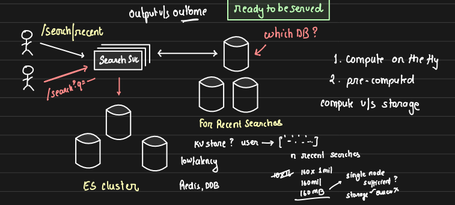
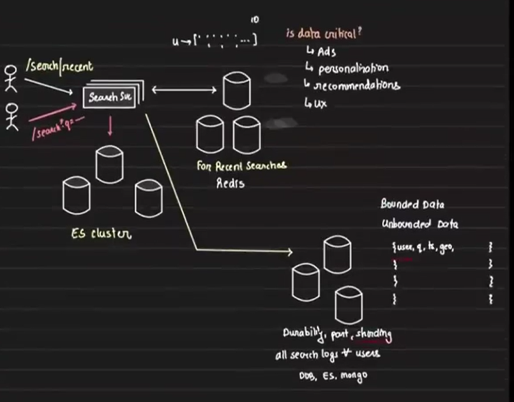
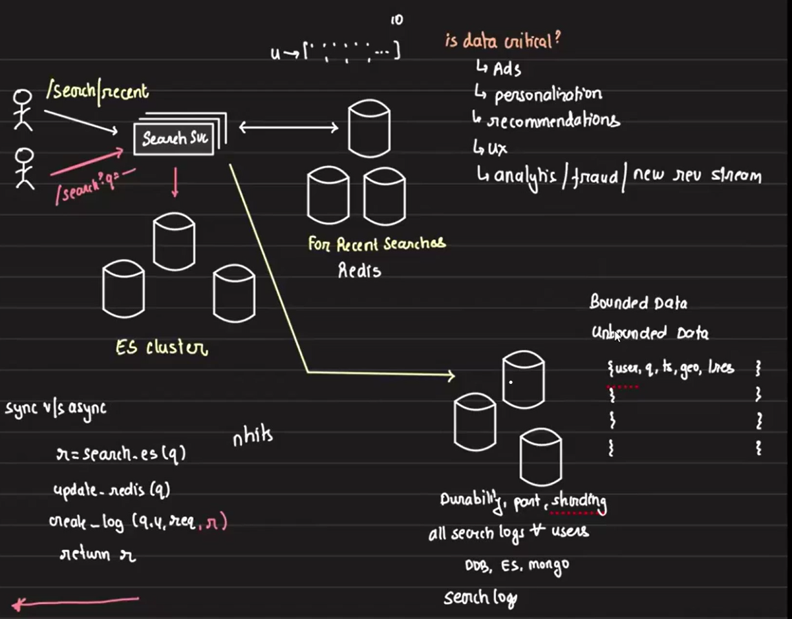
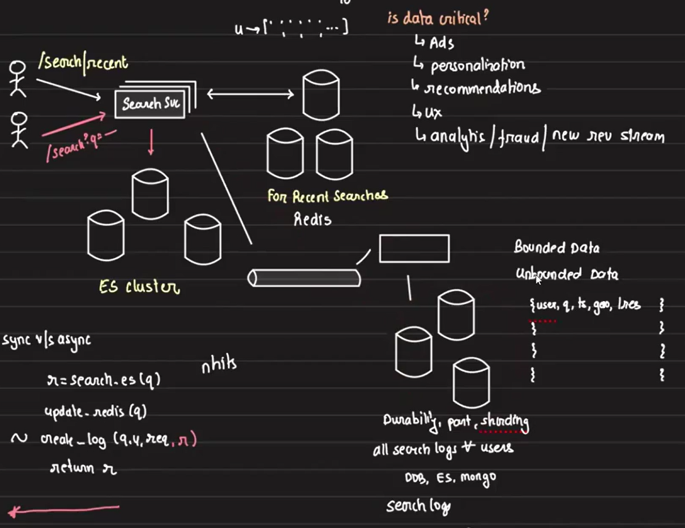

# Designing Recent Searches

## Overview:

When users interact with a search bar on an app or website, they often see a list of their recent searches, improving user experience by allowing them to easily access prior queries. In this design, we'll focus on showing the last 10 searches made by a user. To do this efficiently, we need to think about performance, scalability, and storage, and also ensure the system meets the needs of business analytics.

Arpit, while building a similar feature for Unacademy, shared some valuable insights:

1. 50% of users tap the search bar within the first 5 seconds of app login.
2. 30% of searches happen through recent searches.

With this in mind, the goal is to provide a fast and seamless user experience, while also keeping the system optimized for high traffic. Below is the thought process for designing recent searches.

## Current Search Flow

The search functionality was powered by Elasticsearch. Users had an endpoint `/search`, and upon making a request, the system passed parameters to the Search Microservice. This microservice would:

1. Construct an Elasticsearch query.
2. Fire the query to the Elasticsearch cluster.
3. Retrieve and return the response.

## Designing Recent Searches
To introduce recent searches, we will create another endpoint, `/search/recent`. When a user hits this endpoint, the search service will fetch the last 10 searches they made and return the result.

There are two options for fetching the recent searches:

### Option 1: On-the-Fly Computation
- Each time a request for recent searches comes in, we compute the last 10 searches directly from the database (Elasticsearch).

- Pros:
    - Accurate results with up-to-date searches.
    - No need for additional storage.
    - The data provided will always be up-to-date, ensuring no stale information is delivered.

- Cons:
    - Slower response times since it queries the database each time.
    - Increased CPU load as each request requires computation.
    - High request volume could lead to DB bottlenecks due to frequent queries.

### Option 2: Precomputed Data
- Recent searches are computed ahead of time and stored. When a request comes in, the precomputed data is served directly.
- Pros:
    - Faster response as no computation is needed during the request.
    - Reduces CPU load.
- Cons:
    - Requires additional storage to hold precomputed data.
    - Data may be slightly stale (but for recent searches, this is usually acceptable).

### Precomputed Data vs On-the-Fly Computation: Balancing Accuracy, Performance, and Cost

This example illustrates the classic **compute vs. storage** tradeoff. When we choose to compute data on the fly, we prioritize compute resources over storage. Since compute is generally more expensive than storage, we need to consider whether real-time accuracy is essential. 
- If we require highly accurate data at any given moment—such as in financial transactions — we would opt for **on-the-fly** computation. However, if slight staleness in the data is acceptable, choosing storage can significantly reduce infrastructure costs.

- In our case, we can tolerate a small amount of staleness since we’re not dealing with critical data. For example, the user may not even remember their exact last 10 searches, nor does the order matter much. In fact, if a user logs in after a long period, like a year, retrieving the exact data would be costly and may not add much value.

- From a **product perspective**, user behavior indicates that 50% of users tap on the search bar within five seconds of logging in, making it the **first interaction point with the app** which can't be slow. To keep this interaction fast, precomputed data is preferable as it provides quicker responses than computing on the fly.

## Storage and Access Pattern
To support precomputed data, we need a fast-access database to store and retrieve precomputed recent searches. The access pattern is simple: **Given a user ID**, return their last 10 search queries. So a key-value store works well for this use case.

### Estimating Storage:
- Each user has 10 recent searches.
- Assume each search query is 16 characters long.
- If there are 1 million users, the storage required would be:
    - 16 * 10 * 1,000,000 = 160MB

A **single node** is sufficient for storing this data, but not for handling the query load. With 1M users querying the platform, the database needs to scale to handle the load. 

We have two choices for managing data distribution: **replication** or **sharding**. 
- With **replication**, we risk data staleness because copies of data might not be perfectly synchronized. 
- On the other hand, with **sharding and partitioning** (partitioning by user ID), we can ensure data is more up-to-date and scale effectively. Since our use case prioritizes real-time access without staleness, we are opting for sharding, where each partition handles a specific subset of data, ensuring faster and more reliable access.

Therefore, we should choose a database that supports sharding and partitioning, such as Redis, DynamoDB, or MySQL.

### Choosing the Right Database

Redis is optimal for storing precomputed data because:

- It is the **fastest**, but since it stores data in memory, it can be costly. After running some calculations earlier, we determined that we only need **160MB** of memory in Redis, which is affordable. Therefore, we'll use Redis to store our precomputed data for fast retrieval.

However, Redis has one downside: 

- Since it's in-memory, it loses data on failure. The question is, **is this data mission-critical?** The answer is no—we can afford to lose precomputed data and simply recompute it if needed. So, we will use Redis as our sole storage for precomputed data without worrying about backing it up elsewhere.

- **From a business perspective**, though, there may be a need for more permanent storage. Analytics teams could benefit from this search data by
    - Understanding user behavior 
    - create personalized recommendations and ads (e.g., Instagram reels or targeted ads based on recent searches). 
    
    Therefore, we should also **store these search queries in a persistent database for long-term analytics and insights**.

    

### What to Store?
Should we store only the 10 most recent searches or all the queries made by a user? This brings up the concept of bounded and unbounded data.

1. **Bounded data:** Storing a fixed number of searches (e.g., 10 recent searches).
    - This is a bounded data problem where we know the size and can use an array or similar structure.

2. **Unbounded data:** Storing all searches made by a user.
    -  The data size can grow indefinitely. In this case, using an array or single object isn’t suitable. Instead, we flatten the data across multiple files or documents. For instance, each search query can be stored as a separate MongoDB document or row in an SQL database, preventing any single document from becoming too large.

For unbounded data, we will store each search query made by every user as a single document. This will include

- User ID
- Search query
- Timestamp
- Geo-location

To manage this flexible and semi-structured data, a JSON-based database such as **DynamoDB**, **Elasticsearch**, or **MongoDB** is appropriate, as it can easily handle the growing or shrinking number of attributes.

## Data Ingestion: Synchronous vs. Asynchronous Writes
How do we ensure our search data reaches persistent storage? We have two ways to get search data into persistent storage:

### Asynchronous Writes:

- The search service writes search data to Kafka, and a broker reads from Kafka and writes to the database in batches.

- Advantages:
    - Faster response times for users.
    - Reduced database load as writes can be batched.
    - Kafka has higher throughput than traditional databases.

Asynchronous writes are preferred for this use case since it reduces latency and minimizes the load on the database.

### Synchronous Writes:
1. The search service directly writes data to the database during each search.
2. **Challenges:**
    - Increases latency (search won’t return until data is written).
    - Adds pressure on the database due to frequent writes.

In the synchronous approach, each time a user searches, we execute one read and two write operations:

1. **Read** from the Elasticsearch (ES) cluster to retrieve the search results.
2. **Write** to update the recent searches in Redis.
3. **Write** to the persistent database to store the search query.
4. **Return** the results of the first query.

In the **happy path**, the order of these operations (1, 2, 3) doesn’t matter since the result is only returned when all operations succeed. But in case of failure, the order becomes important. This is where the **product experience** comes into play and the final decission is taken care by the product team not by the engineering team. 

### Adding Fields for Business Insights

When logging to persistent storage, we already have the query result. To enable future insights, we can store additional metadata parameters, such as `len(result)`, to gather analytics. This can help identify search queries that return no results, indicating potential gaps in our offerings.

By tracking search queries that return no or few results, we can quickly recognize what users are looking for that we currently don’t offer. For example, if a large number of users search for a specific topic or product that isn't available, it signals an opportunity to introduce new features, services, or products to meet customer demand. This insight can drive the expansion of offerings, as was the case at Unacademy, Arpit’s experience showed how capturing these insights helped the company recognize topics users were interested in but that weren’t yet covered by their platform. They then introduced new sections based on this data, driving business growth.

**Conclusion:** Storing search data is crucial not only for improving user experience but also for **analytics, fraud detection, and uncovering new revenue opportunities**. This is why thoughtful design, beyond coding, is essential to driving business impact.

## Cost Optimization in the Current Architecture

Till now our architecture look like below -- 

Are there opportunities to reduce costs while maintaining performance?

1. **Optimizing Storage for Storing Search Queries:**

    - **Compression Considerations:** While data compression could save space, it is more effective for large files. Since each search query is stored as an individual file (small size), compression will not yield significant benefits.

    - **Archiving Old Data:** We don't need to store every search query from all users indefinitely. To optimize storage, we can implement a time threshold — after which older search data can be archived and moved to a more cost-effective storage solution like Amazon S3. 
    
        This aligns with our previously discussed approach of hot, warm, and cold storage, data staging, and the use of data lakes, pipelines, and frameworks like Apache Hudi and Spark Streaming. These will help manage and streamline the flow of data while keeping storage costs low without compromising future data access or analytics.

2. **Cost Savings in Redis:**

    - **Combining Redis with Persistent Storage:** While we could theoretically eliminate Redis and store everything in persistent storage (e.g., DynamoDB, MongoDB), this would increase latency for retrieving the 10 most recent searches. Additionally, databases like DynamoDB mainly charge based on each query, which could lead to higher costs due to frequent access to recent searches.

    - **Redis as a Cost-Effective Solution:** Redis is optimized for fast access and in-memory data storage, and in our case, it only requires 160MB of RAM. Redis billing is based on infrastructure, allowing unlimited queries at no extra cost, making it more cost-efficient than frequent queries to persistent storage systems. Therefore, **Redis remains the best option** for our use case, providing both speed and cost efficiency.

## Synchronous vs Asynchronous Writes: Storing Queries in Persistence DB

We can adjust our architecture by introducing asynchronous writes through Kafka. Instead of directly writing search queries to the persistent storage, we can publish them to Kafka, and a separate broker will consume the data and write it to the persistent storage.

So, what should we prefer—synchronous or asynchronous writes?

1. **Performance:** Synchronous writes take longer compared to asynchronous. With synchronous writes, the search latency increases because the user receives a response only after the DB write completes. In contrast, Kafka operates as an append-only system with higher throughput, whereas a traditional database also handles indexing, B+ tree rebalancing, and other operations, which consume more time.

2. **Load on the Database:** Synchronous writes put more pressure on the database with micro-writes, as each user query leads to an individual write. With asynchronous writes, we can batch multiple queries at the broker and write them to the DB in bulk. If there are 1M users on the platform, synchronous writes would lead to an equivalent number of DB operations, whereas asynchronous writes significantly reduce this load.

3. **Scalability and Flexibility:** With asynchronous writes, we can introduce multiple brokers for different tasks like analytics or other processing needs. This approach allows the system to scale more efficiently.

Asynchronous writes, therefore, offer better performance, reduce DB load, and increase flexibility, making them the more sensible choice for this use case.

## Choosing the Persistent Database

When deciding between DynamoDB, Elasticsearch, and MongoDB for storing search queries, we need to consider several factors based on our use case. Here’s what we require from the persistence DB:

1. **Durability**
2. **High data ingestion rate:** The ability to handle a large volume of writes efficiently.

3. **Partitioning and sharding support**
4. **JSON structure storage:** As the data is semi-structured, we need a database that supports JSON storage.
5. **Medium Read/Write Throughput:** We don’t need extremely high throughput, but it must be capable of handling regular queries and writes.
6. **Geo-spatial search capabilities:** We need to perform geospatial searches (DynamoDB lacks this feature).
7. **Support for Range Queries:** Range-based queries help businesses analyze search trends over time, identifying rising interests, seasonal trends, or declining topics which can influence product offerings or marketing strategies.
8. **Text-Based Search and Analysis:** When the analytics team works on personalization, ads, or recommendations, they need advanced text search features. This includes tasks like stemming, lemmatization, typo correction, and synonym matching, as user queries often contain variations. A database with powerful text search capabilities is essential.

**Analysis:**

- **DynamoDB** lacks geospatial search and advanced text search capabilities, so it’s not suitable.
- **MongoDB** doesn’t offer the full range of advanced text filtering and analysis features we require, like streaming and lemmatization for exploratory analysis.
- **Elasticsearch** stands out as it supports text-based filtering, geo-search, and complex analysis for internal business use cases.

Based on these requirements, **Elasticsearch** is the best fit. It supports text search, analytics, geo-search, and provides partitioning/sharding, making it ideal for both real-time searches and analytics.

We will use two **Elasticsearch** clusters: one dedicated to search results for user queries and another stroring user search queries for internal business and analytics purposes, ensuring optimal performance for both external users and internal teams.

## Conclusion
To build a robust recent search feature:

1. Use **precomputed data** stored in Redis for fast, frequent access.
2. Write search data asynchronously to a persistent store like Elasticsearch using Kafka to reduce DB pressure and support analytics.
3. Optimize storage by archiving older data in cold storage and keep Redis as the fast-access cache for recent queries.

By adopting this architecture, we achieve both speed and scalability, while supporting rich analytics and reducing overall infrastructure costs.