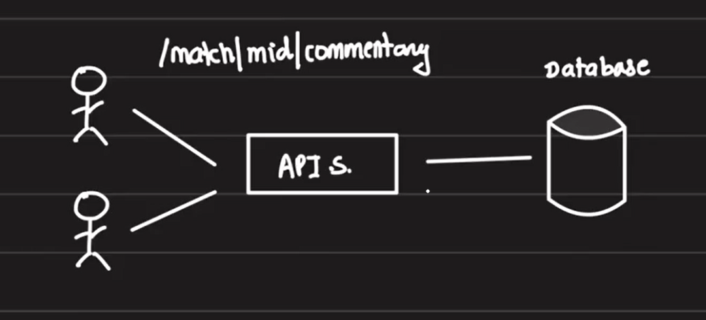
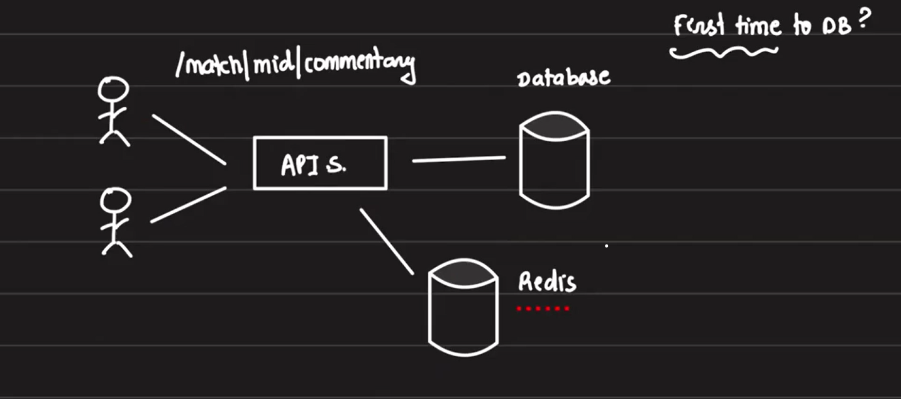
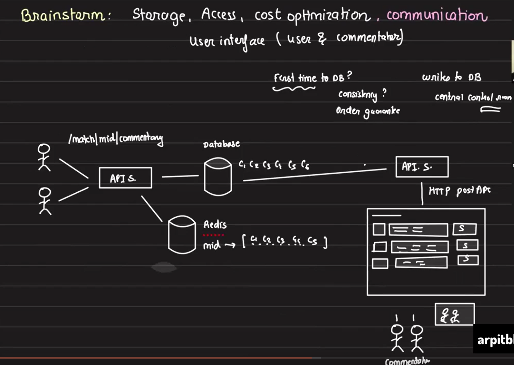
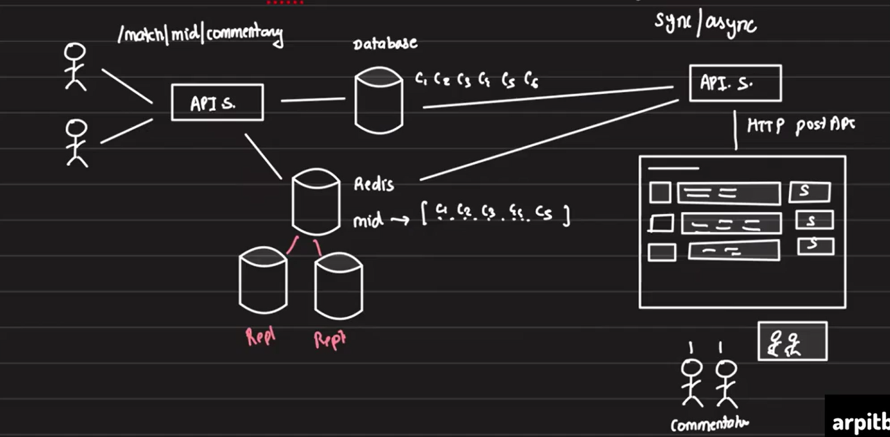
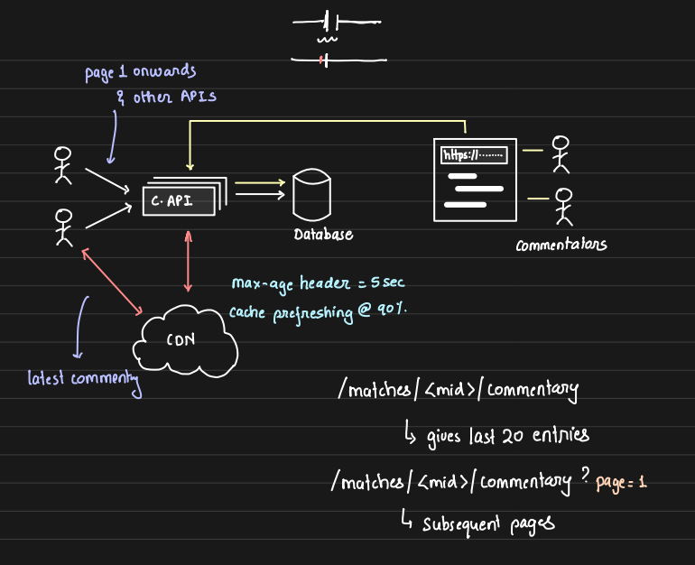

# Designing Cricbuzz's Live Commentary System

## Requirements:
1. **Live Text Commentary:** The system should display live commentary updates to users during matches.

2. **Cost Efficiency:** The architecture must be designed to handle millions of users while keeping the infrastructure cost low.
3. **Good User Experience:** Ensure that the system provides a seamless and responsive user experience.

## Initial Architecture Overview:
- Cricbuzz maintains multiple API servers that communicate with a database to store match data.
- APIs like `/match/<match_id>/commentary` are exposed to users to fetch live commentary.
- Every user request fetches the most recent commentary from the database.
- **Challenge:** Cricbuzz is India’s 8th most visited websites, with enormous traffic directed toward these APIs, creating a performance bottleneck as every request accesses the database directly.

    

## Introduction of Redis Cache:
To address this challenge, we need to introduce a caching layer between the API server and the database, and Redis is an ideal choice for this purpose.

1. **Caching Strategy:**

    - Redis stores the match commentary with `match_id` as the key and a `list of commentaries` as the value.
    - When a request hits the API server, it first checks Redis. If data is found, it returns the commentary from Redis.

    - If Redis does not contain the data (cache miss), the API server fetches the commentary from the database, caches it in Redis, and returns it to the user.

        

2. **Handling Redis Failures:**

    - If Redis goes down and comes back up, it is treated like a **cold start**.
    - API servers fall back to the database to repopulate Redis with fresh data when Redis resumes.

3. **Challenges in Updating Redis with New Data:** 

    - There is a challenge when the Redis server is running continuously. **Consider this scenario:** commentary for a match is fetched and stored in Redis. Later, new commentary is added to the database, but Redis is still serving the old data. Since, as per the current logic, all subsequent requests for the same match_id would find the data in Redis and return it, the system ends up serving stale data.

    - The order of the commentary is important, but it's easily handled by using an `"ORDER BY ball_id"` or `"ORDER BY timestamp"` clause to ensure the data is properly sorted. However, the real challenge lies in how to update the data in Redis to keep it in sync with the latest commentary.

## Understanding How Data is Inserted and Managed in DB for a Match Commentary

To address this issue of updateing Redis, we first need to understand how data is inserted into the database for a particular match. At platforms like Cricbuzz, there's a control room where commentators are watching the match live and typing in the commentaries, which are then pushed to the Cricbuzz API server through a simple HTTP POST request.

The commentators input commentary into a UI that likely consists of a simple text box with a save button to submit the commentary to the API server. The API server then writes this data to the database. But how exactly does the API server handle database writes? Is it simply appending new data? Often, we notice that 
- older commentaries get edited
- new lines are added with older commentaries

So the API server needs to support both appending new entries and updating existing ones in the database.

Since we need to edit existing entries as well, a basic text box won't be sufficient for the commentators. The UI should include 
- Fields for the ball number
- The text of the commentary
- A save button. 

If commentary for a particular ball has already been added, the text box should pre-fill with that existing commentary to allow for editing; otherwise, it should remain blank. The ball number field could either be a dropdown or a pre-filled field, depending on the design.

Given that the commentators are not tech-savvy, the UI must be simple and intuitive—there’s no need for them to write queries or deal with complex input processes to insert or edit data.

## Ensuring Data Synchronization Between Database and Redis

Next, let's explore how the challenge that we face earlier, **how to update the data in Redis to keep it in sync with the latest commentarie added in the DB by commentators**. There are two possible approaches: `synchronous` and `asynchronous`.

### Synchronous Approach

In the synchronous approach, when commentators hit the save button, two API calls are made: 
- one to update the database
- another to update Redis. 

However, what happens if Redis is down and the API call to Redis fails? Should commentators receive an error message? Since commentators are busy focusing on their job of writing commentaries, displaying an error to them might not be ideal. Instead, we can log the error and handle retries for failed writes on the backend.

But although commentators aren't tech-savvy, they are Cricbuzz employees, and the company can ask them to take certain actions if writes fail. Commentators generally assume that whatever they are writing in their UI is immediately visible to users. However, if Redis is up but, due to a network failure, the writes only go to the database and not to Redis, the commentators won’t see an error and will assume everything is fine. In reality, though, users could be seeing outdated information. This becomes a serious issue, especially if a typo in a commentary results in an inappropriate or abusive word. If the commentator corrects the typo, but the change never makes it to Redis, users will still see the mistake.

In this case, we could display a message to the commentators indicating that the write to Redis failed and prompt them to retry. When retrying, two API calls would be made again—one to update the database (as it’s an existing entry for that ball ID) and another to insert new data into Redis. This manual retry process is simpler and more efficient than implementing automatic retries. Auto-retries make sense when the user isn’t under direct control, but since the commentators are part of Cricbuzz's system, we can ensure they are aware of the status of their updates.

### Aynchronous Approach

In this method, a separate thread would be spawned to update Redis. While Redis updates only take milliseconds, creating an additional thread for this purpose introduces unnecessary overhead. Synchronous updates provide a cleaner and more controlled approach in this scenario. Commentators need to be certain that whatever they are inputting into their UI is reflected accurately for the end users in real time.

## Redis Downtime and Recovery

In case Redis goes down, it's essential to acknowledge the outage and halt the Cricbuzz website temporarily. When a new Redis server comes online, it initially holds no data. There are two approaches for restoring data:

1. **On-Demand Caching:** When Redis is empty, the API server fetches data from the database upon receiving a new request and caches it in Redis.

2. **Proactive Initialization:** Alternatively, to speed up the recovery process, we can include an initialization step: when a new Redis server is spun up, the latest 'K' commentaries from ongoing matches are preloaded into Redis. This can be efficiently achieved with a simple SQL query, taking just milliseconds to complete.

So, in terms of recovery and restoration, there’s no real problem. Redis can quickly be restored to full functionality with fresh data, ensuring minimal downtime and seamless user experience.

## Redis Scalability:

- **Scaling Redis:** One Redis node may not be sufficient to handle all requests. The solution is to use Redis in cluster mode:
    - Updates are sent to the master node, which propagates changes to the child nodes. 
    
        Even with multiple Redis servers in place, all write operations continue to be directed to the primary node. This ensures that the write latency remains unaffected, no matter how many Redis servers are part of the system.
    - Reads can be scaled horizontally by distributing the load across multiple Redis servers.

## Optimizing Caching Strategy: Redis vs API Server Caching

The current architecture looks like this -- 

One potential optimization we can consider is caching directly within the API server itself, instead of relying on Redis. On any given day, there is a limited number of matches happening, each with a calculable maximum number of balls bowled. The data for these matches is not so large that it cannot be stored within the API server's memory.

With this approach, thousands of API servers could independently cache match data, removing the need for Redis as an intermediary cache. However, this introduces a challenge: **cache invalidation**.

When an old commentary is updated, how will the API servers know to update their cached data? Additionally, for cases where people typically don’t check scores for matches from two days ago, we'd need a mechanism to automatically delete outdated data. Redis handles this automatically with its expiration policies, but without Redis, we would need to program cache invalidation and data cleanup within the API servers.

This introduces complexity, and to efficiently manage cache invalidation, **Redis becomes necessary**. Redis handles expiration and data consistency across distributed caches, ensuring the latest data is served and stale data is cleared.

## Protocol Selection for API Server: HTTP or Real-Time Solutions?

When it comes to the communication protocol between the API server, Redis, and the website, we have several options to consider: **HTTP GET, WebSockets, and Server-Sent Events (SSE)**. Given that updates in Redis and the database occur every 2-3 seconds, we can explore both **push-based** (WebSockets, SSE) and **pull-based** (HTTP) mechanisms. The longer the polling frequency, the greater the delay between real-time events and what is displayed on the website.

- HTTP is a pull-based protocol, where the API server periodically fetches updates from Redis and delivers them to the client. This approach is more reliable and works well because updates are coming in every few seconds, so the reactive nature of push-based protocols isn't strictly necessary. With a polling frequency of 2-3 seconds, there will be minimal delay between the real-time action and what users see on the website.

- **WebSockets** and **SSE** are push-based protocols. As soon as updates are available in Redis, they are forwarded to the API server and then to the website, making this a more real-time approach. WebSockets can offer a better user experience since they reflect updates instantly without the need for polling.

However, WebSockets come with significant overheads:

1. **Persistent connections** are required to maintain real-time communication.
2. **Edge servers** are necessary to handle distributed real-time traffic.
3. **A message broker** is often needed to facilitate communication between different servers.
4. **CPU usage** increases for both the client and server with each WebSocket connection.
5. **Scaling WebSocket connections** is challenging, especially when millions of users are connected simultaneously.
6. If a connection breaks midway, the event might not reach the API server.
7. The cost of maintaining and scaling WebSockets is high.

Considering these overheads, **is WebSocket worth it** for our use case? Since users are already accustomed to refreshing the page for updates, they may not notice a significant difference between push-based and pull-based updates. With HTTP polling, the API server can make backend calls to fetch updates without user intervention.

Given that **Cricbuzz is one of India's most visited websites**, potentially handling **20 million connections at a time**, the cost of using WebSockets becomes prohibitive. Broadcasting updates using something like `socket.io.broadcast` would result in a costly `for` loop for every 20 million connections.

Therefore, **HTTP polling** offers a more efficient and scalable solution than WebSockets. The slight delay between updates is acceptable for this use case, and the cost savings make HTTP polling the preferred choice over real-time push mechanisms.

## Using CDN for Scalability:

One of the main concerns in this infrastructure is that Redis can be the most expensive component. Most API calls serve the same commentary for a particular match, leading to redundant requests. To optimize, we can consider using a CDN for wider geographical coverage, even if the traffic is primarily in India. Let's compare using a CDN versus the current setup of API server + Redis:

1. **Using CDN:** When requests hit the CDN, it caches the data and serves it directly. CDN is often cheaper than an API server + Redis combination for handling such repeated requests.

2. **Redis Implementation:** In the Redis model, cache debouncing and request hedging can become significant challenges. If many users keep refreshing, a large number of requests flood the API servers. All these API servers make calls to Redis. If Redis deletes the `match_id` key for any reason, all these requests will miss the cache, fall back to the database, and potentially overwhelm it, leading to cascading outages.

    We previously handled these challenges with locking and state management, but the CDN has these features built-in.

- **Advantages of CDN:**
    1. Even if users are not spread out geographically, it makes sense to route API requests through a CDN, with the origin being Cricbuzz's API server. We can split our APIs into **two categories**: **live commentary** and **historical pagination**. 
        - Historical pagination is less likely to be accessed and can be handled by the database. 
        - Live commentary can be served via the CDN to API servers and then to the database.

    2. CDN will handle caching, load balancing, and request hedging (where, in case of cache misses, only a few requests hit the server to fetch data). This reduces the number of API servers and Redis instances, cutting infrastructure costs.

- **Cache Invalidation in CDN:**

    1. Additionally, the CDN takes care of TTL (time-to-live). For updated commentaries on older balls, the CDN can invalidate its cache (e.g., every 5 seconds) so that any subsequent request fetches the updated commentary from the database. 
    2. CDNs also offer **cache prefetching**, where the CDN proactively refreshes a key from the API server just before expiration (e.g., at 90% of TTL). This minimizes the number of requests hitting the API server.

    3. TTL can be configured directly at the CDN level, or the API server can set the TTL with the max_age header in HTTP responses. This way, we can easily adjust the caching duration for specific keys without altering the CDN configuration.

## CDN Data Refresh and Propagation
One key challenge is that the CDN data needs to be refreshed every 4-5 seconds to accommodate updates from new balls being bowled. Since users are accessing data from multiple CDN edge nodes, it’s important to update all nodes within that interval. How does this happen? Each CDN edge server operates independently. When a request comes in for a ball, if the CDN edge server doesn't have that data cached, it propagates the request to the database (or origin), fetches the updated information, stores it locally, and sends it to the user.

## Handling Non-Commentary Information
Furthermore, handling non-commentary information like match delays (e.g., due to rain) or presentation details is another consideration. While we simplified the architecture by associating data with a ball number, the actual commentary feed might contain various types of content. This can include ball-by-ball commentary, messages, end-of-presentation details, or stats. All of these elements are sorted and displayed according to their timestamps, providing a smooth user experience.

## Using S3 and CDN for Simplified Architecture
In this architecture, we could theoretically eliminate the entire API server and database by leveraging Amazon S3 instead. Commentators would push their data directly to S3, and the CDN's origin server would be S3, pulling the data directly from there. However, we're not just serving live commentary—there are other crucial components such as logging, ads, player details, stats, and more, which require **the presence of an API server**.

## Adhoc Questions

- **Question1:** How does a request for new data work when a match is ongoing? Suppose a user is following the match but doesn’t know what’s happening in real time. When the user requests new data, how can they specify which ball or update they want? For instance, if rain stops play and the commentators are updating pitch conditions instead of live ball commentary, how would the user's request for "new data" work?

    - **Answer:** When a user requests data for a live match, they typically don't specify a ball number but rather ask for the "latest data." In this case, the API server (or CDN) would return the most recent commentary. To optimize this, the system can use a timestamp or versioning mechanism.

        If the user requests only "new data," the API server or CDN can compare the user's last-known data timestamp with the current data's timestamp. If there’s new commentary or updates (such as about rain or pitch conditions), the API can send the updates accordingly.

        In the event of a rain delay or similar situation, commentators might provide updates that are not tied to specific ball numbers. These updates are treated like any other commentary and are associated with a timestamp. The system would check for new data by comparing timestamps, ensuring that updates such as pitch conditions after rain are sent to the user without repeatedly querying the database.

        The CDN would only need to contact the database when it doesn’t have the updated data cached. In this way, the CDN minimizes unnecessary database lookups while ensuring that the user receives real-time updates efficiently.

- **Question2:** How does the CDN determine if it has the most up-to-date data? For instance, if 20 requests for new data come in within 20 seconds, and the CDN fetches data from the database on the first request, will it need to check the database again for each of the subsequent requests to ensure the data is still current?

    - **Answer:** When a CDN receives the first request for new data and doesn't have it cached, it will go to the database (or API server) to fetch the latest data and cache it locally. Once cached, the CDN will serve that data for subsequent requests within a short time frame (e.g., 5 seconds) without going back to the database.

        To ensure that the CDN knows whether it has the updated data or not, two mechanisms can be used:

        1. **Time-to-Live (TTL):** When the CDN caches the data, a TTL value is set (say, 4-5 seconds). For any subsequent requests within this TTL window, the CDN serves the cached data. Once the TTL expires, the CDN invalidates the cached data and fetches new data from the database if another request comes in.

        2. **Stale-While-Revalidate:** The CDN can use a mechanism where it serves stale data while asynchronously checking for updates in the background. This ensures that even if the TTL expires, the CDN doesn't block user requests while fetching new data. The updated data is fetched in the background and refreshed for the next request.

        In this way, the CDN doesn’t repeatedly check the database for every request within a short time frame. Only after the TTL expires or stale data is detected would the CDN contact the database again. This approach minimizes the load on the database and improves response times.

## Summary:
- The live commentary system for Cricbuzz must handle high traffic efficiently while ensuring users see up-to-date commentary.

- Redis caching reduces load on the database, but we must ensure cache updates occur synchronously with the database.
- Using HTTP polling ensures reliability and cost-efficiency, while introducing a CDN further enhances scalability and reduces infrastructure costs.