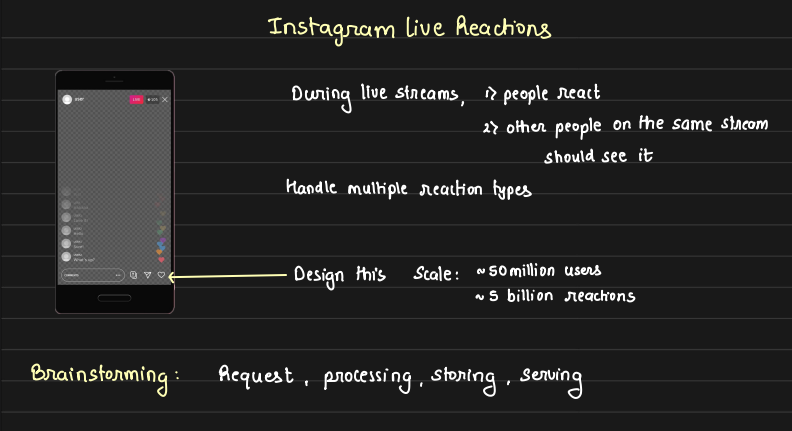

# Instagram Live Reactions System Design

## Problem Overview:

When users react during a live stream, their reactions should be visible to others watching the same stream. The system should handle multiple types of reactions, scale for 50 million users, and process up to 5 billion reactions. The design should meet the following goals:

1. **Horizontal Scalability:** The system should handle peak loads during live streams, but also scale down to reduce infrastructure costs when the stream ends.

2. **Good User Experience (UX):** Users should experience minimal delays in seeing reactions from others.

## Reaction Handling Flow:
When a user taps the reaction button, there are two ways this interaction reaches the backend:

1. **HTTP Post API:** Used for regular server-client interactions.
2. **WebSockets:** Used for real-time communication with lower latency.

In this case, selecting **HTTP Post API** or **WebSocket** for live reactions depends on the type of guarantees we want to provide to the user. 

### **Batching Client-Side Reactions** 

When users continuously tap the reaction button during a live stream, it is inefficient to send an API call for every single tap. Instead, we should batch the reactions on the client-side and send them to the backend in one go. For example, if a user gives 50 reactions in a short span of time, we can **batch** them and send this data in a single request. So to reduce the number of server calls, **client-side batching** is employed. This keeps the API server from being overwhelmed with unnecessary requests.

While it is common practice to keep the client-side "dumb" and avoid embedding business logic, this case is an exception. Handling such frequent API calls on the backend server would put an unnecessary load on the API servers, so batching on the client-side helps reduce strain on the infrastructure while ensuring scalability.

### Handling Client Reactions in API Server

When the API server receives client reactions, it needs to both **persist the data in the database and forward the reactions to other users**. This can be handled either synchronously or asynchronously. However, asynchronous processing is generally more suitable for such use cases because it allows flexibility in handling data for various purposes, such as:

- **Real-time delivery** to other users.

- **Analytics** for identifying popular streams or reactions.

In such a scenario, **Kafka** is an excellent fit due to its support for multiple consumer groups, high availability, and durability. Once a batch request is received by the API server, it writes the data to Kafka. The writing process itself can be done synchronously or asynchronously; for instance, the **API server can buffer the data and then push it to Kafka in bulk.**

- **Handling Data Loss in Batching**
    
    When batching at the API server level, there is a risk of data loss before the data is written to the Kafka queue. However, in this context, the data (such as user reactions) is not highly critical, so minimal data loss is acceptable. Thus, we can afford to bypass the need for persistent storage or data recovery mechanisms for lost data, prioritizing performance and scalability over perfect data retention.

In this system, batching can be implemented at two key points:

1. **Client-Side Batching:** Reactions from users are batched on the client side before being sent to the API server. This approach reduces the number of individual API calls, thereby lowering server load.

2. **API Server Batching:** Once the API server receives the batched reactions from the client, it can further batch the data before pushing it to Kafka. This additional batching helps optimize the handling of large volumes of data and reduces the frequency of writes to the message queue.

### Determining Batch Size

A key consideration in batching is **how much data to batch at once**, especially when dealing with large-scale systems like Instagram, where data traffic can be enormous.

1. **Batch Size by Time:** One approach is to batch data based on time intervals, for instance, 5 seconds. This means that the system will collect and batch reactions over a 5-second window. However, this can result in a substantial amount of data to process, especially at peak times, leading to potential delays.

2. **Batch Size by Count:** Another approach is to batch based on the number of messages, such as 20,000 messages per batch. This ensures that we limit the size of each batch, but it could result in delays if traffic is low, as the system waits to gather 20,000 messages.

3. **Combination of Time and Count:** A more efficient strategy is to use a combination of time and count. The system could either batch reactions for up to 5 seconds or accumulate 20,000 messages, whichever hits first. This ensures that neither batch size nor time introduces significant delays in data processing.

4. **Encoding and Compression:** When batching, encoding plays a crucial role in optimizing the payload size. Since the data primarily consists of integers (e.g., user IDs, reaction counts, live stream IDs), we can use techniques like run-length encoding or protobuf to reduce the message size. Additionally, compressing the batch before sending it to Kafka helps minimize payload size further, which improves performance, **even if it adds some latency**.

By balancing **batch size, encoding, and compression**, we can ensure that the system remains performant while handling high volumes of data efficiently.

## Data Processing and Aggregation

Once the data is batched, the next step is processing and aggregating the reactions for each live stream. Here's how it works:

1. **Aggregation Based on Live Stream:** We need to aggregate the data for each live stream so that the system knows how many reactions happened within a specific timeframe. The reactions can come from **multiple API servers to Kafka**, where a **Kafka consumer** processes these batches. So again we add some delay in spark while doing batching.

2. **Batch Processing and Aggregation:** Kafka consumers **batch and aggregate** the data over time before updating the database (DB) for the respective live stream. Aggregation can be done over a time interval, allowing us to compute totals or statistics for each live stream.

3. **Processing Frameworks:** There are several options for processing and aggregating these batches, such as:

    - Apache Flink
    - Apache Spark
    - Apache Storm
    - Kafka Streams

In most cases, **Spark** is a preferred choice due to its **strong micro-batching capabilities** and better community support.

In most cases, **Spark** is a preferred choice due to its strong micro-batching capabilities and better community support.

4. **Avoiding Re-Computation:** Once the data has been processed and aggregated by Spark, we **should not write it directly to the database**. This is because Spark has already computed valuable data that could be used for other services, such as **analytics, notifications, or trending services**.

Instead, we should write the final aggregated data to another Kafka topic, where it can be consumed by multiple services, allowing them to avoid the cost of recomputing the same data.

5. **Benefits of Kafka Integration:** By writing the aggregated data back into Kafka, other services can easily consume the pre-processed data. This makes the system more **efficient and scalable**, as services like notification, analytics, and trending can directly use the data without needing to run additional computations.

This approach ensures that the system is optimized for performance, reduces redundant processing, and scales efficiently to handle a large number of users and reactions.

## Sending Computed Data to Users

Once the data has been aggregated, the next step is to **distribute this data to users** watching the live stream. This process shares similarities with designs we've previously discussed, such as **Slack's event delivery system**. The flow involves **edge servers, Redis synchronization, and maintaining persistent connections.**

However, there’s a key question: **What exactly are we sending to users?** In a scenario where 50,000 users are watching a live stream, if we attempt to send every single event to each user, the complexity becomes **O(n²)**—with 50K users, this would result in **2 billion events**. Clearly, sending all the information is impractical, especially in a live stream where users expect real-time feedback, not an exhaustive list of events like in a chat application. Remember **this is a live stream not a chat application.**

### Optimizing Data Transmission
Instead of sending every reaction event, we:

1. **Sample the Aggregated Data:** After aggregating the data in Kafka and storing it in the database, we take a sample of the most important or **popular reactions** (e.g., top emojis) to send to the users. This reduces the volume of data transmitted.

2. **Reduce Bandwidth Usage:** By sending only the **popular reactions** rather than every event, we avoid overloading users' connections and save bandwidth. This ensures a smooth experience even during high-traffic live streams and consumes less bandwidth for users.

3. **Role of Edge Servers:** The **group of servers before the edge servers** consumes data from Kafka, determines which reactions are the most popular and common, and then emits this filtered data to the edge servers.

4. **Edge Server Fan-Out:** The edge servers are responsible for performing the **final fan-out**, sending the reactions to users. Since the data has already been sampled and filtered, the system remains efficient and scalable without overwhelming users or the servers.

This approach minimizes complexity and optimizes network usage, ensuring that users still see real-time reactions without receiving unnecessary data.

## Final Real-Time Delivery Flow:
1. **API Server:** Receives regular HTTP POST requests containing users' reactions. To optimize efficiency, the API server performs **batching** of these requests before publishing them to **Kafka**.

2. **Kafka:** Kafka serves as the message queue for reactions. : Kafka consumers process the batched reactions. Here, we perform additional **batching** and **compute aggregates** based on each post (e.g., total reactions for a specific post). Once the **aggregation** is done, the **data** is written to **another Kafka topic**.

3. **Forking for Different Services:** From this second Kafka topic, the data is forked out to different services such as:

    - Analytics
    - Popularity tracking
    - Other business logic services

4. **Real-Time Delivery Service:** For live events, the data is consumed by the real-time delivery service. This service identifies the most popular reactions (e.g., frequently used emojis, reactions) and prepares them for delivery.

5. **Redis Pub/Sub for Delivery:** The real-time delivery service publishes the selected popular reactions to **Redis Pub/Sub**. Any user or service that has subscribed to that live stream will receive these reactions.

6. **Key Optimization – Sampling:** A crucial part of this process is **sampling** — deciding which reactions or data points to emit to users in real time. Instead of sending every reaction, the system identifies the most relevant or popular items, reducing unnecessary data transmission.

## Key Takeaways:

1. **Ability to Reuse Real-Time Scalable Messaging Infrastructure:**

    By leveraging existing infrastructure, such as **Redis Pub/Sub**, we efficiently deliver real-time updates to users. This allows us to scale the system without needing to reinvent the core messaging architecture.

2. **Selective Data Transmission – Smart Sampling:**

    Instead of sending **every single event** to every user (which would result in n² complexity for large numbers of users), we implement **sampling** in the real-time delivery service. Only the **most relevant or popular data** is sent to users, significantly reducing bandwidth usage and improving efficiency.

3. **Reusing Computed Data:**
    
    After performing expensive computations (both in terms of time and resources), such as **aggregating data in the last Kafka topic**, we ensure that this data is reused for multiple purposes (e.g., analytics, notifications) rather than recomputing it. This optimizes system performance and resource utilization.
