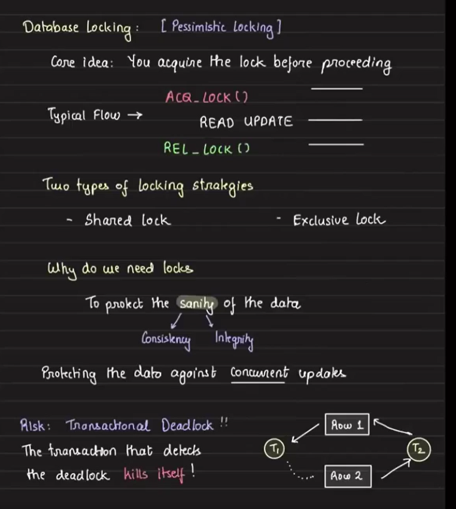
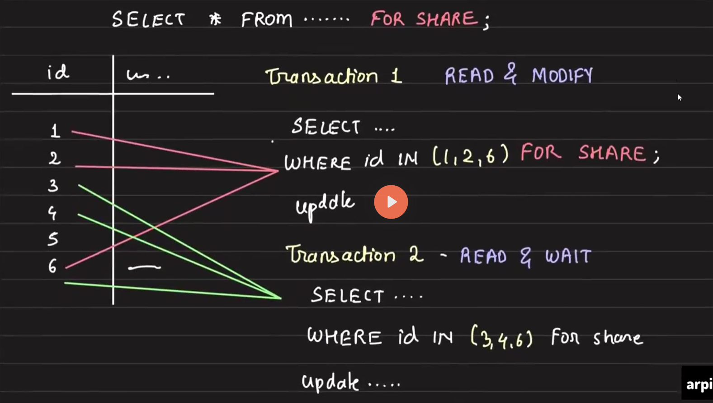
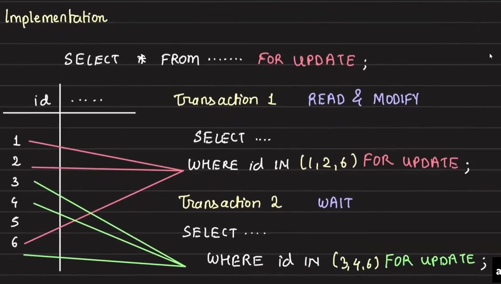
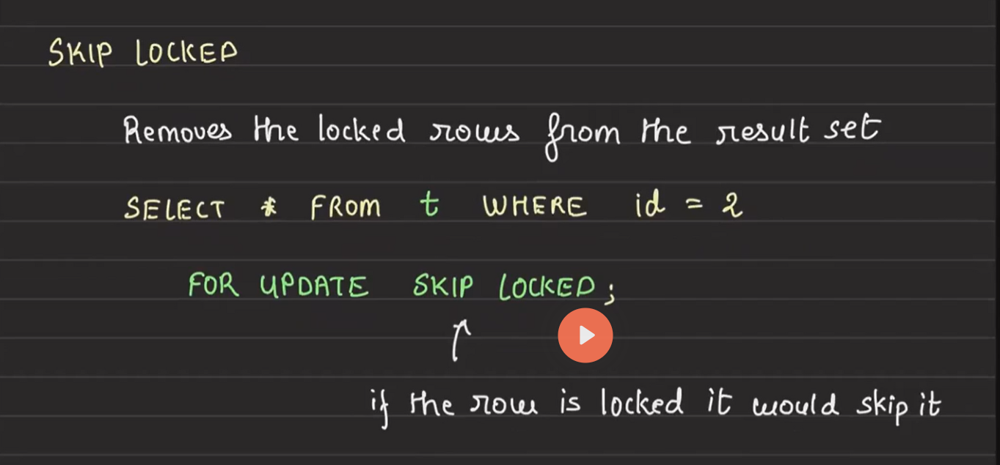
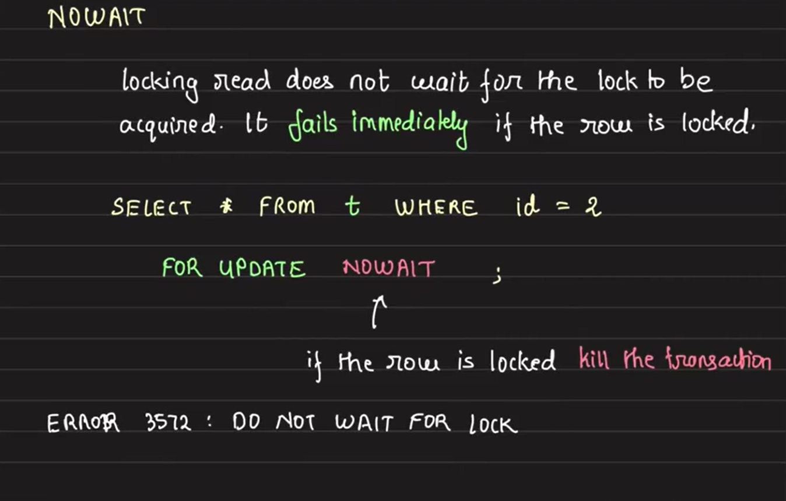

#  Pessimistic Locking and Airline Check-in System

## Pessimistic Locking in Relational Databases

### Key Concept:
Pessimistic locking is used when multiple transactions try to update the same row, potentially causing inconsistencies. For example, in a distributed system, if two threads increment a counter without a lock, both may read the same value, resulting in only a single increment instead of two.

### Solution:
- The solution works by using a lock before entering the critical section of the code (the part where important changes to the database happen). This means that, no matter how many transactions (or users) try to update the database at the same time, only one will be allowed in at a time.
    - When one transaction gets the lock, it can safely update the database.
    - Once it's done, it releases the lock, allowing the next transaction to get the lock and update the database.

    While this ensures that only one transaction updates the database at a time (which keeps things consistent and avoids errors), it can slow things down because other transactions have to wait until the lock is released. So, while locking affects throughput (the number of transactions processed per second), it’s necessary to keep the data consistent and avoid conflicts.

### Types of Locks:
1. Shared Lock: Multiple transactions can read the data simultaneously but cannot update it.

    `FOR SHARE` is a keyword to get `Shared lock`.
2. Exclusive Lock: Only one transaction can both read and update the data at a time.

    In the above implementation, Transaction 2 have to wait for Transaction 1 to complete before stating its own execuion. But if Transaction 2 only needs to update rows 3 and 4, it doesn’t have to wait for Transaction 1 to finish if Transaction 1 is working on different rows (rows 1 and 2). This is because locks are typically applied only to the specific rows being updated, not to the entire table.
    
    `FOR UPDATE` is a keyword to get `exclusive lock`.

    Each transaction locks only the rows it needs to update. So, as long as two transactions are working on different rows, they can proceed without interfering with each other.

### Why Locks are Necessary:
Locks ensure data consistency and integrity, protecting against concurrent updates. However, locks can also lead to deadlocks. Read more on DBMS deadlocks from GATE notes.

### Special Locking Techniques:
- Skip Locked:

    In certain situations, we may want to allow transactions to skip locked rows and continue working on other rows i.e where partial results are acceptable. This is where the `SKIP LOCKED` feature comes in.

    lets use the example at exclusive lock as reference:
    - Let’s say Transaction 1 (T1) has locked row 6 for an update.
    - Transaction 2 (T2) wants to update rows 3, 4, and 6.
    - Without `SKIP LOCKED`, T2 would have to wait until T1 is finished with row 6.
    - However, with `SKIP LOCKED`, T2 can update rows 3 and 4 immediately and simply skip row 6, which is locked by T1. This approach increases system efficiency by allowing T2 to complete part of its work without waiting.
    - **How to use:** Add `SKIP LOCKED` with `FOR UPDATE` in your query to enable this behavior.
    - **Outcome:** T2 will only process **rows 3 and 4**, and skip row 6 because it’s locked by T1, resulting in higher throughput as more work can be done in parallel.
    - **Advantage:** Increases throughput by allowing transactions to proceed without waiting for locks to be released.

    

    **Real-World Use Case:**

    Imagine a distributed to-do list shared by multiple users:

    - The to-do list has 10 tasks.
    - User 1 wants to mark tasks 1, 2, and 6 as completed.
    - At the same time, User 2 wants to mark tasks 6, 7, and 8 as completed.

    With `SKIP LOCKED`, if User 1 is already working on task 6, User 2 can skip task 6 and mark only tasks 7 and 8 as completed. This doesn’t cause any issues, as User 1 will take care of task 6. In cases like this, where partial results are acceptable, using `SKIP LOCKED` can greatly improve efficiency and throughput.

- No Wait:

    The opposite of `SKIP LOCKED` is `NO WAIT`.

    - In some cases, partial results may not be acceptable and you also don’t want the system to wait for a lock to be released.
    - With `NO WAIT`, if a row is locked, the transaction will immediately fail rather than waiting for the lock to be released.
    - How to use: Add `NO WAIT` with `FOR UPDATE` to force immediate failure if the lock cannot be acquired.

    

## Airline Check-in System Design

### Scenario:
Designing a system for passengers to reserve seats during check-in (not booking). Assume payment is already made, and only seat reservation is required.

### Key Requirements:
- Multiple airlines, each with multiple flights.
- Each flight has 120 seats.
- Multiple people may try to reserve seats on the same flight simultaneously.

### Problem:
If 120 users try to reserve a seat at the same time, without proper locking, multiple users could reserve the same seat. The last user’s transaction to commit would overwrite the previous ones, causing inconsistencies.

### Solution:
- Use `FOR UPDATE` in the SQL query to lock a seat when it’s being reserved.
- This guarantees that only one transaction can reserve a specific seat at a time.

### Flow:
1. Users select a free seat.
2. The system locks the seat for that user using exclusive locking (FOR UPDATE).
3. After the seat is reserved and the transaction is committed, the lock is released.
4. The other users' transactions will now reevaluate the query and find the next available seat.

### Optimizing with Skip Locked:
- By adding SKIP LOCKED, users don’t have to wait for locks to be released. If a seat is locked, the system moves to the next available seat.
- This increases throughput but doesn’t guarantee seats will be reserved in order. However, correctness is maintained as no two users can reserve the same seat.