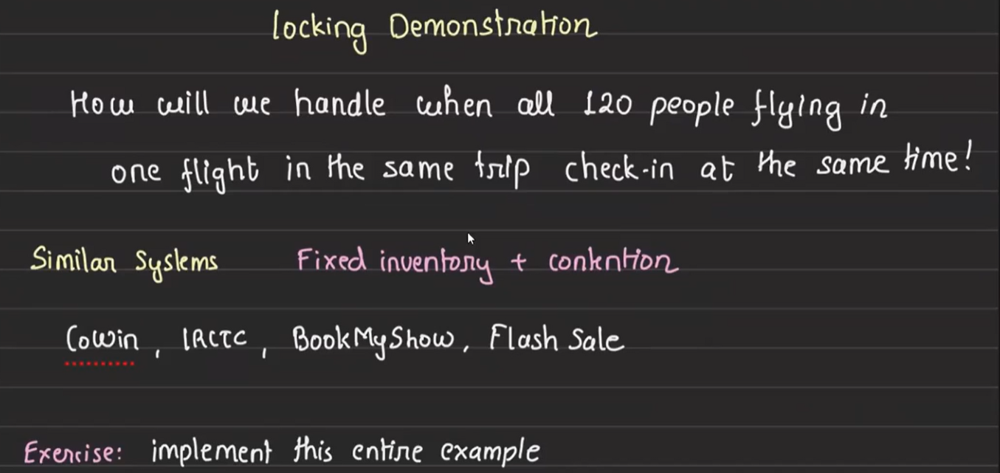
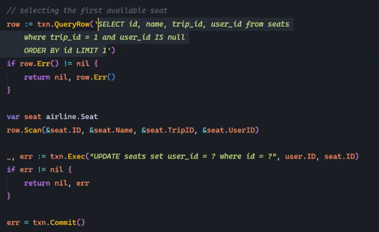
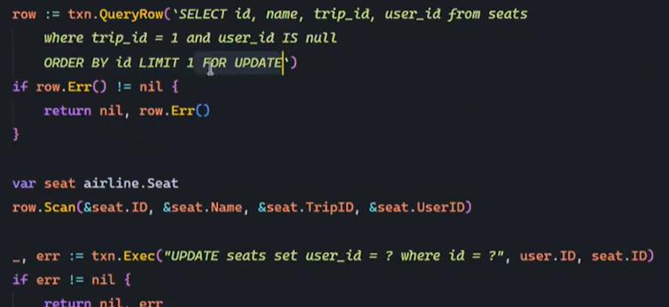
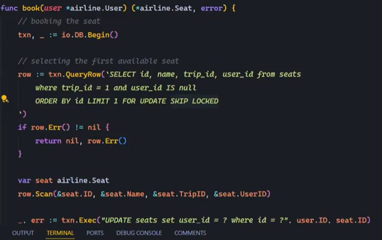

#  Database Locking and Airline Check-in System

## Optimistic Locking vs Pessimistic Locking:

Check this link:- https://medium.com/@abhirup.acharya009/managing-concurrent-access-optimistic-locking-vs-pessimistic-locking-0f6a64294db7 

## Pessimistic Locking in Relational Databases

### Key Concept:
Pessimistic locking is used when multiple transactions try to update the same row, potentially causing inconsistencies. For example, in a distributed system, if two threads increment a counter without a lock, both may read the same value, resulting in only a single increment instead of two.

### Solution:
- The solution works by using a lock before entering the critical section of the code (the part where important changes to the database happen). This means that, no matter how many transactions (or users) try to update the database at the same time, only one will be allowed in at a time.
    - When one transaction gets the lock, it can safely update the database.
    - Once it's done, it releases the lock, allowing the next transaction to get the lock and update the database.

    While this ensures that only one transaction updates the database at a time (which keeps things consistent and avoids errors), it can slow things down because other transactions have to wait until the lock is released. So, while locking affects throughput (the number of transactions processed per second), it’s necessary to keep the data consistent and avoid conflicts.

### Types of Locks:
1. Shared Lock: Multiple transactions can read the data simultaneously but cannot update it.

    `FOR SHARE` is a keyword to get `Shared lock`.
2. Exclusive Lock: Only one transaction can both read and update the data at a time.

    In the above implementation, Transaction 2 have to wait for Transaction 1 to complete before stating its own execuion. But if Transaction 2 only needs to update rows 3 and 4, it doesn’t have to wait for Transaction 1 to finish if Transaction 1 is working on different rows (rows 1 and 2). This is because locks are typically applied only to the specific rows being updated, not to the entire table.
    
    `FOR UPDATE` is a keyword to get `exclusive lock`.

    Each transaction locks only the rows it needs to update. So, as long as two transactions are working on different rows, they can proceed without interfering with each other.

### Why Locks are Necessary:
Locks ensure data consistency and integrity, protecting against concurrent updates. However, locks can also lead to deadlocks. Read more on DBMS deadlocks from GATE notes.

### Special Locking Techniques:
- Skip Locked:

    In certain situations, we may want to allow transactions to skip locked rows and continue working on other rows i.e where partial results are acceptable. This is where the `SKIP LOCKED` feature comes in.

    lets use the example at exclusive lock as reference:
    - Let’s say Transaction 1 (T1) has locked row 6 for an update.
    - Transaction 2 (T2) wants to update rows 3, 4, and 6.
    - Without `SKIP LOCKED`, T2 would have to wait until T1 is finished with row 6.
    - However, with `SKIP LOCKED`, T2 can update rows 3 and 4 immediately and simply skip row 6, which is locked by T1. This approach increases system efficiency by allowing T2 to complete part of its work without waiting.
    - **How to use:** Add `SKIP LOCKED` with `FOR UPDATE` in your query to enable this behavior.
    - **Outcome:** T2 will only process **rows 3 and 4**, and skip row 6 because it’s locked by T1, resulting in higher throughput as more work can be done in parallel.
    - **Advantage:** Increases throughput by allowing transactions to proceed without waiting for locks to be released.

    

    **Real-World Use Case:**

    Imagine a distributed to-do list shared by multiple users:

    - The to-do list has 10 tasks.
    - User 1 wants to mark tasks 1, 2, and 6 as completed.
    - At the same time, User 2 wants to mark tasks 6, 7, and 8 as completed.

    With `SKIP LOCKED`, if User 1 is already working on task 6, User 2 can skip task 6 and mark only tasks 7 and 8 as completed. This doesn’t cause any issues, as User 1 will take care of task 6. In cases like this, where partial results are acceptable, using `SKIP LOCKED` can greatly improve efficiency and throughput.

- No Wait:

    The opposite of `SKIP LOCKED` is `NO WAIT`.

    - In some cases, partial results may not be acceptable and you also don’t want the system to wait for a lock to be released.
    - With `NO WAIT`, if a row is locked, the transaction will immediately fail rather than waiting for the lock to be released.
    - How to use: Add `NO WAIT` with `FOR UPDATE` to force immediate failure if the lock cannot be acquired.

    

## Airline Check-in System Design

### Scenario:
Designing a system for passengers to reserve seats during check-in (not booking). Assume payment is already made, and only seat reservation is required.

### Key Requirements:
- Multiple airlines, each with multiple flights.
- Each flight has 120 seats.
- Multiple people may try to reserve seats on the same flight simultaneously.

### Problem: Concurrent Seat Reservation
Imagine the situation where 120 users attempt to reserve seats on the same flight, at the same time. This can cause several issues with the seat reservation process, specifically in terms of data consistency. Here’s how the seat reservation process might break down:
    

- Flow of Reserving a Seat:
    1. The system searches for the first available seat.
    2. The system then books that seat for the user.

- The Issue:
    - If we don’t apply proper synchronization mechanisms and simply select a free seat (like how we write simple SQL queries in examples or on platforms like Leetcode), we can encounter a race condition.

    - Multiple users may select the same seat at the same time, as no lock is placed on the seat record. When they attempt to commit their changes, the last user’s commit will overwrite the others, causing inconsistent results.

        

- For example:

    - User 1 select Seat 1 as free seat, and then User 2 also selects Seat 1 as well as a free seat.
    - When both users commit their transactions, only the last one to commit (for example, User 2) will actually reserve the seat.
    - The system may end up with Seat 1 reserved by multiple users, and this causes inconsistency because multiple people will be shown the same seat, leading to confusion.

### The Solution: Pessimistic Locking with `FOR UPDATE`
To avoid the issue mentioned above, we need to ensure that only one transaction can update a seat at any given time.

Here’s how we can solve this problem:

1. Using `FOR UPDATE`:
    - When a user tries to reserve a seat, we use the `FOR UPDATE` clause with the `SELECT` statement. This ensures that the row (seat) is locked for that user exclusively. Other transactions will have to wait until the lock is released.

    - `How it works:` Once the lock is acquired by one transaction, other transactions attempting to book the same seat will be blocked. The lock is released only after the seat is successfully reserved and the transaction is committed by the user who reserved it.

        

2. Step-by-step Flow with `FOR UPDATE`:

    - User 1 queries for a free seat and selects **Seat 1**.
    - **Transaction 1** acquires an exclusive lock on **Seat 1** using `FOR UPDATE`.
    - After **Transaction 1** successfully reserves **Seat 1** (committing the transaction), the lock is released.
    - Now **Transaction 2** re-executes the query and acquires a lock on the next available seat (e.g., **Seat 2**). This process repeats until all users have been assigned a seat.

3. Issue of Multiple Concurrent Requests:
    - In the worst-case scenario, if all requests are evaluated at the same time, they may initially all select the same seat (e.g., **Seat 1**), but only **one transaction** can acquire the lock and all other transactions will wait for the lock to get released. 

    - After the lock is released, each transaction will reevaluate(this is a feature of the DB, we don't need to give any other extra command) and select the next available seat, repeating the same process for all 120 seats.
    
    - The benefit of this approach is that each user gets a seat, and the system remains consistent without any conflict.

### Optimization: `SKIP LOCKED`

While the FOR UPDATE approach ensures correctness, it can sometimes lead to inefficiency because other transactions must wait for the lock to be released. This can cause unnecessary delays if a row is locked for an extended period.

To optimize this, we can use `SKIP LOCKED`, which allows transactions to skip over locked rows and proceed with other available seats, rather than waiting for the lock to be released.

- **How it works:** When a transaction encounters a locked row, it simply skips that seat and tries to lock another available seat.

- **Benefit:** This approach increases throughput because transactions don’t have to wait for a lock to be released. While the order of seat reservations may not be guaranteed, correctness is still maintained because each transaction will still get a seat.

    

### When to Use `SKIP LOCKED` Approach
This solution is effective when you have:

- A fixed inventory (e.g., seats, tickets).
- High contention for resources (e.g., many users trying to book the same seats).
- A need for high throughput without sacrificing data consistency.

Examples of Use Cases:
- **IRCTC Ticket Booking:** When a large number of users are trying to book train tickets, this approach ensures that no two users book the same seat and every available seat gets filled.
- **BookMyShow:** When many users are trying to book tickets for the same movie at the same time.
- **Airline Check-in Systems:** To ensure that only one user can reserve a specific seat on a flight.