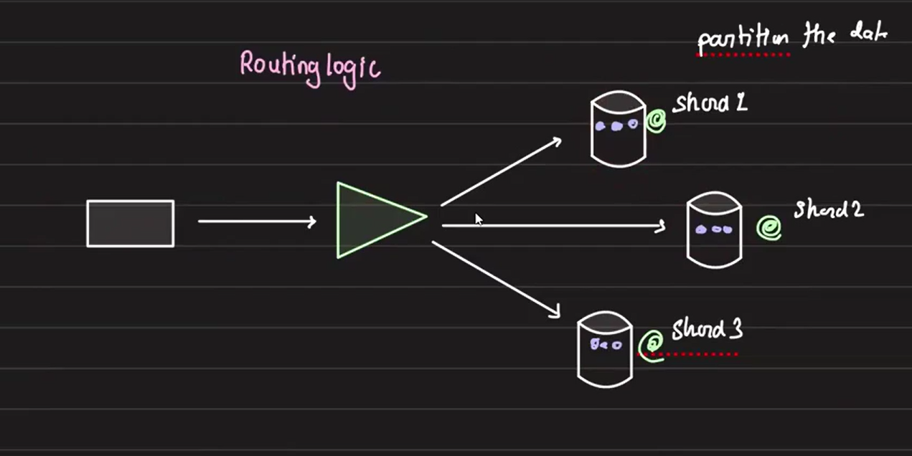
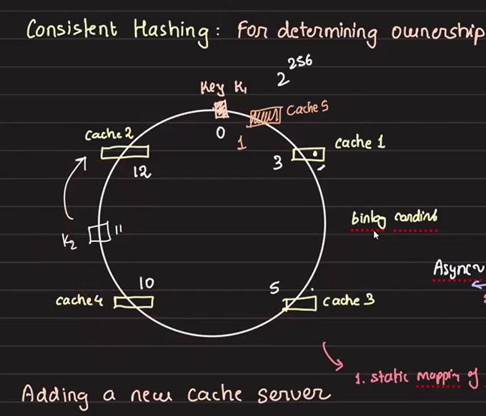
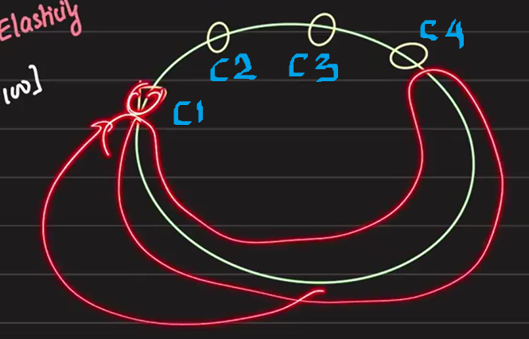
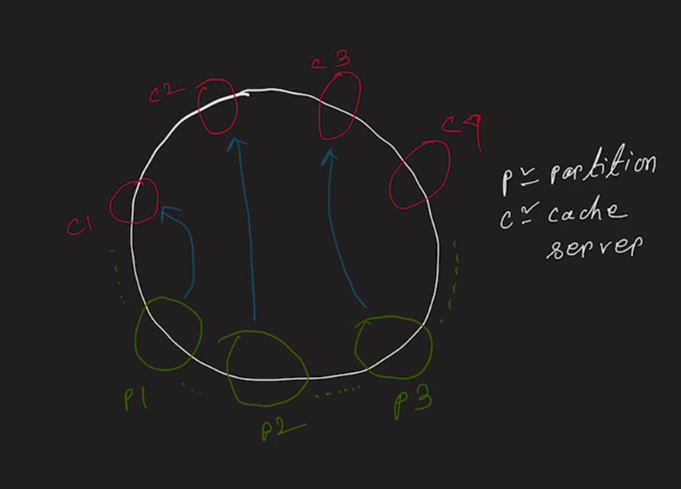
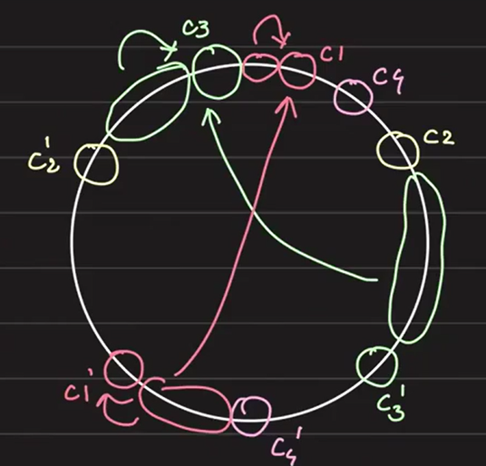
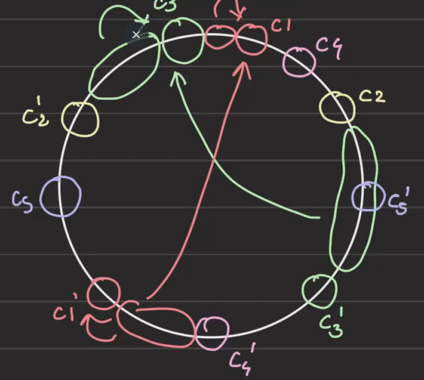
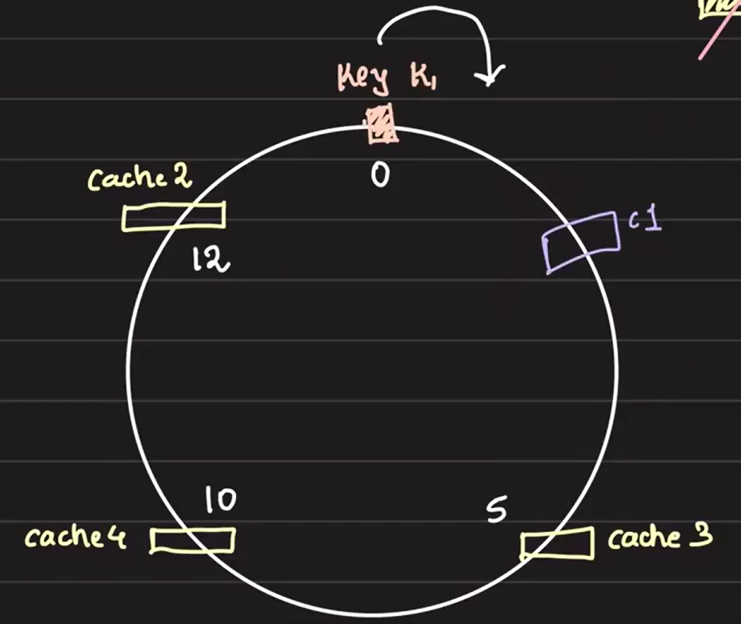

# Distributed Cache Design and Consistent Hashing

When a single cache node cannot hold all the data, we need to distribute the data across multiple nodes. This distribution can be managed using various algorithms such as hash-based routing, range-based routing, or static routing. The goal is to determine the ownership of data and identify which node holds the data for a given key.

## Four Key Patterns in Distributed Cache Systems

When cache data is distributed across multiple shards, the data for a particular key will reside in only one shard. Therefore, when a user queries for that key, the request must be directed to the correct shard to retrieve the value. There are four main approaches to ensure the request reaches the appropriate shard:

1. **Proxy-Based Access (Pattern 1):** The client hands over the request to a proxy, which connects to the appropriate database, fetches the response, and forwards it back to the client. This setup is common in systems like load balancers, reverse proxies, and API gateways.

2. **Direct Access (Pattern 2):** The client knows exactly which database node to request data from and directly sends the request to the appropriate node.

3. **Shard Handoff (Pattern 3):** The client sends a request to any shard, and if that shard doesn’t hold the data, it returns the shard ID where the data is located. The client then sends the request to the correct shard. Redis uses this approach for master node identification.

4. **Distributed Hash Table (DHT) (Pattern 4):** Unlike the previous patterns, where one component knows the entire topology, DHTs operate without any single entity having a full view of the system. DHTs are not typically used for cache, but they are fundamental to the internet's operation. Explore it at your own to learn.

## Challenges with Hash-Based Routing in Scaling

In a hash-based routing strategy, data ownership is determined by applying a hash function to the key, and the result maps the key to a specific server or shard. This approach works well when the number of servers is fixed, but problems arise when scaling up or down. When scaling up (adding servers) or scaling down (removing servers), hash-based routing typically involves significant data movement between servers.

**Example:**

Consider the following scenario:

- We have 8 keys: k1, k2, k3, k4, k5, k6, k7, k8.
- We are using 2 servers initially, Server1 and Server2, with a simple modulo hash function to distribute the keys.

After applying the hash function, assume the keys are distributed like this:

- Server1 holds k1, k3, k5, k7.
- Server2 holds k2, k4, k6, k8.

Now, if you decide to scale up and add one more server (Server3), the distribution changes because the hash function now needs to account for 3 servers:

- Server1 now hold k1, k4, k7
- Server2 now hold k2, k5, k8
- Server3 now hold k3, k6, k8.

So this creates a lot of data movement, which can be resource-intensive and disrupt the system.

A solution to mitigate this issue is **consistent hashing**. Consistent hashing minimizes data movement by ensuring that only a small subset of keys are remapped when a server is added or removed, reducing the overall load and improving system stability during scaling operations.

In our case, consistent hashing is implemented at proxy server and determines which server a key should be placed on or retrieved from based on the hash function. Once the correct server is identified, the proxy then routes the request to that server to store or retrieve the key.

## Data Migration Without Downtime

Arpit discusses consistent hashing in this section, and we can refer to any tutorial for details. In the example below, without cache5, all requests between cache2 and cache1 are directed to cache1. However, when cache5 is introduced, some of the data is rerouted to cache5 while some continues to go to cache1. This results in transferring only the necessary portion of data from cache1 to cache5, without affecting the other caches. This is how consistent hashing helps minimize data transfer during scaling.

To add new cache nodes without downtime:

- **Approach 1:** We need to identify the keys that should now be served by cache5 and transfer them from cache1. To achieve this, we must iterate through all the keys in cache1 and determine whether they should be moved to cache5. Additionally, if any new put requests are received during this process that should belong to cache5 post-migration, those must also be transferred. This requires setting up a master-slave configuration for a subset of data, which, while possible, is extremely challenging to configure.

- **Approach 2:** To migrate data from cache1 to cache5, we first need to dump the data from cache1 to cache5. This process of dumping the complete data is relatively quick and efficient. Once the data is loaded, we can introduce cache5 and start serving requests. However, there's a challenge: let's assume that creating the dump takes 10 minutes, and transferring and loading the data into cache5 takes another 5 minutes. If we start at 11:00, cache5 will be ready by 11:15. During this 15-minute window, live traffic is ongoing, and new keys may be introduced or existing keys updated.

    If any keys that will be handled by cache5 are modified during this time, we need to account for those changes. To address this, we can't introduce cache5 until the replication lag (the difference between the live traffic and the dump) is minimized. However, completely eliminating this lag is difficult, so our goal is to minimize it as much as possible.

    After loading the dump, we can reduce the replication lag using asynchronous replication. Once the lag becomes negligible (e.g., 15 milliseconds), we perform a brief "stop-the-world" operation, where we temporarily pause write operations to cache1. This allows cache5 to fully catch up without rejecting any write requests — we simply hold them momentarily during this transition. After cache5 has caught up, we add it to the ring, ensuring a seamless migration without any noticeable impact on the user experience.

    **How do we determine replication lag in seconds?**

    Replication operates based on a Write-Ahead Log (WAL). Each entry in the WAL is associated with a unique identifier. In MySQL, this is referred to as the **bin log coordinator**, while in PostgreSQL, it's called the **log sequence number (LSN)**. Every database operation is recorded in the WAL, and this log has a monotonically increasing ID. Typically, this ID encodes a timestamp, similar to how timestamps are embedded in IDs for tracking purposes.

    During replication, fragments of the WAL are transferred to the replica, which re-executes these operations on its local data copy. The replica keeps track of the last processed bin log coordinator (or LSN) and periodically queries the master for its current bin log coordinator or LSN. The difference between these two values represents the replication lag. Essentially, the gap between the master’s latest log and the replica's processed log provides an indication of how much behind the replica is, which can be translated into seconds.

## Introducing a New Cache Node (Cache5)

When we talk about introducing **Cache5**, what does that actually mean? For example, given a key, say `k1,0`, how do we programmatically determine which cache holds that key, rather than just theoretically?

### Consistent Hashing in Load Balancing

In a consistent hashing ring, each node is mapped to a position in an array, which determines where the data for a particular key resides. For example, a key `k1,0` might map to cache1, which holds the data for the key. When adding or removing nodes, consistent hashing minimizes data movement, though it can still lead to hot spots where some cache nodes handle a disproportionate load.

In a consistent hashing system, we maintain an array that stores the index and the cache ID. For example, according to the last picture without considering Cache5, the array might look like this:

| Index | 0   | 1   | 2    | 3    |
|-------|-----|-----|------|------|
| Cache | C1,3 | C3,5 | C4,10 | C2,12 |

For a value like `k1,0`, we perform a linear search in the array to find the nearest/smallest number greater than `0`. In this case, it’s C1 (i.e., 3), which means Cache1 holds the key.

So, the **consistent hashing ring** can essentially be visualized as an array with `n` elements, where `n` represents the number of cache nodes. This can easily be implemented in the database proxy.

### Adding Cache5 to the Consistent Hashing Ring

When we introduce a new cache server (Cache5) into the consistent hashing ring, we simply insert it into the array in the correct position to maintain the order. Using **insertion sort** ensures that the array remains sorted. After adding Cache5, the array looks like this:

| Index | 0 | 1   | 2   | 3    | 4    |
|-------| ----- |-----|-----|------|------|
| Cache | c5,1 | C1,3 | C3,5 | C4,10 | C2,12 |

### The Challenge of Cache Placement

One issue with this approach is that if **Cache3** is hot (i.e., handling a lot of traffic), placing **Cache5** at position `1` (as determined by the hash function) may not be ideal. The position of a cache node is determined by passing the cache node (or its IP or ID) to the hash function, which assigns a position based on the hash value. However, this approach lacks fine-grained control.

According to traditional consistent hashing rules, we wouldn’t manually place Cache5 in a specific spot, but since this is our system, we can tweak it to suit our needs. For example, instead of relying on the hash function, we could manually place **Cache5** at position `4`, between **Cache3** and **Cache4**.

So, the modified array would look like this:

| Index | 0 | 1   | 2   | 3    | 4    |
|-------| ----- |-----|-----|------|------|
| Cache | c1,3 | C5,4 | C3,5 | C4,10 | C2,12 |

### Conclusion
If we want **fine-grained** control over where to place cache nodes, we shouldn't rely solely on the hash function. Instead, we can use static mapping to manually position nodes in the array. This gives us flexibility to adjust the system based on real-world requirements, such as balancing load across caches. We can adapt the consistent hashing approach to suit our specific needs rather than strictly following traditional rules.

## Handling Skewness in Consistent Hashing: Introducing Virtual Nodes

When we fully rely on a hash function to allocate nodes in the ring, how do we address skewness in the distribution? 

For example, in the above picture, if the entire red area is being handled by **Cache1**, it leads to a heavy load on **C1**. How can we handle this?

A possible solution is to divide the large area into smaller chunks and distribute these chunks among multiple cache servers. As shown in the below picture, we break down the large red portion into smaller partitions (e.g., p1, p2, p3, etc.), and each partition can be handled by different cache servers.

This brings us to the concept of virtual nodes. The main idea behind virtual nodes is similar to this: we give a single cache server a virtual presence in multiple locations on the ring. In below pic, C1, C2, etc., represent physical nodes, while C1’, C2’, etc., represent virtual nodes.

As a result, the size of the array (the consistent hashing ring) increases. For example, if each physical server has one virtual presence, the array size doubles the number of cache servers. If each physical server has two virtual presences, the array size triples the number of cache servers.

### Challenges with Adding a New Node in This Approach

Now, suppose we want to add **Cache5**. It would be added in the locations shown in below picture, where **C5** is the physical node, and **C5’** is its virtual presence. On the left side, where **C2** originally handled the entire fragment, some portion will now be handled by **C5**. As per our previous approach, we would take a dump of **C2** and load it into **C5**.

However, on the right side, **C5'** will also handle part of the load from C3'. So we would also need to take a dump of **C3** and load it into **C5**. In this case, **C5** would require two dumps: one from **C2** and one from **C3**, with replication lag from both, making the process of adding **C5** quite complicated.

While virtual nodes initially seem like an effective solution, their operational complexity can be overwhelming. As we increase **statefulness**, consistent hashing becomes less ideal. But if we imagine these as **stateless** servers (like API servers, load balancers), every server would be equally capable of handling requests. Adding **C5** would simply redistribute some requests that originally went to **C2** and **C3** to **C5**, without any operational complexities.

Thus, consistent hashing is an excellent solution for stateless systems (such as API servers and load balancers) but not as effective for stateful systems like caches.

## Handling Cache Server Shutdowns and Outages

1. **Graceful Shutdown**

    This might occur if we want to scale down or reduce infrastructure costs. Suppose we want to shut down **Cache1 (C1)**. The range of requests that previously went to **C1** now needs to go to **Cache3 (C3)**. The process for a graceful shutdown is as follows:

    - **Step 1:** Take a data dump of **C1** and transfer it to **C3**.
    
    - **Step 2:** Perform dual writes to both **C1** and **C3** until the replication lag is either 0 or minimal enough to perform a “stop the world” operation.
    
    - **Step 3:** Once the replication lag is minimal, remove **C1** from the consistent hashing ring.

2. **Abrupt Outage**

    If C1 crashes suddenly, we have two options for handling this:

    **Option 1:** Respect the outage, and any data that was stored in **C1** is considered lost.

    **Option 2:** Ensure high availability, even when **C1** is down. The challenge here is how to serve both read and write requests when **C1** is unavailable.

    - **Handling Reads:**

        To serve reads, we need a replica of **C1’s** data. This requires that multiple nodes own the same data, meaning writes must go to multiple nodes. For example, we could replicate **C1’s** data to **C3**. Every write to **C1** would also be replicated to **C3**. This setup could be expanded to other nodes, increasing the number of replicas. If **C1** goes down, other replica caches, like **C3**, can handle the read load. However, this comes at the cost of increased storage footprint.

    - **Handling Writes:**

        When **C1** is down, **C3** could take over handling write requests. But when **C1** comes back online, we face the challenge of syncing the data between **C1** and **C3**. We also need to handle potential merge conflicts. This is where concepts like **lock-free data structures**, **CRDTs (Conflict-free Replicated Data Types)**, and **conflict resolution logic** come into play. The complexity of the design depends on how robust or simple we want the system to be.
    
    By carefully considering these options, we can design a system that gracefully handles cache shutdowns and remains highly available during outages.

### Graceful Shutdown and Abrupt Outages

1. Graceful Shutdown:

    - Take a data dump from the cache being shut down and move it to another cache.

    - Perform dual writes to both caches until the replication lag is minimal.

    - Remove the old cache from the system.

2. Abrupt Outages:
    - **Option 1:** Accept the data loss.
    
    - **Option 2:** Ensure high availability by maintaining replicas of data across multiple nodes. This approach increases storage requirements but allows reads and writes to be served even if one node goes down. Synchronizing data and handling merge conflicts when a node comes back online is crucial, which can be managed using lock-free data structures or conflict resolution techniques.