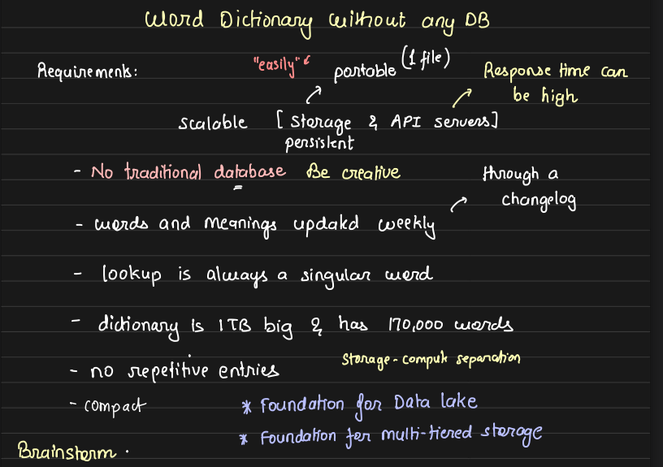
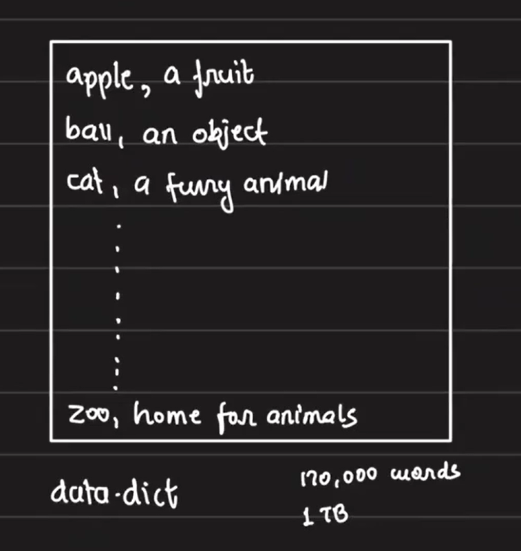
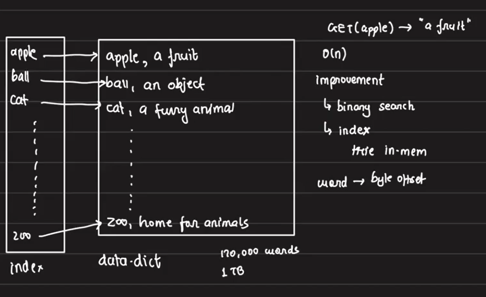
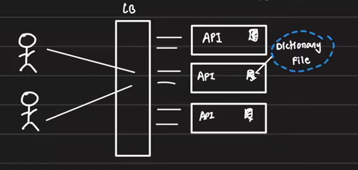
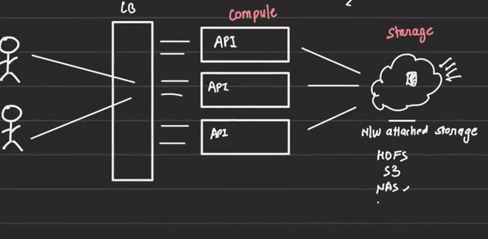

# Designing a Scalable Word Dictionary Using a File-Based Approach

## Problem Overview:

We will design a scalable word dictionary that can return the meaning of words via an API call. The dictionary must be contained within a single file, and words/meanings will be updated weekly. The dictionary file will be 1TB in size, containing approximately 170,000 words. The solution needs to be efficient in handling large datasets and offer reasonable response times.

- Key Requirements:
    - **Dictionary stored in one file** (1TB size, 170,000 words, no repetitive entries).
    - **Portability:** The dictionary should be contained within a single file, making it easy to move.
    - **Weekly Updates:** Every week, a changelog containing new words, updates, or deletions will be applied.

    - **Efficient Search and Update Operations:** The design should support quick lookup of words and allow updates without significant overhead.
    - Every week, the dictionary will be updated with a change log that may include:
        - New words along with their meanings.
        - Existing words that may receive updated meanings.
        - Words that may need to be removed from the dictionary.
    
    

## Alternative Approach by relaxing constraint 

If the constraint of using a single file were removed, we can consider creating a separate file for each word, where the file name serves as the key, and the file's content contains the corresponding meaning of the word. This is called **content-addressable file system**, similar to how Git works.

Advantages:
- **Efficient Lookups:** For a GET request, we can construct the file path using the key, directly read the file, and return the response if the file exists. If the file doesn't exist, we return a 404 error.

- **Easier Updates:** Updating or deleting a word would involve modifying or removing a single file.
- **Simplicity:** This approach avoids the need for a large index and can scale easily.

Disadvantage:
- **File Overhead:** Storing individual files for each word would introduce additional overhead in terms of file system management and storage.

## Approaches for Optimizing GET Requests: Pros and Cons

Since we cannot use a traditional database, we need to design our own. However, instead of creating a fully-fledged database, we'll build one that efficiently solves the specific problem at hand.

Our word dictionary will be a simple text file, which we'll call `data.dict`. This file will contain entries like words and their meanings.

For example, a typical entry in `data.dict` might look like this:

What would a GET call look like? For example, if we receive a GET request for the word "apple," our system needs to search the dictionary and return the corresponding definition: "a fruit."

### Approach 1: Linear Search

For this GET request, we would search the file line by line until we find the word, and then return its meaning. However, this approach has a linear time complexity (O(n)), meaning that for a 1TB file, in the average case, we would still need to scan 0.5TB of data. This is inefficient, especially for large files. Additionally, there’s a risk that the word might appear within the definition (message, meaning) part, making it challenging to distinguish between the key and the value.

### Approach 3: Binary Search

 We can implement binary search in place of linear seach to improve the efficiency of searching for data. While binary search in a file can be challenging, it is possible with careful implementation. Try experimenting with binary search on a file to explore this solution further.

### Approach 3: Indexed Search with HashMap

To improve search performance, we can implement an indexed search by maintaining an index of words and their corresponding offsets within the file. This would allow us to perform a lookup using the index, greatly reducing search times.

- Index Structure:
    - The index will store words and their offsets (starting positions) in the file.

    - We can use a hashmap to store the index in memory for fast lookups like below,

        

- Calculating Index Size:
    - **Word Size:** The average length of an English word is ~4.7 characters (~5 bytes).

    - **Offset Size:** Each offset is an 8-byte integer (64-bit), which can support indexing a file size of 1TB.

    - **Index Entry Size:** Each index entry would take ~13 bytes (5 bytes for the word, 8 bytes for the offset).

    - **Total Index Size:** For 170,000 words, the index size would be ~2.2MB (13 bytes * 170,000 words).

    We can the index itself can be kept either in disk or RAM. However, if we don't persist the index on disk, the index would need to be recreated every time we load the dictionary, significantly increasing the startup time of the API server. To avoid this overhead, we can store the index on disk, allowing us to quickly load it into memory and begin serving requests when the server starts.

    Given the constraint that the dictionary must be stored in a single file, the challenge is how to persist the index within the same file as the dictionary itself.

#### File Structure: Embedding the Index in the Data File

- **Marker Based Approach:**

    A potential approach is to append the index to the data file itself and use a marker to identify where the index ends and the actual data (dictionary) begins. However, storing the index after the data would require scanning the entire file to locate the end marker, which would increase loading time. Instead, we can place the index at the beginning of the file, followed by a marker indicating the end of the index. This way, we only need to read the index and skip loading the actual data until needed.

    However, there is a challenge with using markers — if the chosen marker string appears inside a key, it may lead to incorrect identification of the index's end. 

    Also the marker-based approach (even if the marker never appears in a key) requires us to dynamically increase the size of the character array(index) as we progress through the read operation. At each step, we also need to check if the marker has been encountered, which adds overhead and increases the loading time.

- **Fixed Length Header:** 
    
    To avoid these issues, instead of relying on a marker, we can store the exact size of the index in the header. This way, we know exactly how many bytes to read to load the entire index. The process would follow this flow:
    1. Load the header.
    2. Retrieve the index length from the header.
    3. Read the index and load it into memory.

    But how do we determine the size of the header? Do we add another header to describe the length of the next one? Absolutely not! The header has a fixed length in all cases, so we know exactly how many bytes to read. We can structure these bytes to contain specific information.

    For example, let's use a 16-byte header. In this 16-byte structure,
    - First 4 bytes: Length of the index.
    - Next 4 bytes: Version information.
    - Last 8 bytes: Reserved for future use

    This makes the header-loading process simple — just read the first 16 bytes.

    The index starts at byte 17, and we can determine where it ends by reading the length of the index from the first 4 bytes of the header. The actual data (dictionary) begins right after the index. By reading the entire header in one system call, we can efficiently load the index into a character array of exactly the required size, improving speed in contrast of marker-based approach where at each step, we need to check if the marker has been encountered.

    When our API server boots up, it performs a well-optimized startup process.
    - Step 1: Load the 16-byte header.
    - Step 2: Read the index length from the first 4 bytes of the header.
    - Step 3: Load the index into a hashmap in memory.
    - Step 4: Start the web server to handle API requests.

    Now how the API server handles a GET request - 

    1. The API server first checks if the word exists in the in-memory index.
    2. If the word exists, the server fetches the corresponding offset from the index.
    3. It reads the word’s meaning from the file using the offset and returns it to the user.
    4. If the word does not exist in the index, it returns a 404 Not Found.

## API Server Configuration and Handling Read Requests

Given the scale of handling data as large as Oxford University's dictionary, a single API server is insufficient to manage all read requests effectively. In this case, multiple API servers are required.

- Key Considerations:
    1. Configuration Needs:

        -  Since each API server holds the entire dictionary and serves data from the disk on each request, the server should be equipped with high-speed SSDs for fast data retrieval.

        - To handle the index efficiently and serve requests quickly, each API server requires high RAM capacity to store the index in memory.
    
    2. Scaling and Infrastructure Costs:

        - As traffic increases, more API servers will be needed, each containing a full copy of the dictionary. However, this approach leads to high infrastructure costs as every server will need the same storage and computing power.

            

        - To reduce these costs, we can adopt a model where API servers do not store the full dictionary themselves. Instead, we can use **network-attached storage** (NAS) or a similar distributed storage system. In this model, API servers will query the central storage for data.

    3. Staleness and Data Synchronization:

        - One of the primary concerns with having multiple API servers is data synchronization. However, since the dictionary database is updated only once a week as per our prerequisites, the risk of data staleness is minimized. All API servers can operate with the same copy of the data during the week without the need for real-time synchronization, ensuring consistency across the system.

- Moving to a Storage-Compute Separation:

    By separating storage and compute, the dictionary is stored in a centralized network storage, and API servers only query the storage for the required data and does not contains any data within its own disk. This approach allows API server to be lightweight, so we can use low-configuration servers for the API, significantly reducing costs.

    - **Storage:** The dictionary is stored in NAS, HDFS, or S3, which supports file operations such as reading from specific offsets.

    - **Compute:** API servers are lightweight and can scale independently, accessing the dictionary via network calls. This reduces the cost of maintaining large servers.
    
    

    - Storage Requirements:

        - The storage system should support file access over the network.
        
        - It should have **key-value** semantics and support operations like reading specific **offsets** and fetching data in **byte ranges**.

        Systems such as NAS, HDFS, and S3 (with byte-range fetch capabilities) are ideal for this setup.
    
    - Benefits of Storage-Compute Separation:

        1. **Independent Scaling:** Compute nodes (API servers) can scale horizontally based on traffic without duplicating storage. All servers refer to the same centralized storage, which can also scale independently if needed.

        2. **Cost Efficiency:** While there is a network call involved in accessing data, the cost savings from using lightweight servers and centralized storage are substantial. Furthermore, this ensures all API servers have a **consistent view of the data**.
    
    This architecture ensures the system can handle high traffic efficiently while keeping infrastructure costs under control

    - So the API Server Workflow becomes:

        1. The API server boots up and loads the header and index from the storage.
        2. API server loads the index into memory its own memory.
        3. It starts the web server and begins serving requests.
        4. For each request, the server checks if the word exists in the index. 
            - If the word is not found in the index, it returns a 404 error. 
            - Otherwise the server retrieves the corresponding byte location from the index, reads the meaning from that position from network storage and sends it back to the user.

## Handling Updates and Writes in a Dictionary API

Now that we have sorted out the read operations for our API server, let’s shift focus to write operations, specifically handling weekly updates. As illustrated in Pic-6, we have a data.dict file representing the current dictionary, while the changelog contains updated meanings for existing words, as well as new words and their meanings. 

### Challenges in Updating an Entry:

Let's explore the challenges involved in updating a word, say "ball."

1. **Space Management for Updates:**

    Suppose the updated meaning for "ball" requires 10 more bytes than the existing entry. To accommodate the new meaning by overwriting the old one, we would need to right-shift every byte after the modified key by 10B to create space. The complexity of this operation is high because, in the worst case, it might involve shifting all the bytes in the dictionary, which could be up to 1TB in size. On average, we might shift 0.5TB per word. If the changelog contains 100 words, this could result in 50TB of disk I/O—a significant cost in performance. After each update, we would also need to update the index to reflect the new positions.

    Overwriting the new meaning without shifting might overwrite parts of the next word, and unlike memory (RAM), where inserting data is straightforward, we can't easily do the same on disk.

2. **Insertion of New Words:** 
    
    For new entries, we would need to shift bytes after the insertion point, similarly creating inefficiency.

3. **Index Updates:**

    After such operations, we would also need to update the index to reflect new positions.
    

### Improvement with Merge Sort:

Instead of right-shifting, a more efficient approach is to use merge sort:

- Both `data.dict` and the changelog are sorted, allowing us to merge them into a new `data.dict` file.

- The time complexity is `O(n+m)`, where `n` is the number of entries in `data.dict` and `m` is the number of entries in the changelog.

- This approach processes the entire dictionary only once, regardless of how many updates are in the changelog, which drastically reduces the data movement compared to shifting bytes. In the previous approach the same operation is performed for each entry in change log.

- How does merging work?

    We use a two-pointer approach. If both the dictionary and changelog contain a particular key, we take the updated entry from the changelog; otherwise, we take whichever file has the relevant data.

### **Weekly Update Process:**
    
Suppose this merging happens every Sunday. The process would be as follows:
1. Spin up a weekly update server.
2. Fetch the changelog.
3. Download the actual dictionary file.
4. Perform the merge operation.
5. Upload the latest dictionary file to the database and delete the older version.

### **Handling Index and API Server Synchronization:**

When the new dictionary is uploaded, the index of the unchanged words might change due to updates. The API server needs to reload the new index to ensure it's serving accurate data.

- **Pull-based Approach:**

    The API server checks the current version of the file in storage and compares it to the version in the header it has. If there’s a mismatch, it reloads the index. However, polling too frequently wastes bandwidth, and polling too infrequently might lead to serving stale data for a longer time. The only way to avoid this issue is by replacing the old dictionary file with the new one, rather than using a new name.
    
- **Push-based Approach:**
        
    The update server pushes notifications to API servers. However, some servers may receive the update while others might not due to failures. To avoid this, a new file name can be used. Servers that get the update will read from the new file, while others will continue reading from the old one. However, the challenge is how the servers reading the old file will eventually switch. To address this, we could think of using a pub/sub model, but that increases infrastructure costs significantly for just a weekly update.
    
    - **The Solution - Meta.json File:**

        Instead of complex mechanisms, we can use a meta.json file that contains the S3 path of the latest dictionary file. When a new API server spins up, it reads the meta.json file to get the S3 path, loads the index, and starts serving requests. For older servers, we can use a rolling update process. After the weekly update server finishes uploading the new dictionary and updating the meta.json file, it triggers a Jenkins deployment. This deployment deletes old API servers and spins up new ones, which automatically read the latest file.
    
### Storage and Compute Separation:

Here, we've built a system that can efficiently query data stored in S3 with a pointed read operation—given a word, it returns the meaning. This system can be useful for key-value pairs that are infrequently accessed, whereas frequently accessed data might reside in a system like DynamoDB. For example, recent Amazon orders might be stored in DynamoDB, while older orders (3+ months) could be stored in S3, reducing infrastructure costs.

## Handling Deletions in Changelog:
        
The changelog can also contain deletion markers. We can use markers like 1 for new words, 2 for updated words, and 3 for deleted words. While merging, any word with a 3 marker will be skipped, effectively removing it from the new dictionary.

This approach optimizes the update process while keeping the API servers in sync with the latest data efficiently and cost-effectively.

