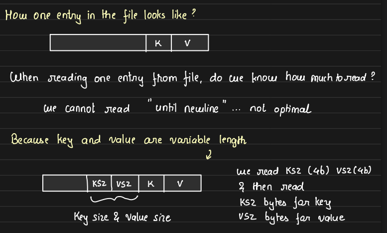

# Key-Value Store with Fast Read, Write, and Delete Operations

In this class, we’ll be building a key-value store on hard disk that supports extremely fast reads, writes, and deletes, all while ensuring full persistence. The solution involves optimizing operations for high performance, even when dealing with large datasets stored on HDDs (hard disk drives).


## Basic Operations:
- **Put Operation:** Adds a key-value pair to the storage.

    - Example:
        ```scss
        put (k1,v1), (k2,v2), (k3,v3), (K1,v1’)
        ```

        The storage would look like:
        ```scss
        K1, v1
        K2, v2
        K3, v3
        K1, v1’
        ```

        In this setup, `k1` is stored twice, once with `v1` and once with `v1’`. We don't overwrite the old value directly because random writes to HDD are slow, so the system appends new data. The Get request always fetches the latest value.

- **Delete Operation:** Simulates deletion by adding a "tombstone" entry.

    - Example:
        ```scss
        DEL(K2) -> Put (k2, -1)
        ```
        This way, the storage looks like:

        ```scss
        K1, v1
        K2, v2
        K3, v3
        K1, v1’
        K2, -1
        ```
    
    The only two write operations are `put` and `delete`. For both operations, we avoid any random writes, as random writes on HDDs are time-consuming. Instead, we ensure that all write operations are handled by appending data sequentially at the end of the file. This approach optimizes performance and throughput by leveraging sequential writes, which are significantly faster on HDDs compared to random writes

## Handling Multiple Entries for the Same Key:

Now how `get` requests work for keys like `k1` and `k2` when there are multiple entries for the same key. We always need to retrieve the latest value. One approach is to scan the storage from the end and take the first value we encounter. However, in the worst case, this could involve scanning the entire storage, which is inefficient.

- **Optimizing with an Index:**

    To optimize this, we can create an index and store it in RAM for fast random access. The index will track the latest position where each key's value is located.
        
    - For `put` request, a new entry is created in storage and either a new entry is created in index or the existing entry is updated with the latest offset in the index.

    - For `delete` operations, we simply remove the key from the index. We may or may not create a new entry in the storage for a delete, but the index will reflect the deletion.

    - Processing `get` Requests:
        - The server first checks the index to see if the key exists.

        - If the key is found in the index, the location is retrieved, and the value is fetched from storage.
        
        - If the key is not in the index, the server returns a 404 (not found).

    This approach ensures that the system efficiently handles both put and delete operations while providing fast lookups for get requests. The index ensures minimal scanning and provides a way to keep track of the most recent data for each key.

    


## Limitations of the Basic Approach:

1. **File Size:** Over time the file becomes too large.

2. **Stale Values:** Old values are still stored even after updates.

3. **RAM Constraints:** The index is stored in RAM, which limits the number of keys we can store. Assuming each entry requires about 13 bytes (5 bytes for the key, 8 bytes for the pointer), meaning for 1MB of RAM, we can store a maximum of ~76,923 keys.

## Handling File Size and Staleness in Storage

### Why Is a Large File Problematic?

While writing to a file is generally efficient since we only append data at the end (making it an O(1) operation), there are several challenges when the file becomes too large:

- **Seeking Time:** To append data, the system needs to seek the end of the file. This involves physically moving the hard disk arm to the required location, which becomes slower as the file size grows.

- **Contiguous Space:** HDDs struggle to find large blocks of contiguous space for massive files, making the process inefficient.

- **File Size Limits:** File systems impose a maximum file size limit, which varies depending on the system. Some file systems support sizes over 1TB, but it’s important to be mindful of these limits.

- **File System Constraints:** Certain file systems allow chaining (similar to linked lists), where memory blocks don’t need to be contiguous, but not all systems support this.

In addition to these factors, **sequential I/O** is much faster than random I/O because it requires less movement of the hard disk head to find the right block to write. To optimize performance on magnetic disks, it’s crucial to perform **sequential or batch I/O operations** as much as possible. Therefore, it’s always advisable to keep file sizes manageable and optimized for performance.

### Solving the Problem of Large Files

To address the issue of large files and stale data, we need a mechanism to delete stale entries. Here's how we can approach it:

- **Background Cleanup Thread:** We can create a background thread that runs at regular intervals to clean the file. This thread will go through each entry in the storage and check if the entry’s offset matches the one stored in the index. Only if it matches will the entry be added to a new file, thus removing outdated or redundant data.

- **Handling New Entries During Cleanup:** In write-heavy scenarios, when the cleanup thread creates a new file, new entries may still be written to the current file. This can cause some staleness, as these new entries won't be part of the freshly cleaned file yet. Moreover, if a new entry is a delete operation, the same key might already be in the new file, leaving some inconsistency until the next cleanup cycle.

- **Index Consistency:** After cleaning and creating a new file, we need to ensure the index is updated with the new byte locations. The challenge here is ensuring that the index is in sync with the cleaned data. The index must reflect the latest file changes, but during heavy writes, this can be tricky to manage.

### Solution: Make Files Immutable

To resolve these issues, we introduce the concept of immutable files. Immutable files are:

- **Open for read but closed for write.** Once a file reaches a certain size (e.g., 1GB), we create a new file and shift all new write operations to this new file.

- **Handling Reads and Writes:** We continue to serve **GET requests** from both old and new files, but **PUT requests** are handled by the active (new) file. This means we can have multiple old, read-only files (immutable files), but only one active file for writes.

- **Merge and Compaction:** At regular intervals, we perform a **merge and compaction** process on the immutable files. This algorithm removes stale entries from the old files, and the resulting file can be one or more smaller, optimized files.

    

- **Index Updates:** With this approach, the index structure changes slightly. Instead of only storing the offset for each key, the index will now store both the **offset and the file descriptor** (the file where the key is located). After each merge and compaction, we need to update the index with the new file descriptors and offsets to reflect the cleaned data. This requires a stop-the-world mechanism, where the index is paused for updates and then resumed once updated.

    

By following this approach, we keep our files manageable, improve performance by reducing file size, and ensure data consistency through efficient indexing and cleanup mechanisms.

### Deciding the Merge Frequency

The merge frequency depends on several factors, such as:

- **Put and delete frequency:** The number of put and delete operations occurring over time.

- **Average size of key-value pairs:** The size of each key and value associated with a put request, also known as the ingestion rate.

To manage disk utilization efficiently, we should trigger a merge and compaction when the total storage used by files reaches around 80% of the total disk capacity. This helps prevent the disk from becoming full and ensures that disk space is utilized optimally.

By merging and compacting files periodically, we reduce stale entries and free up space, maintaining a healthy balance between performance and disk usage.

### Communicating Merge and Compaction to Non-Technical Users

Explaining when to run the merge and compaction algorithm to non-technical clients can be challenging. Instead of relying solely on technical details, it’s much more effective to visualize the process using a graph.


The graph above represents disk utilization over time:

- The **top green line** indicates the total disk capacity.
- The **white slope** represents the disk utilization by the files.
- **Red lines** show points where merge and compaction operations are performed, reducing disk usage.

As disk usage increases, merge and compaction reduce it, creating a cyclical pattern. The key takeaway for customers is that they need to configure the merge and compaction rate in a way that prevents disk usage from reaching maximum capacity, ensuring smooth operations. Visualizing this process helps make it easier for clients to understand and manage their storage.

### More details on GET request

When a GET request is received, we first check the index to identify the file descriptor and offset from where to read the data. However, how do we determine how many bytes to read?

To address this, we need to store the size of the value along with the key on disk. Each entry in the disk will consist of the key and value, but there's more information required. In addition to the key and value, we need to store:

1. The size of the value (VSZ).
2. The size of the key (KSZ).

    

For instance, if we allocate a fixed 4B to store KSZ and another fixed 4B to store VSZ, we can efficiently determine the data size for retrieval.

- **Modified Get Request:**

    - When a GET request is received, it comes with a key. The server stores the key in memory to determine the file descriptor and the offset where the data is stored.

    - Once the offset of the file is identified, the server performs a system call to read 8B from that location. These 8B contain the KSZ and VSZ.

    - After determining the sizes of the key and value, the server performs another read to fetch the corresponding number of bytes.

    - The server then skips the key bytes and reads the value bytes, completing the retrieval process.

### Handling Data Corruption and Optimizing System Calls

What happens if some data gets corrupted? Serving corrupted data to the user is unacceptable. Instead, we should detect corruption and notify the user, without sending incorrect data. To achieve this, we use a checksum, specifically a **CRC (Cyclic Redundancy Check)**, which allows us to detect bit-level corruption.

For each record stored on disk (which includes the key, value size, actual key, and value), we store a checksum. This checksum is the first thing stored for each entry in storage, and it helps in identifying data corruption. For more details on how CRC works and detects corruption, it's worth exploring this topic further.

- **Structure of Stored Records:**

    The fields in the record are -- 
    - CRC (Cyclic Redundancy Check) for data integrity
    - Timestamp (TS)
    - Key Size (KSZ)
    - Value Size (VSZ)
    - Key
    - Value

    These are universal for any kind of storage system. The number of bytes used for these fields is also fixed.

    

- **Reducing System Calls**

    However, since each system call is expensive, we can optimize this. Instead of making two separate calls, we store the **record size (RSZ)** along with the **offset (VPOS)** and **file descriptor (FileID)** in the index. This allows us to read the entire record (CRC, TS, KSZ, VSZ, key, and value) in a single system call and after that we can easily figure out key and value.

    By doing this, we minimize the system calls to one, significantly improving performance

    


This approach resembles the **Bitcask** database model, one of the fastest embedded databases used in production systems like Uber.